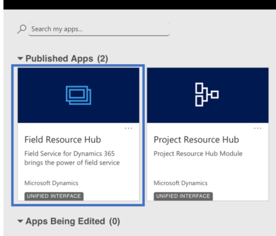
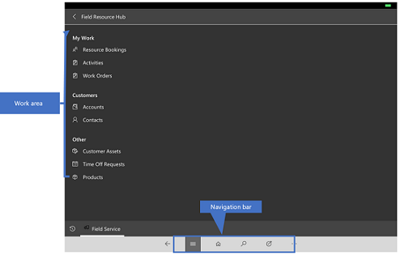
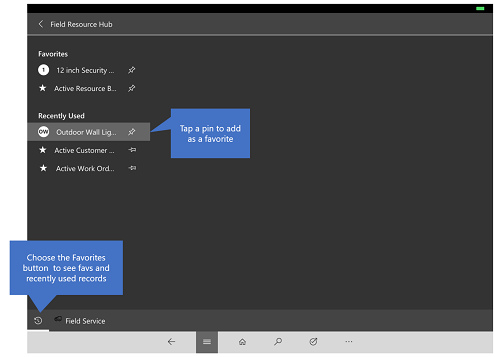
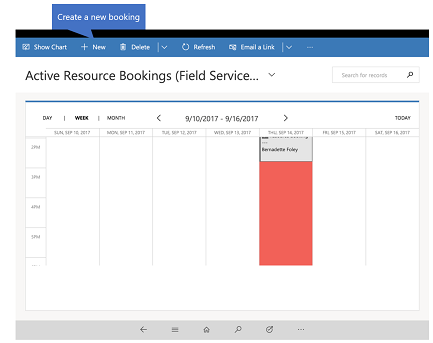

# Field Resource Hub User's Guide (Field Service)

[!INCLUDE[cc-applies-to-update-9-0-0](../includes/cc_applies_to_update_9_0_0.md)]

Field Resource Hub app lets field techs do basic tasks in the field like, view upcoming appointments, view and edit bookings, complete service tasks including adding products, notes and signatures. Field techs can also submit time-off requests so a dispatcher knows when the tech isn’t available.  

**Available anywhere, on any device**

There are two flavors of Field Service app. If you’re using a desktop browser, you’ll use the Dynamics 365 for Field Service app. If you’re a field tech using a smartphone or tablet, you’ll use the Field Resource Hub app which is a subset of the Field Service app. The Field Resources Hub app is built on the Unified Interface framework, which uses responsive web design principles to provide an optimal viewing and interaction experience for any screen size, device, or orientation.

For information Dynamics 365 for Field Service app [!INCLUDE[proc_more_information](.../includes/proc-more-information.md)] [Dynamics 365 for Field Servic user's guide](../field-service/user-guide.md).

> [!Note] 
> If you're looking for the full-featured Field Service mobile app, it’s a different mobile app called Field Service Mobile. [!INCLUDE[proc_more_information](.../includes/proc-more-information.md)] [Field Service Mobile App user’s guide](../field-service/field-service-mobile-app-user-guide.md).

## Install the mobile app

Before you can start using the Field Resource Hub app, you need to install the Dynamics 365 mobile app on your device. 

[!INCLUDE[proc_more_information](.../includes/proc-more-information.md)] [Install Dynamics 365 for phones and tablets](../mobile-app/install-dynamics-365-for-phones-and-tablets.md).

## Basic Navigation

1.	When you sign in on the Dynamics 365 mobile app, you’ll see the MyApps page with a list of the apps that you access to. 
2.	Select **Field Resource Hub**.

**The navigation bar**

Use the nav bar to get to your work area, create a new record, search, or do other tasks. To access more commands, tap 

**Favorites and recently used records**

The Favorites and Recently Used sections provide quick access to your records, views, and dashboards. 

- To access these sections, tap the **Menu**  button on the nav bar, and then tap the **Favorites and Recent**  button.

- To pin an item as a favorite, from the list of **Recently Used** items, tap the pin. This will pin and move the item to Favorites.

  
  
## Work orders  
 Work orders have information on what work needs to be done at a customer site. They're used to coordinate and schedule resources and activities, and can be used for installations, repairs, or preventative maintenance. 
 
 To find and open a work order:  
  
1.  Tap the menu button , and then tap **Work Orders**.  
  
2.  From the list of work orders, tap a work order number to open it.  
  
3.  When the work order opens, you can add notes, attachments, photos, and more.  
  
## Resource Bookings  
Resource bookings provides an overview of resource schedule and bookings for a day, week, or month view. Bookings can be created for a specific work order or without a work order.

- To see your bookings in a calendar view, tap the menu button , and then tap **Resource Bookings**. 

- To create a new booking, tap **New** on the command bar and then fill in the required information.

  
## Customer assets  
 Customer assets provide information on which product a customer is using. This is where a list of serviceable items that are related to a service location are maintained. 
 
 Customer assets also provides a historic log of all the work orders that are related to the item, which gives you a complete service history for the item.
 
 To find and open a customer asset:  
  
1.  Tap the menu  button, and then tap **Customer Assets**.  
  
2.  From the list of customer assets, tap an asset name to open it.  

## Products 
 Products is a collection of products and their pricing information that your company owns and sells. When you're out in the field use products to see what products is available in the inventory and the pricing information.
  
 To find a product:  
  
1.  Tap the menu  button, and then tap **Products**.  
  
2.  From the list of products, tap the product name to open it.  
  
## Time off requests  
 Keep the schedule board up-to-date by logging time-off requests. When you need to take time off, log the request so that dispatchers can see the time off request when they're working on the schedule.  
  
 To submit a time off request:  
  
1.  Tap the menu  button, and then tap **Time Off Requests.**  
   
2.  Tap **New** on the command bar.  
  
3.  Enter the required information, and  then tap **Save**.

## General information on how to use the mobile app 

[!INCLUDE[proc_more_information](.../includes/proc-more-information.md)] [Mobile Basics Guide](../mobile-app/dynamics-365-phones-tablets-users-guide.md).

### See Also  
 [Dynamics 365 for Field Servic user's guide](../field-service/user-guide.md)
