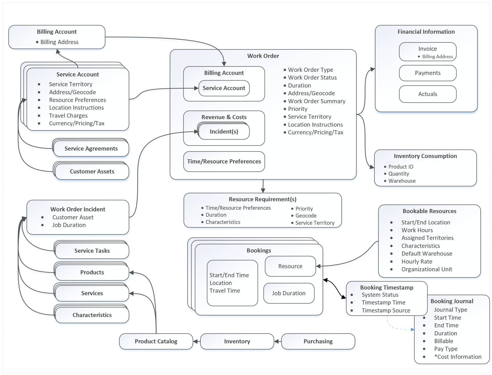
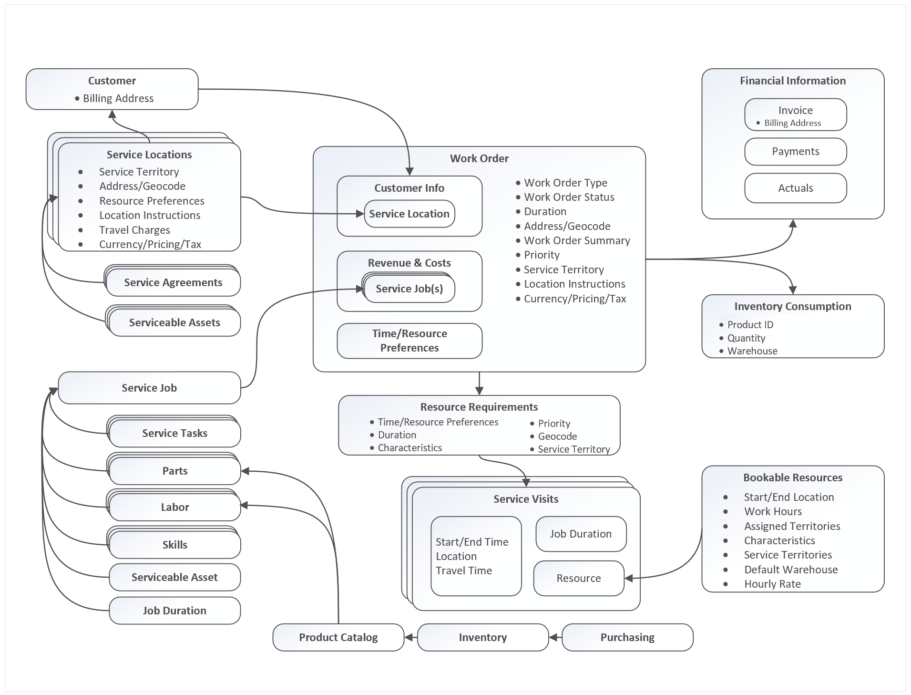

# Field Service work order architecture

The most important process in Field Service is the work order process where work orders are:

1.  Created 
2.  Scheduled to resources 
3.  Performed by field technicians 
4.  Completed and reviewed 
 
The following diagram can help you understand the various entities, attributes, and relationships that enable the work order process. This diagram references the specific entity names in the application. For a diagram showing the more commonly used names, see the diagram at the end of this article. 

> [!div class="mx-imgBorder"]
> 

The **Work Order** entity contains the details of the job that needs to be completed. This includes basic details like work order type, status, duration, priority, and more. Work orders are related to the standard Dynamics 365 **Account** entity in that specifying a **Service Account** on the work order adds related account information like territory, address, geocode (latitude and longitude), price list, and more. For instances where the work order location (service account) is different than the billing location, you can relate a service account to a **Billing Account**. 

> [!Note]
> A service account and billing account are both account entity records. The only difference is which account is entered in the **Service Account** and **Billing Account** work order fields, though organizations can distinguish between the two with their own business processes. 

Service accounts are also important when creating **Service Agreements**, which are used to automatically generate recurring work orders. An agreement can only be associated to one service account, which means all work orders generated as part of the agreement will be dispatched to that service account location. The type of work and assets being maintained can vary.

Service accounts are also important for **Customer Assets**. Adding a service account to a customer asset implies the piece of equipment is located at the service account location. Work orders related to a customer asset maintenance, inspection, repair should correlate to the asset's service account.

Beyond adding basic details and an account to a work order, you can add **Revenue and Cost** items that better define the specific work to be done. **Work Order Incidents** are a defined package of service tasks, products, services, and characteristics (skills) that are recommended. This makes for quicker work order creation because rather than manually adding service tasks, products, services, and characteristics (skills), you can simply add an incident that effectively serves as a template to populate these details.

Finally, you can define on a work order **Time and Resource Preferences** that specify when a work order should be completed to meet an SLA.

All of the important work order details that relate to scheduling are passed to an automatically generated related entity called a **Resource Requirement**. Resource requirements are used to assign the work order to the most appropriate resource (field technician). The resource requirement framework is partly what allows any entity to be scheduled, such as cases, opportunities, or custom entities.

Before any scheduling can take place, a **Bookable Resource** must be created that represents an employee, contractor, equipment, facility, or anything that needs to be scheduled. When creating a bookable resource, you can add attributes that distinguish them from each other like location, organizational unit, role, characteristics (skills), and more.

Finally, when it's time to schedule a work order, you assign a requirement to a resource and this creates a **Booking**. You can think of a booking as a scheduled time slot for a specific resource. Requirements can be scheduled by several methods, including:

-  Manually on the schedule board 
-  With the schedule assistant
-  Resource Scheduling Optimization 

Field technicians will see their daily, weekly, and monthly bookings on their agenda in the Field Service Mobile app.

> [!Note]
> A single requirement can be booked multiple times, creating multiple booking records. This is useful when you want to schedule the same requirement to multiple resources or even to the same resource at different times. 

Field technicians can also track the status of the bookings they are working on by editing the status of the booking to traveling, in progress, on break, completed, and custom statuses. Each status change is recorded in the system as a **Booking Timestamp** and eventually **Booking Journals**, which are used to calculate the time and labor cost of a booking. For example, a booking timestamp and booking journal help an organization understand the total time a field technician travels to a work order location and this can be leveraged for reporting and billing.

While performing a work order, field technicians may use products and services indicating that a part or labor was needed. Though these products and services were previously added to the work order, they were originally listed in the **Product Catalog**. Products that represent physical parts and not labor are tracked in **Inventory** and are replenished with the **Purchasing** process that relies on submitting and receiving purchase orders.

Finally, when the work order is reviewed and closed by a service manager, **Inventory Consumption** and **Financial Information** is updated. Inventory consumption at its simplest means the quantity of a product is deducted from a warehouse based on the work order activity. In cases where used products and services must be billed, closing a work order triggers the creation of an invoice for payments and actuals, which are a log of transactions.

The following diagram references the same work order process diagram in the beginning of this article, but with common names instead of entity names.
> [!div class="mx-imgBorder"]
> 

### See also

- [Work order life cycle and statuses](work-order-status-booking-status.md)
- [Connected Field Service architecture](../field-service/developer/connected-field-service-architecture.md)

[!INCLUDE[footer-include](../includes/footer-banner.md)]