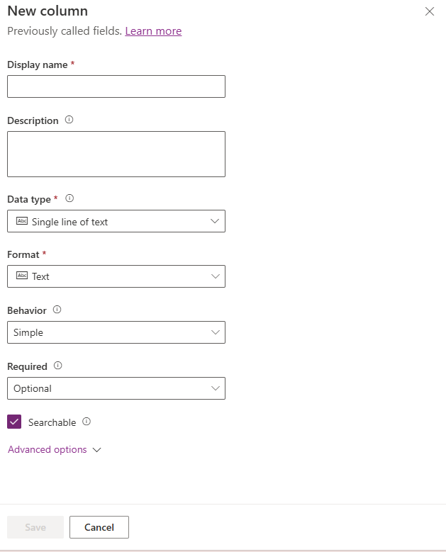
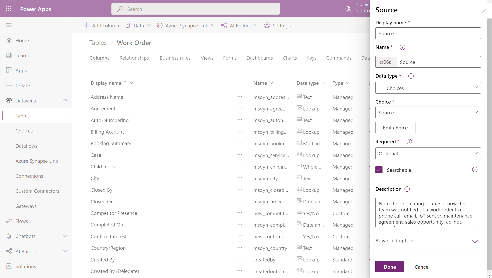
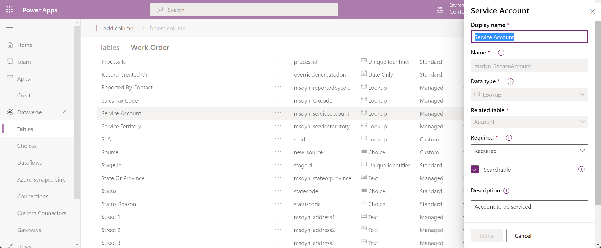
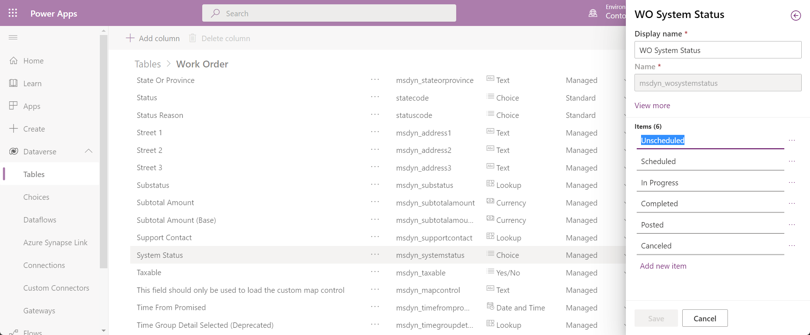
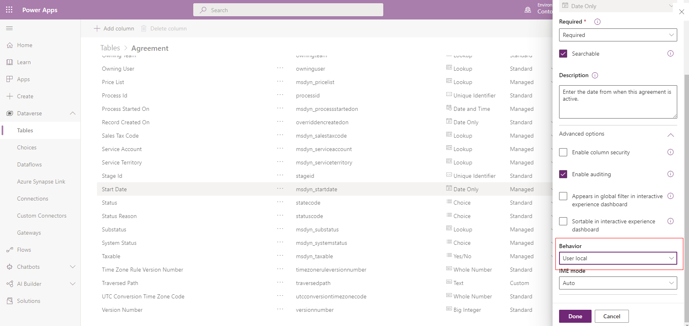

# Create and edit Field Service columns (fields)

When deploying Field Service, you may need to add new columns (also called fields) to the various tables (sometimes referred to as "entities") that you use, like work orders, bookable resource bookings, customer assets, and more.

Follow these best practices when creating and editing columns:

- Understand existing columns and try to use them before creating new ones.
- Field display names and labels can be edited.
- Field properties can't be edited.
- Optional fields can be made required, but required fields can't be made optional.
- Don't delete existing fields.

> [!Important]
> Don't delete existing fields. Deleting fields can cause important processes to fail causing errors. You can simply hide or remove fields from the forms so that users cannot see them.

In this article, we'll discuss how to create and edit fields for the work order table; however, the following guidance applies to all Field Service tables.

## Create new fields

> [!Important]
> Before editing existing fields, make sure you consider possible system implications. Review the documentation to help avoid potential performance or process disruption.

After understanding the existing fields and processes on the work order form, you may need to create additional fields based on your unique business processes.

Go to `https://make.powerapps.com`.

To create a new field, select **+Add column**.

> [!div class="mx-imgBorder"]
> 

> [!div class="mx-imgBorder"]
> 

Save your changes.

## Edit fields

Administrators can edit the display names and labels of existing fields, but can't edit field properties. 

For example, you can change the field display name of **Service Account** to **Customer**, as seen in the following screenshot.

> [!div class="mx-imgBorder"]
> 

Or consider the **System Status** field; you can change choice option labels, like changing the **In Progress** label to **Work Started**. 

> [!div class="mx-imgBorder"]
> 

Optional fields can be made required, but required fields cannot be made optional.

### Editing field properties

Don't edit field properties! Editing field properties can result in performance and process disruptions.

For example, editing fields in the following ways is unsupported and can cause issues when upgrading.

- Removing choice options.
- Adding choice options.
- Changing field requirement from _Required_ to _Optional_ (though it's okay to change from *Optional* to *Required*).
- Changing the behavior of a **Date Only** or **Date and Time** field is unsupported. They must be left as **User Local** and can't be set to _Date Only_ or _Time Zone independent_. See additional notes for more details.

## Additional notes

### Deleting fields

Don't delete existing fields! Deleting fields can cause unexpected issues. Instead of deleting a field, hide or remove fields from the forms so that users can't see them.

### Changing the behavior of a Date and Time field is unsupported

Changing the behavior of a **Date Only** or **Date and Time** column that is included with Field Service is unsupported, irreversible, and can cause upgrade issues. For example, the following screenshot shows the _Start Date_ column located on the agreement table. The behavior property must be left as **User Local**.

> [!div class="mx-imgBorder"]
> 
