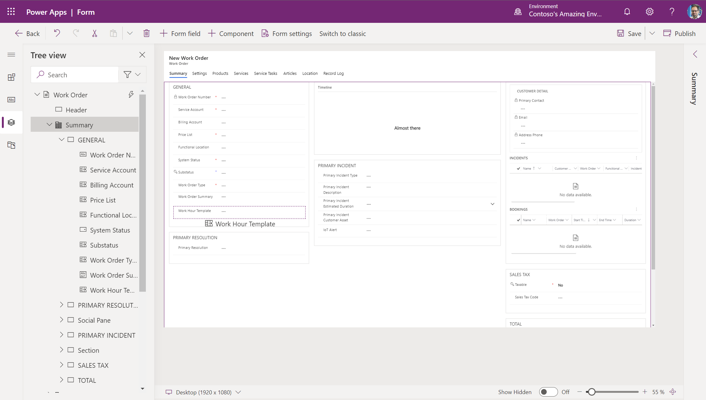
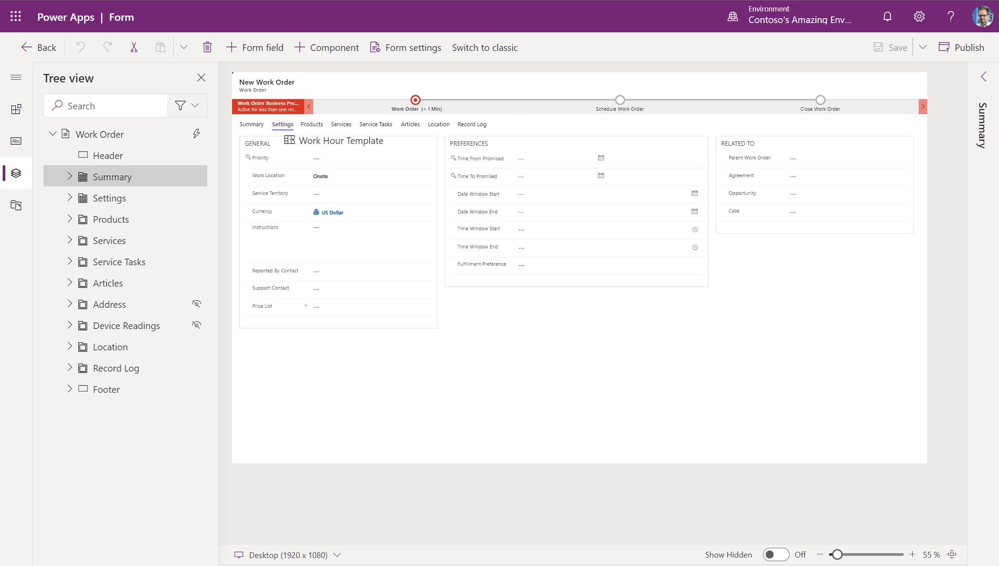
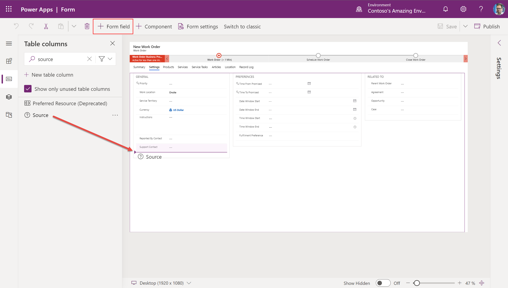

# How to customize the Field Service work order form

While setting up Field Service for your organization, you may have to customize the forms that back office workers like dispacthers, service managers, and other roles use to view important information and document their work. IT administrators may customize Field Service forms so users can capture information unique to your business or industry and to ensure the form layout matches your business processes.

Customizing forms properly is very important for maximizing performance, like the time it takes for forms to load and save changes; and for improving usability, like how easy it is for users to view and update information. 

In this article we will walk through how to edit or "customize" the Work Order form for back office workers, but the steps below should be used to edit or customize any Field Service web form. 

> [!Note]
> There is a separate and unique process to customize the mobile work order form for frontline workers. See the section at the end of this article. 

## Prerequisites

- System administrator security role
- Field Service - Administrator security role

## 1. Understand the default work order form 

Before customizing the work order form, it is very important to understand the default work order form that is included with Field Servive. This means understanding the fields and the recommended process flow. This will help you determine if you need to make minor changes to the default form or create something completely new. Using the default fields and process is recommended for performance, usability, and upgradability reasons.

Go to the Field Service app > Work Orders > select an existing record or create a new one.

The work order form is optimized for the following standard work order process.

1. A work order is created manually, from a converted case, via an IoT alert, from an agreement schedule, or via an integration. Newly created work orders have a system status equal to _Unscheduled_ by default. 
2. Work order details are entered like the account, work order type, location, products, services, service tasks, and any other information that is important
3. The work order is scheduled to one or more resources ("frontline workers") and the system status automically becomes _Scheduled_.
4. The frontline worker views the scheduled work order on his or her mobile app and travels to the customer location to perform the required work and records progress. The system status becomes _In Progress_. The fronltine worker updates information like when he or she arrived on site, service tasks completed, services and products billed. 
5. The frontline worker completes the work order and the system status becomes _Completed_.
6. The back office manager or dispatcher views the completed work order and verifies the work is completed and the necessary data is captured. If everything is finished the status is changed to _Closed-Posted_.

> [!div class="mx-imgBorder"]
> 

[Read more about the Field Service work order process](work-order-status-booking-status.md)

View and understand the default fields and determine which ones can be used for your business.

> [!div class="mx-imgBorder"]
> 

The following fields are critical to the Field Service work order process and are required. If your organziation does not plan to use these fields then you may want to consider creating an entirely new entity table.

- Work Order Number
- System Status
- Service Account
- Billing Account
- Price List
- Work Order Type
- Work Location
- Address
- Latitude
- Longitude

The following subgrids are also critical to the Field Service work order process and are highly recommended.

- Bookable Resource Booking ("Bookings")
- Service Tasks
- Products
- Services

Read more about the work order fields and functions by reviewing the topics on [Field Service architecture](field-service-architecture.md) and [creating a work order](create-work-order).

## 2. Make a list of needed and unneeded fields

Make a list of default work order fields that are relevant to your business process and another list of unneeded fields. Make sure to add the critical fields mentioned above to the list of needed fields as they are required.  

## 3. Create new fields as needed

Create new fields if the default work order form is missing fields that you need.

See the topic on [How to create and edit Field Service columns (fields)](field-service-customize-columns-fields.md) for best practices when created, editing, and deleting fields. **Hint:** You should be very careful when editing default fields and you should never delete default fields. 

## 4. Decide to customize the existing work order form or create a new form

Go to https://make.powerapps.com > Tables > Work Order > Forms

Decide if its best for your organization to use the existing work order form or to create a new one. Use the information in the tabs below to understand the scenarios, pros, and cons of either customizing the existing work order form or creating an entirely new one. It is recommended to use the existing work order form.

## [Existing form (recommended)](#tab/existing-form)
Better for scenarios where your organization does not want to make a lot of changes to the layout or fields; and organizations that generally want to use the default work order process. 

**Pros**

- **Recommended** - the existing work order form is recommended by Microsoft.
- **Receives updates** - the existing work order form receives updates for performance and new features.
- **Better supportability** - when you use the work order form that is included with Field Service, it is easier for support teams to diagnose and resolve issues.

**Cons**

- **Less customizable** - By agreeing to use the existing work order form, you agree to make minimal changes to the form.
- **Need to test upgrades** - The existing work order form will receive updates as much as twice per year. You will have to test new updates in a sandbox environment and ensure they will not disrupt your users.

## [New custom form](#tab/new-form)
Better for scenarios where your organization has to make many changes to the form and you have a very unique work order process. This option is also best for organizations that need multiple different work order form for different secuirty roles. 

**Pros**

- **Shielded from updates** - a new custom form will not receive updates. This can be beneficial if you have very specific processes and form layouts. 
- **More edits** - You are free to make more changes to the form to fit your unique work order process.

**Cons**

- **No updates** - Your custom work order form will not receive updates from Microsoft. It will be static.
- **Maintenance costs** - If Microsoft releases work order features that your organization wants to adopt, you will need to manually customize your forms to include those features. This costs time and money.
- **Risk of slow performance and errors** - evidence shows that custom forms tend to have slower performance and more errors because of the risk of violating form design best practices. Review the risks and best practices at the end of this article.

--- 
* * *

Select the Main "Work Order" form.

It is highly recommended to use the default Work Order Main form and make changes within that form. This will ensure your work order form will be upgraded and you can benefit from improvements like new features and performance improvements. If you have a very unique work order process, then creating a new custom form is an option. See more details at the end of this article. 

> [!div class="mx-imgBorder"]
> 

For basic information on editing forms see the Power Platform documentation on [creating and editing forms](https://docs.microsoft.com/powerapps/maker/model-driven-apps/create-and-edit-forms). 

We are now ready to customize the Work Order form with a combination of existing work order fields and your new custom fields. 

## 5. Hide and remove form tabs, sections, and fields

### Hide unwanted tabs, sections, and fields

The next step is to hide unwanted tabs, sections, and fields. It is recommended to _hide_ rather than **remove** items because it reduces the chances of errors and makes it easier to add them back later on if needed.

#### Hide unwanted tabs

Tabs run horizontal across the top of the form. Hide tabs that you do not need. 

> [!div class="mx-imgBorder"]
> 

You cannot hide the summary tab.

#### Hide unwanted sections

Sections are areas within tabs. Hide sections you do not need. If there is only one field in a section you need, simply move the needed field to another section and then hide the unneeded section.

> [!div class="mx-imgBorder"]
> 

#### Hide unwanted fields

Hide fields that are unneeded. Do not hide required fields. 

> [!div class="mx-imgBorder"]
> 

### Choose to remove price related fields if applicable

There is an easy and supported way to remove all price related fields (e.g. Price List, Total Amount, etc) from the Work Order, Work Order Product, and Work Order Service 

In a scenario where your organization does not need price list or price calculations (e.g. Total Amount) on the work order or work order products and services, there is an easy and supported wayyou can easily remove all price related fields by going to Field Service Settings and turning **Calculate Price** to _No_. [More details](https://docs.microsoft.com/dynamics365/field-service/configure-default-settings#work-order-and-bookings-settings). 

### Choose to remove tax related fields if applicable

There is an easy and supported way to remove all tax related fields (e.g. Price List, Total Amount, etc) from the Work Order, Work Order Product, and Work Order Service 

## 6. Rearrange form tabs, sections, and fields

### Move less important items away from the first form tab

The first form tab is very consequential for form load times. 

Review default fields, subgrids, etc on the first form tab and move unwanted items to another tab.

As an example, imagine the _Primary Incident Type_ field is not important to your organization. 
> [!div class="mx-imgBorder"]
> 

Move it to another tab. If you still wish to use it, then leave it there; hide it if you do not need it. 

> [!div class="mx-imgBorder"]
> 

Do the same for subgrids and any other control.

## 7. Add your custom fields to the form

### Add your custom fields to the appropriate form tabs

Add the custom fields you created earlier for your unique business processes to the form.

Avoid adding any custom fields to the first form tab unless absolutely necessary. In particular, avoid adding subgrids and lookup fields to first form tab because they can significantly slow load times.

In the example below, we created a custom field called "Source" that is a choice type field to select how the work order was originated (phone, email, IoT, agreement, etc). We are adding the custom field to the second form tab named "Settings".

> [!div class="mx-imgBorder"]
> 

    
[Follow form design best practices](https://docs.microsoft.com/powerapps/maker/model-driven-apps/create-and-edit-forms)

	

## 8. Test your forms with tools

[Run Performance Insights](https://docs.microsoft.com/en-us/powerapps/maker/common/performance-insights-overview) to see how app and form performance is affected by things like browsers, network performance, data queries, and more.

Use the monitoring tool to understand the root cause of why forms may be loading slowly. See [this blog post](https://powerapps.microsoft.com/en-us/blog/monitor-now-supports-model-driven-apps/) and [this doc](https://docs.microsoft.com/en-us/powerapps/maker/model-driven-apps/monitor-form-checker) for more details.

## Summary of recommended best practices

- Always use default fields and processes when possible
- Hide unwanted tabs, sections, and fields; do not remove them
- Create more form tabs rather than adding too many fields to any single form tab
- Move lesser used fields away from the first form tab
- Avoid adding fields and controls to the first form tab, especially subgrids and lookups
- Avoid adding more than 3 subgrids to any single form tab
- Avoid adding more than 10 lookups to any single form tab
- Use the PCF _Form component control_ to display information from the other tables inside the form. This prevents form users from having to click away from the form. 
- Do not edit or remove form libraries
- Minimize fields and controls overall. Every field and control added to a form has a performance cost, so be mindful and only create fields and controls that are critical to your business.
- Review best practices to [design efficient forms](https://docs.microsoft.com/powerapps/maker/model-driven-apps/design-productive-forms)
- Review best practices to [design performant forms](https://docs.microsoft.com/powerapps/maker/model-driven-apps/design-performant-forms) forms.

## Customizing the mobile work order form

While the instructions in this article are useful for customizing any web form for back office workers, there is a specific work order form optimized for the mobile experience for frontline workers. See the topic on [Editing the booking and work order form](mobile-powerapp-booking-work-order-form.md) to learn how to customize the mobile work order form.

## Create an entirely custom work order form (not recommended)

In some scenarios you may need to create a completely custom work order form. The top reasons you may need to create a custom work order form include:

1. You have a very unique work order process and are unable to use the standard work order process included with Dynamics 365 Field Service or you need to add a lot of custom fields (greater than 100).
2. You have decided it is not feasbile for all roles to use the same work order form even while using security roles and field security profiles to limit information; and you need to create different forms for different user personas.

#### Create a new form

Go to https://make.powerapps.com > Tables > Work Order > Forms

Select **Add form** at the top and select Main form.

> [!div class="mx-imgBorder"]
> 

You can also start from a copy of the default form if you have already made changes there.

> [!div class="mx-imgBorder"]
> 

#### Choose to remove price related fields if applicable

There is an easy and supported way to remove all price related fields (e.g. Price List, Total Amount, etc) from the Work Order, Work Order Product, and Work Order Service 

In a scenario where your organization does not need price list or price calculations (e.g. Total Amount) on the work order or work order products and services, there is an easy and supported wayyou can easily remove all price related fields by going to Field Service Settings and turning **Calculate Price** to _No_. [More details](https://docs.microsoft.com/dynamics365/field-service/configure-default-settings#work-order-and-bookings-settings). 

#### Remove other unwanted fields and subgrids

With a custom form you can remove fields, controls, tabs, and other items whereas before we hid them.

However there are some limitations to what can be removed listed below.

The following fields are critical to the Field Service work order process and are required. If your organziation does not plan to use these fields then you may want to consider creating an entirely new entity table.

- Work Order Number
- System Status
- Service Account
- Billing Account
- Price List
- Work Order Type
- Work Location
- Address
- Latitude
- Longitude

The following subgrid is also critical to the Field Service work order process and should not be removed.

- Bookable Resource Booking ("Bookings")

#### Add your fields, subgrids, controls
After removing fields, subgrids, and controls you do not need, you can add your custom fields.

Follow best practices when adding fields to the form mentioned above in the _Summary of recommended best practices_.

## Form scripts

Many organizations run code scripts on load, on change, and on save of the form to perform validations and run prcesses. Form scripts can greatly impact form performance like load time. Review the topic on [Write scripts to implement complex business logic in FIeld Service](field-service-customize-scripts.md) for best practices including [running solution checker to test scripts for issues](https://docs.microsoft.com/powerapps/maker/data-platform/use-powerapps-checker). 

## See also

- [Create and edit forms](https://docs.microsoft.com/powerapps/maker/model-driven-apps/create-and-edit-forms)
- [Design productive forms](https://docs.microsoft.com/powerapps/maker/model-driven-apps/design-productive-forms)
- [Design performant forms](https://docs.microsoft.com/powerapps/maker/model-driven-apps/design-performant-forms)
- [Optimize form load time with design and script best practices](https://docs.microsoft.com/dynamics365/customerengagement/on-premises/customize/optimize-form-performance?view=op-9-1) 
   