# Customize the work order form

While setting up Field Service for your organization, you may have to customize the forms that back office workers like dispatchers, service managers, and other roles use to view important information and document their work. IT administrators may customize Field Service forms so users can capture information unique to your business or industry and to ensure the form layout matches your business processes.

Customizing forms properly is very important for maximizing performance. Form customizations can affect the time it takes for forms to load and save changes; proper form customization can also improve usability, making it easier for users to view and update information.

In this article, we'll walk through how to customize the work order form, though the steps can be used to customize any Field Service web form.

> [!Note]
> There is a separate and unique process to customize the mobile work order form for frontline workers. See the configuration considerations at the end of this article.

## 1. Understand the default work order form 

Before customizing the work order form, make sure you understand the default work order form included with Field Service. Understanding the existing fields and recommended process flow will help you determine what changes to make to the form. Using the default fields and processes is recommended for better performance, usability, and upgradability.

Go to **Field Service** > **Work Orders** and select an existing record or create a new one.

The work order form is optimized for the following standard work order process.

1. A work order is created manually, from a converted case, via an IoT alert, from an agreement schedule, or via an integration. Newly created work orders have a system status equal to _Unscheduled_ by default. 
1. Work order details are entered like the account, work order type, location, products, services, service tasks, and any other information that is important.
1. The work order is scheduled to one or more resources ("frontline workers") and the system status automatically becomes _Scheduled_.
1. The frontline worker views the scheduled work order on their mobile app and travels to the customer location to perform the required work. The system status becomes _In Progress_. The frontline worker updates information like when they arrived on site, service tasks completed, services and products billed. 
1. The frontline worker completes the work order and the system status becomes _Completed_.
1. The back office manager or dispatcher views the completed work order and verifies the work is completed and the necessary data is captured. If everything is finished the status is changed to _Posted_.

> [!div class="mx-imgBorder"]
> 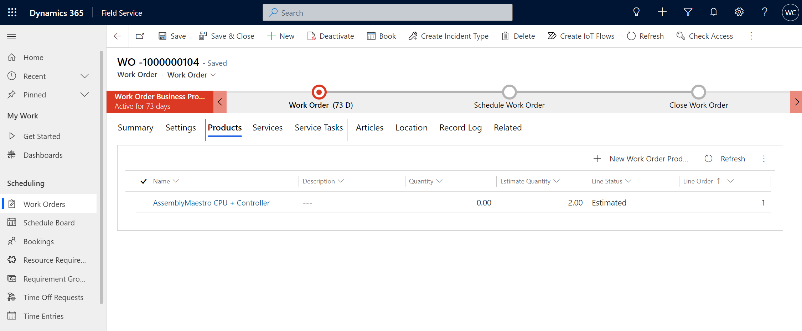

[Read more about the Field Service work order process](work-order-status-booking-status.md)

View and understand the default fields and determine which ones can be used for your business.

> [!div class="mx-imgBorder"]
> 

The following fields are critical to the Field Service work order process and are required. If your organization doesn't plan to use these fields, then you may want to consider using another entity table or creating an entirely new one.

- **Work Order Number**
- **System Status**
- **Service Account**
- **Billing Account**
- **Price List**
- **Work Order Type**
- **Work Location**
- **Address**
- **Latitude**
- **Longitude**

The following subgrids are also critical to the Field Service work order process and are highly recommended.

- **Bookable Resource Booking** ("Bookings")
- **Service Tasks**
- **Products**
- **Services**

For more information, see these articles on [Field Service architecture](field-service-architecture.md) and [creating a work order](create-work-order.md).

## 2. Make a list of needed and unneeded fields

Make a list of default work order fields that are relevant to your business process and another list of unneeded fields. Make sure to add the critical fields mentioned above to the list of needed fields as they're required.  

## 3. Create new fields as needed

Create new fields if the default work order form is missing fields that you need.

For more information on best practices, see the article: [How to create and edit Field Service columns (fields)](field-service-customize-columns-fields.md)

> [!Note]
> Use caution when editing default fields, and never delete default fields. 

## 4. Begin customizing the work order form

Go to **https://make.powerapps.com** > **Tables** > **Work Order** > **Forms**.

Select the Main **Work Order** form. This is the work order form included with Field Service.

> [!div class="mx-imgBorder"]
> 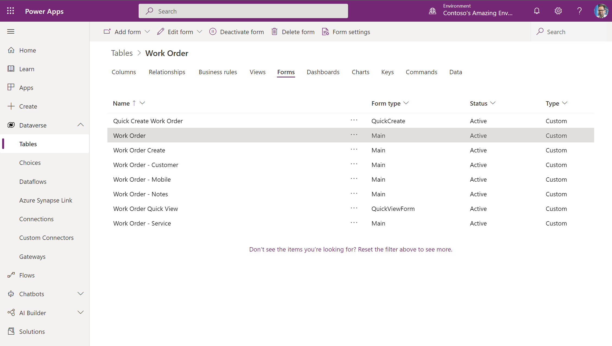

While we recommend using the main **Work Order** form, there are some scenarios where you may want to create a completely new form. 

In the following tabbed sections, we'll look at the pros and cons of using the existing work order forms and creating a new one. 

## [Existing form (recommended)](#tab/existing-form)

Using the existing form is better for scenarios where your organization doesn't want to make many changes to the layout or fields; it's also better for organizations that generally want to use the default work order process.

### Pros

- **Recommended** - The existing work order form is recommended by Microsoft.
- **Receives updates** - The existing work order form receives updates for performance and new features.
- **Better supportability** - When you use the work order form included with Field Service, it's easier for support teams to diagnose and resolve issues.

### Cons

- **Less customizable** - By agreeing to use the existing work order form, you agree to make fewer changes to the form.
- **Need to test upgrades** - The existing work order form will receive updates as much as twice per year. You'll have to test new updates in a sandbox environment and ensure they won't disrupt your users. For more information, see the article: [Merge form customizations](/power-platform/alm/how-managed-solutions-merged#merge-form-customizations). 
## [New custom form](#tab/new-form)

Some scenarios may call for a completely custom work order form. The top reasons you may need to create a custom work order form include:

1. You have a unique work order process and are unable to use the standard work order process included with Dynamics 365 Field Service, or you need to add many custom fields (greater than 100).
2. You have decided it's not feasible for all roles to use the same work order form, even while using security roles and field security profiles to limit information; you also need to create different forms for different user personas.

### Pros

- **Shielded from UI updates** - A new custom form won't receive updates to the user interface meaning the layout and fields displayed on the form. This can be beneficial if you have very specific processes and form layouts.
- **More edits** - You're free to make more changes to the form to fit your unique work order process.

### Cons

- **No updates** - Your custom work order form won't receive updates from Microsoft. It will be static.
- **Maintenance costs** - If Microsoft releases work order features that your organization wants to adopt, you'll need to manually customize your forms to include those features. This costs time and money.
- **Risk of slow performance and errors** - Evidence shows that custom forms tend to have slower performance and more errors because of the risk of violating form design best practices. Review the risks and best practices at the end of this article.

### To create a completely custom work order form...

Go to **https://make.powerapps.com** > **Tables** > **Work Order** > **Forms**.

Select **Add form** at the top and select main form.

> [!div class="mx-imgBorder"]
> 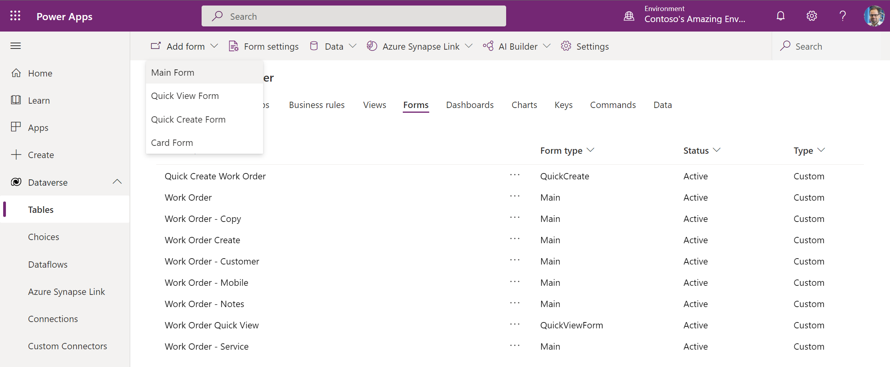

You can also start from a copy of the default form if you've already made changes there.

> [!div class="mx-imgBorder"]
> 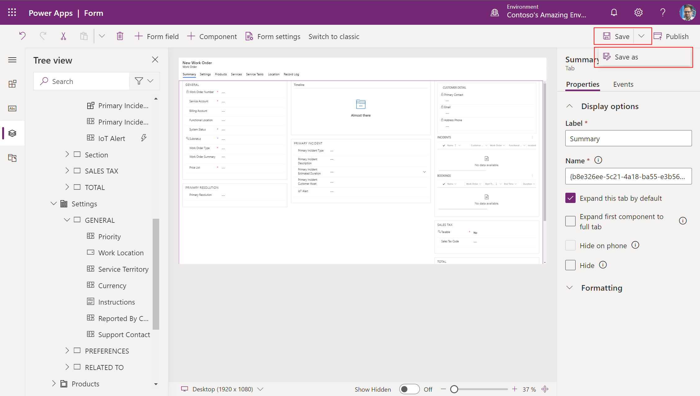

--- 
* * *

## 5. Hide form tabs, sections, and fields

The next step is to hide unwanted tabs, sections, and fields. We recommend that you _hide_ rather than *remove* items because it reduces the chances of errors and makes it easier to add them again later on if needed. This should be done before rearranging or adding fields.

> [!Important]
> The following fields are critical to the Field Service work order process and are required. If your organization doesn't plan to use these fields then you may want to consider creating an entirely new entity table.
> 
> - **Work Order Number**
> - **System Status**
> - **Service Account**
> - **Billing Account**
> - **Price List**
> - **Work Order Type**
> - **Work Location**
> - **Address**
> - **Latitude**
> - **Longitude**
> 
> The following subgrid is also critical to the Field Service work order process and should not be removed.
> 
> - **Bookable Resource Booking** ("Bookings")

#### Hide unwanted tabs

Tabs run horizontal across the top of the form. Hide tabs that you don't need. 

> [!div class="mx-imgBorder"]
> 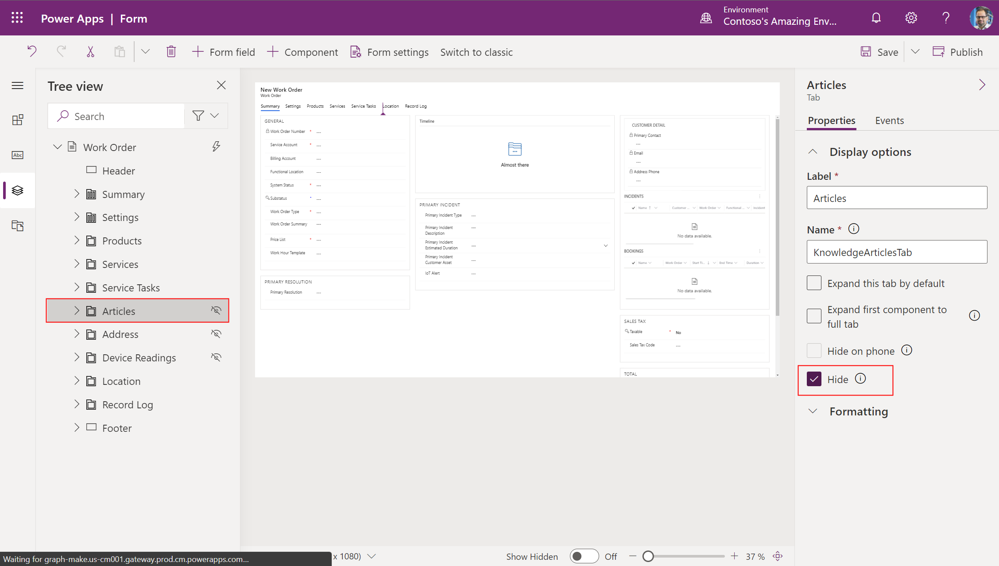

You can't hide the summary tab.

#### Hide unwanted sections

Sections are areas within tabs. Hide sections you don't need. If there's only one field in a section you need, move the field to another section and then hide the unneeded section.

> [!div class="mx-imgBorder"]
> 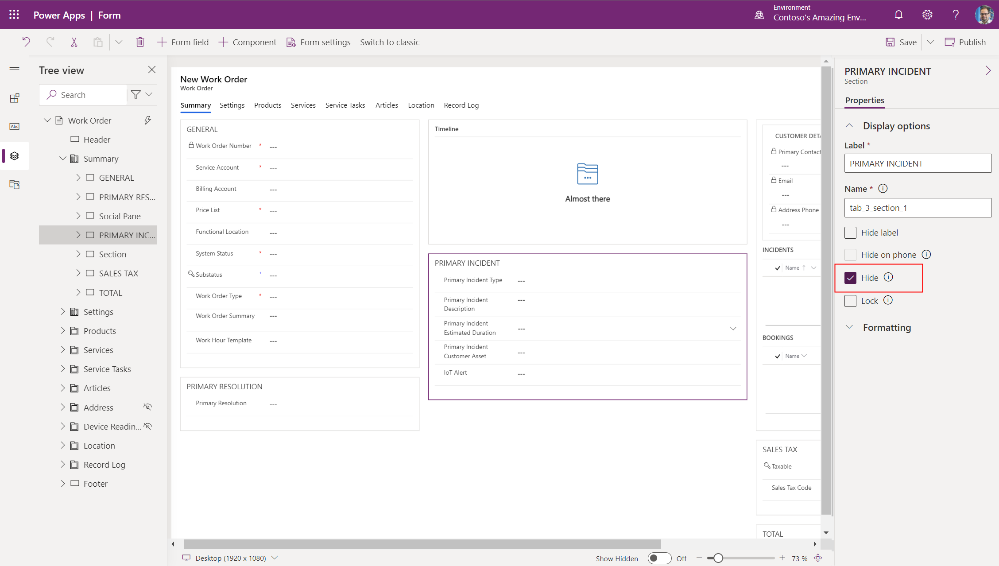

### Remove price-related fields if applicable

There's an easy and supported way to remove all price-related fields (for example, **Price List**, **Total Amount**, and others) from the work order, work order product, and work order service forms.

Go to **Field Service Settings** and set **Calculate Price** to _No_. For more information, see [this article for more details](/dynamics365/field-service/configure-default-settings#work-order-and-bookings-settings). 

### Remove tax-related fields if applicable

There's an easy and supported way to remove all tax-related fields (such as **Taxable**) from the work order, work order product, and work order service forms.

Go to **Field Service Settings** and set **Calculate Tax** to _No_. For more information, see [this article for more details](/dynamics365/field-service/configure-default-settings#work-order-and-bookings-settings). 

### Hide unwanted fields

Hide fields that aren't needed. Don't hide required fields listed earlier in this article. 

> [!div class="mx-imgBorder"]
> 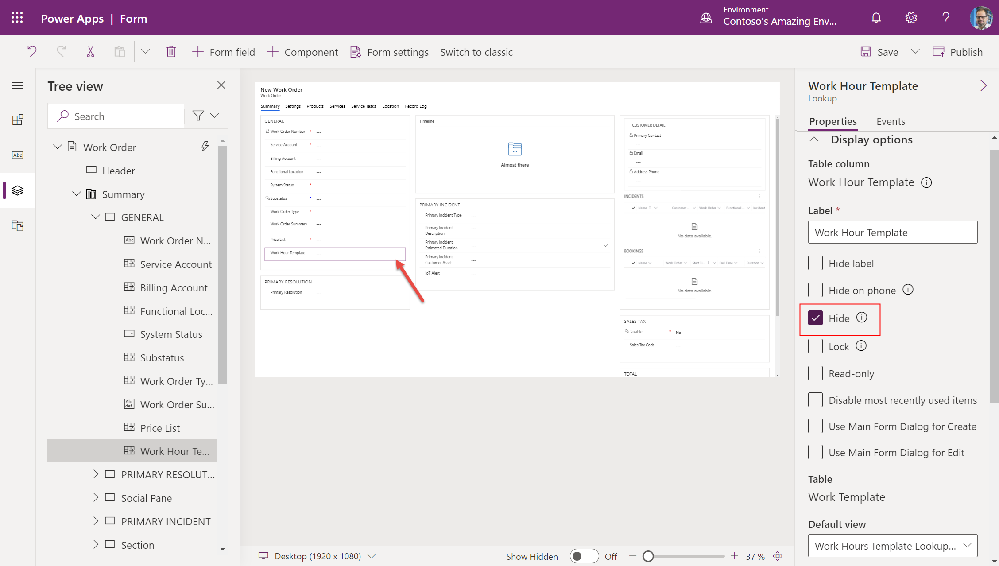

## 6. Add your custom fields to the form

If you created custom fields (columns) earlier, you'll next need to add them to the form. For the best outcome, we recommend following these guidelines: 

1. All new custom fields must be added into a new form section. This is required.
1. Add new custom fields into a new form tab. This is highly recommended but not required.
1. Don't add new custom fields to the first form tab unless absolutely necessary. Doing so will slow form load times. In particular, avoid adding subgrids and lookup fields to the first form tab because they can significantly slow load times.

### Adding your custom fields into a new form tab (recommended)

For example, imagine we created a custom field called "Source" that is a choice-type field to select how the work order was originated (for instance, phone, email, IoT alert, or agreement), and we want to add this new custom field onto the work order form.

Go to the work order form editor.

Select **+Component** at the top, then select **1-**, **2-**, or a **3-column tab**.

In the following screenshot, a new form tab named "New Tab" is created.

> [!div class="mx-imgBorder"]
> 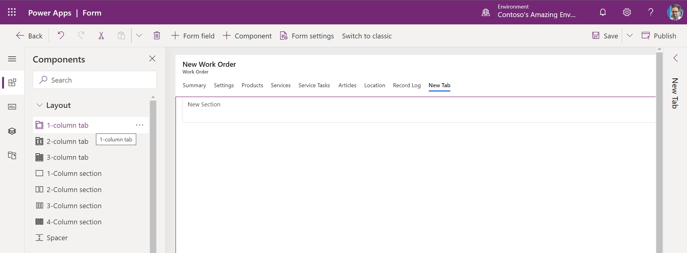

Rename the tab based on your business process.

> [!div class="mx-imgBorder"]
> 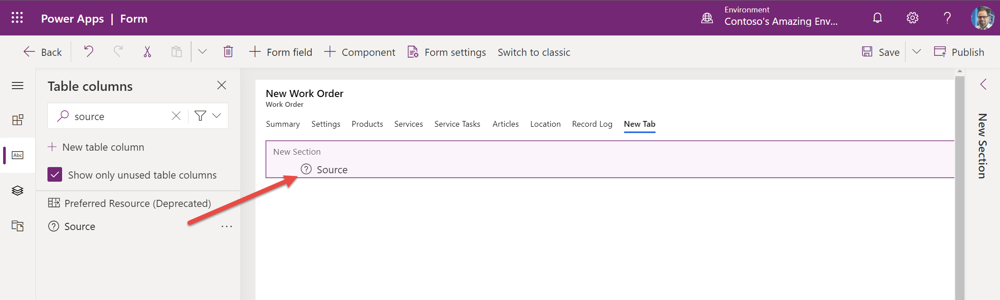

New sections are automatically created when a new form tab is created. 

> [!div class="mx-imgBorder"]
> 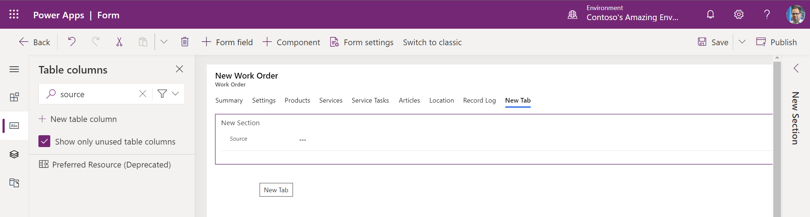

Add your custom fields in the new sections in the new tab. You can add new tabs and new sections as needed.

> [!div class="mx-imgBorder"]
> 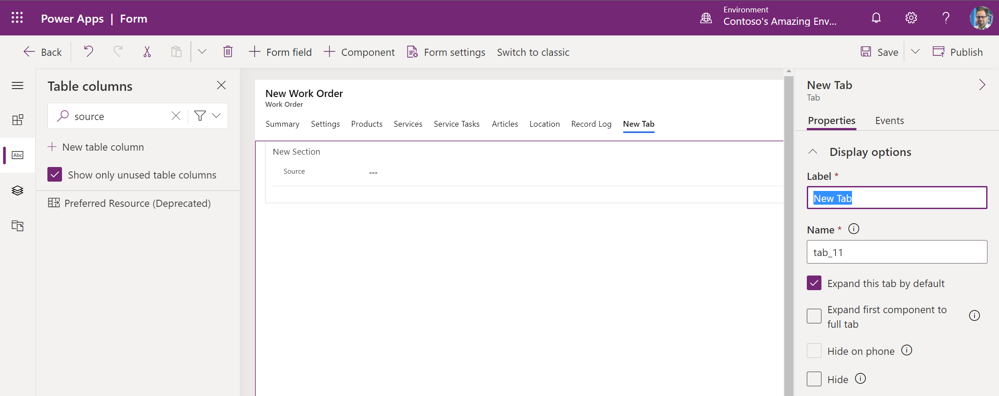

### Adding your custom fields into a new section

In scenarios where you need custom fields in an existing tab, create a new section within an existing tab and add your custom fields in the section.

> [!Note]
> Don't add new custom fields into existing sections. You must create new sections. Also, avoid adding new sections and custom fields into the first form tab (named the summary tab by default), as it can lead to slower load times.

In the following screenshot, we created a new section in the work order settings tab and will add custom fields in this new section.

> [!div class="mx-imgBorder"]
> 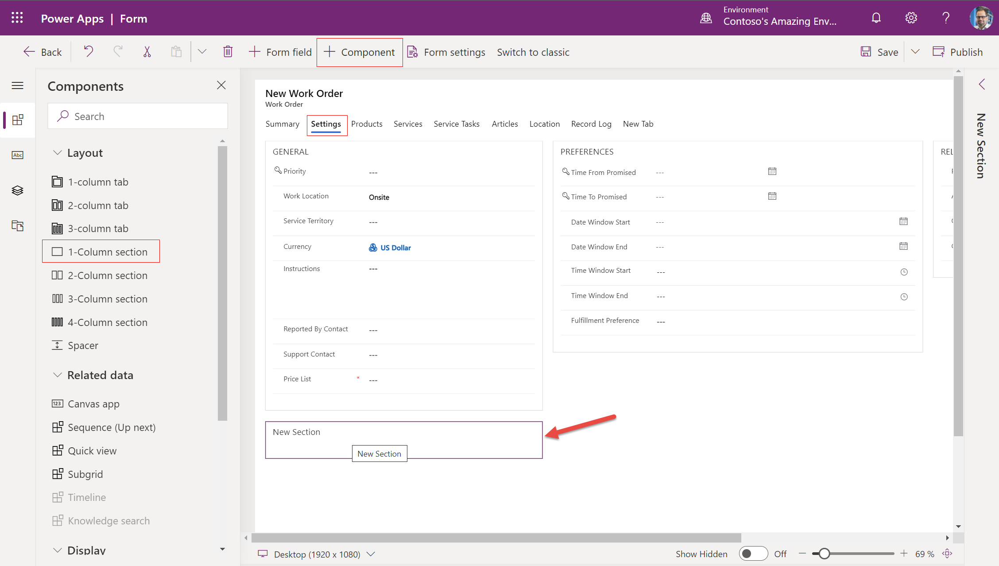

For more information on editing forms, see the Power Platform documentation on [creating and editing forms](/powerapps/maker/model-driven-apps/create-and-edit-forms) and [follow form design best practices](/powerapps/maker/model-driven-apps/create-and-edit-forms).

## 7. Test your forms with tools

[Run Performance Insights](/powerapps/maker/common/performance-insights-overview) to see how app and form performance is affected by things like browsers, network performance, data queries, and more.

Use the monitoring tool to understand the root cause of why forms may be loading slowly. For more information, see [this blog post](https://powerapps.microsoft.com/blog/monitor-now-supports-model-driven-apps/) and [this article](/powerapps/maker/model-driven-apps/monitor-form-checker).

## Configuration considerations 

### Customizing the mobile work order form

While the instructions in this article are useful for customizing any web form for back-office workers, there's a specific work order form optimized for the mobile experience for frontline workers. For more information, see the article on [editing the booking and work order form](mobile-powerapp-booking-work-order-form.md).

### Form scripts

The work order form includes form script libraries. Don't edit or remove any out-of-the-box form libraries.

Many organizations run code scripts on load, on change, and on save of the form to perform validations and run processes. Form scripts can greatly impact form performance like load times. For more information, see the article [Write scripts to implement complex business logic in Field Service](field-service-customize-scripts.md) for best practices, including [running solution checker to test scripts for issues](/powerapps/maker/data-platform/use-powerapps-checker).

[!INCLUDE[footer-include](../includes/footer-banner.md)]
