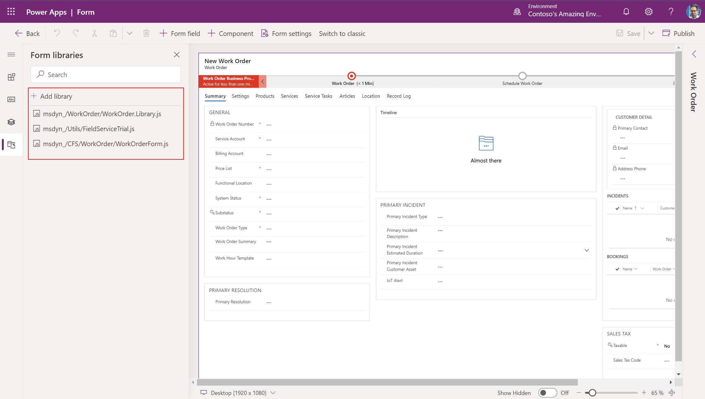

# Write scripts to implement complex business logic in Field Service

In some Field Service implementations, there are functionalities and complex business logic requested by the stakeholders which go beyond the processes offered by the default "out-of-the-box" Field Service app and even beyond the platform options like workflow and business rules. For these requirements developers may write custom code to execute complex requirements.

Implementing complex business logic typically involves writing [plugins](https://docs.microsoft.com/en-us/powerapps/developer/data-platform/plug-ins) on the server side and [JavaScript web resources](https://docs.microsoft.com/en-us/dynamics365/customerengagement/on-premises/developer/clientapi/client-scripting?view=op-9-1) on the client side.  

**Plugins** allow you to write your own custom functionality on top of Microsoft’s event-driven dynamics platform for just about any process you can imagine.

A plug-in is a custom business logic that integrates with Microsoft Dynamics 365 to modify or extend the standard behavior of the platform. Plug-ins act as event handlers and are registered to execute on a particular event in CRM. Plugins are written in either C# or VB and can run either in synchronous or asynchronous mode.

Some scenarios where you could write a plugin are: 

- You want to execute some business logic such as updating certain fields of a record or updating related records, etc. when you create or update a Dynamics 365 record.
- You want to call an external web service on certain events such as saving or updating a record.
- You want to dynamically calculate the field values when any record is opened.
- You want to automate processes such as sending e-mails to your customers on certain events in CRM.

**JavaScript** is one of the ways to apply custom business process logic for displaying data on a form in Dynamics 365. In the context of Field Service, developers may add JavaScript to the work order and booking forms to enforce business logic. They may also add JavaScript to the Schedule Board to create [booking rules](set-up-booking-rules) that perform validations when a booking

## Step 1: Understand the risks of writing custom scripts

> [!Note]
> Adding plugins and JavaScript to your Field Service app requires a lot of caution. In fact, too many scripts or poorly written scripts is the top reason for poor performance, errors, and troubled Field Service implementations. It is recommended to only write scripts if the customization is absolutely critical to run your Field Service operation. Read this article and related content thoroughly before, during and after writing scripts.

## Step 2: Check if Field Service or Dynamics 365 can accomplish the requirement 
Before writing a plugin or JavaScript web resource it is important to check if the Field Service app or another Dynamics 365 app can accomplish the same or similar function. Unfortuantely many people write scripts to accomplish functions that already exist. Not only is this a waste of time and money, but duplicate processes can cause errors and performance issues.

## Step 3: Try using platform options

Before writing a custom script, try to accomplish your requirement with platform options like Power Automate, workflows and business rules. Can't fulfill your requirement with platform options? Decide if a workflow can get close enough to help your business. Using platform options is better for performance, more scalable, more supportable, and is less likely to break with upgrades.

View the following topic to understand [when to use plugins, advantages and disadvantages comapred to workflows](https://docs.microsoft.com/en-us/powerapps/developer/data-platform/plug-ins#when-to-use-plug-ins).

## Step 4: Review best practices before writings plugins or scripts

References
- [Best practices and guidance regarding plug-in and workflow development for the Microsoft Dataverse](https://docs.microsoft.com/powerapps/developer/data-platform/best-practices/business-logic/)
- [Best practices and guidance of client side scripting for model-driven apps](https://docs.microsoft.com/en-us/powerapps/developer/model-driven-apps/best-practices/business-logic/)
- [Make intelligent customizations when you use JavaScript on forms](https://docs.microsoft.com/en-us/powerapps/maker/model-driven-apps/design-performant-forms#javascript-customization)
- [Scalable Customization Design in Microsoft Dataverse](https://docs.microsoft.com/en-us/powerapps/developer/data-platform/scalable-customization-design/overview)

## Step 5: Use tools to test your scripts

[Use solution checker to validate your model-driven apps in Power Apps](https://docs.microsoft.com/powerapps/maker/data-platform/use-powerapps-checker)

Use the built-in CRM Plugin Trace Functionality and plugin profiler - For Online Dynamics 365, we can use the Plugin Registration Tool. Install Plugin Profiler in PRT using Install Profiler to get started. 

[Analyze plug-in performance](https://docs.microsoft.com/en-us/powerapps/developer/data-platform/analyze-performance)

## Summary of recommended best practices

- Avoid writing scripts when possible
- Try using workflows and flows before writing scripts
- Run solution checker on scripts
- Run scripts asynchrnously instead of synchronously
- create a custom model driven app or canvas app (powerapp)
- do not edit or delete existing form libraries 

> [!div class="mx-imgBorder"]
> 

## JavaScript on the Schedule board 

It is recommended to not create more than 1 booking rule. Instead think about using booking alerts. 

### See also

- [Create or edit model-driven app web resources to extend an app](https://docs.microsoft.com/en-us/powerapps/maker/model-driven-apps/create-edit-web-resources)
- [Client scripting in Customer Engagement using JavaScript](https://docs.microsoft.com/en-us/dynamics365/customerengagement/on-premises/developer/clientapi/client-scripting?view=op-9-1)
- [Script (JScript) web resources](https://docs.microsoft.com/en-us/powerapps/developer/model-driven-apps/script-jscript-web-resources)
- [Use plug-ins to extend business processes](https://docs.microsoft.com/en-us/powerapps/developer/data-platform/plug-ins)
- [Access external web services](https://docs.microsoft.com/en-us/powerapps/developer/data-platform/access-web-services)
