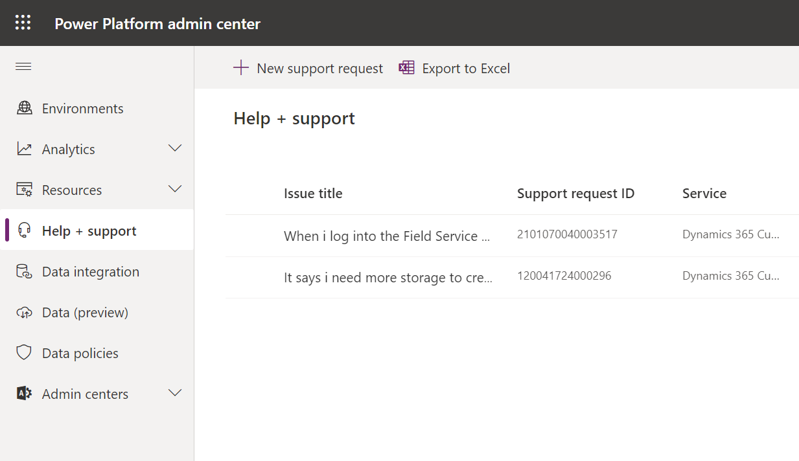
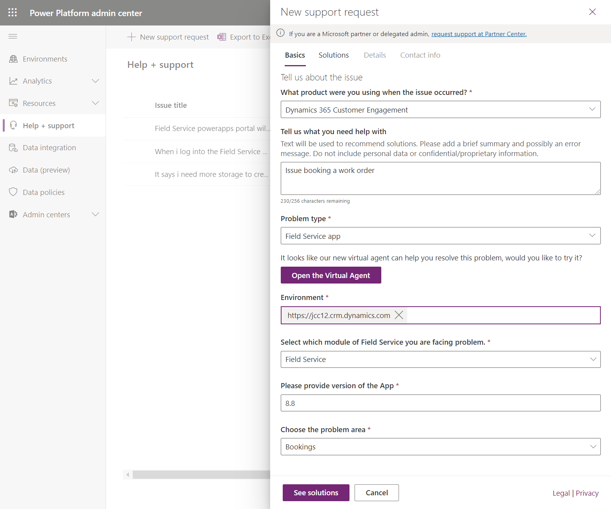

# Submit a support request

Create a support request to get help from a Microsoft representative if you encounter an issue with Dynamics 365 Field Service or Resource Scheduling.

Try the following _before_ submitting a support request to resolve the issue.

- Search the Field Service [documentation](https://aka.ms/fs).
- Check out the [community forum](https://community.dynamics.com/365/fieldservice).
- [Run Solution Health Hub](troubleshoot-field-service-solution-health.md) to run diagnostic tests on your environment (system administrators only).

Follow the instructions below to create a support request.

### Go to the Power Platform admin center

Go to the Power Platform admin center located at [https://admin.powerplatform.microsoft.com/support](https://admin.powerplatform.microsoft.com/support).

Sign in with the username and password you use to sign into Field Service.

Go to the **Help + support** section in the left navigation pane.

### Create a new support request

Select **+New support request** in the top left.

> [!div class="mx-imgBorder"]
> 

### Enter details and submit

Enter relevant details about your support request.

For **What product were you using when the issue occurred?**, select *Dynamics 365 Customer Engagement*.

For **Problem type**, select *Field Service app*.

> [!div class="mx-imgBorder"]
> 

### Still need help? Contact us!

[Contact us](https://dynamics.microsoft.com/contact-us/) to chat with or call Microsoft Dynamics 365 support.
