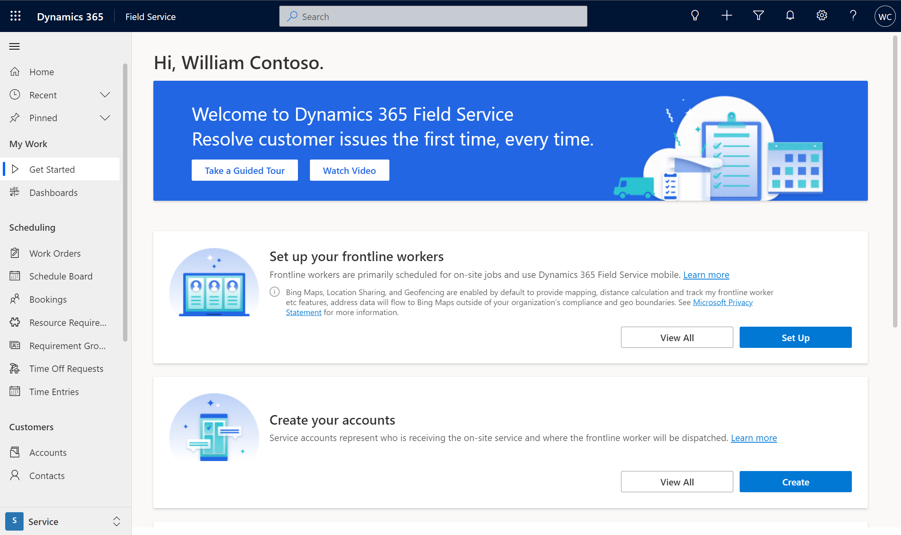

# Submit a support request for Dynamics 365 Field Service

- Read docs
- View forums
- Run Solution Health Hub

### Log in to the Field Service app
> [!div class="mx-imgBorder"]
> 

### Go to the Power Platform admin center

[https://admin.powerplatform.microsoft.com/support](https://admin.powerplatform.microsoft.com/support)

### Create a new support request

> [!div class="mx-imgBorder"]
> 

### Enter details and submit support request

> [!div class="mx-imgBorder"]
> 