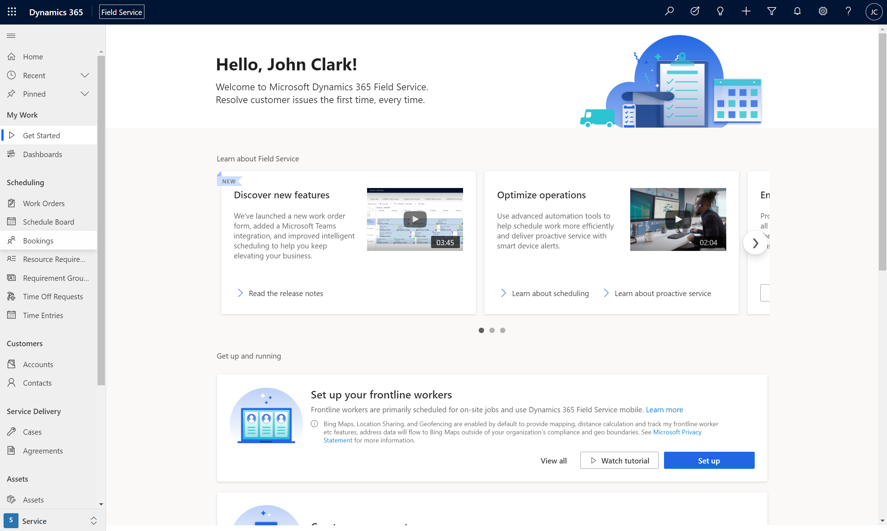
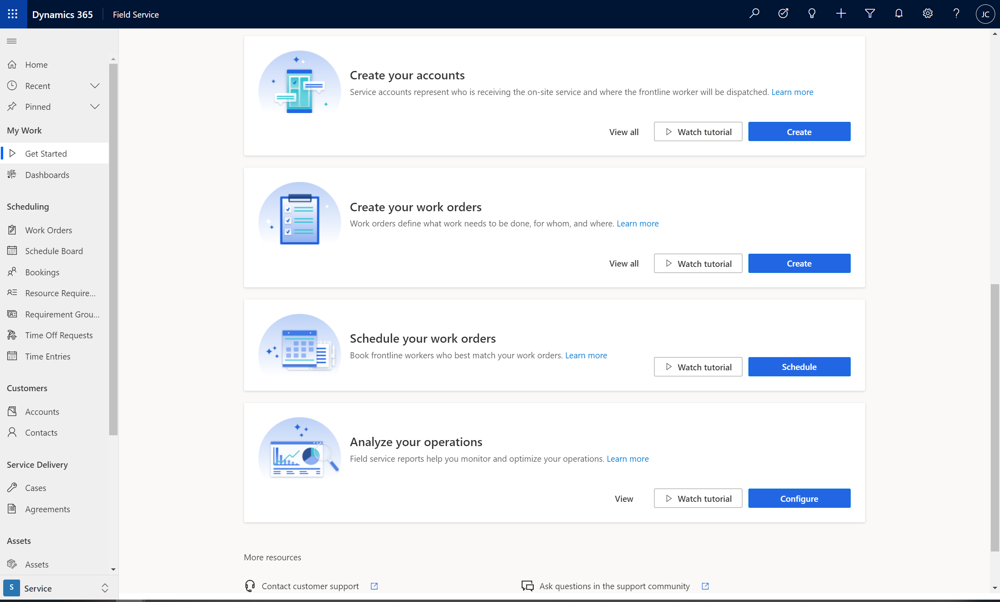
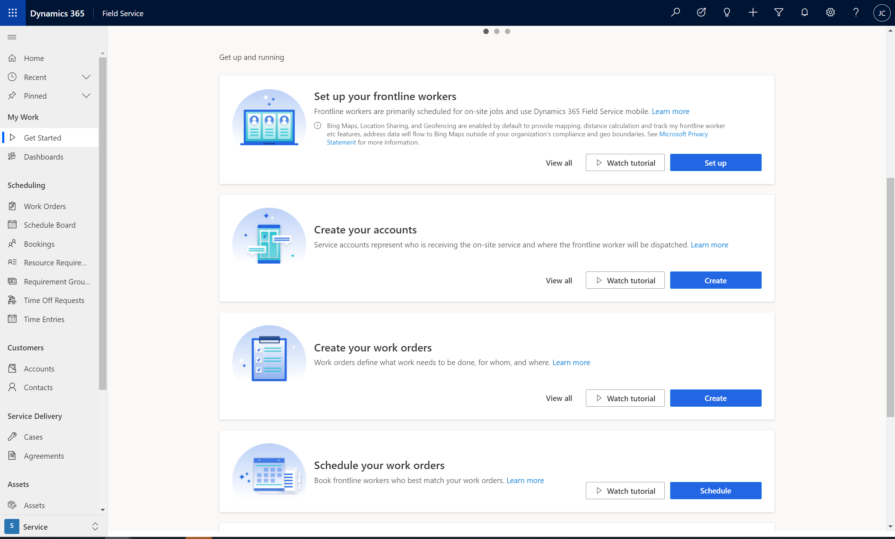
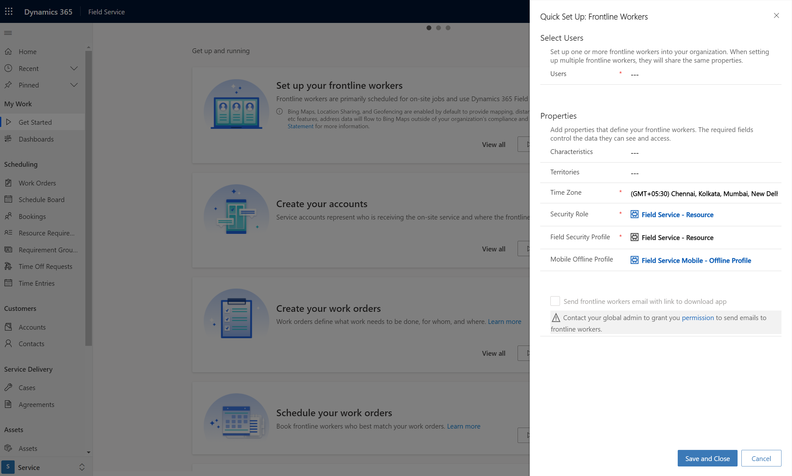
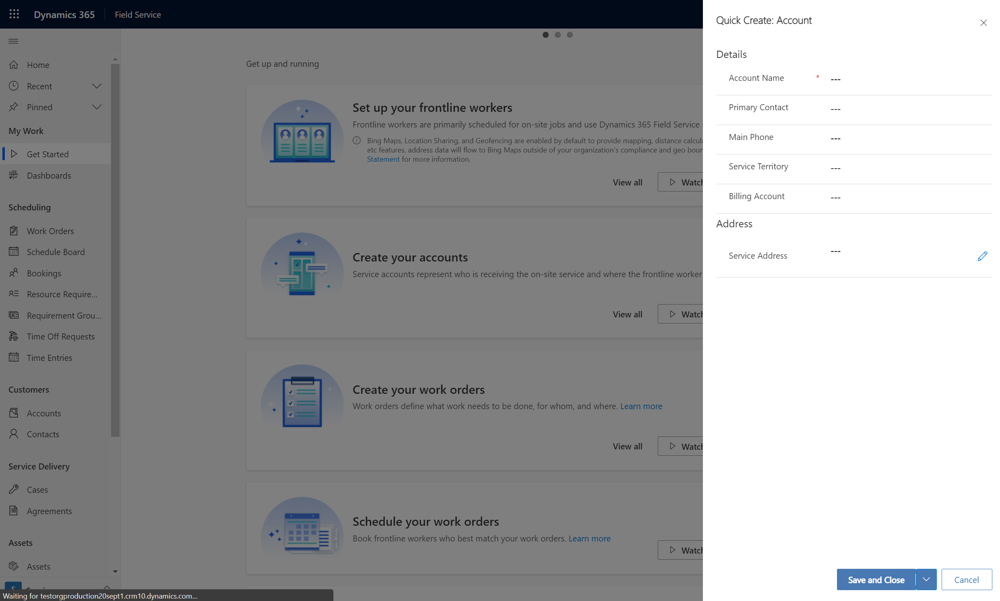
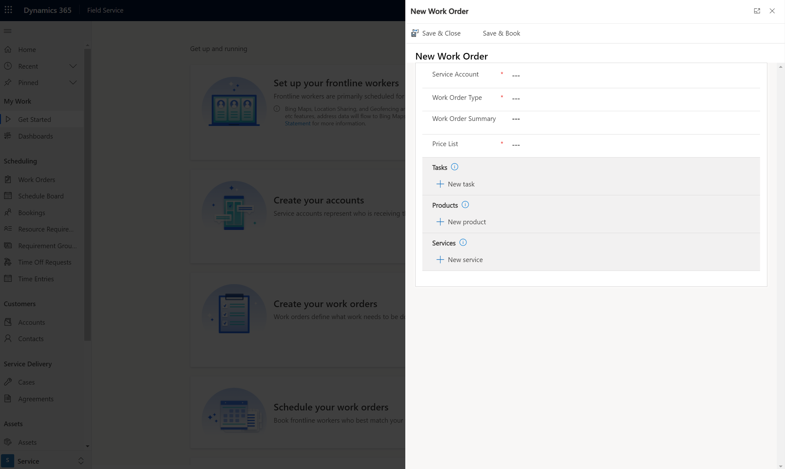
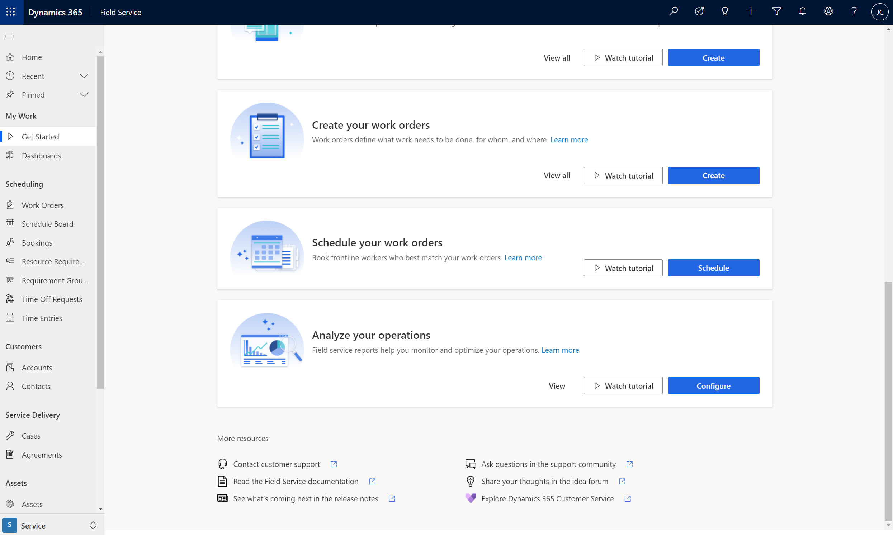
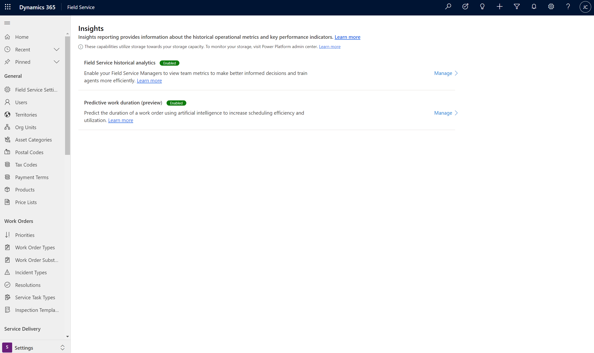
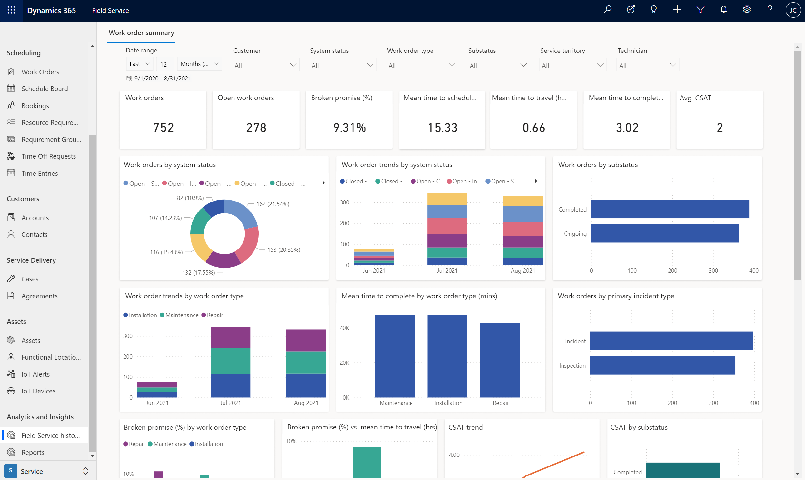

# Get started with Dynamics 365 Field Service

After you have [installed Dynamics 365 Field Service](install-field-service.md) and have [assigned Field Service licenses to your users](view-user-accounts-security-roles.md) who need to use the app, you can start adding your frontline workers and scheduling work orders. The best way to do this is to use the new **Getting Started** page, as seen in the following screenshot.

In the **Learn about Field Service** section, there are four cards with videos and links to documentation to help quickly learn about new features and capabilities in the current release. And for users new to Field Service, you'll also see key app functionality. With each release, we'll highlight new functionality in this **Getting Started** section, so be sure to check back regularly!

In the **Get up and running** section, there are a set of actions and tutorial videos that guide you through important Field Service processes, like: 

- Creating frontline workers (sometimes called technicians)
- Adding customers
- Creating work orders
- Scheduling work orders to frontline workers
- Analyzing your operations

Finally, at the end of the **Getting Started** page, there are links to helpful resources, including: 

- Support contacts to help with product questions
- Release plans to stay up to date with latest improvements and upcoming development
- Field Service community forum
- Ideas portal to submit feature ideas

## Prerequisites

- The Field Service **Getting Started** page is available with the 2021 Wave 2 release.
- Either **System Administrator** or **Field Service - Administrator** privileges to see and use the **Getting Started** page.

## Set up your frontline workers

First, you must set up your frontline workers. This person is someone in your company who completes work orders. 

From the **Getting Started** page, select the **Set Up** option.

In the form, enter required information. Recommended values are prepopulated; don't change these values unless necessary.

You can also send an email to the frontline worker, so that they can download the mobile app on their device. For more information about sending emails to frontline workers, see this article: [Send frontline workers an email with a link to download Dynamics 365 Field Service mobile app](frontline-worker-set-up-email-approval.md).

## Create your accounts

Next, create an account that represents one of your customers. 

From the **Getting Started** page, Select **Create**.

In the form, fill out relevant details.

**Save and close**.

## Create your work orders

Create a work order that outlines work that needs to be done for a customer, typically at the customer's location or at the location of an asset or equipment. 

From the **Getting Started** page, select **Create**.

In the form, fill out relevant details.

- The **Service Account** represents the customer who the work order relates to.
- **Tasks** are a checklist of things that need to be done.
- **Products** are parts that may be needed to complete the work order.
- **Services** represents labor that may be needed to complete the work order.

## Schedule your work orders

Next, schedule the work order to a frontline worker. 

On the **Getting Started** page, select **Schedule** to go to the schedule board.

Find your work order in the lower pane, then select-and-drag it to your frontline worker.

## Analyze your operations

Finally, you can analyze your operation by enabling and looking at work order summary and resource utilization Power BI reports. 

On the **Getting Started** page, select **Configure** in the **Analyze your operations** section to go to the insights setting page.

Select **Manage** for the reports you would like to enable or disable for your organization.

You'll see reports under **Analytics and Insights**.

Congratulations! You have successfully completed the core scenario in Field Service.
