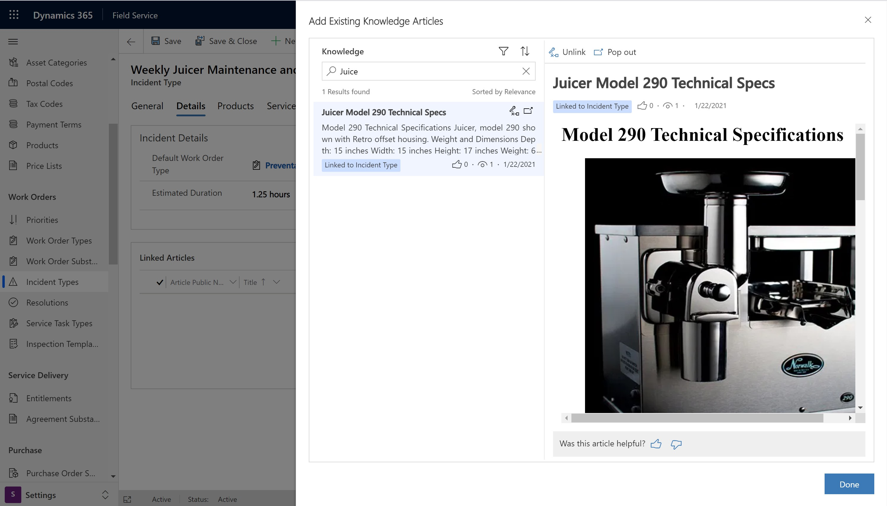
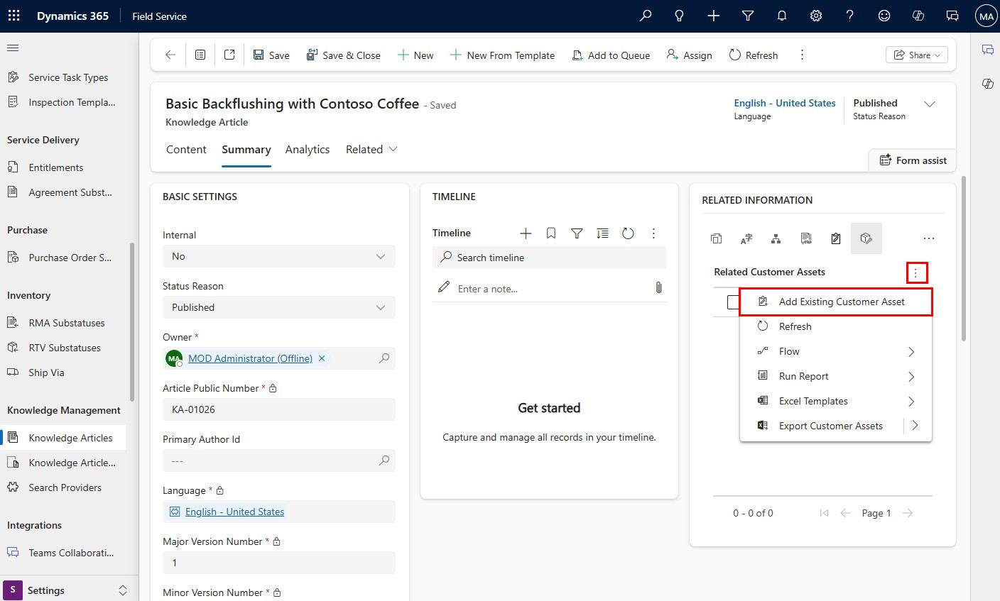
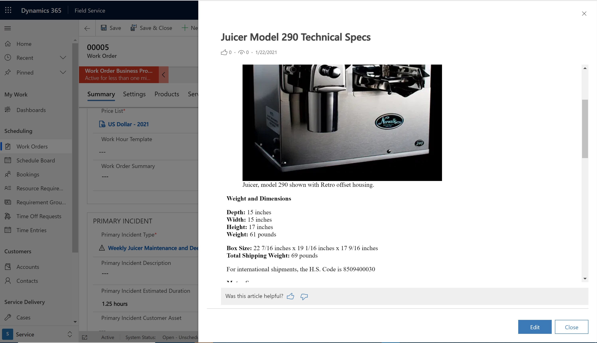
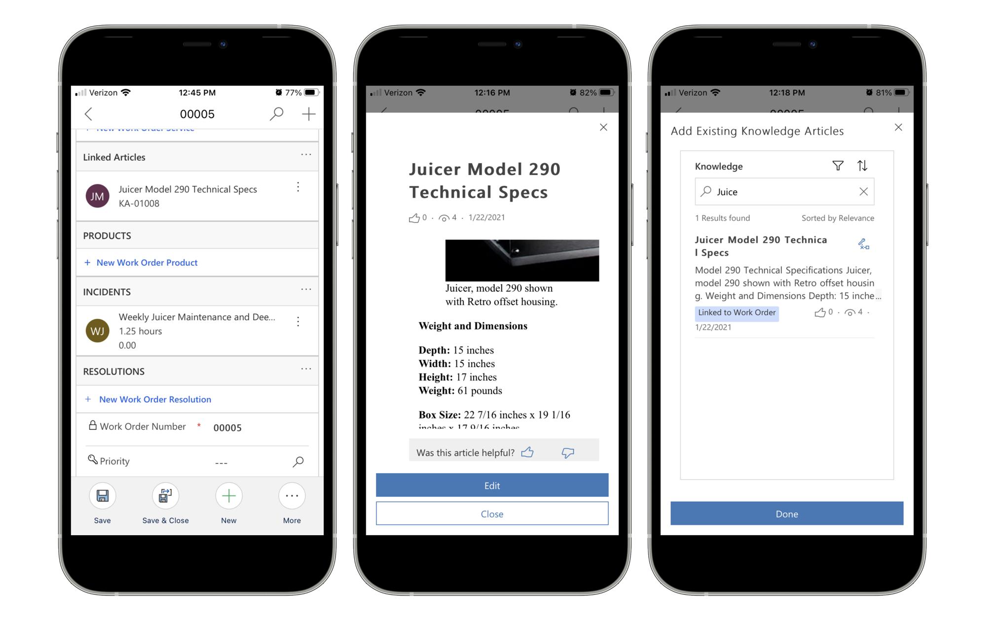
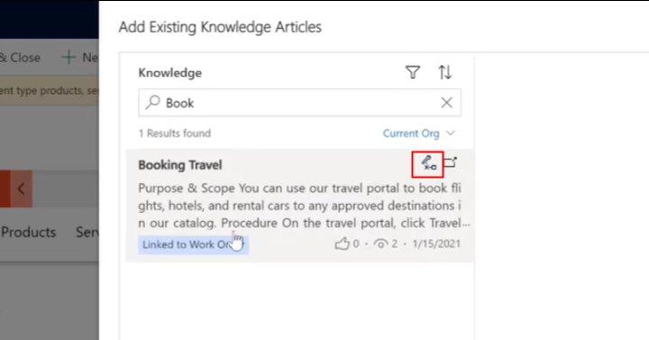

# Knowledge management in Dynamics 365 Field Service

When field service technicians are onsite performing work, they need to be able to access information to help them solve the problems they encounter.

With knowledge management in Dynamics 365 Field Service, relevant knowledge articles can be associated directly to work orders so that technicians can easily troubleshoot while on the go. Articles added to work orders can also be based on related cases, incidents, products, and customer assets.

Access to these articles can:

- Improve first-time fix rate.
- Guide technicians through procedures and help.

> [!Note]
> Previously, knowledge management was only available for Field Service through Dynamics 365 Customer Service; it's now built-in to Field Service and no longer requires Dynamics 365  Service. If you're already using Dynamics 365 Customer Service knowledge articles in Field Service, you can still use knowledge management for both. 

In this article, we'll walk through how to: 

- Create a knowledge article
- Associate articles to cases, assets, incident types, or products
- Associate articles to work orders
- View knowledge articles from the mobile app

## Create a knowledge article

In Field Service, go to **Settings** > **Knowledge Articles**.

Create a knowledge article and add text, pictures, and videos as needed.

Then save and publish the article.

For more information on knowledge articles, visit the following Customer Service documentation:

- [Create and manage knowledge articles](https://docs.microsoft.com/dynamics365/customer-service/customer-service-hub-user-guide-knowledge-article)
- [Set up a search provider](https://docs.microsoft.com/dynamics365/customer-service/set-up-search-providers)

## Associate knowledge article to cases, customer assets, incident types, products

Next, associate knowledge articles to various work order records like incident types, products, or customer assets based on your business needs. When any of these records are added to a work order, the related knowledge articles will be linked to the work order. 

Let's look at two examples: relating knowledge articles to incident types, and relating them to customer assets.

### Associate knowledge articles to incident types

In Field Service, go to **Settings** > **Incident Types** and select an incident type.

> [!div class="mx-imgBorder"]
> 

In the **Details** section, relate the relevant knowledge article or articles to the incident type.

> [!div class="mx-imgBorder"]
> 

### Associate knowledge articles to Customer assets

In Field Service, go to **Settings** > **Knowledge articles**. 

Select an article. In the **Related Information** section, select **Add Existing Customer Asset**.

> [!div class="mx-imgBorder"]
> 

Selecting a customer asset will relate the knowledge article to that asset. 

## Create a work order

In Field Service, go to **Work Orders** > **+New**.

Add work order incidents, customer assets, and work order products to the work order.

Associated knowledge articles will be added to the work order in **Linked Articles** section of the work order form.

> [!div class="mx-imgBorder"]
> 

> [!div class="mx-imgBorder"]
> 

You can also link specific knowledge articles that are *not* associated to incidents, assets, or products. From the **Linked Articles** section, select **+New Linked Article**.

> [!Note]
> Adding multiple work order incident types, customer assets, and work order products will link all associated knowledge articles to the work order. 

## View work order and knowledge articles on the mobile app

After the work order is saved and scheduled to a technician, the technician can see the knowledge articles in the Field Service mobile app.

> [!div class="mx-imgBorder"]
> 

Knowledge articles are downloaded and available offline; however, images and videos in knowledge articles will only be available when the mobile device is online. Ensure your system administrator publishes the latest [mobile offline profile](mobile-power-app-system-offline.md) so knowledge articles are downloaded to the device in the next sync.

## Configuration considerations

- To remove an article from a work order, select the unlink icon, as seen in the following screenshot.

> [!div class="mx-imgBorder"]
> 

## Additional notes

- If a work order is created from a case via the **Convert to Work Order** button on the case, knowledge articles linked to the case will automatically be linked to the work order.

