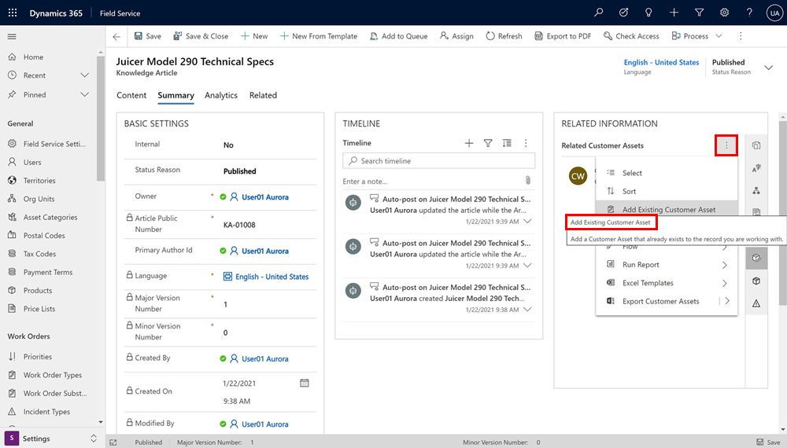

# Knowledge management in Field Service

features:
- same knowledge management as customer service. dont need customer service
- available on mobile offline
- link to work orders, incidents, and assets

business value:
- improve first time fix rate
- guide technicians through procedures and help

## Prerequisites
> [!Note]
>

For a guided walkthrough, check out the following video.

> [!VIDEO 
https://www.microsoft.com/en-us/videoplayer/embed/RWs4Cu]

See the video on [Field Service (Dynamics 365) mobile app: Offline JavaScript](https://youtu.be/tUdL5YZA29A) for more details.

> [!div class="mx-imgBorder"]
> 

## Configuration considerations
## Additional Notes

> [!div class="mx-imgBorder"]
> 

> [!div class="mx-imgBorder"]
> 

> [!div class="mx-imgBorder"]
> 

> [!div class="mx-imgBorder"]
> 

> [!div class="mx-imgBorder"]
> 