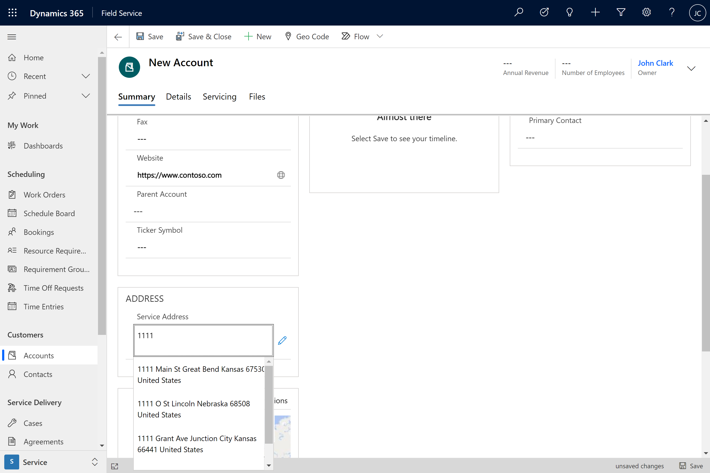
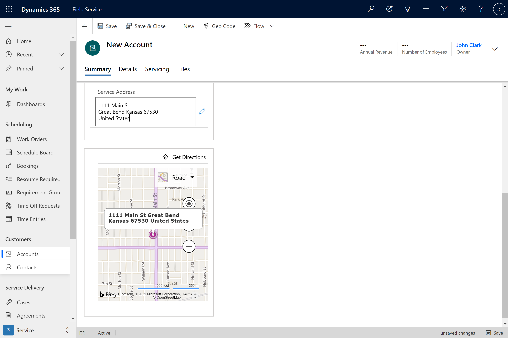
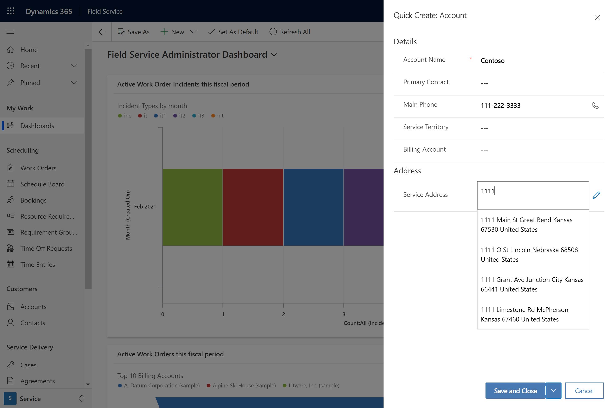
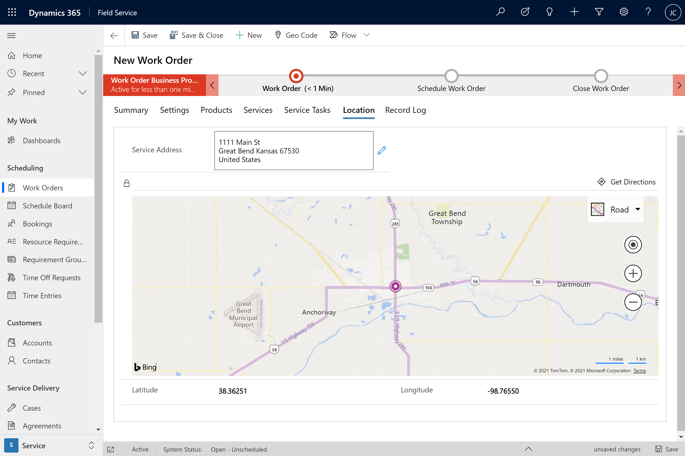

# title

Dynamics 365 Field Service provides the following map and location features to optimize your field service operations.   Here are an overview of the features and how to enable.
Address recommendations

Field service users can quickly enter account service addresses using Bing Maps address recommendation with an inline map minimizing to ensure accuracy and reduce data entry errors. 
Note:  Field Service Resource by default has read privileges and cannot edit addresses, so they will see the new merged address but not the new edit with location recommendations.

1-click directions
Inline map with 1 click directions so technicians can arrive on time for customer service appointments.

Work order map view 

Dispatchers can view work orders on a map in the Schedule Board when service account addresses have been geo coded.

Mapping settings

To use the map enhancement in your Field Service deployment, the following settings must be enabled:

> [!Important]
> By connecting to a mapping service, you are allowing the system to share your data, including but not limited to addresses and coordinates, with external systems outside of your Microsoft Dynamics 365 environment. (Mapping service refers to Bing Maps or other third-party mapping service designated by you or your operating system). This also applies to Government Cloud environments. Your use of the mapping service will also be subject to their separate terms of use. Data imported from such external systems into Microsoft Dynamics 365 are subject to the [Microsoft Privacy Statement](https://privacy.microsoft.com/privacystatement).

## Connect to Maps

Connect to Maps (default = disabled) 

## Enable Bing Maps (Show Bing Maps on forms)

Enable Bing Maps (Show Bing Maps on forms) (default = disable)
Advanced Settings / Settings / Administration / System Settings / General [Tab] 

> [!div class="mx-imgBorder"]
> 

For information on enabling maps for the work order form, see the article on [managing Bing Maps](https://docs.microsoft.com/dynamics365/customer-engagement/admin/manage-bing-maps-organization).

> [!div class="mx-imgBorder"]
>  

## Enable Auto Geocoding Address 

Enable Auto Geocoding Address   (default = enabled) 
Field Service [App] / Settings [Area] / Field Service Settings [Page] / Other [Tab] 

Go to **Field Service** > **Settings** > **Field Service Settings**.

> [!div class="mx-imgBorder"]
>   

In the **Other** section, decide if you would like the application to auto geocode addresses. The recommended setting is **Yes.**
 
"Auto geocode addresses" means that after entering an address on entities such as accounts, contacts, users, and work orders, the system will automatically attempt to locate the address and populate latitude and longitude values. Disallowing auto geocoding for addresses  requires the user to select a Geocode button.

> [!div class="mx-imgBorder"]
> 

## Enable Address suggestions

Enable Location Recommendations (default = enabled?)
Field Service [App] / Settings [Area] / Field Service Settings [Page] / Other [Tab] 

> [!div class="mx-imgBorder"]
> 

> [!div class="mx-imgBorder"]
> 

> [!div class="mx-imgBorder"]
> 

> [!div class="mx-imgBorder"]
> 

> [!div class="mx-imgBorder"]
> 

## Configuration considerations
## Additional Notes