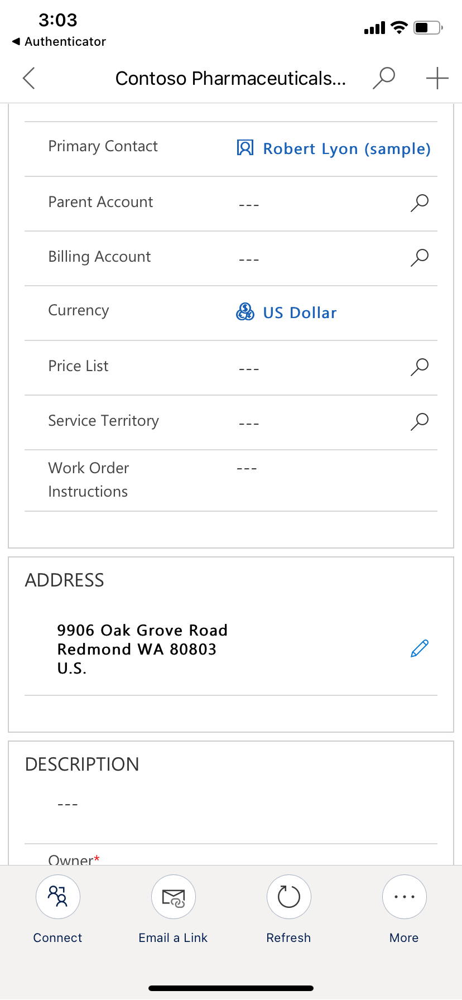
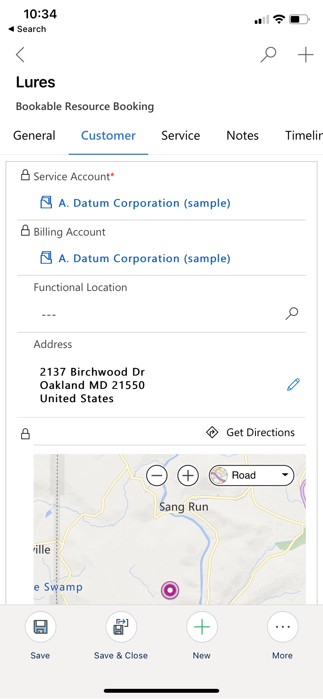
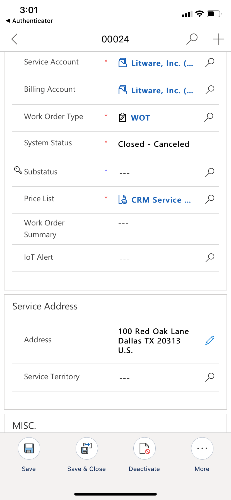

# title

## Connect to Maps

## Enable Bing Maps (Show Bing Maps on forms)

## Enable Auto Geocoding Address 

## Prerequisites
> [!Note]
>

> [!div class="mx-imgBorder"]
> 

Map Enhancements
Dynamics 365 Field Service provides the following map and location features to optimize your field service operations.   Here are an overview of the features and how to enable.
Address recommendations
Field service users can quickly enter account service addresses using Bing Maps address recommendation with an inline map minimizing to ensure accuracy and reduce data entry errors. 
Note:  Field Service Resource by default has read privileges and cannot edit addresses, so they will see the new merged address but not the new edit with location recommendations.

1-click directions
Inline map with 1 click directions so technicians can arrive on time for customer service appointments.

<map 1 click directions>

Work order map view 

Dispatchers can view work orders on a map in the Schedule Board when service account addresses have been geo coded.

<schedule board with map view>

Mapping settings

To use the map enhancement in your Field Service deployment, the following settings must be enabled:

Enable Bing Maps (Show Bing Maps on forms) (default = disable)
Advanced Settings / Settings / Administration / System Settings / General [Tab] 

Enable Auto Geocoding Address   (default = enabled) 
Field Service [App] / Settings [Area] / Field Service Settings [Page] / Other [Tab] 

Enable Location Recommendations (default = enabled?)
Field Service [App] / Settings [Area] / Field Service Settings [Page] / Other [Tab] 

Connect to Maps (default = disabled) 

> [!div class="mx-imgBorder"]
> 

> [!div class="mx-imgBorder"]
> 

> [!div class="mx-imgBorder"]
> 

> [!div class="mx-imgBorder"]
> 

> [!div class="mx-imgBorder"]
> 

> [!div class="mx-imgBorder"]
> 

> [!div class="mx-imgBorder"]
> 

> [!div class="mx-imgBorder"]
> 

> [!div class="mx-imgBorder"]
> 

## Configuration considerations
## Additional Notes