# Enable location and map settings in Dynamics 365 Field Service

Locations and maps are important for getting the most value out of Field Service. For example, knowing the location of work orders and resources allows the solution to effectively route the closest technician (resource) to the service request (work order).

Enable location and map settings to perform functions like:

- Get directions with one click so technicians can arrive on time for customer service appointments
- Attach latitude and longitude values to addresses (geocode)
- See work orders on a map
- Geofencing 

> [!Important]
> By connecting to a mapping service, you are allowing the system to share your data, including but not limited to addresses and coordinates, with external systems outside of your Microsoft Dynamics 365 environment. (Mapping service refers to Bing Maps or other third-party mapping service designated by you or your operating system). This also applies to Government Cloud environments. Your use of the mapping service will also be subject to their separate terms of use. Data imported from such external systems into Microsoft Dynamics 365 are subject to the [Microsoft Privacy Statement](https://privacy.microsoft.com/privacystatement).

## Connect to Maps

Go to **Resource Scheduling app** > **Administration** > **Scheduling Parameters**.

> [!div class="mx-imgBorder"]
> 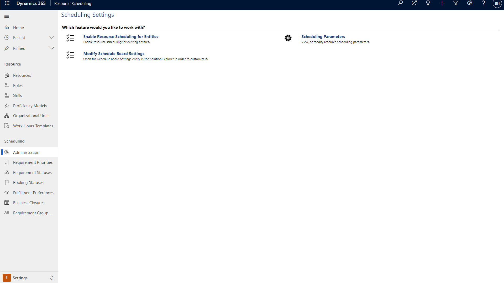 

Set **Connect to Maps** to **Yes**.

> [!div class="mx-imgBorder"]
> 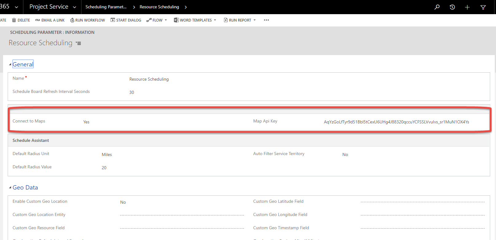  

> [!Note]
> In Field Service version 8.8.10.44+ the Bing Maps API key is hidden.

Save and close.

## Enable Auto Geocoding Address 

Geocoding is associating a latitude and longitude to an address. This allows dispatchers to locate work orders more effectively than an address.

"Auto geocode addresses" means that after entering an address on entities such as accounts, contacts, users, and work orders, the system will automatically attempt to locate the address and populate latitude and longitude values. Disallowing auto geocoding for addresses requires the user to select a Geocode button to manually geocode an address.

From the Field Service App go to  **Settings > Field Service Settings > Other tab** 

> [!div class="mx-imgBorder"]
> 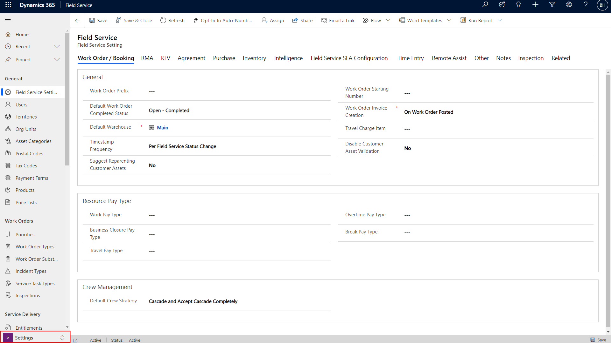  

In the **Other** section, decide if you would like the application to auto geocode addresses. The recommended setting is **Yes.**
 

> [!div class="mx-imgBorder"]
> 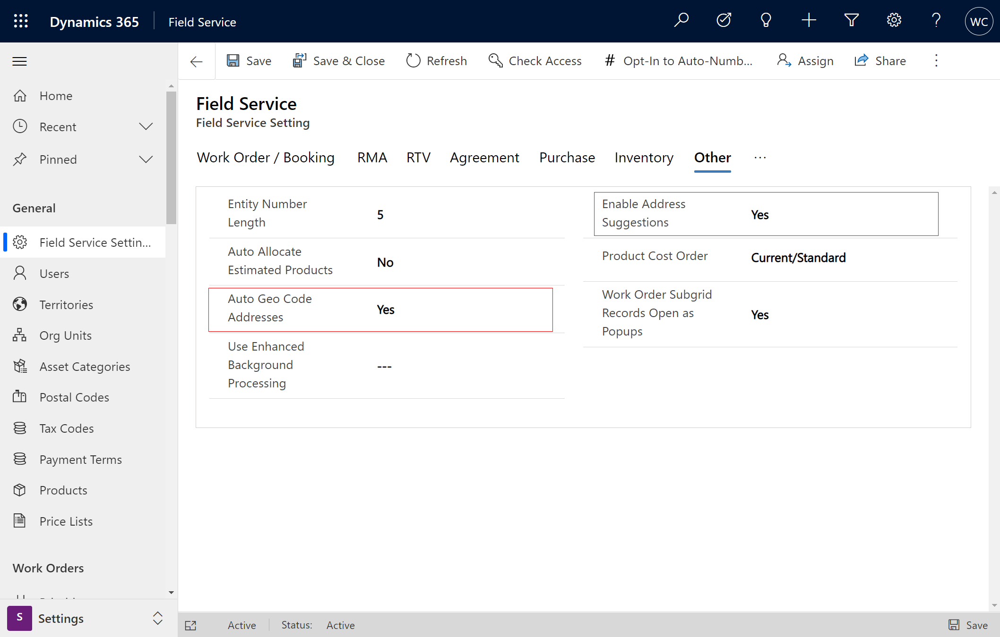

## Enable Address suggestions

Field service users can quickly enter account service addresses using Bing Maps address recommendations. As the user enters an address the system will make recommendations. This ensures accuracy and reduces data entry errors. 

> [!div class="mx-imgBorder"]
> 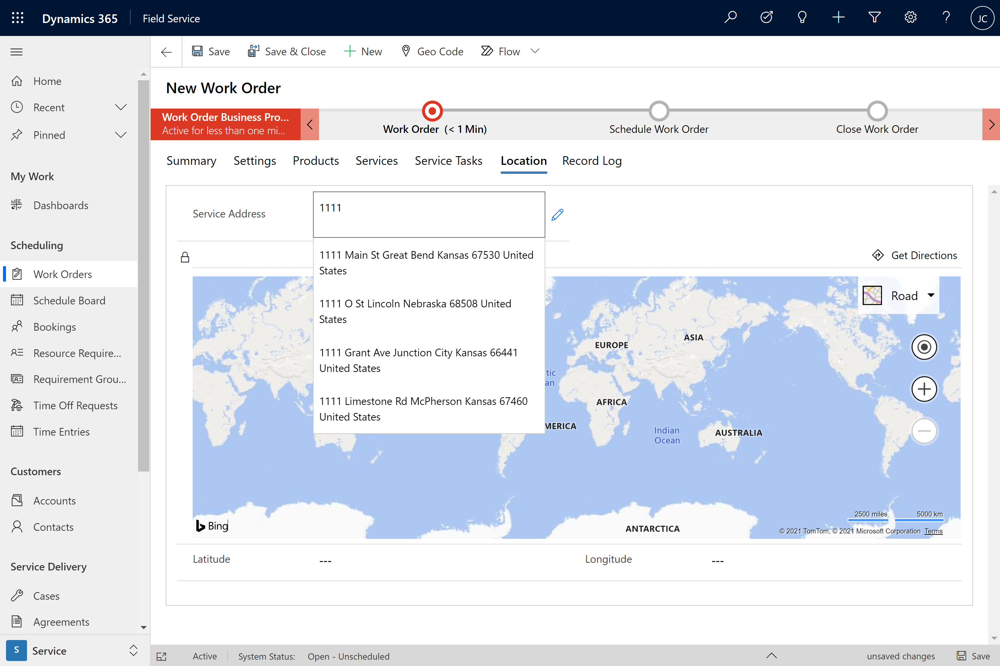

Address recommendations are available on the mobile app too for technicians. 

> [!div class="mx-imgBorder"]
> 

To enable Location Recommendations: 

From the Field Service App go to **Settings > Field Service Settings > Other tab** 

Address recommendations are on the account, work order, and booking forms.

> [!Note]
> By default the _Field Service - Resource_ security role has read only privileges and cannot edit addresses.

## Enable Bing Maps (Show Bing Maps on forms)

It is helpful for dispatchers and technicians to see a map view on work orders, accounts, and other tables.

> [!div class="mx-imgBorder"]
> 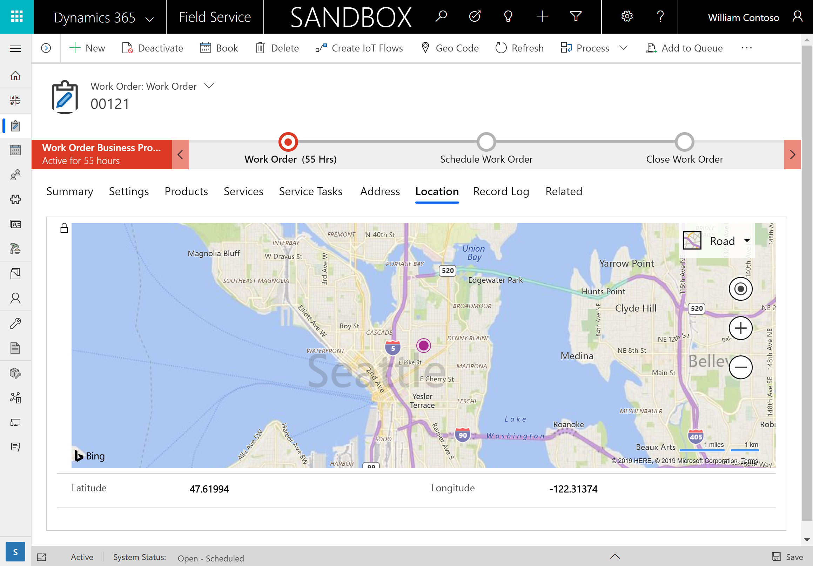 

Enable Bing Maps (Show Bing Maps on forms) by going to **Advanced Settings > Settings > Administration > System Settings > General tab** 

> [!div class="mx-imgBorder"]
> 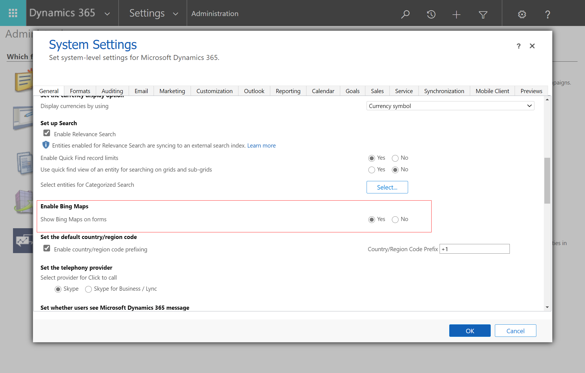

For information on enabling maps for the work order form, see the article on [managing Bing Maps](https://docs.microsoft.com/dynamics365/customer-engagement/admin/manage-bing-maps-organization).

## Test geocoding

Finally, let’s test geocoding.

Go to **Field Service > Work Orders** and select **+New**.

Begin typing an address.

> [!div class="mx-imgBorder"]
> 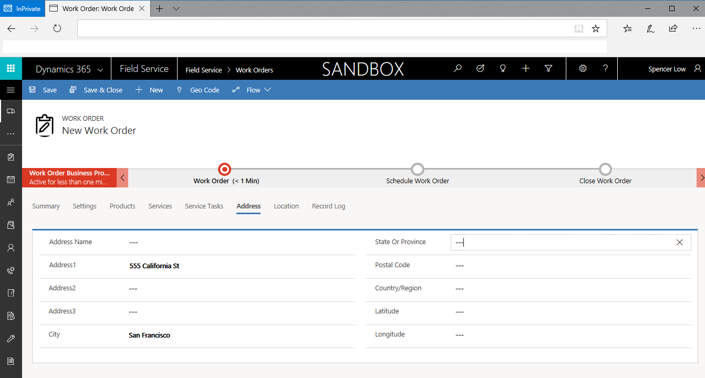  

The system will find the address and present it as a suggestion.

> [!div class="mx-imgBorder"]
> 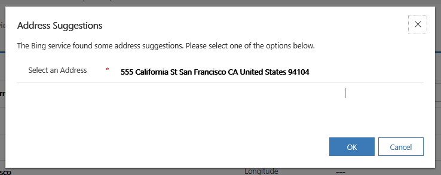  

After selecting the correct address, the form will populate the rest of the address, **including the latitude and longitude**.

> [!div class="mx-imgBorder"]
> 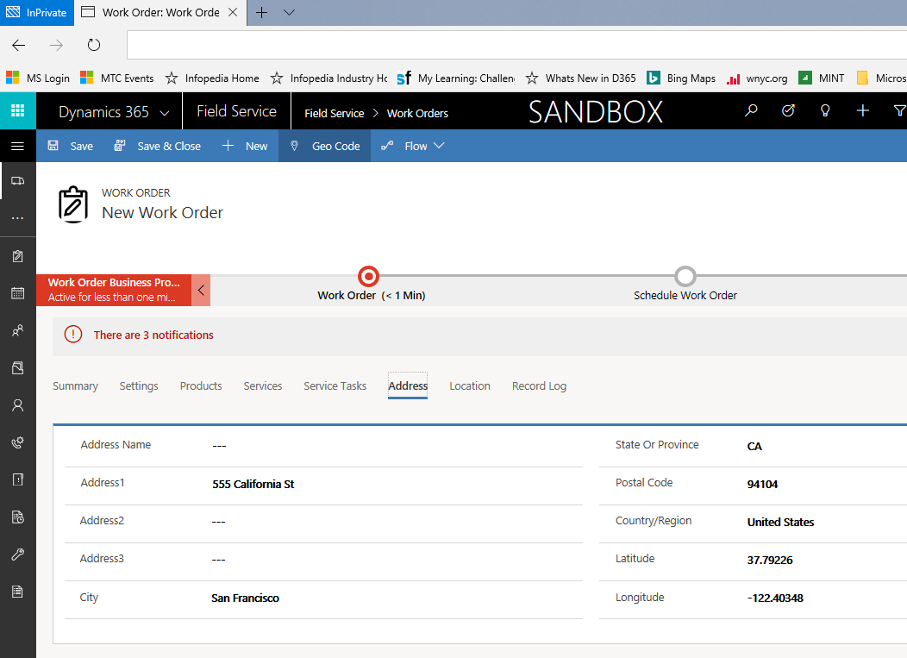  

If you don't want the system to auto geocode addresses, select the geocode button in the top ribbon.

> [!div class="mx-imgBorder"]
> 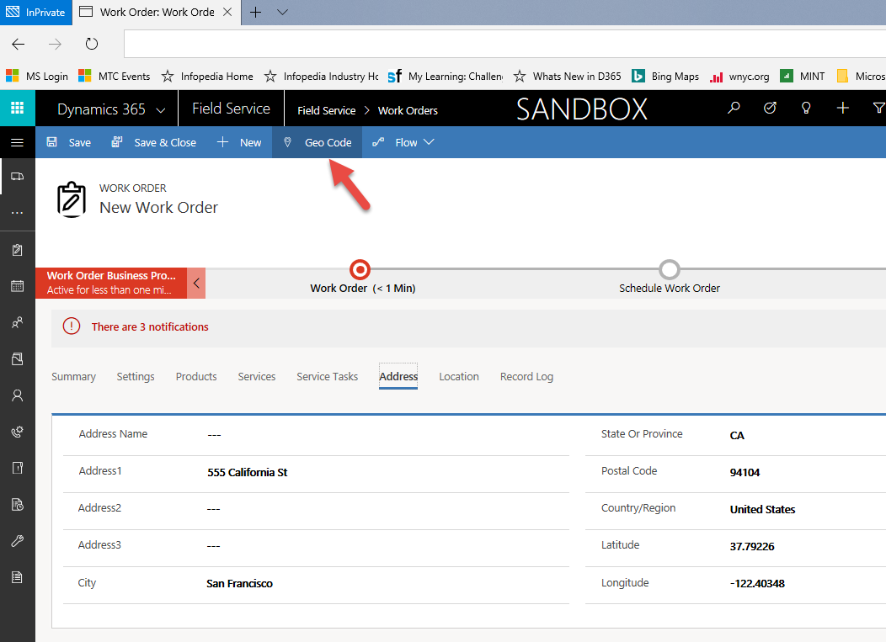  

>[!Note]
> **Pro Tip \#1:** When using the Field Service application, it's uncommon to enter addresses on a work order. The standard process is to geocode accounts, and when a service account is entered on a work order as the service location, the geocoded address is pulled from the account and added to the work order.

>[!Note]
> **Pro Tip \#2:** It's possible to geocode multiple records at one time by selecting the records from a view. In the screenshot below, we are mass geocoding accounts.

> [!div class="mx-imgBorder"]
> 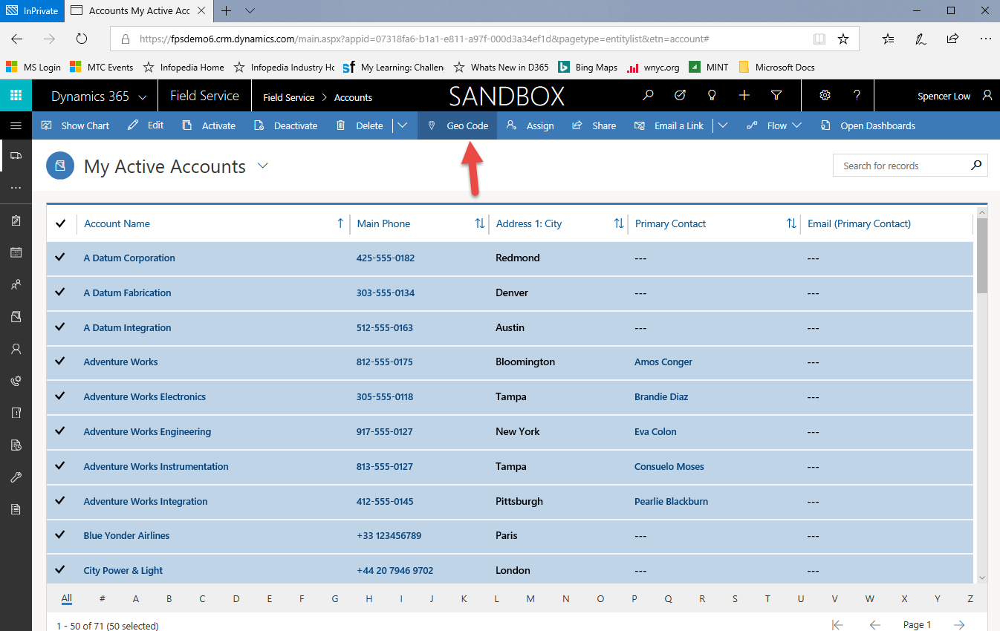  

## See also

- [Location tracking, sharing, and auditing](mobile-powerapp-location-auditing.md)
- [Geofencing](mobile-powerapp-geofence.md)

