# Install and set up Field Service Mobile

The [!INCLUDE[pn_fieldservice_mobile_app_long](../includes/pn-fieldservice-mobile-app-long.md)] app gives field technicians the information they need to get to a customer location and complete work orders quickly. Dynamics 365 Field Service provides the cross-platform, multi-device Field Service Mobile application that is crafted to the field service worker's needs. The mobile application is customizable and extensible, allowing any organization to brand the application as its own, define what types of data field service workers can access, and much more.

To get up and running with Field Service Mobile, you'll need to:

1. Install the Field Service Mobile app onto your phone, tablet, or Windows 10 device.
2. Install the Woodford mobile configuration tool.
3. Install and configure the mobile project template.

In this article, we'll walk through each of these steps. See the following video for an additional walkthrough.

> [!VIDEO https://www.microsoft.com/videoplayer/embed/RE4yt5e]

> [!Note]
> For additional Field Service videos, see [this full playlist](https://aka.ms/fs-videos).

## Prerequisites

This article assumes you already have a Dynamics 365 environment with Field Service installed.

## Step 1: Download the Field Service Mobile app on a phone or tablet

Download **Field Service Mobile** from the Windows, Apple, or Google Play app stores, or visit the following links. **Field Service Mobile** requires Field Service versions **7.5.5** and **8.2+**.

- [Download for Windows](https://aka.ms/fsmobile-windows)
- [Download for iOS (Apple)](https://aka.ms/fsmobile-iOS)
- [Download for Android](https://aka.ms/fsmobile-android)

> [!div class="mx-imgBorder"]
> 

## Step 2: Install the Field Service Mobile configuration tool (Woodford)

The configuration tool allows app access for field technician users, and allows administrators to customize the mobile experience.

1. [Download the mobile configuration tool (Woodford)](https://www.resco.net/woodford/download) and save to your computer.

2. In the Dynamics 365 organization, go to **Settings** > **Solutions**. Select **Import**. 

>[!Note]
> You may have to select the gear icon and go to **Advanced Settings** in order to access the **Solutions** option from the settings dropdown.
 
> [!div class="mx-imgBorder"]
> 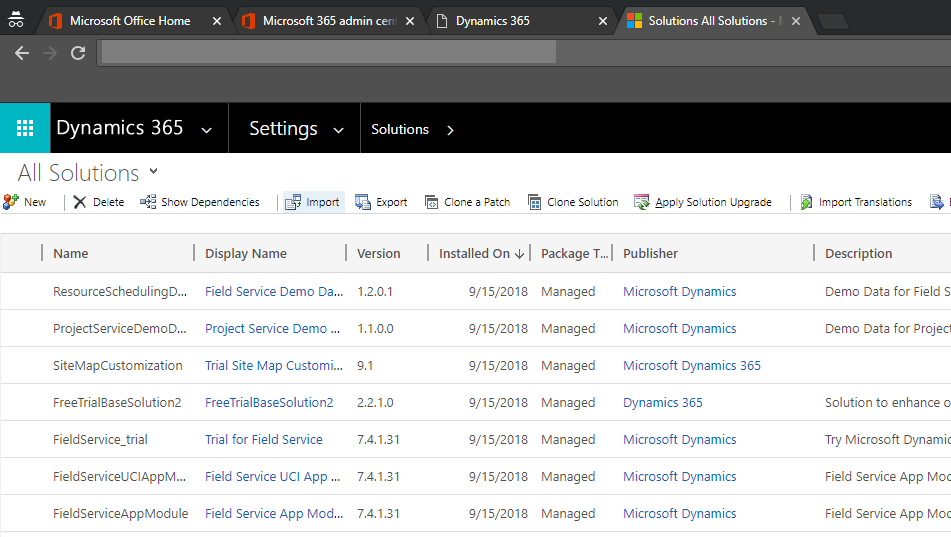

3. On the **Select Solution Package** screen, select the ```Woodford\_\#\_\#\_\#\_\#\_managed.zip``` file, and then select **Next**.

> [!div class="mx-imgBorder"]
> 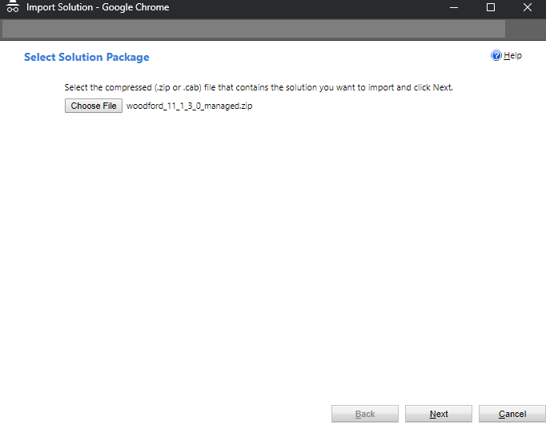

4. After the import completes, verify that **Woodford** appears on the **Settings** menu. If you don't see it, refresh the page.

> [!div class="mx-imgBorder"]

> 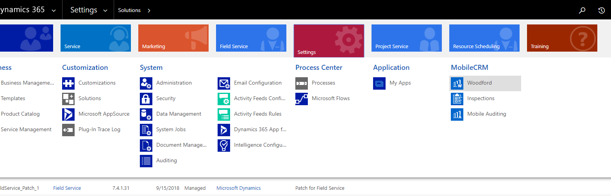  


## Step 3: Import the mobile project template

Next, download and import a mobile project that allows you to configure the mobile app for your organization.

The mobile project template contains all customizations for the Field Service Mobile app. A mobile project allows you to customize the mobile experience across devices. For example, you use a mobile project to add, remove, and change fields, entities, views, and forms on the mobile app.

1. Open the Mobile Configuration Tool (Woodford) by going to **Settings** > **Woodford** and selecting **MobileCRM Woodford HTML5**. If you experience trouble opening or working in the HTML5 version, you can use the MobileCRM Woodford Legacy in a non-private Internet Explorer browser window.

> [!div class="mx-imgBorder"]
> 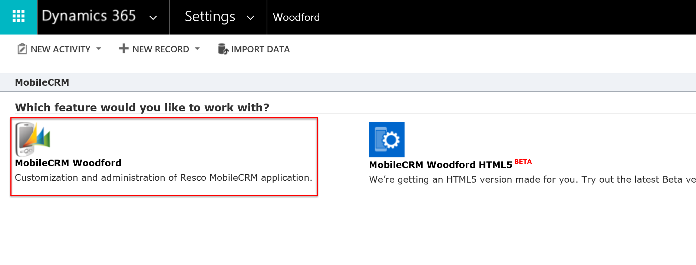

2. You may be asked to set a storage quota. Set to **500 MB**, and then select **OK**.

3. Register yourself as a user.

4. [Download mobile project for **Field Service Mobile** (latest) Field Service v7.5.5 and v8.2+](https://aka.ms/fsmobile-project) and save in a location other than the Downloads folder. If you have an existing mobile project from a previous app version, you'll need to manually move the customizations for that project into a derivative of this project.

  The mobile project is updated periodically; [bookmark this website](https://aka.ms/fsmobile-project) for regular access the latest mobile project.

**For previous mobile apps** for D365 for Field Service, see the article on [Field Service Mobile project template version history](./field-service-version-history-mobile.md#mobile-project-template-version-history). 

5. Import the mobile project file.
> [!div class="mx-imgBorder"]
> 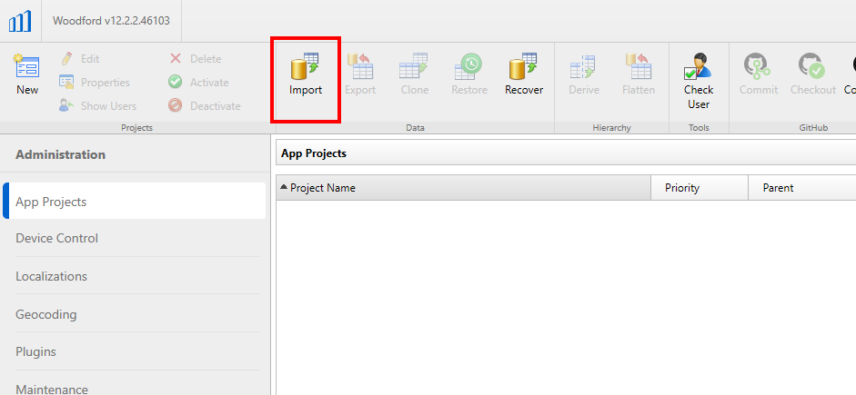

6. In the **Add Mobile Project** dialog:

- Keep **Type** set to **Standard User**.
 - Enter the filename of the mobile project file you downloaded. In our example, it was FSDyn365_1.0.2735 (yours may be different depending on which version you downloaded).
 - Enter a priority value. In our example, we set it to 10. 
 - Assign the template to all field service security roles.
 - Select **Save**.


> [!div class="mx-imgBorder"]
> 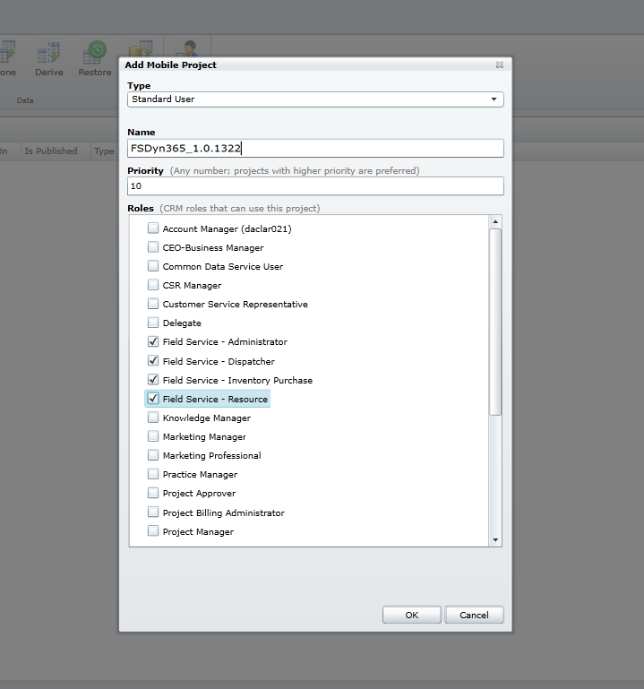

7. Double-click on your newly imported mobile project file. You'll be taken to the project detail page. Select **Publish**.

> [!div class="mx-imgBorder"]
> 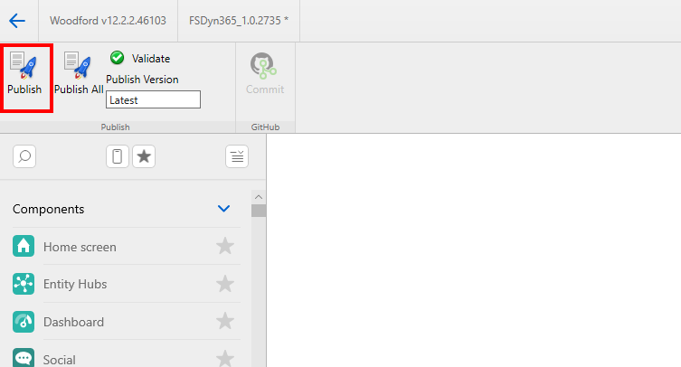

8. Head back to the main Woodford page by selecting the back button in the navigation, as seen in the following screenshot. 

> [!div class="mx-imgBorder"]
> 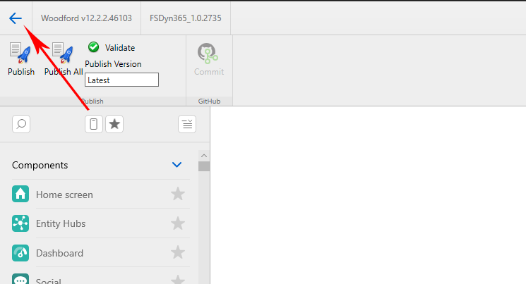

9.  Select to highlight the mobile project template and select **Derive**.

> [!div class="mx-imgBorder"]
> 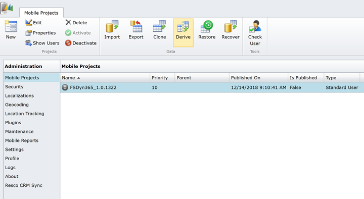

- Keep **Type** set to **Standard User**.
- Enter a name (in our example, FSDyn365_1.0.2735-derivative), a higher priority (in our example, 20), and assign to relevant Field Service security roles.
- Select **Save**.

> [!div class="mx-imgBorder"]
> 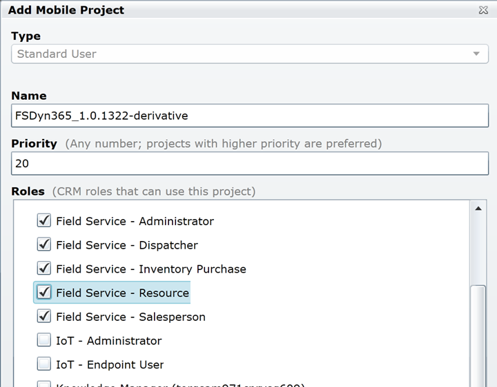


> [!Note]
> Make sure to publish the project to match the version of Field Service Mobile your technicians are using. For example, if your technicians are using Field Service Mobile v12.1, publish the mobile project template to 12.1. If your technicians are using different versions of the mobile project, publish the project to the lowest common version.


> [!div class="mx-imgBorder"]
> 

1.  Double-click the mobile project template *parent* (not your new derivative), and then select **Publish All**.

2.   Verify that the mobile configurations are published by checking for an arrow next to the projects.
> [!div class="mx-imgBorder"]
> 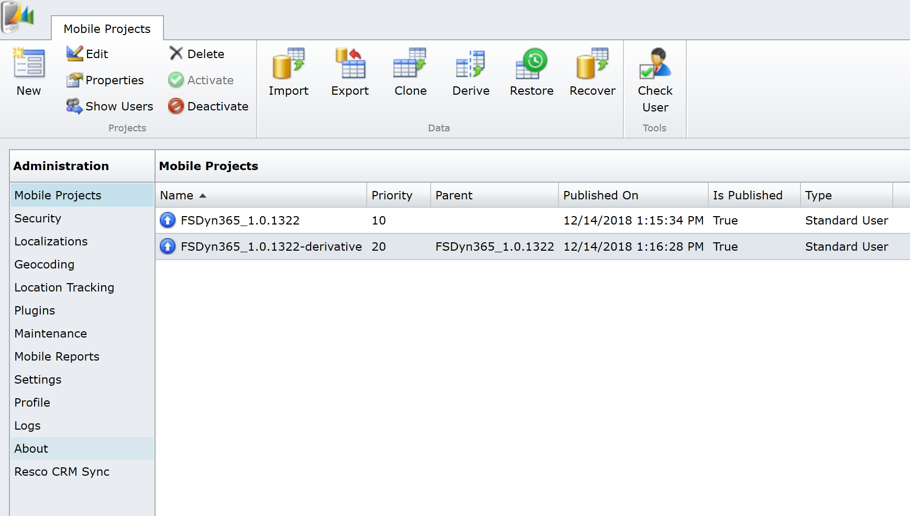

> [!Note]
> This is a trial license and is valid for 30 days. The trial can be extended by following the guidance in this article: [Extend Field Service Mobile configuration tool trial](../field-service/activate-fs-mobile-app-license.md).

## Initial setup steps

Go to **Plugins** > **Delete**.

Select work orders and related work order entities, such as work order products, services, and service tasks.

This helps ensure that when work orders or related records are deleted on the server, they are removed from the mobile app too. For more information, [see the Woodford Guide (PDF)](https://www.resco.net/downloads/Woodford_Guide.pdf).

> [!div class="mx-imgBorder"]
> 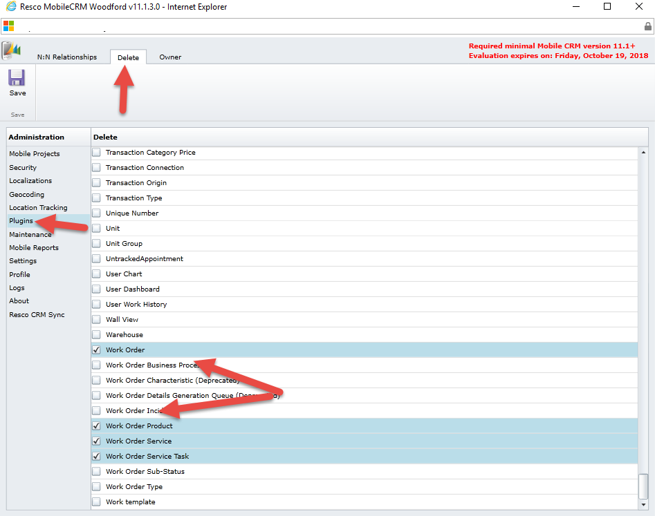  

**Save**.

Next up, go to **Mobile Projects **and double-click on your mobile project template.

Select **Configuration** in the left pane.

> [!div class="mx-imgBorder"]
> 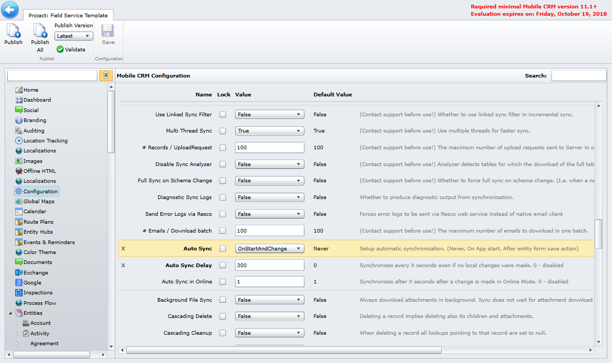  

This section details many configurations regarding the Field Service Mobile (2017) app user interface and how data passes back and forth between the mobile application and the server.

Here are a few important configurations for administrators to consider when initially setting up the mobile app.

**Auto Sync** dictates when the mobile app sends data to the server. Setting auto sync to **OnStart** is recommended for learning and demonstration purposes.

**Auto Sync Delay** is a timer that dictates when the mobile app will automatically try to send and receive data from the server.

**Save Password** dictates whether the mobile app will remember a user’s password. Setting to **True** is recommended for learning and demonstration purposes.

## Next steps

> [!Note]
> You won't be able to use the Field Service Mobile application with your Dynamics 365 organization until you have [set up users](view-user-accounts-security-roles.md) and [bookable resources enabled for mobile app access](set-up-bookable-resources.md) in addition to the steps in this article. To use Field Service Mobile, the bookable resource (field technician) record must have **Enabled for Field Service Mobile** set to **Yes**.

### See also

- [Enable maps for Field Service Mobile](mobile-enable-maps.md)
- [Frequently asked questions about the mobile solution](https://www.resco.net/mobilecrm/support.aspx)
- [Woodford guide](https://www.resco.net/downloads/Woodford_Guide.pdf)

[!INCLUDE[footer-include](../includes/footer-banner.md)]