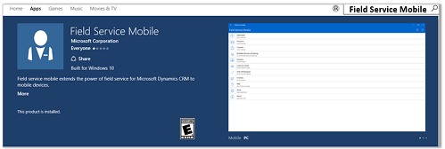
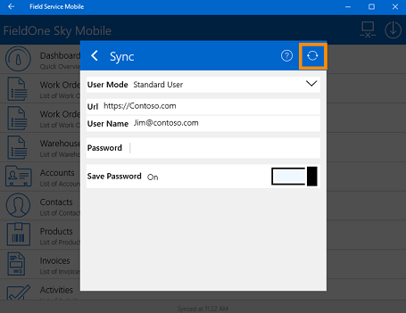

# Field Service Mobile App User’s Guide

[!INCLUDE[cc-applies-to-update-9-0-0](../includes/cc_applies_to_update_9_0_0.md)]

[!INCLUDE[pn_fieldservice_mobile_app_long](../includes/pn-fieldservice-mobile-app-long.md)] (mobile) give your field agents all the information they need to get to a customer location and complete work orders  quickly.  
  
 Before you can start using [!INCLUDE[pn_fieldservice_mobile_app_short](../includes/pn-fieldservice-mobile-app-short.md)] (mobile), your [!INCLUDE[pn_crm_shortest](../includes/pn-crm-shortest.md)] administrator will need to install a mobile solution. [!INCLUDE[proc_more_information](../includes/proc-more-information.md)] [Install the Field Service mobile app](../field-service/install-the-mobile-app.md)   
  
   
## Install the mobile app  
 [!INCLUDE[pn_fieldservice_mobile_app_short](../includes/pn-fieldservice-mobile-app-short.md)] (mobile) is supported on the following devices:  
  
- [!INCLUDE[pn_windows_10](../includes/pn-windows-10.md)]  
  
-   iOS 6 +  
  
- [!INCLUDE[tn_android](../includes/tn-android.md)] phone  
  
 To download the app, search for  Field Service Mobile in your device's app store.  
  
   
  
   
## Sign in  
 Now that you've installed [!INCLUDE[pn_fieldservice_mobile_app_short](../includes/pn-fieldservice-mobile-app-short.md)] (mobile), let's get started! First, you need to sign in. You'll need your [!INCLUDE[pn_microsoftcrm](../includes/pn-microsoftcrm.md)] web address, user name, and password. If you don't have any of these, contact your [!INCLUDE[pn_crm_shortest](../includes/pn-crm-shortest.md)] admin. [!INCLUDE[proc_more_information](../includes/proc-more-information.md)] [Find your Dynamics 365 administrator or support person](../basics/find-administrator-support.md)  
  
1.  When the app is installed, sign in with your [!INCLUDE[pn_crm_shortest](../includes/pn-crm-shortest.md)] credentials, and then tap **Sync**.  
  
   
  
2.  After you sign in, you'll see the Home screen. Here, you can tap **Setup** to see or change your sign-in information.  
  
   
  
3.  To sync your device to the server, tap the Sync button. This  downloads changes made on the server to your device, and uploads information from your mobile device to the server.  
  
   
  
   
## Work online or offline  
 [!INCLUDE[pn_fieldservice_mobile_app_short](../includes/pn-fieldservice-mobile-app-short.md)] (mobile) lets you work online or offline. Online mode requires an Internet connection; offline mode does not.  
  
 You can configure the app to sync when it launches, when information changes, or every few minutes. Your system administrator configures this setting.  
  
### Online mode  
 When you’re working online, information continuously syncs with the server, so you don’t need to manually sync your device.  
  
-   To work online, tap the Online/Offline mode button.  This is how the button looks when you’re online.  
  
   
  
### Offline mode  
 When you're working offline, all the information you need is downloaded  to your device. This way you can continue your work even without an Internet connection. When you enter information, it’s saved to your device and sent to the server on the next sync.  
  
-   To work offline, tap the Online/Offline Mode button.  This is how the button looks when you’re offline.  
  
   
  
   
## Get around the app (for all security roles)  
 When you first sign in to [!INCLUDE[pn_fieldservice_mobile_app_short](../includes/pn-fieldservice-mobile-app-short.md)] (mobile), you’ll see your home screen, which shows you a list of actionable items. To get more information, tap any of the items on the left.  
  
> [!NOTE]
>  If you have a [!INCLUDE[pn_field_service](../includes/pn-field-service.md)] admin, dispatcher,  inventory purchase, or resource (field agent) security role, you can use [!INCLUDE[pn_fieldservice_mobile_app_short](../includes/pn-fieldservice-mobile-app-short.md)] (mobile). However, depending on your security role, you may not have permission to access or change certain data in the app. [!INCLUDE[proc_more_information](../includes/proc-more-information.md)] [Find your Dynamics 365 administrator or support person](../basics/find-administrator-support.md)  
  
### Dashboard  
 Your dashboard provides a quick overview of business data. Depending on how things are set up in [!INCLUDE[pn_fieldservice_mobile_app_short](../includes/pn-fieldservice-mobile-app-short.md)] (mobile), you may see a default system dashboard or one that you created. [!INCLUDE[proc_more_information](../includes/proc-more-information.md)] [Create or customize dashboards](../customize/create-edit-dashboards.md)  
  
   
  
### Accounts  
 In Accounts  you can see a list of your service accounts.  
  
 To see where all of the accounts are located on a map view, tap the **Map View** button.  
  
 To add a new account, tap the **+**  button , and then add your information.  
  
   
  
 Tap an account name to see the account information.  
  
 Tap the **Edit Account** button to edit the account info, such as name, address, and phone number.  
  
 To get more information related to the account, tap any of the buttons at the bottom.  
  
   
  
### Bookable Resources  
 In Bookable Resources shows your work order bookings.  
  
 By default, work orders are listed in the **Agenda** view. To change views, tap **Day**, **Week**, or **Month**.  
  
   
  
### Contacts  
 Contacts shows a list of all your account contacts.  
  
 To see where your contacts are located on a map, tap the **Map** button.  
  
 To add a new contact, tap the **+** button, and then add your information  
  
   
  
 Tap a contact’s name to see the account information.  
  
 Tap the **Edit** button to edit the contact's info, such as name, email address, and phone number.  
  
 To get more information about the contact, tap any of the buttons at the bottom.  
  
   
  
### Customer Assets  
 In Customer Assets you'll see which products a customer uses.  
  
 To add new customer assets, tap the **+**  button, and then add the asset information.  
  
   
  
 To see information related to the asset, tap the asset name on the left.  
  
   
  
### Products  
 Products shows a list of your products, including the price, type of product, quantity on hand, and more.  
  
 To add a new product, tap the **+**  button, and then add the product information.  
  
   
  
 To see details about the product, tap **Products**, and then tap a product in the list.  
  
   
  
### Agreements  
 Agreements is where you can see customer contracts.  
  
### Time off requests  
  
1.  If you need to take time off or you are not available to take a new work order, tap **Time Off Requests**, and then tap the **+**  button.  
  
2.  Fill in your time off information, and then tap the Save button.  
  
    > [!NOTE]
    >  This will gray your name out on the schedule board, which lets the dispatcher and scheduling assistant know that you aren't available.  
  
   
  
### Map  
 The map shows the location of your accounts and contacts on a map.  
  
 To filter the view, tap **Accounts** or **Contacts**.  
  
   
  
### Calendar  
 The calendar shows your appointments on a calendar.  
  
### Setup  
 To see or update your setup or sign-in information, tap **Setup**.  
  
### About  
 To see which version of the app you’re using, tap **About**.  
  
 Tap the **Menu** button in the top right to send logs, view privacy info, and more.  
  
   
  
   
## For field agents  
 Field agents can use the mobile app to review work orders and get all the information they need to complete the job.  
  
### Review work order bookings  
 When a work order is assigned to you, it shows up in [!INCLUDE[pn_fieldservice_mobile_app_short](../includes/pn-fieldservice-mobile-app-short.md)] (mobile).  
  
 By default, you can only see work orders for the current day plus the next 7 days, that have a status of scheduled, traveling, or in progress. Once a work order is completed, you can no longer see it in [!INCLUDE[pn_fieldservice_mobile_app_short](../includes/pn-fieldservice-mobile-app-short.md)] (mobile).  
  
1.  To see your work order bookings, tap **Bookable Resource Booking**.  
  
2.  By default, work orders are listed in the **Agenda** view. To change views, tap **Day**, **Week**, or **Month**.  
  
   
  
 You can also tap the Arrow button to see your bookings for the next day. Or, you can use the  filter to see work orders with a specific booking status.  
  
   
  
### Open a work order  
  
1.  To open a work order, from the list of bookings, tap the work order that you want to open. The work order opens on the right.  
  
2.  To open the work order in full screen view, at the top, double-tap **Work Order**.  
  
   
  
### See the location of a work order on a map  
  
1.  Open the work order, and then tap **Map**. This shows the location of the work order on a map.  
  
2.  To get driving directions, tap the Driving Direction button. This opens the default driving directions app on your mobile device. It provides turn-by-turn directions from your location to the work order location.  
  
   
  
### Update the work order status  
 The minute you start driving to the next job, it’s important to update the status of the work order. This keeps the dispatcher up to date on what’s going on with the work order, and lets the dispatch team provide the customer with the current status.  
  
1.  Open the work order, and then tap **Booking**.  
  
2.  Tap Add button for **Booking Status**.  
  
3.  Select a status. If you’re driving to the work order location, then update your status to **Traveling**.  
  
   
  
    > [!NOTE]
    >  Make sure to update the status again when you arrive on site, and again when you complete the work order.  
  
4.  When you’re done, tap the **Save** button.  
  
    > [!NOTE]
    >  When the work order is complete, remember to mark it as **Completed**.  
  
### Update the work order start time  
 When a dispatcher schedules a work order, the booking will have a start and end time. This may be the time promised to the customer, but if you’re running late or the job is taking longer than expected, it’s important to update the start and end time. This automatically keeps the dispatcher up to date on the schedule board.  
  
-   Open the work order, tap **Booking**, and then change the **Start Time**.  
  
   
  
### Check the work order details  
 To get more information on what work needs to be done for the service call, look at the **Info**, **Other**, and **Incidents** tabs.  
  
 The **Info** tab provides service account info, address, priority, and more.  
  
   
  
 The **Other** tab provides billing account info, service time windows, price lists, and more.  
  
   
  
 The **Incidents** tab shows which incidents are linked to the work order.  
  
   
  
### Check service tasks, products, and services  
 When a work order is created, incidents are added to the work order, which includes a list of service tasks, products, and services.  
  
 Service tasks let a field agent know what tasks need to be performed for the work order. Products tell them what products they might have to use to complete the work order. Services show the hours needed to complete the work.  
  
**Check service tasks**  
  
1.  Open the work order, and then tap **Service Tasks**.  
  
   
  
2.  Tap a service task to open it.  
  
3.  When the service task is open, add notes, mark percentage complete, and how long it took to complete the task.  
  
   
  
4.  When you’re done tap, the **Save** button.  
  
**Check products**  
  
1.  Open the work order, and then tap **Products**.  
  
2.  Tap a product name to open it.  
  
   
  
3.  Mark if the product was used, enter the correct quantity, make sure the price is correct, and add any additional notes.  
  
   
  
4.  When you’re done, tap the **Save** button.  
  
**Check services**  
  
1.  Open the work order, and then tap **Services**.  
  
2.  Tap a service name to open it.  
  
   
  
3.  If the service was performed, mark it as used, and then add any additional information.  
  
   
  
4.  When you’re done, tap the Save button.  
  
### Add notes, pictures, signatures, and more  
 When you’re working on a work order you can add your notes, attachments, pictures, and signatures.  
  
**Add a picture**  
  
1.  Open the work order, tap **Notes**, and then tap the **Camera** button.  
  
   
  
2.  Tap the **Camera** button to take the picture  
  
3.  Adjust the picture as needed, and when you’re done, tap the Save button.  
  
**Add notes**  
  
1.  Open the work order, and then tap **Notes**.  
  
2.  To add notes, tap the **Add** button **+**  .  
  
   
  
3.  Add your notes in the **Description** area.  
  
   
  
4.  When you’re done, tap **Save**.  
  
**Add attachments, signatures, record video, and more**  
  
1.  Open the work order, and then tap **Notes**.  
  
2.  Tap the **Add** button **+**  .  
  
3.  Tap the **Menu** button to add attachments, signatures, record video and more.  
  
   
  
4.  When you’re done, tap **Save**.  
  
### Create a follow-up  
If work still needs to be done, you can create a follow-up booking.  
  
1.  Open the work order, and then tap **Booking**.  
  
2.  Tap the **Menu** button , and then tap **Create follow up**.  
  
   
  
3.  Tap **Open**, and then add your information  
  
4.  When you’re done, tap **Save**.  
  
   
## Privacy notice  
 [!INCLUDE[cc_privacy_field_service_mobile_app](../includes/cc-privacy-field-service-mobile-app.md)]
  
### See also  
 [Dynamics 365 for Field Service - User's Guide](../field-service/user-guide.md)   
 [Overview of Dynamics 365 for Field Service](../field-service/overview.md)
