# Manage Field Service Mobile with Microsoft Intune

Mobile Application Management (MAM) is software that enables IT administrators to apply and enforce corporate policies on mobile apps. One MAM option for IT administrators is [Microsoft Intune](https://docs.microsoft.com/intune/apps/app-management), which offers a suite of features that lets you publish, push, configure, secure, monitor, and update mobile apps - including Field Service Mobile.

MAM is important to field service organizations whose technicians use Field Service Mobile primarily because:

1. Technicians frequently travel to multiple locations, and protecting sensitive company data is critical.
2. Many field service organizations have a bring-your-own-device (BYOD) policy, which means the Field Service Mobile app needs management among many different kinds of devices and apps for personal use. 

With an Intune-enabled Field Service Mobile app, IT administrators can:
- Add and assign the Field Service Mobile app to user groups and devices, including users in specific groups, devices in specific groups, and more.
- Configure the Field Service Mobile app to open with specific settings enabled, and update the app when already installed on the device.
- See reports and track app usage.
- Limit sharing of corporate data among apps by restricting data leakage through “Cut/Copy/Paste/Save As.”
- Provide encryption at rest.

## Prerequisites

- Field Service Mobile v12.1+ for iOS and Android
  - Intune for Field Service Mobile on **Windows 10 devices is not supported**
- No Field Service Mobile Configurator (Woodford) requirements 

## Get started

Intune is a separate Microsoft product that is not included with Field Service. Refer to the documentation on [What is Microsoft Intune app management?](https://docs.microsoft.com/intune/apps/app-management) and [Adding and assigning an app with Intune](https://docs.microsoft.com/intune/apps/quickstart-add-assign-app) to get started.

## Prefill default Org URL in mobile app sign-in screen

For devices enrolled in MDM, you can configure the following two MAM properties:

| Property Name / Configuration | Key	Type	| Description |Notes |
| --- | ---- | --- | --- |
| DefaultOrgUrl	| string | Autopopulates the Org URL in the Field Service Mobile sign-in page	| See picture below |
| IntuneMAMUPN	| string | Remembers and autopopulates the user's username in the Field Service Mobile sign-in page	| Value must be set to **{{UserPrincipalName}}** |

> [!div class="mx-imgBorder"]
> 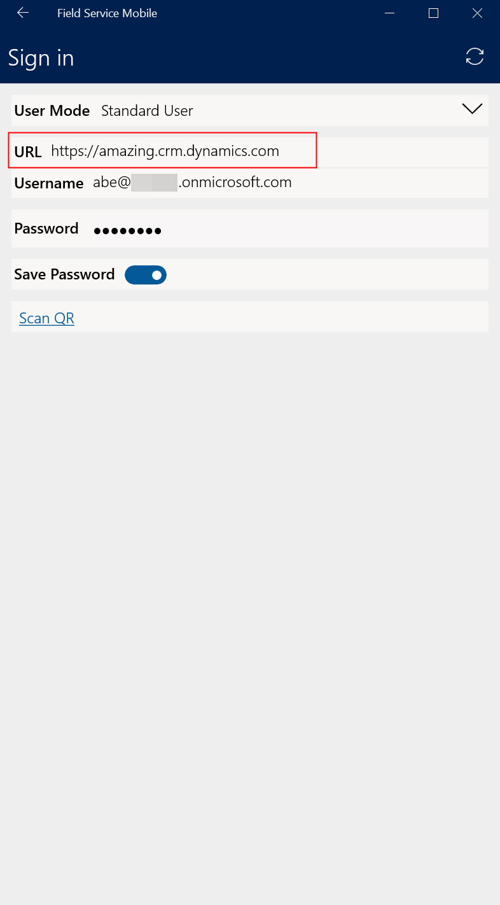

## Create an app configuration

A configuration can be set up through the [Device Management portal](https://devicemanagement.microsoft.com/). Each supported platform (iOS, Android, and Windows) requires a separate configuration. 

## Register the Field Service Mobile app in Device Management portal
In order to create an app configuration, we need to register and add Field Service Mobile for a tenant in the Device Management portal.

- Go to **Apps** ("1" in the following screenshot).
- Select **All apps** ("2" in the following screenshot).
- Select **+Add** ("3" in the following screenshot).

> [!div class="mx-imgBorder"]
> 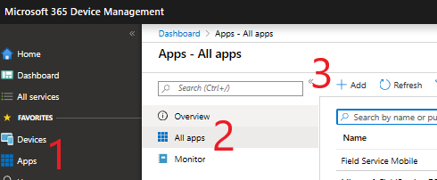

- Select **App type** ("4" in the following screenshot).
- Fill in **App information** ("5" in the following screenshot).

If you want to use an app that's not in the store, choose **Line-of-business** for **App type**.

> [!div class="mx-imgBorder"]
> 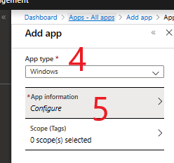

- Select **Add**.

- Go to **Assignments** ("6" in the following screenshot). 
- Select **Add group** ("7" in the following screenshot). 

- Choose **Available for enrolled devices** for **Assignment type** and select the users or groups that should be included.

> [!div class="mx-imgBorder"]
> 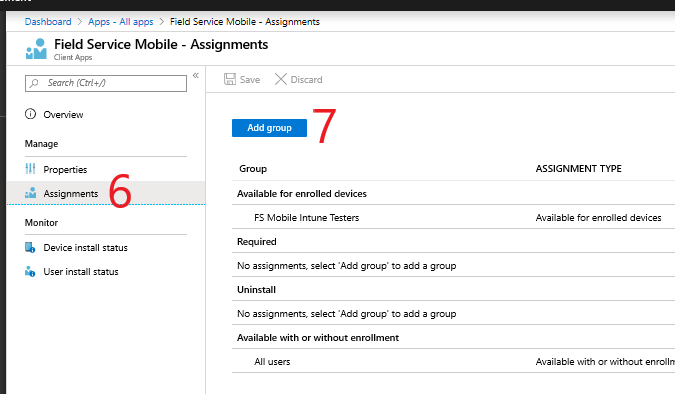

The app should now be available to download through the Company Portal app on the device.

> [!Note]
> iOS requires you to install the app through the Company Portal app *first* in order to be able to download the app configuration. After the initial installation, you can sideload your custom version of the app onto the device; the app configuration policy will still be there.

## Configuring Android and iOS

In the Device Management portal: 

- Go to **Apps** ("1" in the following screenshot).
- Select **App configuration policies** ("2" in the following screenshot).
- Select **Add** ("3" in the following screenshot).

> [!div class="mx-imgBorder"]
> 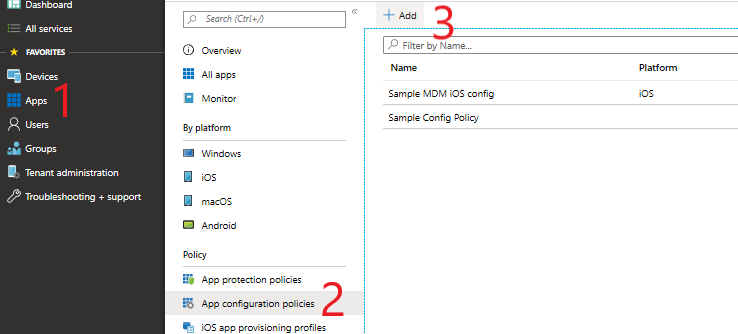

- Enter a **Name** ("4" in the following screenshot). 
- Select **Managed devices** as the **Device enrollment type** ("5" in the following screenshot). 
- Select **Platform** ("6" in the following screenshot). 
- Select **Associated app** ("7" in the following screenshot), and pick a registered app ("8" in the following screenshot).

> [!div class="mx-imgBorder"]
> 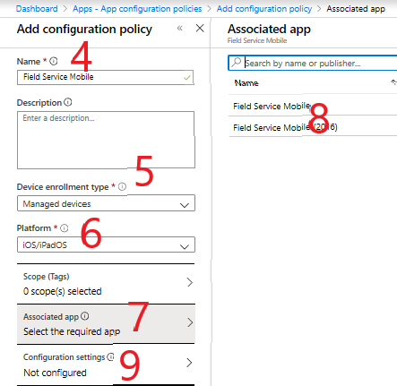

- Select **Configuration settings** ("9" in the following screenshot). 
- Select **Use configuration designer** as the **Configuration settings format** ("10" in the following screenshot). 
- Enter configuration settings ("11" in the following screenshot). 
- Save settings and select **Add**.

> [!div class="mx-imgBorder"]
> 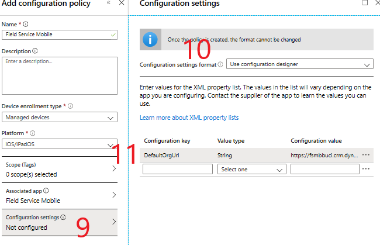

The following screenshot shows an example of what to configure. To populate the username, use **{{UserPrincipalName}}**. To populate a URL, enter your organization's specific org URL.

> [!div class="mx-imgBorder"]
> 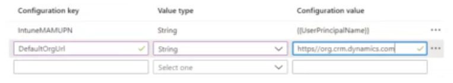

Finally, go to **Assignments** and select a group that the policy should be assigned to.

## Alternative way to configure Android

In the Device Management portal: 

- Go to **Apps** ("1" in the following screenshot).
- Select **App configuration policies** ("2" in the following screenshot).
- Select **Add** ("3" in the following screenshot).

> [!div class="mx-imgBorder"]
> 

- Enter a **Name** ("4" in the following screenshot). 
- Select **Managed apps** as **Device enrollment type** ("5" in the following screenshot). 
- Select an **Associated app** ("6" in the following screenshot).

> [!div class="mx-imgBorder"]
> 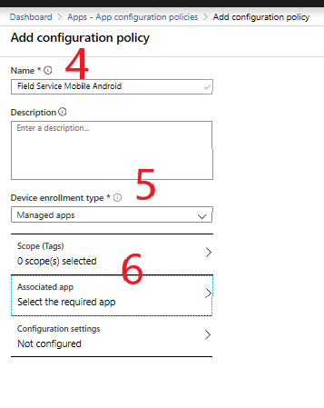

- For the **Associated app** field, either select the app from the list of featured apps or add a new one by using an app bundle or package ID.

- Go to **Configuration settings** ("7" in the following screenshot).
- Add configuration settings ("8" in the following screenshot). 
- Save and select **Add**.

> [!div class="mx-imgBorder"]
> 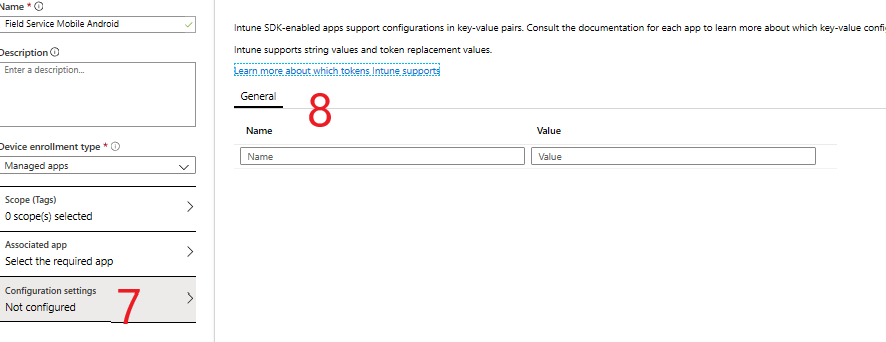

Finally, go to **Assignments** and select a group that the policy should be assigned to.

> [!Note]
> This configuration will also be available for iOS apps once you authenticate within the app.

## Configuring Windows

In the Device Management portal: 

- Go to **Devices** ("1" in the following screenshot). 
- Select **Configuration profiles** ("2" in the following screenshot). 
- Select **Create profile** ("3" in the following screenshot).

> [!div class="mx-imgBorder"]
> 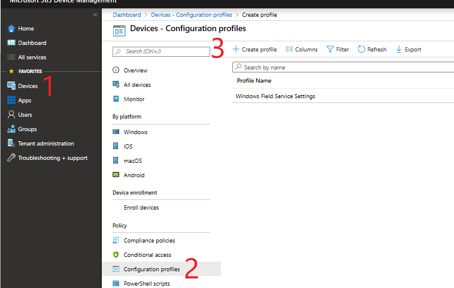

On the new profile:

- Enter a **Name** ("5" in the following screenshot).
- Select **Windows 10 and later** as **Platform** ("7" in the following screenshot).
- Select **Custom** as **Profile type** ("6" in the following screenshot). This will open the Custom OMA-URI Settings. 

For the custom OMA-URI settings: 

- Select **Add** ("7" in the following screenshot).
- Enter a **Name** ("8" in the following screenshot). Use a property name in this field - for instance: **DefaultOrgURL** or **IntuneMAMUPN**. 
- Select **OMA-URI** ("9" in the following screenshot). 
  - OMA-URI looks like this: ./User/Vendor/MSFT/EnterpriseModernAppManagement/AppManagement/AppStore/{PackageFamilyName}/AppSettingPolicy/{PropertyName}
    - **PackageFamilyName** is Microsoft.FieldService-D365_8wekyb3d8bbwe for Field Service Mobile.
    - **PropertyName** is same property used in the **Name** field.
- Select a **Data type**  ("10" in the following screenshot). 
- Set a **Value** ("11" in the following screenshot)

> [!div class="mx-imgBorder"]
> 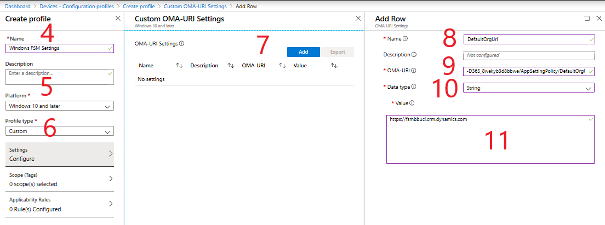

Apply your changes and create the profile.

Finally, go to **Assignments** and select a group that the policy should be assigned to.

## Testing

For Android and iOS: 

1. Download the Company Portal app and sign in with an organization account.

2. Install Field Service Mobile from the Company Portal app.

3. Start Field Service Mobile.

For Windows:

1. Go to **Settings** > **Access work or school** and select **Connect**.

2. Sign in with your organization account.

3. Install the app.

## Additional notes

- Standard MAM capabilities for Field Service Mobile will work with or without MDM device enrollment in Intune.
- Standard app configuration policies with Intune are supported for the [Field Service (Dynamics 365) mobile app](mobile-2020-power-platform.md); however, specific configurations like prefill of URL or username are not available.

[!INCLUDE[footer-include](../includes/footer-banner.md)]