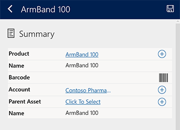
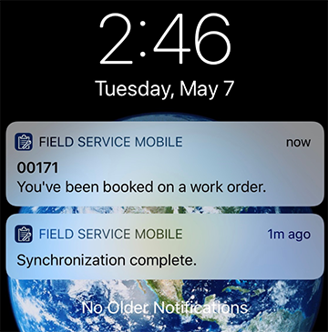
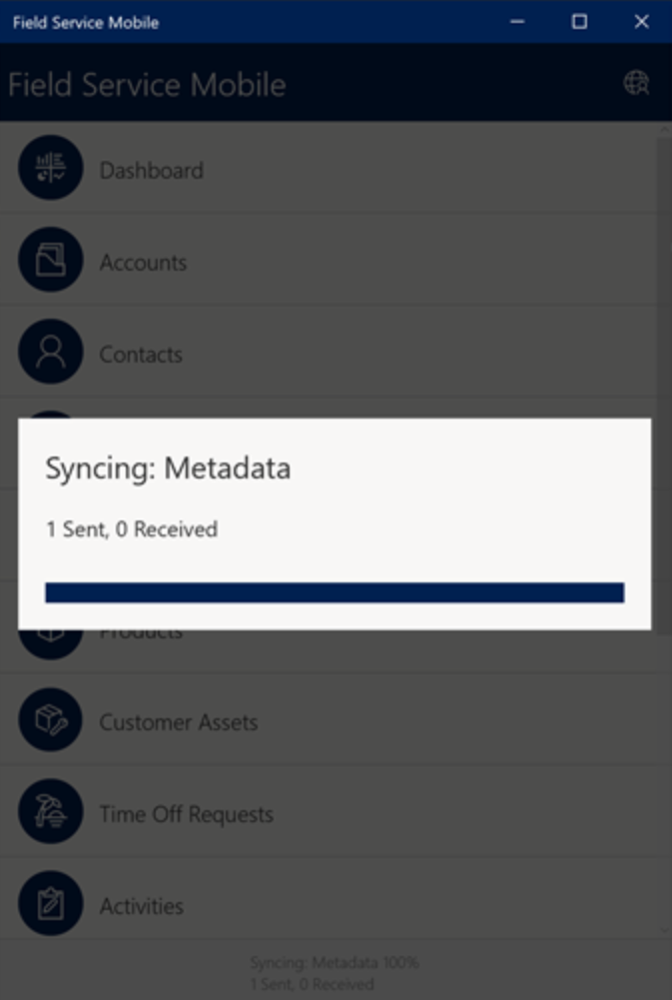
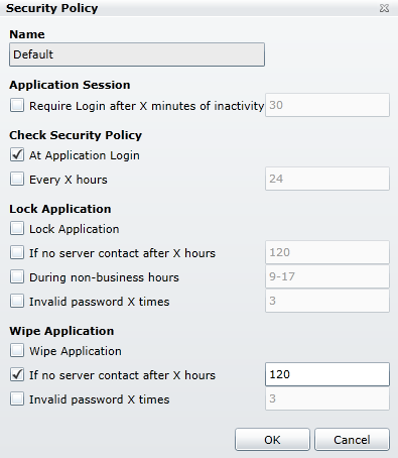
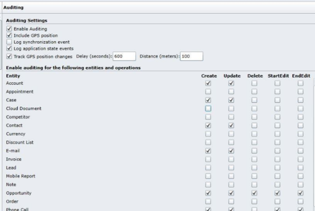

# Overview of Field Service Mobile (Xamarin app)

Field technicians use the Field Service Mobile app to view their schedules, work orders, equipment details, and more as they travel to various customer locations each day. In this article, we'll take a look at some basic details of the application.

For a guided walkthrough, check out the following video.

> [!VIDEO https://www.microsoft.com/videoplayer/embed/RE4HnwA]

## Supported platforms

- Windows 10, desktop + tablet
- iOS 12.0+, phones + tablets
- Android 6.0+, phones + tablets

## Key capabilities

- **Native app**: Field Service Mobile is a native app for Windows, iOS, and Android mobile devices. Native apps can use device-specific hardware and software, like the camera and microphone.

- **Offline capabilities**: Field Service Mobile has full offline capabilities. This means work order details and other valuable information can be downloaded to the field technicians' phones and tablets to use when internet connectivity is not available. When a field technician is working in "online mode," the data on the mobile app reflects the server data. The app can be configured to always be online, online only when connected to WiFi, online when the field technician manually toggles to online mode, or never online. **Sync filters** allow administrators to decide which entities and records should be downloaded locally for offline mode. For example, an administrator can make it so only this week's work orders to be downloaded.

| Online | Offline |
| --- | --- |
| Server data in real time | Data stored on device |
| No data stored locally | All data encrypted by default. File storage is encrypted to AES 256; data storage is encrypted to AES 128 |
| Requires internet connection | Data sent to device can be limited to records necessary for time, user, or role |
| Any and all entities can be forced to “Online”-only mode | Can schedule server syncs at intervals |

- **GPS**: The phone or tablet's GPS allows an organization to schedule work orders to the closest available field technician, calculating arrival times to customer locations, and [geofencing](geofencing.md). 

- **Camera**: The app uses the device's camera for pictures and videos. This means field technicians can take a picture of completed work to attach to an invoice or to help with resolution tracking for training purposes later on.

- **Barcode scanning**: Using the device's camera to scan barcodes helps field technicians in multiple scenarios including:

  1. Scan a barcode on a new piece of equipment that was recently installed for a customer - this automatically enters the barcode number on the customer asset record, saving the technician time from manually entering this information. 
  2. Scan the barcode of an existing asset to automatically locate the asset record in the database. This ensures that new data is entered on the correct asset record for accurate service history.

> 

- **Dictation**: This allows field technicians to enter notes and important work order data using the device's speech-to-text capabilities. It's helpful for field technicians who wear protective gloves and can't type information into mobile forms.

- **Signature**: Capture a digital signature from a customer in the mobile form, often as approval of completed work. For more comprehensive and legally binding requirements, digital signature service providers can be integrated with.

- **Email integration**: Access emails, calendars, events, and contacts by enabling Exchange and other email providers on the mobile app without having to toggle to another mobile app.

- **Access documents**: Beyond attaching documents as notes within work orders, you can integrate with document storage services like SharePoint and other cloud storage locations to give field technicians offline access to product manuals and instructions. Field Service Mobile also supports 3D file formats that display 3D models of equipment, tools, parts, and more.

- **Push notifications**: Trigger push notifications to the field technician's device reminding their to perform actions or enter data. For example, you can notify field technicians with a push notification when they have been booked to a new work order. Selecting a push notification can take the user to specific booking, work order, or other records. 

> 

## Device requirements

- **Available Space:** The amount of required mobile device space depends on the quantity of records that an organization wants to sync to mobile. You can connect to your organization with the app and go to the app's settings on your phone to see how much space the app is utilizing. This amount can and will change based on how much data the app has to sync from the organization. Also note that you should account for how much data will be needed outside of Field Service Mobile (for photos, texts, other apps, and so on). 

- **RAM:** Minimum 512 MB, though we recommend 1 GB, particularly for organizations with many records and customizations. That said, how much RAM is required depends on how many apps a person will be using. For example, organizations that are using mobile device management (MDM) solutions, requiring their users to switch between multiple applications should provide mobile devices that have a minimum of 2 GB of RAM.

- **Processor:** The typical standard is a minimum clock speed of approximately 1.4 GHz. Again, be sure to consider other app usage. 

- **Camera:** Autofocus is required for both QR and barcode scanning. 

- **GPS:** GPS is required if you need to use any locational functionalities, like navigation, maps, or location auditing.

## Installation

Installing Field Service Mobile involves downloading the "Field Service Mobile" app from the relevant app store and setting up the mobile configuration tool. Instructions for both can be found in the [Field Service installation article](field-service-mobile-app-user-guide.md).

## Upgrade

New versions of the Field Service Mobile app are released in a cadence similar to Dynamics 365 Field Service. They can be downloaded and applied through your relevant app store. In some cases - like with Windows 10 - downloading the app from the Windows Store allows for automatic upgrades as new versions are released.

The mobile configuration tool is also upgraded periodically, but not always on the same cadence as the app.

## Authentication

### OAuth2
The main security token for the mobile app is the application master password. The application uses this master password to encrypt the application database and other sensitive information stored in Field Service Mobile app.

If there are legacy authentication methods that require the app to submit the user’s password to the server, the server password is used for encrypting the application master password for the user’s convenience. With the OAuth2 authentication, the user must provide a dedicated password used for encrypting the application master password. 

Regarding password storage, the app can be configured to either:

- Require the user to enter the password each time the application is launched (or resumed from the background), or
- Store the password in the device's secure storage so that the user does not need to type it in repeatedly

### Multi-factor authentication (MFA)
Multi-factor authentication based on the related Microsoft 365 tenant Azure active directory can be enabled for Field Service Mobile. This adds a second layer of security with a phone call or text message for user sign-in and transactions.  

## Security

### Data encryption

Data encryption is based on an application key. The application key is randomly generated and protected by the user password. The key is used to encrypt all local Field Service data. Let's take a look at how this works.

The application generates the random application key when it creates its local database. After that, it's stored in an encrypted form on the device file system and the application decrypts it when needed. The application key (AES256) is used together with the user password (PBKDF2), a random initialization vector (IV), and salt for encryption and decryption.

Let's take a look at how this works.

For encrypting the SQLite database, the application key is passed to the SQLite database driver.

The driver uses the application key and IV to encrypt or decrypt individual database pages using AES128 in cipher feedback (CFB) mode. Each page (1024 bytes) is encrypted separately. The IV is the page header (contains variable or unpredictable data).

Each file in the blob store (attachment store) contains a header with random IV (16 bytes) and encrypted data. The blob data is encrypted with AES256 in cipher block chaining (CBC) mode using the application key and file header IV. PKCS7 is used for data alignment.

### Synchronization

Synchronization is when the Field Service Mobile app calls the server for new or updated data. For example, the app will need to synchronize to the server for a field technician to see a new work order booking scheduled by the dispatcher. 

> 

The app can perform a synchronization manually, timed, or based on available connection.

- If the password is stored, sync is automatic​
- If the password isn’t stored, password entry is required to sync

The system also keeps a **synchronization log** that tracks when users last synced and on what devices.

### Mobile device management (MDM)

- **Application sessions**: Require sign-in after a specific number of minutes of inactivity. After the defined time in minutes passes, Field Service Mobile asks for the password to continue using it.

> [!div class="mx-imgBorder"]
> 

- **Lock**: If a device is stolen or there are concerns about the security of offline data, the administrator is able to remotely lock the application on a single device, or a group of devices. This blocks the user from opening the application.

- **Wipe**: In the worst case scenario, you can completely wipe out the data from the application. This is done remotely by just one action and regardless of the synchronization. This means that you delete the data remotely from the mobile device and users will no longer be able to see it.

- **Force Full Sync**: This forces the application to perform a full synchronization of the data during the next synchronization of the app.

### Auditing

You can keep an audit record of when specific entities are edited, as well as application state events and the GPS location of the device.

> [!div class="mx-imgBorder"]
> 

#### Dynamics security

For accessing Dynamics 365 Field Service entities and fields, the Field Service Mobile app uses the Dynamics 365 security role and field security profile framework. Additionally, entities and fields can be further restricted at the mobile app level, but a user cannot access any entity or field that could not be accessed in Dynamics 365.

### See also

- [Mobile configurations and customizations](mobile-app-configuration-customization.md)
- [Push notifications](mobile-push-notifications.md)

[!INCLUDE[footer-include](../includes/footer-banner.md)]