# Use Field Service Mobile (Xamarin)

In this article, let's look at common tasks that technicians perform on Field Service Mobile while completing work orders.

## Sign in and sync data

 To sign in, you need your organization's Dynamics 365 URL, your user name, and password. Contact your [!INCLUDE[pn_crm_shortest](../includes/pn-crm-shortest.md)] administrator if you don't have this information. [!INCLUDE[proc_more_information](../includes/proc-more-information.md)] [Find your Dynamics 365 administrator or support person](../customerengagement/on-premises/basics/find-administrator-support.md).  
  
1. Open the app, and enter your [!INCLUDE[pn_crm_shortest](../includes/pn-crm-shortest.md)] credentials. When sign-in completes, you'll see the home screen.
  
   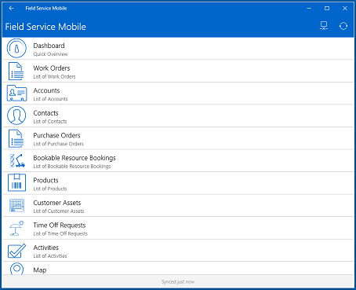  
  
2. To sync your device to the server, tap the **Sync** button to download changes made on the server to your phone or tablet, and upload information from your device to the server.  
  
   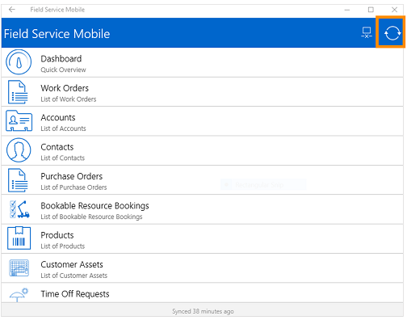  
  
## Work online or offline  
 
[!INCLUDE[pn_fieldservice_mobile_app_short](../includes/pn-fieldservice-mobile-app-short.md)] lets you work online or offline. Online mode requires an Internet connection; offline mode does not.  
  
The system administrator configures the app to sync when it launches, when information changes, or every few minutes.
  
### Online mode

 When you’re working online, information continuously syncs with the server, so you don’t need to manually sync your device.  
  
- To work online, select the **Online/Offline Mode** icon.  The screenshot shows what the option looks when you’re online.  
  
  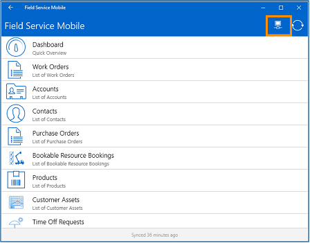  
  
### Offline mode

 When you're working offline, the information you need is downloaded to your device so that you can continue your work without an internet connection. When you enter information, it’s saved to your device and sent to the server on the next sync.  
  
- To work offline, select the **Online/Offline Mode** icon.  The screenshot shows how the button looks when you’re offline.  
  
  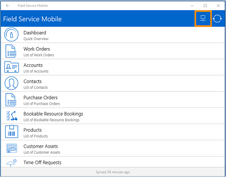  
  
## Get around the app (for all security roles)

When you first sign in to Field Service Mobile (Xamarin), you’ll see your home screen, which shows you a list of actionable items. To get more information, select any of the items.  
  
> [!NOTE]
> If you have a [!INCLUDE[pn_field_service](../includes/pn-field-service.md)] admin, dispatcher,  inventory purchase, or resource (field agent) security role, you can use [!INCLUDE[pn_fieldservice_mobile_app_short](../includes/pn-fieldservice-mobile-app-short.md)] (mobile). However, depending on your security role, you may not have permission to access or change certain data in the app. [!INCLUDE[proc_more_information](../includes/proc-more-information.md)] [Find your Dynamics 365 administrator or support person](../customerengagement/on-premises/basics/find-administrator-support.md)  
  
### Dashboard

Your dashboard provides a quick overview of business data. Depending on how things are set up in [!INCLUDE[pn_fieldservice_mobile_app_short](../includes/pn-fieldservice-mobile-app-short.md)] (mobile), you may see a default system dashboard or one that you created. [!INCLUDE[proc_more_information](../includes/proc-more-information.md)] [Create or customize dashboards](../customerengagement/on-premises/customize/create-edit-dashboards.md)  
  
 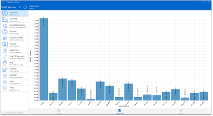  
  
### Accounts

In **Accounts**, you can see a list of your service accounts.  
  
To see where all of the accounts are located on a map view, select **Map View**.  
  
To add a new account, select **+** and then add your information.  
  
 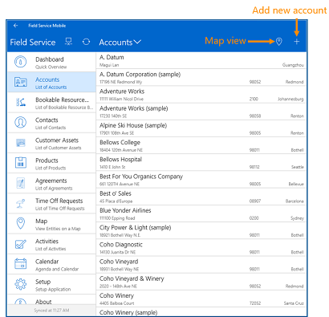  
  
Select an account name to see the account information.  
  
Select **Edit Account** to edit the account info such as name, address, and phone number.  
  
To see more information related to the account, select any of the options at the bottom.  
  
 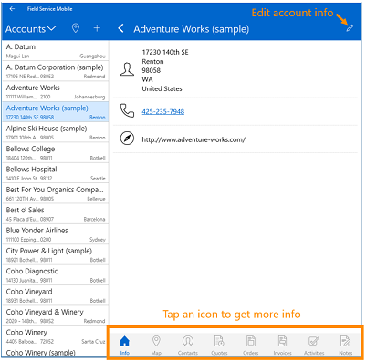  
  
### Bookable resources

The **Bookable Resources** section shows your work order bookings.  
  
By default, work orders are listed in the **Agenda** view. To change views, tap **Day**, **Week**, or **Month**.  
  
 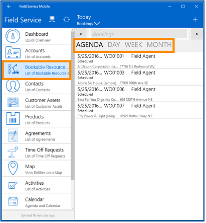  
  
### Contacts

**Contacts** shows a list of all your account contacts.  
  
To see where your contacts are located on a map, select **Map**.  
  
To add a new contact, select **+** and then add your information  
  
 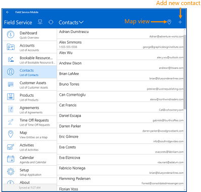  
  
Select a contact’s name to see the account information.  
  
Select the **Edit** button to edit the contact's info such as name, email address, and phone number.  
  
To see more information about the contact, select any of the options at the bottom.  
  
 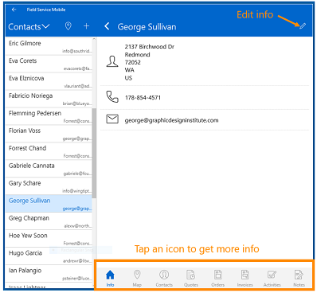  
  
### Customer assets

In the **Customer Assets** section, you'll see which products a customer uses.  
  
To add new customer assets, select **+** and then add the asset information.  
  
 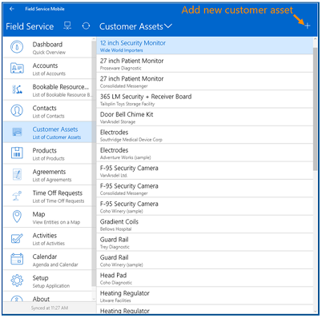  
  
To see information related to the asset, select the asset name on the left.  
  
 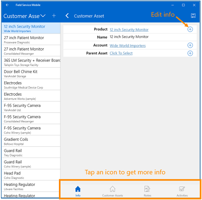  
  
### Products

**Products** shows a list of your products, including the price, type of product, quantity on hand, and more.  
  
To add a new product, select **+** and then add the product information.  
  
 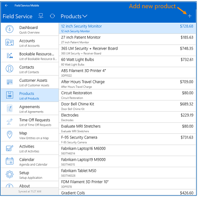  
  
To see details about the product, select **Products**, and then select a product in the list.  
  
 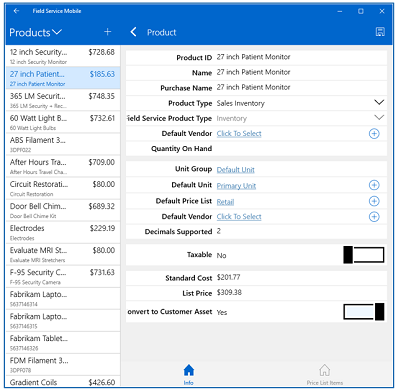  
  
### Agreements

The **Agreements** section is where you can see customer contracts.  
  
### Time-off requests  
  
1. If you need to take time off or you're not available to take a new work order, select **Time Off Requests**, and then select the **+**  button.  
  
2. Fill in your time-off information, and then select **Save**.  
  
   > [!NOTE]
   >  This will gray your name out on the schedule board, which lets the dispatcher and scheduling assistant know that you aren't available.

   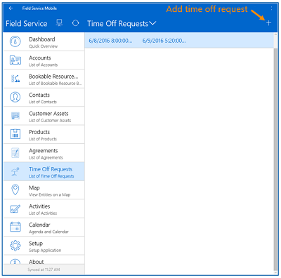

### Map

The map shows the location of your accounts and contacts on a map.

To filter the view, select **Accounts** or **Contacts**.

> [!div class="mx-imgBorder"]
> 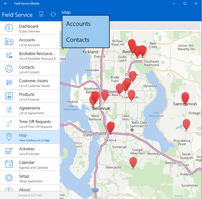

### Calendar

The calendar shows your appointments on a calendar.

### Change settings and sign-in info

To see or update your setup or sign-in information, select **Setup**.

### About this version

To see which version of the app you’re using, select **About**.

Select **Menu** in the top right to send logs, view privacy info, and more.

 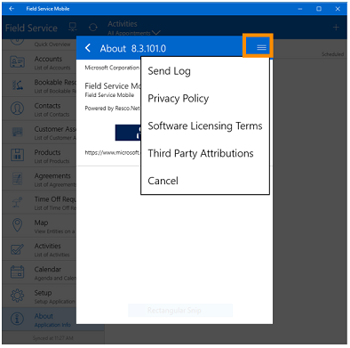

## Review work order bookings

When a work order is assigned to you, it shows up in [!INCLUDE[pn_fieldservice_mobile_app_short](../includes/pn-fieldservice-mobile-app-short.md)] (mobile).

By default, you can only see work orders for the current day plus the next seven days; those work orders must have a status of scheduled, traveling, or in progress. Once a work order is completed, you can no longer see it in [!INCLUDE[pn_fieldservice_mobile_app_short](../includes/pn-fieldservice-mobile-app-short.md)] (mobile).

1. To see your work order bookings, select **Bookable Resource Booking**.

2. By default, work orders are listed in the **Agenda** view. To change views, select **Day**, **Week**, or **Month**.

   

You can also select the **Arrow** to see your bookings for the next day. Or, you can use the filter to see work orders with a specific booking status.

   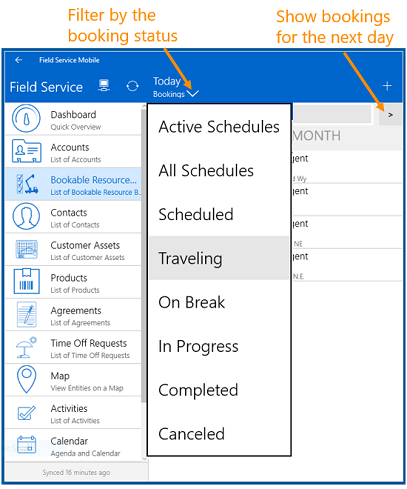

## Open a work order

1. To open a work order, from the list of bookings, select the work order that you want to open. The work order opens on the right.

2. To open the work order in full screen view, at the top, double-tap **Work Order**.

   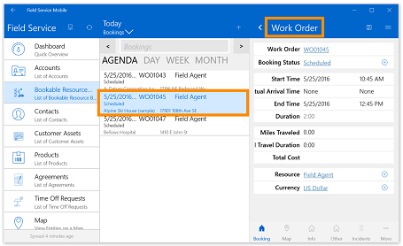

## See the location of a work order on a map

1. Open the work order, and then select **Map**. This shows the location of the work order on a map.

2. To get driving directions, select **Driving Direction**. This opens the default driving directions app on your mobile device. It provides turn-by-turn directions from your location to the work order location.

   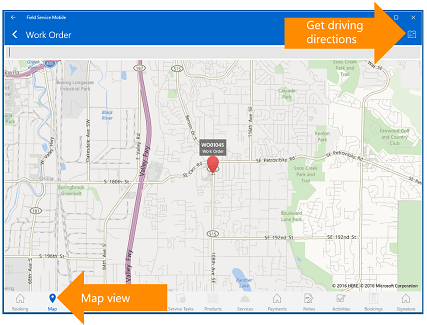

## Update work order status

 The minute you start driving to the next job, it’s important to update the status of the work order. This keeps the dispatcher up to date on what’s going on with the work order, and lets the dispatch team provide the customer with the current status.

1. Open the work order, and then select **Booking**.

2. Select **Add** for **Booking Status**.

3. Select a status. If you’re driving to the work order location, update your status to **Traveling**.

   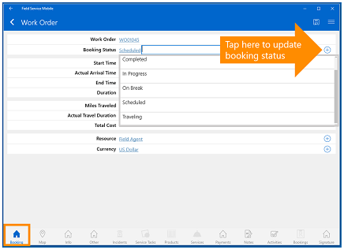

   > [!NOTE]
   >  Make sure to update the status again when you arrive on site, and again when you complete the work order.

4. When you’re done, select **Save**.

   > [!NOTE]
   >  When the work order is complete, remember to mark it as **Completed**.

## Update work order start time

When a dispatcher schedules a work order, the booking will have a start and end time. This may be the time promised to the customer, but if you’re running late or the job is taking longer than expected, it’s important to update the start and end time. This automatically keeps the dispatcher up to date on the schedule board.

- Open the work order, select **Booking**, and then change the **Start Time**.

  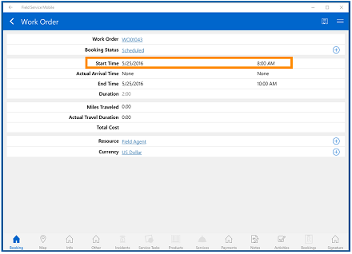

## Check work order details

To get more information on what work needs to be done for the service call, look at the **Info**, **Other**, and **Incidents** tabs.

The **Info** tab provides service account info, address, priority, and more.

 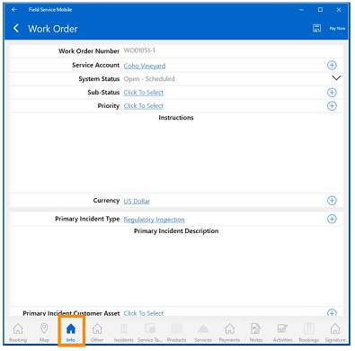

The **Other** tab provides billing account info, service time windows, price lists, and more.

 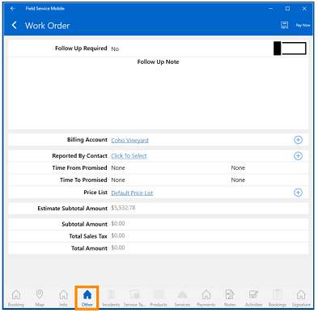

The **Incidents** tab shows which incidents are linked to the work order.

 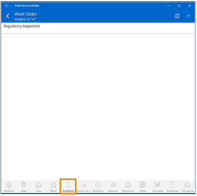

## Check service tasks, products, and services

When a work order is created, incidents are added to the work order, which includes a list of service tasks, products, and services.

Service tasks let a field agent know what tasks need to be performed for the work order. Products tell them what products they might have to use to complete the work order. Services show the hours needed to complete the work.

### Check service tasks

1. Open the work order, and then select **Service Tasks**.

   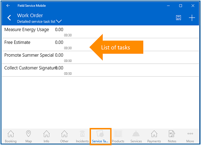

2. Select a service task to open it.

3. When the service task is open, add notes, mark percentage complete, and how long it took to complete the task.

   

4. When you’re done select **Save**.

### Check products

1. Open the work order, and then select **Products**.

2. Select a product name to open it.

   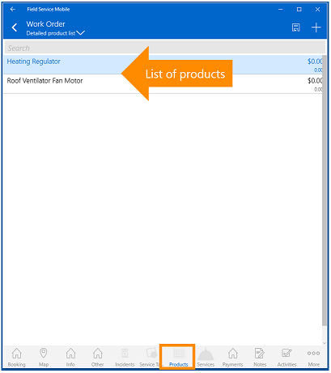

3. Mark if the product was used, enter the correct quantity, make sure the price is correct, and add any additional notes.

   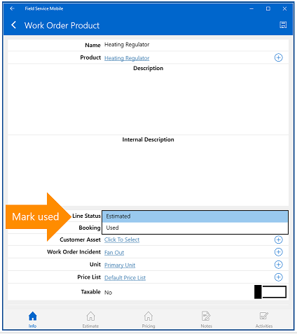

4. When you’re done, select **Save**.

### Check services

1. Open the work order, and then select **Services**.

2. Select a service name to open it.

   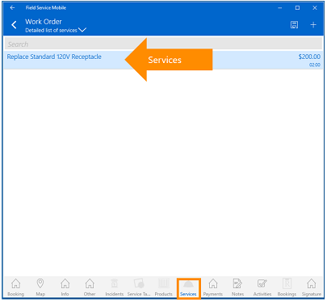

3. If the service was performed, mark it as used, and then add any additional information.

   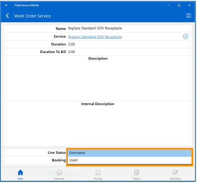

4. When you’re done, select **Save**.

## Add notes, pictures, signatures, and more

 When you’re working on a work order, you can add your notes, attachments, pictures, and signatures.

### Add a picture

1. Open the work order, select **Notes**, and then select the **Camera**.

   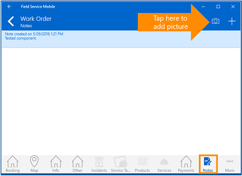

2. Select the **Camera** button to take the picture.

3. Adjust the picture as needed, and when you’re done, select **Save**.

### Add notes

1. Open the work order, and then select **Notes**.

2. To add notes, select **+**.

   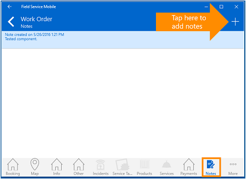

3. Add your notes in the **Description** area.

   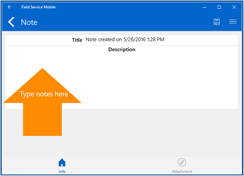

4. When you’re done, select **Save**.

### Add attachments, signatures, record video, and more

1. Open the work order, and then select **Notes**.

2. Select **+**.

3. Select **Menu** to add attachments, signatures, record video, and more.

   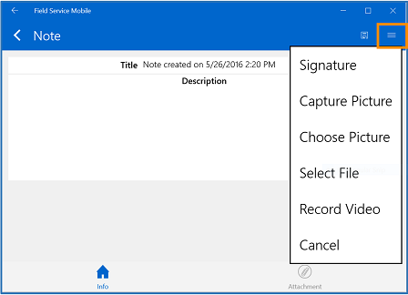

4. When you’re done, select **Save**.

## Create a follow-up booking

If work still needs to be done, you can create a follow-up booking.

1. Open the work order, and then select **Booking**.

2. Select the **Menu**, and then select **Create follow up**.

   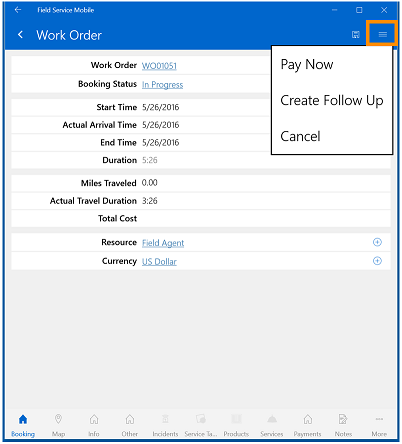

3. Select **Open**, and then add your information

4. When you’re done, select **Save**.

### Next steps

- [Enable bookable resources for mobile app access](set-up-bookable-resources.md)

### See also

- [Dynamics 365 Field Service - User's Guide](../field-service/user-guide.md)
- [Overview of Dynamics 365 Field Service](../field-service/overview.md)

[!INCLUDE[footer-include](../includes/footer-banner.md)]