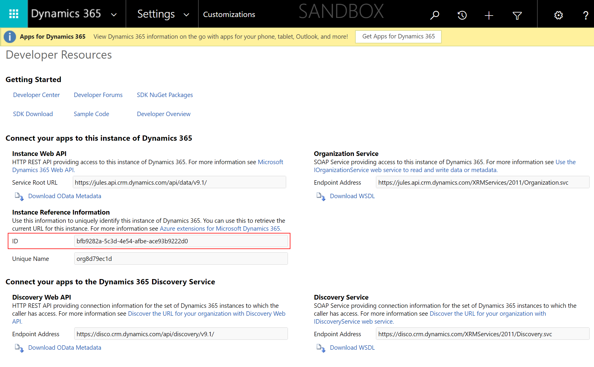
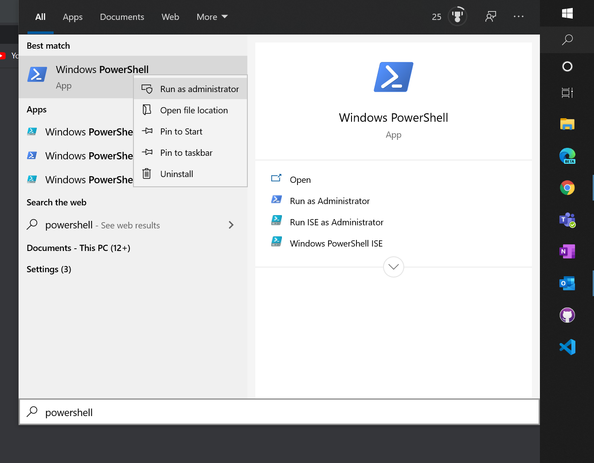
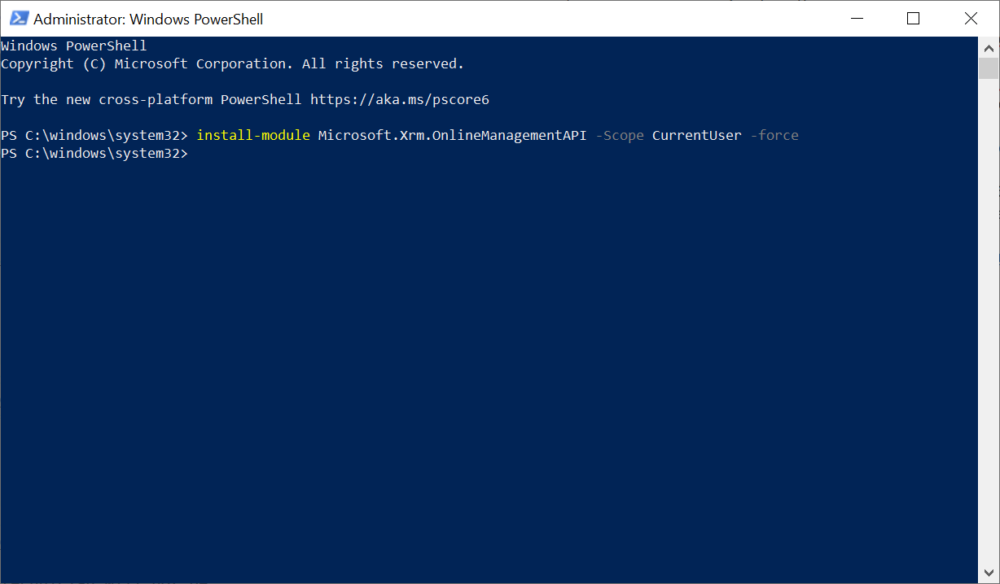
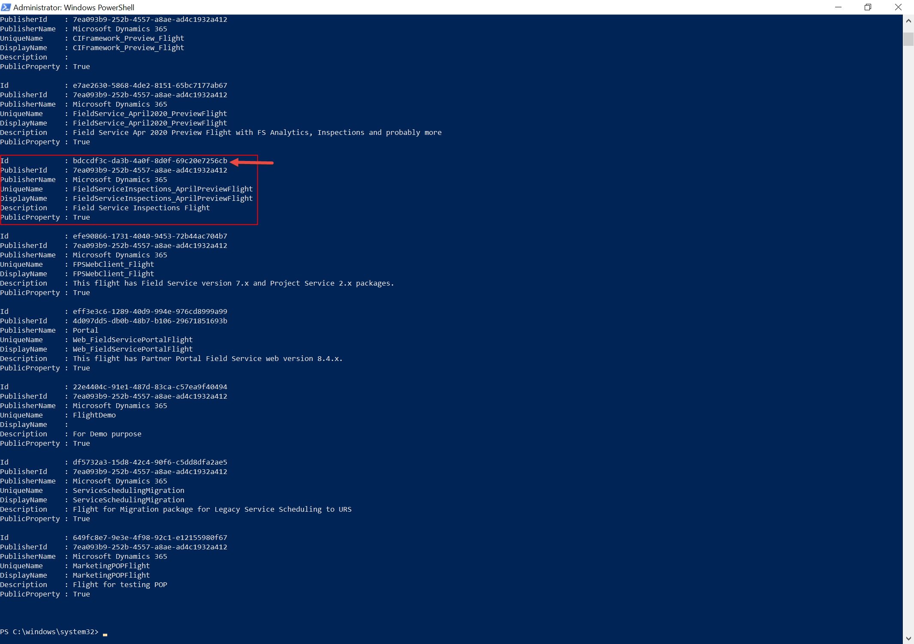
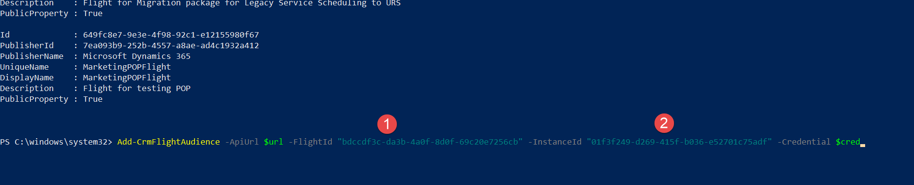
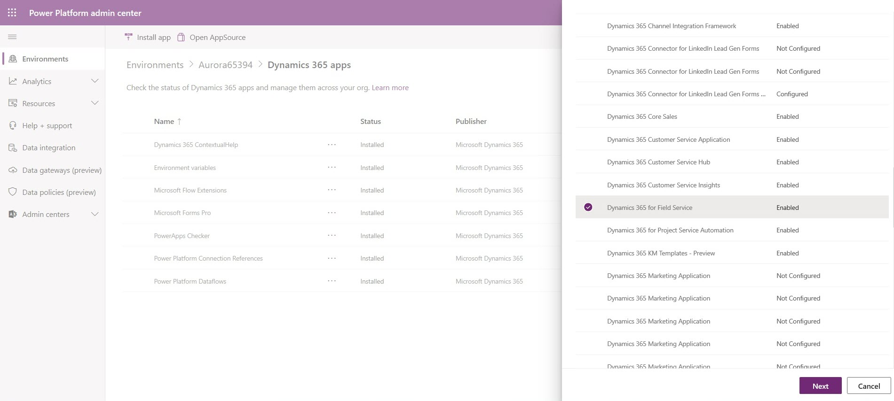
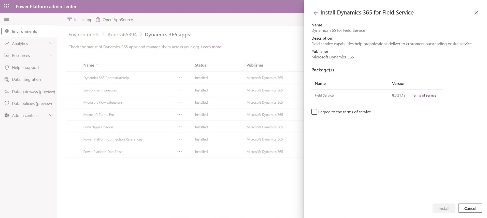
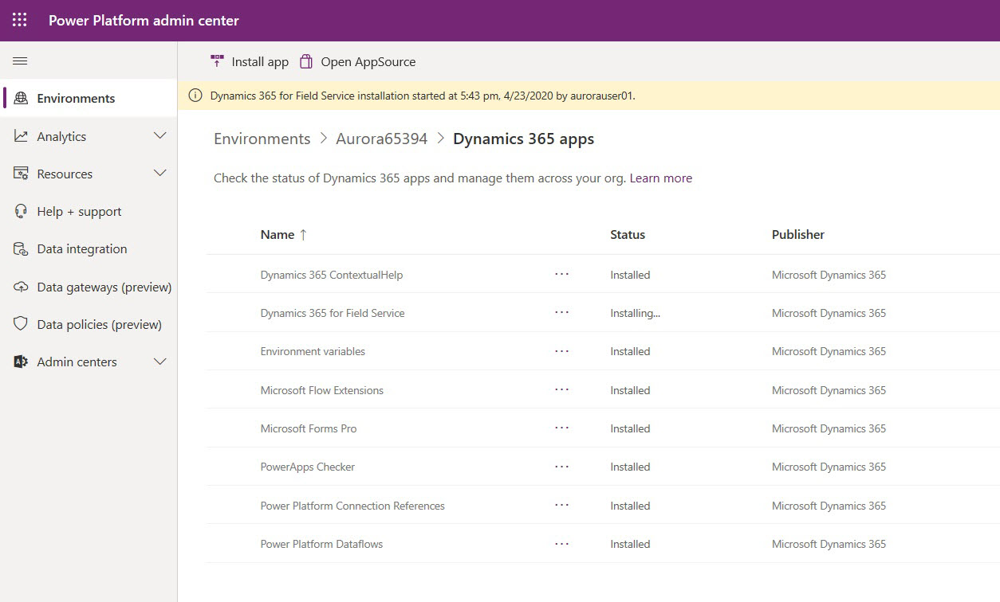
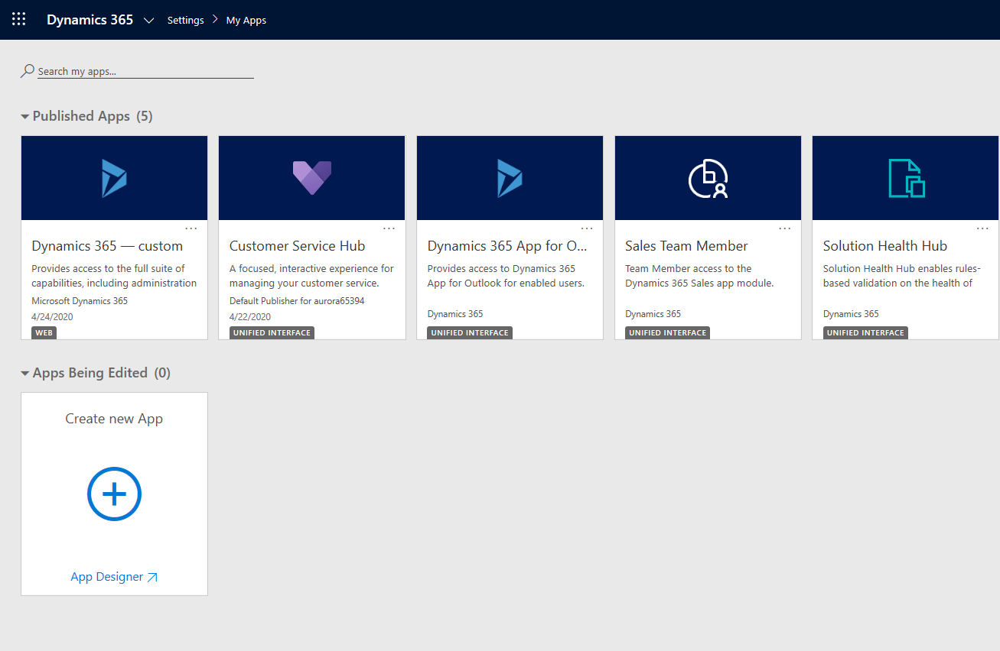
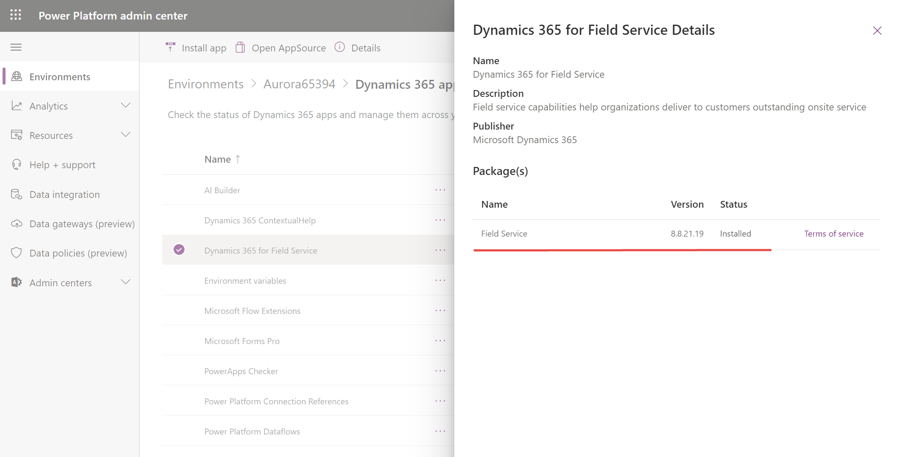

# Install preview features for Dynamics 365 Field Service

New Field Service capabilities are often available as a preview before they are generally available. Preview features are not intended for production usage as they may be changed before becoming generally available. By installing and learning preview features, you can better prepare for how your business can adopt them when they are generally available.

Follow the instructions in this article to manually add Field Service preview features to your testing and development environment.

Installing a preview solution will install Field Service and preview features. 

## Prerequisites

Find and note the **Org ID** of your Dynamics 365 environment you wish to add preview features to.

You can find this in **Settings** > **Customizations** > **Developer Resources**

> [!div class="mx-imgBorder"]
> 

Make sure your PC computer has PowerShell installed. If not, [install it](https://docs.microsoft.com/powershell/scripting/install/installing-powershell?view=powershell-7).

## Step 1: Run PowerShell

Open PowerShell and **Run as Administrator**.

> [!div class="mx-imgBorder"]
> 

Here's an example of all the PowerShell commands we'll run; you can follow with the steps below. We recommend copying and pasting the following in a note that you can edit with your specific information for username, password, org ID and more.

    install-module Microsoft.Xrm.OnlineManagementAPI -Scope CurrentUser -force 
    $user = “username@org.onmicrosoft.com”   
    $password = “password” 
    $cred = New-Object System.Management.Automation.PSCredential ($user, (ConvertTo-SecureString $password –ASPlainText –Force)) 
    $url = “https://admin.services.crm.dynamics.com”  
    Get-CrmFlights -ApiUrl $url -Credential $cred  
    Add-CrmFlightAudience -ApiUrl $url -FlightId "092718c6-8031-43f7-b957-2b2e662ebf46" -InstanceId "d9bee8b4-995f-4d78-83c0-8b55e471245d" -Credential $cred 

## Step 2: Run command to install API

Run the following command:

        install-module Microsoft.Xrm.OnlineManagementAPI -Scope CurrentUser -force 

> [!div class="mx-imgBorder"]
> 

## Step 3: Run commands for username and password

Run the following command; be sure to substitute your own username. This username reflects a user with system administrator security role:

        $user = “user@org.onmicrosoft.com”   

Run the following command; substitute your own password:

        $password = “password” 

Run the following command:

        $cred = New-Object System.Management.Automation.PSCredential ($user, (ConvertTo-SecureString $password –ASPlainText –Force)) 

## Step 4: Run command for your URL

Next, check the article on [Service URLs](https://docs.microsoft.com/powerapps/developer/common-data-service/online-management-api/get-started-online-management-api#service-url).

Run the following command, substituting the service URL based on your environment's geography.

        $url = “https://admin.services.crm.dynamics.com” 

## Step 5: Run command to get preview flights

Run the following command:

        Get-CrmFlights -ApiUrl $url -Credential $cred  

If prompted, run software from an untrusted publisher by Entering "R".

> [!Note]
> If you get the error *"\Microsoft.Xrm.OnlineManagementAPI.psm1 cannot be loaded because running scripts is disabled on this system"*, run the following PowerShell command: “Set-ExecutionPolicy -ExecutionPolicy AllSigned -Scope LocalMachine".

You will see a list of preview features. 

> [!div class="mx-imgBorder"]
> 

## Step 6: Find ID of preview flight

Find the preview feature you would like to add to your environment and note the ID. In our example, it's the ID for **FieldService_April2020_PreviewFlight**.

> [!div class="mx-imgBorder"]
> 

Run the following command by substituting the ID of the preview feature found in PowerShell (seen under "1" in the previous screenshot) and the orgID of your environment you noted in the beginning (seen under "2" in the previous screenshot).

        Add-CrmFlightAudience -ApiUrl $url -FlightId "bdccdf3c-da3b-4a0f-8d0f-69c20e7256cb" -InstanceId "01f3f249-d269-415f-b036-e52701c75adf" -Credential $cred 

It will say **Added to Flight**.

## Step 7: Install or upgrade preview version of Field Service 

As a system administrator, go to [https://admin.powerplatform.microsoft.com/environments/](https://admin.powerplatform.microsoft.com/environments/).

Select the environment you want to install or upgrade the preview features to and then select **Manage Dynamics 365 apps** in the top ribbon.

Then select **Install app** in the top ribbon and find Dynamics 365 Field Service.

> [!div class="mx-imgBorder"]
> 

Agree to the terms and install the Field Service preview version.

> [!div class="mx-imgBorder"]
> 

Back in the list of apps, you'll see it has a status of "Installing..."

> [!div class="mx-imgBorder"]
> 

## Step 8: Verify preview flight is installed

Here is an example of the apps that may be in your Dynamics 365 environment *before* installing the preview flight.

> [!div class="mx-imgBorder"]
> 

*After* the flight is installed, an upgraded version of the Field Service app will appear. If you did not have the Field Service app installed, the preview flight will install Field Service and the preview features. If you had the Field Service app installed, it will upgrade the Field Service app to include the preview features.

> [!div class="mx-imgBorder"]
> 

Simply click on the Field Service app to access Field Service capabilities and the preview features.

### See also

- [Install Field Service](./install-field-service.md)

- [Upgrade Field Service](./upgrade-field-service.md)
