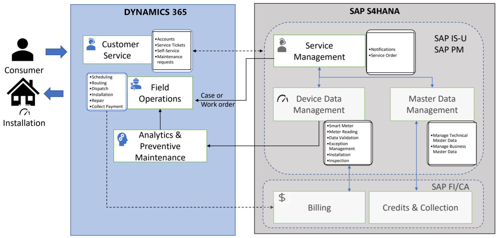

# Dynamics 365 Field Service and SAP integration

Integrate Dynamics 365 Field Service with SAP C-4Hana and SAP S-4Hana to connect your work order scheduling system to your ERP system.

Microsoft offers guidance for integrating Field Service with the SAP Planned Maintenance and SAP Industry-Specific Utility (IS-U) modules. Integration is done by connecting SAP to the [Common Data Model](https://docs.microsoft.com/common-data-model/), which Field Service is built on, along with other Dynamics 365 modules. Find more details in the [Microsoft consulting services GitHub repository](https://github.com/microsoft/MCSBusinessApplicationsDynamicsFSUtilityIndustry), which hosts materials created and updated by Microsoft, but open to ISVs and SIs to improve and build upon as part of the Open Data Initiative.

The materials provide details on three main aspects of integrating Field Service with SAP:

1. Field Service and SAP business processes
2. Entity, field, and data models
3. Guiding principles and best practices 

Below is some example architecture for how the SAP Industry-Specific Utility "meter to cash" solution will interact with Dynamics 365 Field Service.

> [!div class="mx-imgBorder"]
> 

## Additional notes

See also: 

- [Microsoft Consulting Services GitHub repo](https://github.com/microsoft/MCSBusinessApplicationsDynamicsFSUtilityIndustry)
- [Logic Apps SAP connector](https://docs.microsoft.com/connectors/sap/)

[!INCLUDE[footer-include](../includes/footer-banner.md)]