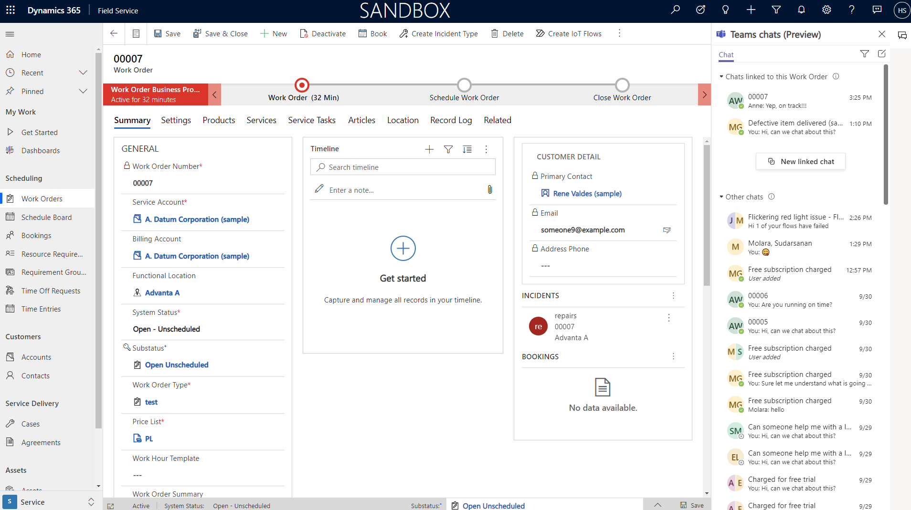

# Collaborate on work orders with Microsoft Teams

Integrate with Microsoft Teams to chat with team members in the context of work orders. The Teams integration helps finding answers and fix issues the first time. It also lists team members that have previously worked on a work order.

> [!div class="mx-imgBorder"]
> 

For a guided walkthrough, check out the following video.

> [!VIDEO https://www.microsoft.com/videoplayer/embed/RWOc1n]

## Set up the Teams integrations

An administrator must set up the overall integration between Microsoft Teams and Dynamics 365 apps.

For more information, see [Install and set up Teams Integration](/dynamics365/teams-integration/teams-install-app).

## Enable and configure collaboration settings in Field Service

1. In Field Service, go to **Settings** > **Microsoft Teams Integration** > **Collaboration**.

1. On the **Microsoft Teams collaboration and chat** page, turn on the toggle for **Turn on Microsoft Teams chats inside Dynamics 365**.

1. Select one of the following:

   - **Turn on for all Dynamics 365 apps** – Enables Teams chat for all supported Dynamics 365 apps in your organization, including any that you add in the future.
   - **Turn on for selected Dynamics 365 apps** – Enables Teams chat for the apps you choose. If your organization already uses Teams, the selection you made previously remains. If you haven't yet set up Teams, it's enabled by default.

1. Save the changes.

In the **Connect chats to Dynamics 365 records** section, add all the tables you'd like to collaborate on.

For more information, see:
- [Work with Microsoft Teams chat in Dynamics 365](/dynamics365/teams-integration/enable-teams-chat)
- [Configure Teams chat](/dynamics365/customer-service/configure-teams-chat)

## Create a new chat

1. To start a new chat, open a record for a table that is connected to the Teams integration.

1. In the top-right corner of your screen, select the chat box icon to open the Teams chats panel. In the Teams chats panel, you'll see a list of chats that are contextually linked to the current work order, along with other chats in your Teams history.

   :::image type="content" source="media/work-order-teams-create.png" alt-text="Field Service work order, showing linked chats in the Teams chats panel.":::

1. Select **New connected chat** to start a new chat that will be linked to the current record. Add the relevant participants. By checking the **Send introduction message**, you'll start the conversation with the relevant details shown between participants of the conversation.

1. Select **Start chat** to start the conversation.

## Connect and disconnect existing chats

To connect an existing chat to a record, select the ellipses icon next to the chat in the Teams panel, and select **Connect to this record**. That chat will now appear in the top section of the Teams panel, where other chats linked to this work order appear.

:::image type="content" source="media/work-order-teams-link-to-work-order.png" alt-text="Teams chat panel on the work order, showing the option to link chat to the work order.":::

To unlink the chat from a record, select the ellipses icon next to the connected chat, and then **Disconnect from this record**.

## Customize welcome message

When you start a new chat, some predefined information creates a welcome message in the chat panel.

To customize the information in the welcome message, go to **Settings** > **Microsoft Teams Integration** > **Collaboration**.

Select the record type, then choose a view from the system. **Save** when done.

The first five columns in the view you choose will be shown in the welcome message when you invite someone to collaborate on a record.

[!INCLUDE[footer-include](../includes/footer-banner.md)]
