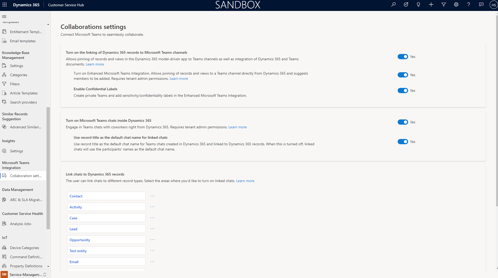
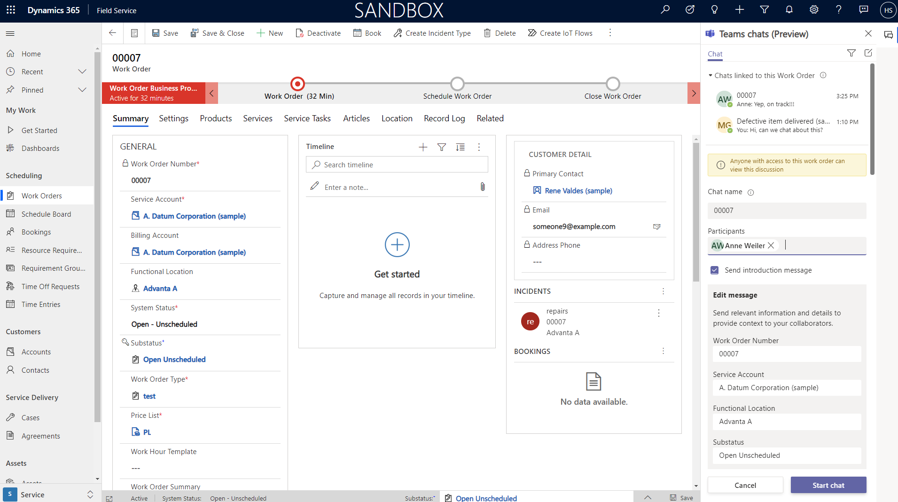
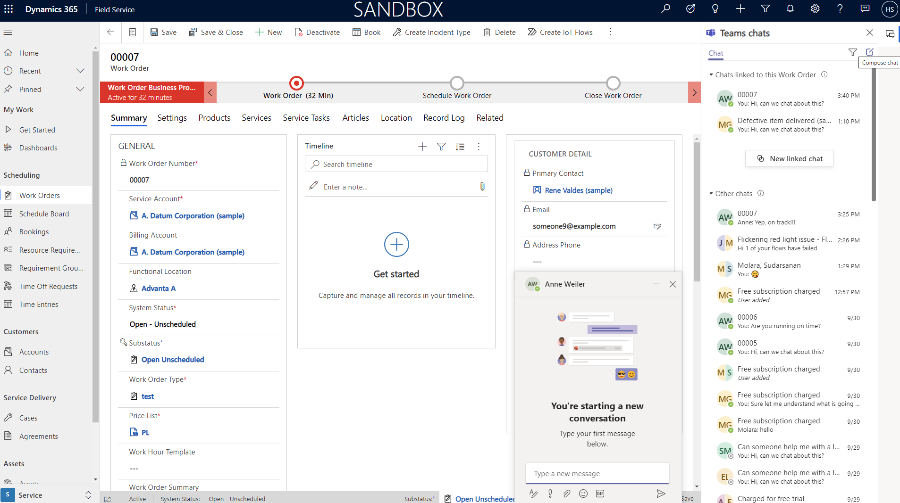
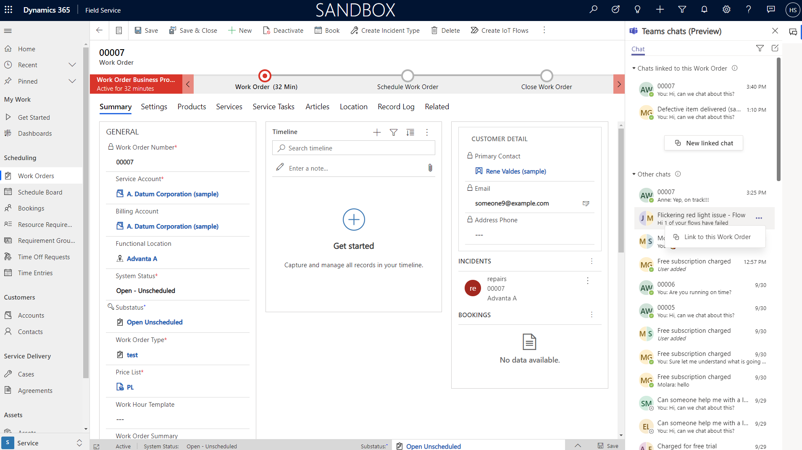
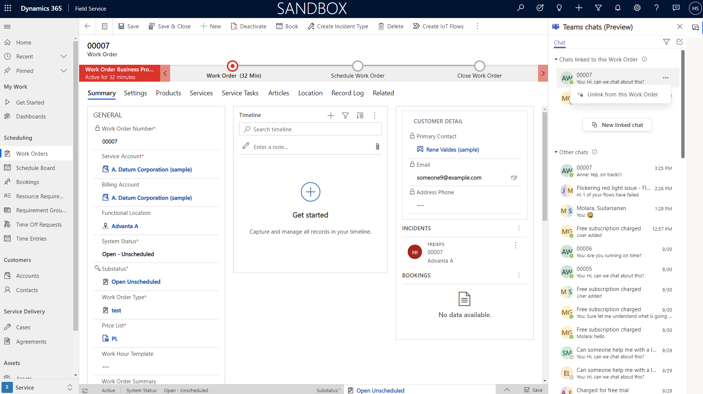
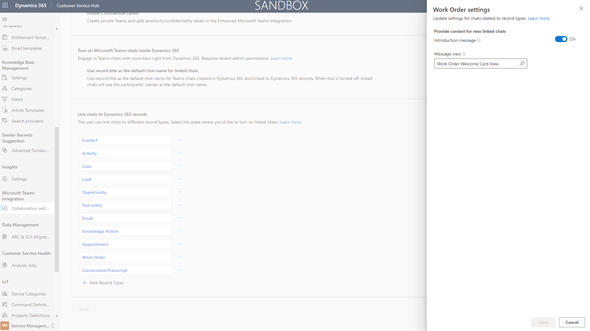
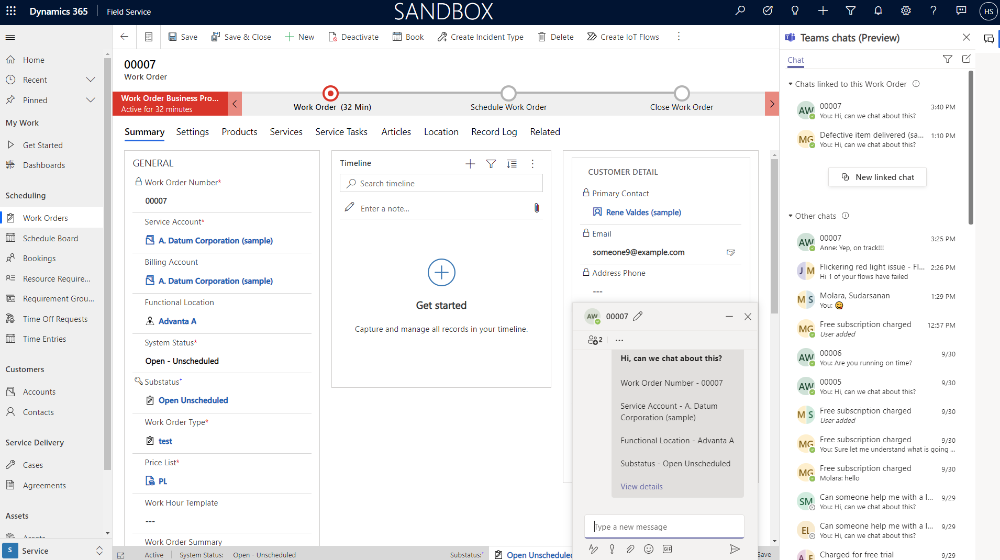

# Collaborate on work orders with Microsoft Teams

Integrate with Microsoft Teams to chat with team members in the context of work orders. Teams integration makes it easy to find answers and fix issues the first time. It also makes it easy to understand which team members may have previously worked on a work order.

> [!div class="mx-imgBorder"]
> 

## Prerequisites

- Set up overall integration between Microsoft Teams and Dynamics 365 customer engagement apps. See this article: [Install and set up](/dynamics365/teams-integration/teams-install-app)

### Configure collaboration settings

When signed into Dynamics 365, go to **Microsoft Teams Integration** > **Collaboration Settings** and set the toggles to **Yes**, as seen in the following screenshot. 

> [!div class="mx-imgBorder"]
> 

In the **Link chats to Dynamics 365 records** section, add the record types you'd like to collaborate on, such as work orders.

## Create a new chat from a work order

To start a new chat from a work order, go to **Field Service** > **Work orders** > and select a work order.

In the top-right corner of your screen, select the chat box icon to open the Teams chats panel. In the Teams chats panel, you'll see a list of chats that are contextually linked to the current work order, along with other chats in your Teams history.

> [!div class="mx-imgBorder"]
> 

Select **New linked chat** to start a new chat that will be linked to the current work order. Add the relevant participants. By checking the **Send introduction message**, you'll start the conversation with the relevant details, shown between participants and the **Start chat** button.

> [!Note]
> You can customize what information is populated in the welcome message. For more information, see the section "Customize welcome message" later in this article.

> [!div class="mx-imgBorder"]
> 

## Link and unlink existing chats

To link an existing chat to a work order, select the ellipses icon next to the chat in the Teams panel, and select **Link to this Work Order**. That chat will now appear in the top section of the Teams panel, where other chats linked to this work order appear.

> [!div class="mx-imgBorder"]
> 

To unlink the chat from the work order, select the ellipses icon next to the linked chat, and then **Unlink from this Work Order**.

> [!div class="mx-imgBorder"]
> 

## Customize welcome message

When new chats are started from the work order (or other record types), information is prepopulated as a welcome message in the chat panel.

To customize the information shown in this prepopulated welcome message, go to **Microsoft Teams Integration** > **Collaboration Settings**.

Select the work order record type, then choose a view from the system. Save when done.

> [!div class="mx-imgBorder"]
> 

The first five columns in the view you choose will be shown in the welcome message when you invite someone to collaborate on a work order.

> [!div class="mx-imgBorder"]
> 

