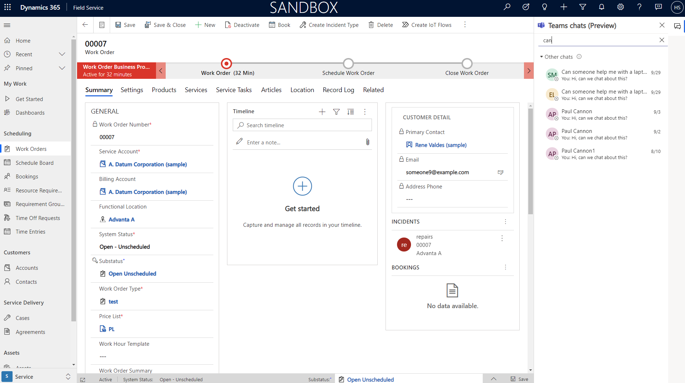

# Collaborate on work orders with Microsoft Teams

// Video: https://msit.microsoftstream.com/video/8ea30840-98dc-948e-756d-f1ec230bb3b1

[Microsoft Teams integration with customer engagement apps in Dynamics 365](https://docs.microsoft.com/dynamics365/teams-integration/teams-integration)

[Install and set up](https://docs.microsoft.com/dynamics365/teams-integration/teams-install-app)

> [!div class="mx-imgBorder"]
> 

## Prerequisites
> [!Note]
>

>[!TIP] 
> 

Enable Teams integration with Work Order or other tables

> [!div class="mx-imgBorder"]
> 

## Create a new chat from a work order

> [!div class="mx-imgBorder"]
> 

> [!div class="mx-imgBorder"]
> 

## Link and unlink existing chats 

> [!div class="mx-imgBorder"]
> 

> [!div class="mx-imgBorder"]
> 

> [!div class="mx-imgBorder"]
> 

## Customize welcome message

Select the work order table form the Teams collaboration admin page then choose a view from the system. 

> [!div class="mx-imgBorder"]
> 

The first 5 coulmns in the view you choose will be displayed in the welcome message when you invite someone to collaborate on a work order.

> [!div class="mx-imgBorder"]
> 

## Configuration considerations
## Additional Notes
