# Time entries for Dynamics 365 Field Service

Time entry capabilities help field service organizations better track the time that technicians spend during work orders and other scenarios. 

Time entries are useful for: 

- reporting 
- understanding utilization
- billing and invoicing for service 

> [!Note]
> Field Service time entry utilizes the same entity that Project Service Automation has always used. This creates a consistent time capture process, regardless of whether your organization uses Field Service, Project Service Automation, or both.

There are three ways time entries are created in Dynamics 365 Field Service: 

- **automatically** during the work order process
- **manually** for custom business processes
- automatically for **time-off requests**

> [!div class="mx-imgBorder"]
> 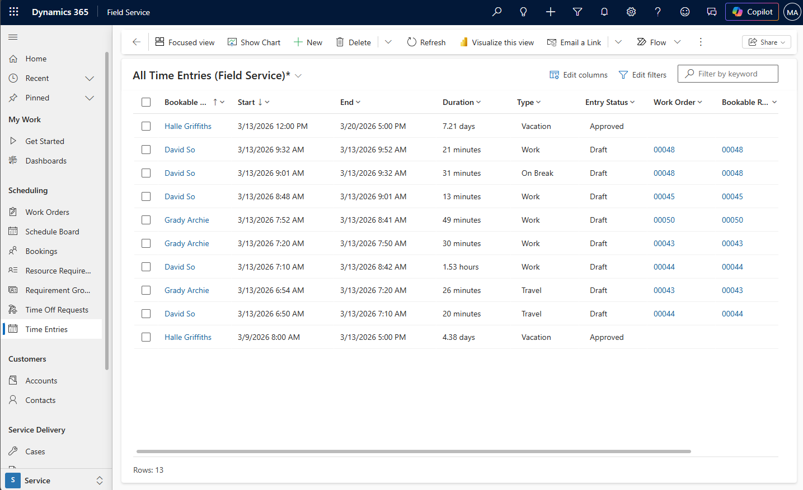

For a guided walkthrough, check out the following video.

> [!VIDEO https://www.microsoft.com/videoplayer/embed/RE4J6mQ]

## Automatic time entries

Time entries are automatically created during the work order process. As a work order is scheduled and performed, booking status changes are tracked in booking timestamps.

> [!div class="mx-imgBorder"]
> 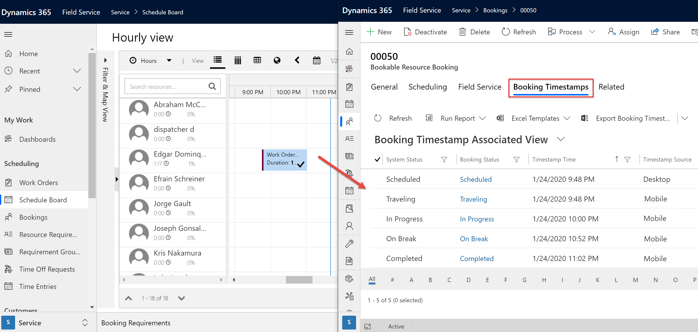

When the work order booking status is changed to **Completed**, time entries are created based on the booking timestamps.

> [!div class="mx-imgBorder"]
> 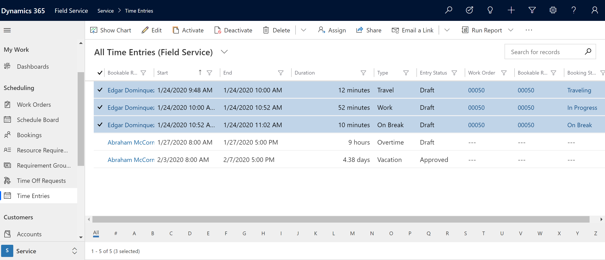

When the work order system status (different than the booking status) is changed to **Closed-Posted**, actual records are created based on the time entries. These records represent the internal cost of the technician's time.

> [!div class="mx-imgBorder"]
> 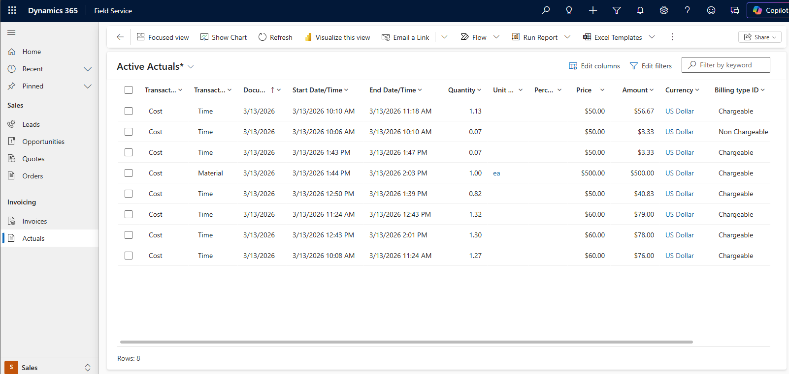

## Manual time entry

Time entries can also be created manually. From a desktop, go to **Field Service** > **Time Entries** > **+New**.

Add a start time, end time or duration, and the bookable resource to which the time entry relates.

> [!div class="mx-imgBorder"]
> 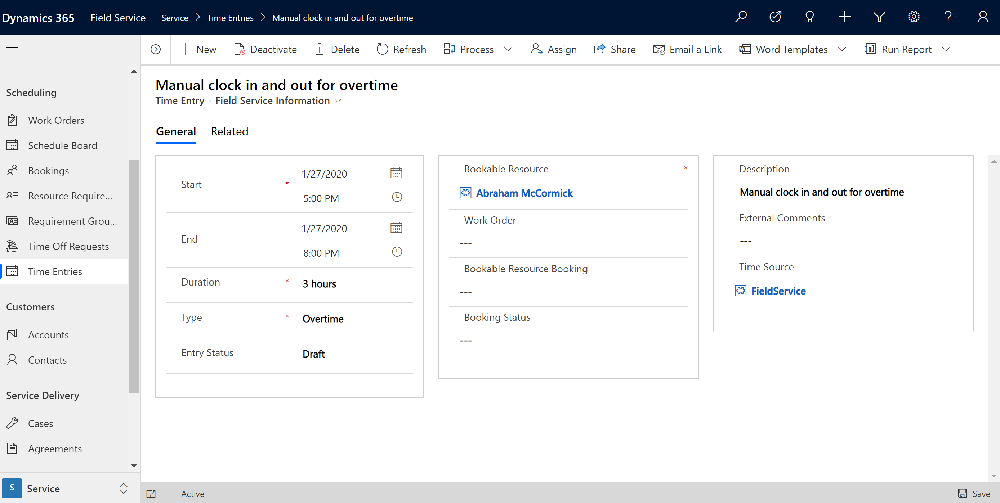

You can relate the time entry to other records - like work orders and bookings - as needed.

You can also view and create time entries on the [Field Service (Dynamics 365) mobile app](mobile-power-app-get-started.md). 

> [!div class="mx-imgBorder"]
> 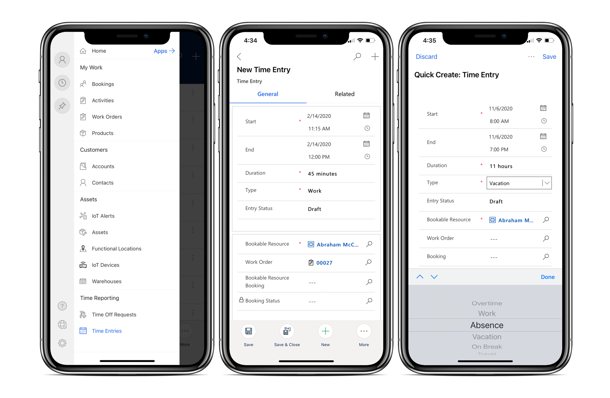

## Time off

Time-off requests are automatically recorded as time entries as well.

First, submit a time-off request. Submission can be done in the desktop browser or from Field Service Mobile.

> [!div class="mx-imgBorder"]
> 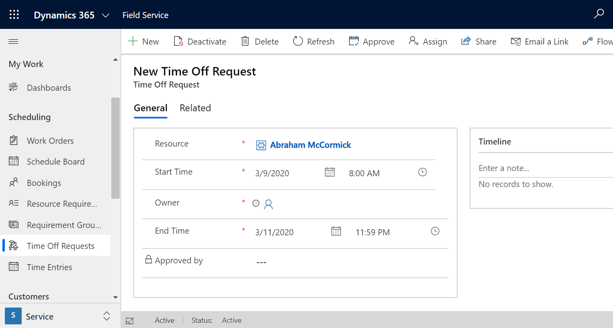

A time entry record will automatically be created. The type will be **Vacation** by default and the entry status will be submitted.

> [!div class="mx-imgBorder"]
> 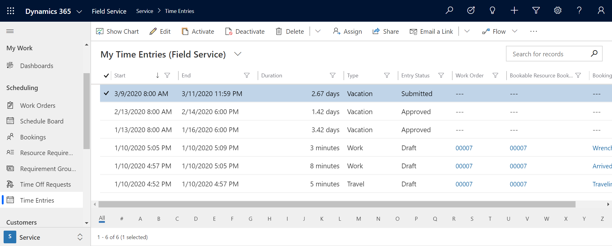

Next, approve the time-off request. Approval is only required if the resource on the time-off request requires approval, as defined on the bookable resource record.

> [!div class="mx-imgBorder"]
> 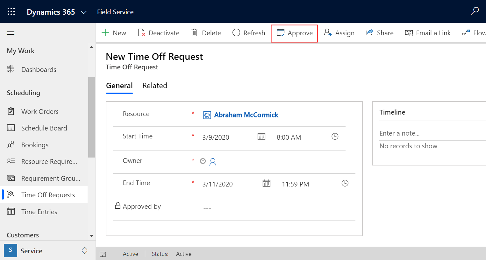

The time entry **Entry Status** will be updated as approved.

> [!div class="mx-imgBorder"]
> 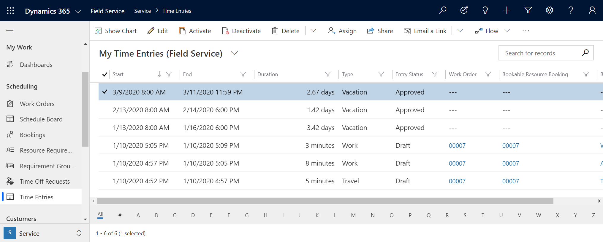

Making changes to the date or duration of the time entry will update the time-off request and vice versa.

> [!Note]
> You can create time-off requests from Field Service Mobile in online and offline modes; the time entries will be created upon sync. 

## Configuration considerations

- While out-of-the box security roles have been adjusted to allow for time entry usage and time entry automatic creation from time-off requests, organizations should expect to add time entry permissions to their custom security roles. Without permissions on time entry, users will be blocked from creating time entries and time-off requests due to their interconnected automation, even if they could previously create time-off requests.

- If you do not want time entries created automatically for the work order process, go to **Field Service** > **Settings** > **Field Service Settings** and set the **Time Entry Generation Strategy** to **Manual**.

> [!div class="mx-imgBorder"]
> 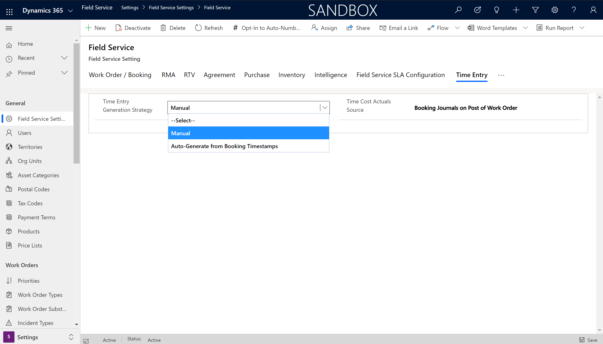

- Time entries are created based on booking timestamps, and booking timestamps are created based on the **Timestamp Frequency** setting in Field Service Settings. See the [article on booking timestamps](booking-timestamps.md) to understand how timestamps can be created based on the booking statuses or Field Service booking statuses.

- Time entries can be viewed and created on the Field Service Mobile (Xamarin) app

> [!div class="mx-imgBorder"]
> 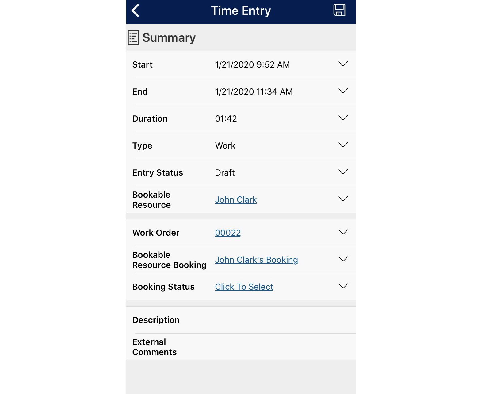

Import [the latest mobile project template](https://aka.ms/fsmobile-project) into the mobile configuration tool (Woodford) to display time entries in Field Service Mobile (Xamarin).

## Additional notes

Time entries are only automatically created for work order bookings and not for independent bookings or bookings related to other entities such as cases or custom entities.

Time entries are not created in offline mode, but are created upon sync. 

### See also

- [Time and expense in Project Service Automation](https://docs.microsoft.com/dynamics365/project-service/time-expense-collaboration-guide)

- [Booking timestamps](booking-timestamps.md)

- [Time off requests](submit-approve-time-off-requests.md)

[!INCLUDE[footer-include](../includes/footer-banner.md)]