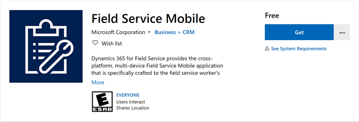
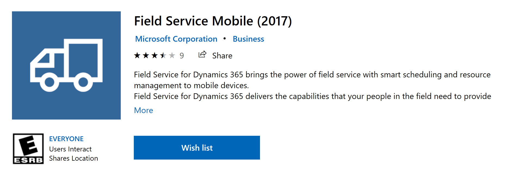

# Field Service Mobile (Xamarin) version history

> [!IMPORTANT]
> We recommend using the [Field Service (Dynamics 365) mobile app](mobile-power-app-overview.md) instead of the Field Service Mobile (Xamarin) app to benefit from the new features and continuous investments in the platform. While the new Field Service (Dynamics 365) mobile app continues to evolve, we'll continue to make available and support the current Field Service Mobile (Xamarin) app. By June 2021, new deployments must use the Field Service (Dynamics 365) mobile app; support for the current Field Service Mobile (Xamarin) app will end June 2022.

This article chronicles important updates related to Field Service Mobile (Xamarin) app and associated mobile project templates.

## 13.2.203

### Updates 
- OAuth authentication support with Sharepoint integration 
- Entity form rules step ExecuteJS
- JSBridge: DefaultKeepAlive flag exposed through JSBridge command (Desktop only) 
- iOS: FilterPicker now uses UIPopoverPresentationController for iPads 
- [Android] Changes to target API level 29 (Android 10)
 
### Bug fixes 
- Clicking on ContentDocumentLink crashes app when related entity is not in metadata 
- MobileCRM: Localization is not applied for time picker 
- iOS: NewDetailImageItem - fit image also by width. 
- Sync: Some cleanup optimizations switched off in case of FullSync. 
- Win10: App crash on charts. 
- Unable to add N:N relation for different id with the same target entity (user to user) 
- Business process flow sync errors 
- Export command on list view currently accepts only 950 records 
- Win10: Error applying form rule - Crashes in DetailItemTextBox (InvalidCastException: InvalidCast_WinRT, Resco.UI.WindowsRT.DetailItemComboBox, MissingMetadataType) 
- iOS: View selector popup is not correctly centered on iPads 
- iOS: Ultimate list-set needs display every time when the frame was changed. 
- Win10: When the visibility of a LookUp view changes in an onChange rule, the lookUp field is never enabled again. 
- CSS: MobileUsers grid not scrollable to bottom 
- Email form 'to' field value is filled two times 
- FormTable: Table disappears on the Android app after returning from landscape mode 
- It takes too long to close RichTextEditor properties - user is confused 
- JSBridge: setting "preventClose" causes close button to disappear for all lookups 
- Allow disabling use of versionnumber in full or incremental sync per entity in Advanced Sync Setup
- Charts: wrong labels of second Horizontal axis field
- Clicking on check-box on the list view opens the list item instead of checking the check-box
- Overlap of contents on report preview on Android
- Save is not executing when invoking MobileCRM.UI.EntityForm.save() from script

## 12.3.206

### Updates

- Moving authentication library from ADAL.Net to MSAL.
- Updating Intune SDKs for Android and iOS.
- Azure Image Recognition: Integrate with Azure's Custom Vision service to classify images.  
- Buttons on entity forms: Ability to add custom buttons on forms, adding the ability to execute actions directly from form's UI. A rule can be provided to implement custom business logic.  
- Brand new look and feel of charts: Charts in the mobile application get a visual makeover as the app now uses a different visualization library. The old look can be enabled as a legacy option in Woodford.
- Rules support square root and other math operators  
- Rules editor now natively supports more complex math operations on top of your data, such as using the *Nth* root, exponentiation, and logarithm, directly in the rules.
- Mobile audit is uploaded last to ensure that any referenced records are uploaded first.  
- REFACTOR: iOS: RTL ordering of panels. 
- Mobile reports: When emailing report from multiselect, pass first record reference as relationship variable.
- Sync: Custom upload order: It is now possible to specify a custom upload order. You can specify which entities are uploaded at the beginning and which entities are uploaded at the end of the upload process.  
- Report: Excel: Use style with text wrapping enabled for texts with multiple lines. 

### Bug Fixes

- Win10: MonthCalendar handled every cell click twice.
- Win10: Refresh global search placeholder after app language has changed.
- MobileCRM.Win10: Stacked chart display old chart on hover. 
- MobileCRM.Win10: Bar charts don't support stacked or grouped view.
- Win10: Forward button included (serves as back button in RTL). 
- Win10: RTL-related fixes.
- Android: SendEmail action fixed to support both Gmail and Outlook.
- Android: Do not show download progress in status bar on devices with top cutout (notch) and Android 9+ in portrait.
- Report: Excel: Fixed assignment of horizontal alignment constants to vertical alignment. Fixed warning. 
- All: Use correct color for home icons if custom home theme is used.
- Scheduler: FilterStatus and other items in ButtonsBar were not reduced or hidden properly when ButtonsBar width was not sufficient.
- Report: Excel: Fixed assignment of horizontal alignment constants to vertical alignment.
- Android: Hide tab bar when content was scrolled externally.  
- MobileCRM.Win10: Charts: Missing axis Labels (only every second is displayed).
- Fixed incorrect date formats.
- Charts labels overlap and error when charts use year grouping.  
- Win10: Drilldown window in the center of view when the chart is too large.  
- Incorrect implementation of RemoveItemCampaign/RemoveItemCampaignActivity web requests (Dynamics 365).
- Failure to sync the entity ServiceEndpoint (and other entities without RowVersion field) if the sync type is 'Incremental Sync.'  
- iOS13 - App crashes when uploading videos to cloud storage.
- iOS13 - App crashes if notifications are disabled for the app.
- Mobile Report does not work with cloud Documents in online mode.  
- iOS: Expand/Collapse button should only be available on New Form UI.
- iOS13 - App crash when appointment set to "Complete."  
- Source has been attached to any resource when there has not been valid resource (in mode 'Source To Owner relationship').  
- SharePoint: Sync problems when adding and deleting SharePoint docs.  
- Accessibility: VoiceOver: iOS: Can't edit already filled Lookup fields.
- LOCALIZATIONS: Remove unnecessary translations of DetailView tabs (en-US and es-ES).
- Mobile CRM: Windows Store app cannot open lookup dialog window.  
- Mobile CRM: App crashes when exporting records.  
- Unable to save signature as a .png file.
- iOS: Lookup control - typed characters are invisible in the text input.
- Android: App crashing when returning from tasks form.
- Android: App crashes when trying to print notes.
- iOS: App intermittently not loading saved password on iOS 13.x. We have changed the default configuration to access keychain data. From 'AccessibleWhenUnlockedThisDeviceOnly' to 'AccessibleAfterFirstUnlockThisDeviceOnly.'
- Android: Intermittent app crash on barcode scan.
- Android: Fix for extra lines appearing in PDF report.
- Mismatch in behavior of day picker for duration field in work order service for Android and Windows.
- Android app crashes when scanning barcode.
- Android app crashes when trying to print notes.
- Android app crashing when returning from tasks form.
- Android app crashes when resource not 'Enabled for mobile' signs in.
- Android Intune: Go back button doesn’t work properly when we transfer data from other apps.
- All platforms UX Improvement: Session ID on error dialog box.
- Android App crashes when trying to sign in without password.
- Android updated 'MGF1 digest' encryption methodology from SHA-1 to SHA-256.

## 12.1.224

### Updates

- Added session information to telemetry and error logs for supportability.

### Bug fixes

- iOS: App crash when uploading multiple files.
- Windows: Search term cannot be completely entered.
- Android: Crash fix.
- All: Custom option set values displayed in unordered list.
- All: BPF customizations require save before proceeding even with no change.
- All: Handled exception on view search when search contains option sets.
- All: Custom/auto-save forms not automatically saving changes.

## 12.1.220

### Updates

- Enabled capability to launch Dynamics 365 Remote Assist from iOS.
- Accessibility enhancements.
- Mobile reports usability improvement: default to last report type used.
- Barcode scanner usability improvement: scan multi-part bar codes.

### Bug fixes

- PDF mobile report format/layout fixes.
- App crash when adding video to notes on iOS.
- Improved handing of auth/refresh tokens.
- Localization fix.
- Miscellaneous crash fixes for iOS, Android, Windows.
- App will now not throw an error when opening work order product item from booking when there is an inactive product.

## 12.1.212

### Updates

- PDF report generation: A technician can now choose PDF document type as one of the report formats.
- Brokered authentication: A technician can leverage the Company Portal or Authenticator apps on a device to authenticate.
- Added support for oAuth Authentication in Sovereign/DoD clouds.
- DocuSign integration: Bring your DocuSign account and leverage DocuSign integration for digital signatures.

### Bug fixes

- App crashes when wrong URL is entered on sign-in screen.
- App crashes when sending logs if networkLog.txt does not exit.  
- App crashes when connecting to an org without Woodford.
- App crashes when click on 'password manager' from sign-in screen.
- App crashing on certain older Android devices (G5, LG K7).
- MobileReport - formatting issue on Word/HTML.
- MobileReport - contents of Word document is removed if user saves work order without closing active doc.
- Unit amount and unit cost are not calculated when the offline work order product created and sync backed to server.
- Conditionally displaying a URL is not showing hyperlink icon.

## 12.1.203

- Win10: Use standard fileIO methods (except open & delete).
- When copying DynamicEntity, copy the party list and not just the pointer.
- SharePoint upload: A misleading sync error removed.
- Sync does not download NN entities (including the list member entity).
- Set entity multiselect picklist property value using JsonSerializers.
- Always reload EntityHub command.
- Improve the username discovery for OAuth2.
- Chat: Don't crash when chat is closed during loading posts.
- EmailForm: Espace attachment name. Attachment name with a single quote was not visible.
- iOS and Android: Chosen multiple photos (note list) now respect max image size.
- DownloadEntityImages(): Preventing duplicated IDs.
- iOS: Permission descriptions were added to Info.plist (due to inspections review rejection)
- Open content file in read mode. iOS doesn't allow you to open it as writable.
- Scheduler: An "undefined" string was shown in Task/TimeOff tooltip, when Task/TimeOff name was not set.
- UpdateAddress ignores non-string fields.
- DownloadMarketingListMembers check lists in batches (100).
- Sync MarketingMembers has incorrect logic.
- Scheduler: Error object was not converted to string message properly.
- Scheduler: FallbackView was not used also when task, source, or resource entity did not have.
- Don't inspect dirty flag on disposed form controller (AppStore crashes).
- Android: Delay LocationTracking service creation on startup.
- Desktop: Bring all types of DetailItems into view. Previously only text items were handled.
- Google and Exchange contacts: full name filter is compatible.
- iOS: MessageBox-related fixes.
- SearchForm force the cached entities, we already know the entities to search.
- Desktop: Do not scrollIntoView multiline text DetailItem on click.
- Google, Exchange contacts: full name filter is compatible.
- Clicking on Power BI sign-in button doesn't open authentication dialog.
- iOS "Navigate To" command in account form doesn't fill in the destination automatically after redirecting to the map app.
- "Direct to current location" button on the map of work order doesn't work in iOS.
- "Unlock with your fingerprint" window doesn't appear in Android.
- Android: unable to use "Navigate to" on account and work order.
- NavigateTo on iOS opens Google Maps even though Apple Maps is selected.
- "Scan Barcode" in the hamburger menu doesn't work.
- Field Service Mobile Android splash screen hangs.
- OAuth with Proxy: If Proxy is bad, the app doesn't show any indication and it remains on the sign-in page.
- Saving IoT device command: Getting error "Server Error: PluginBase."
- Allow sign-in to OnPrem url.
- OAuth on Android: authentication attempt with valid server entered shows error pop-up "One or more errors occurred."
- Validate mobile app with no Woodford project.
- "e" letter is displaying in separate line for "Mark Complete" button on service tasks subgrid of work order form.
- Booking record should be deleted from the app if it is removed from the schedule board.
- Server error appears when users with Field Service dispatcher privileges try to create customer assets in online mode.

## 11.3.107

- Support for Dynamics 365 Remote Assist deep linking (Android).
- Fixed saving of offline booking signatures.
- Fixed update address button error message.
- Fixed unresponsive iOS buttons.
- Fixed date picker on Android.
- Fixed issue on iOS where user was not prompted to grant "Always" location permission to app.
- PushRegistrationIntentService start fixed for Android 8+.

## Mobile project template version history

Mobile projects hold configurations and customizations of the Field Service Mobile app such as view and form layout, mobile workflows called form rules, and offline HTML/JavaScript. These mobile projects are imported through the Field Service Mobile Configuration Tool (Woodford). The Field Service engineering team periodically releases new mobile project templates and the latest one can always be downloaded at [https://aka.ms/fsmobile-project](https://aka.ms/fsmobile-project).

To learn more about mobile projects, see our topic on [installing the Field Service Mobile Configuration Tool](https://docs.microsoft.com/dynamics365/customer-engagement/field-service/install-field-service#install-the-field-service-mobile-configuration-tool).

## 1.0.7289

| Download link | Release date | Relates to Field Service Mobile version | Publish to Woodford version | Minimum Field Service version |
| --- | --- | --- | --- | --- |
| [1.0.7289](https://aka.ms/fsmobile-project)  |  January 2021  |  12.1+ | 12.1+ | 8.8.30 | 

Features:
- Inspections: Added support for matrix control in Mobile.
- Inspections: Data returned in entity lookup can be based on related entity lookup to improve filtering.

Bug fixes:
- Error will be thrown when saving time entry if end time is prior to start time.
- Warehouse is set to the user who is logged into the application by default.
- Windows app: Map icon in shortcut header is not visible. 
- Inspections: WOST form not closing on "Mark Complete" button click if form is not filled. 
- Inspections: Unable to put response in different language than English in inspections form. 
- Inspections: Bar control text input updates to look like a single line text box.
- Inspections: Windows: An error appears on work order service task if work order service task has an inspection.

## 1.0.5912

| Download link | Release date | Relates to Field Service Mobile version | Publish to Woodford version | Minimum Field Service version |
| --- | --- | --- | --- | --- |
| [1.0.5912](https://aka.ms/fsmobile-project-5912)  |  October 2020  |  12.1+ | 12.1+ | 8.8.30 | 

Features
- Inspections support on Field Service Mobile
- Functional Location support on Field Service Mobile
- Asset properties support on Field Service Mobile

Bug Fixes:
- Travel calculation corrected in scenarios where actual arrival time is late
- Added defensive checks to prevent creating duplicate timestamps

## 1.0.4847

| Download link | Release date | Relates to Field Service Mobile version | Publish to Woodford version | Minimum Field Service version |
| --- | --- | --- | --- | --- |
| [1.0.4847](https://aka.ms/fsmobile-project-4847)  |  June 2020  |  12.1+ | 12.1+ | 8.8.14 | 

- Added support for Dynamics 365 Remote Assist deep link on iOS.
- Bug fix to populate fields from service account when creating a new work order associated with that service account.

## 1.0.4549

| Download link | Release date | Relates to Field Service Mobile version | Publish to Woodford version | Minimum Field Service version |
| --- | --- | --- | --- | --- |
| [1.0.4549](https://aka.ms/fsmobile-project-4549)  |  May 2020  |  12.1+ | 12.1+ | 8.8.14 | 

- Added support for [time entry](field-service-time-entry.md) on fields, forms, and views.
- Added font file for PDF reports.

## 1.0.3514

| Download link | Release date | Relates to Field Service Mobile version | Publish to Woodford version | Minimum Field Service version |
| --- | --- | --- | --- | --- |
| [1.0.3514](https://aka.ms/fsmobile-project-3514)  |  January 2020  |  12.1+ | 12.1+ | 8.8.6.300 | 

## 1.0.3482

| Download link | Release date | Relates to Field Service Mobile version | Publish to Woodford version | Minimum Field Service version |
| --- | --- | --- | --- | --- |
| [1.0.3482](https://aka.ms/fsmobile-project-3482)  |   November 2019  |  11.3+ | 11.3+ | 8.8.6.300 | 

- Added support Dynamics 365 Remote Assist deep linking (Android)

## 1.0.2735

| Download link | Release date | Relates to Field Service Mobile version | Publish to Woodford version | Minimum Field Service version |
| --- | --- | --- | --- | --- |
| [1.0.2735](https://aka.ms/fsmobile-project-2735)  |  August 2019  |  11.3 | 11.3 | | 

## 1.0.1322

| Download link | Release date | Relates to Field Service Mobile version | Publish to Woodford version | Minimum Field Service version |
| --- | --- | --- | --- | --- |
| [1.0.1322](https://aka.ms/fsmobile-project-1322)  |   December 2018  |  11.2 | 11.2 | | 

## Mobile project for Field Service v6.1

| Download link | Release date | Relates to Field Service Mobile version | Publish to Woodford version | Minimum Field Service version |
| --- | --- | --- | --- | --- |
| [Field Service v6.1 v1.0.0.0](https://go.microsoft.com/fwlink/p/?linkid=836310)  |  December 2018  |  **Field Service Mobile (2017)** 9.0+ | 9.1 | | 

## Mobile project for Field Service v6.0

| Download link | Release date | Relates to Field Service Mobile version | Publish to Woodford version | Minimum Field Service version |
| --- | --- | --- | --- | --- |
| [Field Service v6.0 v1.0.0.0](https://go.microsoft.com/fwlink/p/?LinkId=808250)  |  December 2018  |  **Field Service Mobile (2016)** 8.0 | 8.0 | | 

## Important notes

**Field Service Mobile** applies to Field Service 7.5.5+ and 8.2+.

> [!div class="mx-imgBorder"]
> 

**Field Service Mobile (2017)** applies to Field Service 6.1.

> [!div class="mx-imgBorder"]
> 

[!INCLUDE[footer-include](../includes/footer-banner.md)]