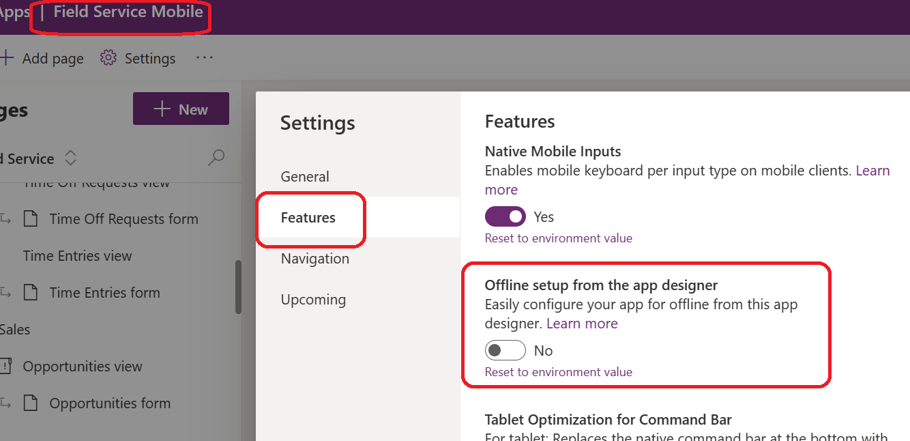

# Field Service Mobile (Preview) troubleshooting

[!INCLUDE[public-preview-banner](../includes/public-preview-banner.md)]

## The FSM Mobile App shows error on start due to permission/privilege issues 

### Prerequisites

Administrator permissions in Dynamics 365 Field Service (Preview).

### Symptoms

The FSM app fails to launch with an error similar to the following:

    Principal user (Id=<GUID>, …) is missing 'prvReadmsdyn_Mobile' privilege (Id=<GUID>) on OTC=<INT> for entity 'msdyn_mobilesource' …

### Resolution

The Public Preview of the new FSM Native UX requires a few additional privileges added to the Security Roles which the user belongs to. 
Please follow [these steps](flw-troubleshooting-mobile-custom-security-role-tsg.md) to resolve this issue.

## The FSM Mobile App shows error on start due to missing files in the solution

### Prerequisites

Administrator permissions in Dynamics 365 Field Service (Preview).

### Symptoms
One potential issue is that required Mobile Source records are missing. These records should be created upon solution installed. There might be some issues that these records didn't get created successfully or these records are deleted by users or corrupted.

### Resolution
To mitigate the issue, please recreate the missing records  by following [these steps](flw-troubleshooting-mobile-missing-files-tsg.md). 

## The Field Service Mobile App Module does not show the Settings area, so I can't enable the new Native experience

### Prerequisites

Administrator permissions in Dynamics 365 Field Service (Preview).

### Symptoms
The new Native Experience app setting toggle is available through a new "Settings" sitemap area shipped in the OOB FSM app module. Ths new "Settings" area is not visible in a custom app module.

### Resolution
Follow [these steps](flw-troubleshooting-mobile-missing-files-tsg.md) to enable the "Settings" sitemap area in your custom app module.

## The new Native expeience does not show up even if the "New experience" toggle in the Settings has been enabled

### Prerequisites

Administrator permissions in Dynamics 365 Field Service (Preview).

### Symptoms
The Field Service Mobile app does not load the new experience, even if it has been enabled in the App Module Settings according to [this doc](https://learn.microsoft.com/en-us/dynamics365/field-service/mobile-powerapp-newux-overview#enable-the-preview-features).

### Resolution
The new native expeience (preview) currently does not support users or app modules with offline enabled. Verify and correct the following cases:
1. The user used to log in into the FSM app should not be part of the Mobile Offline Profile.
2. The App Module itself should not be setup for offline. Turn of the following setting in the maker experience
    