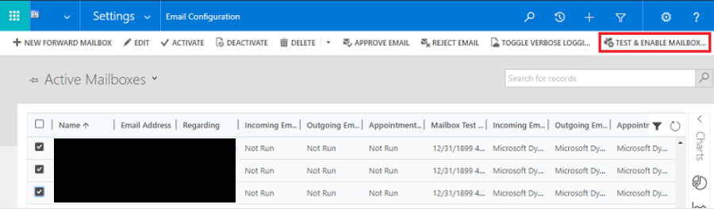
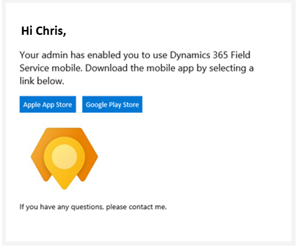

# Send frontline workers an email with a link to download Dynamics 365 Field Service mobile app

As a part of the [**Frontline Worker Set Up**](frontline-worker-set-up.md) process, admins can automatically send an email to their frontline workers with a link to download the Dynamics 365 Field Service mobile app. 

Field Service admins need approval from their global admins to send email to their frontline workers. In this article, we'll walk through the steps to get approval through Power Platform.

## Prerequisites 

- Your organization's global admin must have a Microsoft 365 [administrator account](https://www.microsoft.com/microsoft-365/business/office-365-administration?rtc=1). For more information, learn more about [admin permissions](https://docs.microsoft.com/microsoft-365/admin/add-users/about-admin-roles?view=o365-worldwide).

## Step 1: Add the approve email addresses privilege for system admins

Your organization's system admin requires the **Approve Email Addresses for Users or Queues** privilege in order to receive access to their Dynamics 365 mailbox. A global admin can assign the **Approve Email Addresses for Users or Queues** privilege to the **Security Role: System Admin**. 

To manually assign the **Approve Email Addresses for Users or Queues** privilege to the **Security Role: System Admin**:

1. In the [Power Platform admin Center](https://admin.powerplatform.com), select your organization's environment.

2. Select **Settings** > **Users + Permissions** > **Security roles**.

3. Select the **System Admin** security role, and then select the **Business Management** tab.

4. Under **Miscellaneous Privileges**, set the privilege level for **Approve Email Addresses for Users or Queues**.

> 

## Step 2: Approve mailboxes for system admins

1. In the [Power Platform admin center](https://admin.powerplatform.com), select your organization's environment.

2. Select **Settings** > **Email** > **Mailboxes**.

3. Select **Active Mailboxes**.

4. Select the mailboxes you want to approve, then **More Commands (…)** > **Approve Email** > **OK**.

5. Select **Test & Enable Mailbox** > **OK**.

> 

6. If **Outgoing Email Status** displays **Success**, your organization's system admin can now automatically send emails to their frontline workers with a link to download the Dynamics 365 Field Service mobile app. This capability is through the [Quick Set Up: Frontline Worker form](frontline-worker-set-up.md).

> 

