# Set up Frontline Workers in your Organization

Frontline workers in Dynamics 365 Field Service are individuals in your organization who are primarily scheduled for on-site jobs and uses Dynamics 365 Field Service mobile application for their work. Their quick setup in Dynamics 365 Field Service is critical to organizations in order to ensure they can immediately start fixing problems at customer locations and completing service calls. Therefore, admins can now use a **single form** to set up frontline workers in their organizations with all the required permissions that will allow their frontline workers to be promptly equipped to use the Dynamics 365 Field Service mobile application and instantanteously be scheduled for work orders. 

With a single form, admins can: 
1. Set up one or more frontline workers in their organization with the appropriate [characteristics (skills and certifications)](https://docs.microsoft.com/dynamics365/field-service/set-up-characteristics), [territories](https://docs.microsoft.com/dynamics365/field-service/set-up-territories), time zone, [security roles](https://docs.microsoft.com/dynamics365/field-service/view-user-accounts-security-roles), [field security profiles](https://docs.microsoft.com/dynamics365/field-service/view-user-accounts-security-roles), and [mobile offline profile](https://docs.microsoft.com/dynamics365/field-service/mobile-power-app-system-offline). 
2. View and/or update the defaulted security role, field security profile, and mobile offline profile that is set for their frontline workers, which controls the data their frontline workers can see and access. If appropriate, admins can choose to update these permissions or add any custom security roles, field security profiles, or mobile offline profile.
3. Automatically send an email to their frontline workers with a link to download the Dynamics 365 Field Service mobile application. 

After setting up one or more frontline workers, admins can:

4. View a list of all of their frontline workers, including their name, e-mail address, and home address. 
5. View and/or update the details of individual frontline workers on the Bookable Resource form, including their home address, security role, field security profile, and mobile offline profile. 

> [!NOTE]
 > Bing Maps has been enabled for new organizations - 1 click directions has been enabled for all frontline workers. See [Microsoft Privacy Statement](https://privacy.microsoft.com/privacystatement) for more information. 

## Prerequisites 
- Your organization's global admin or system admin sign in with their Microsoft 365 [administrator account](https://www.microsoft.com/microsoft-365/business/office-365-administration?rtc=1). For more information, learn more about [admin permissions](https://docs.microsoft.com/microsoft-365/admin/add-users/about-admin-roles?view=o365-worldwide).
- Each frontline worker must have a Dynamics 365 Field Service license assigned through the [Microsoft Admin Center](https://admin.microsoft.com). 

## Definitions 

**Frontline workers**: Individuals in your organization who are primarily scheduled for on-site jobs and uses Dynamics 365 Field Service mobile for their work.

**Characterisitics**: Defines a frontline worker's areas of expertise or certifications.

**Territories**: Defines a frontline worker's geographical regions, such as city, state, county, or postal code, to inform scheduling.

**Security Role**: Controls the types of data and record types a frontline worker can access and edit. This should be defaulted to **Field Service - Resource**.

**Field Security Profile**: Controls which fields a frontline worker sees for a record type. This should be defaulted to **Field Service - Resource**.

**Mobile Offline Profile**: Controls what data is downloaded to the Dynamics 365 Field Service mobile application in offline mode. Unpublished profiles will not appear until published. This should be defaulted to **Field Service Mobile - Offline Profile**. 

## Get started 

1. On the **Home** tab or **Get Started** tab, admins can set up their frontline workers in their organization.

> 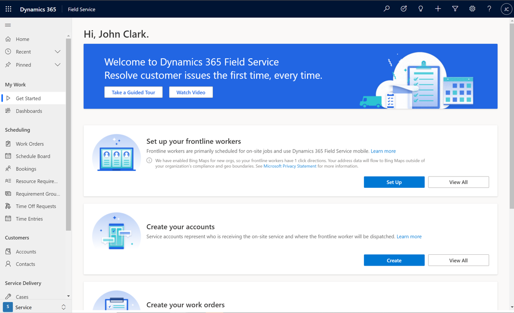

## Use the form 

1. On the **Set up your frontline workers** section, select **Set Up**. 

> 

2. The **Quick Set Up: Frontline Workers** form will appear. 

> 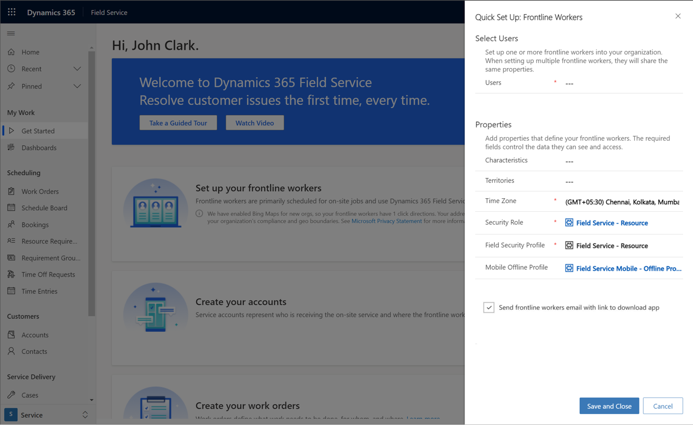

3. In the **Users** section, admins can type in and select **one or more frontline workers** in their organizations. 

 > [!NOTE]
 > If setting up multiple frontline workers on this form, all of them will have the properties, such as Characterisitics, Territories, Time Zone, Security Role, Field Security Profile, and Mobile Offline Profile. This allows the ability to group your frontline workers by these properties. 

> 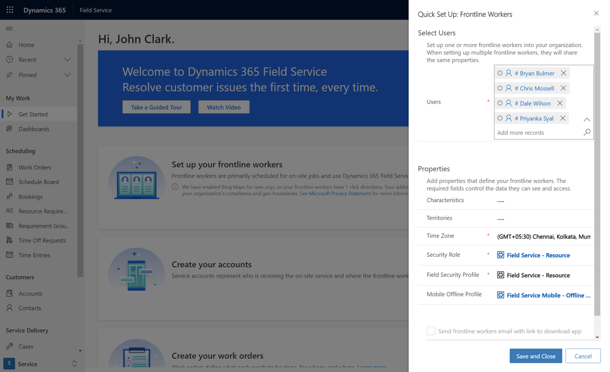

4. Type and select the **Characterisitcs** that your frontline workers has. This is an optional field. 

> 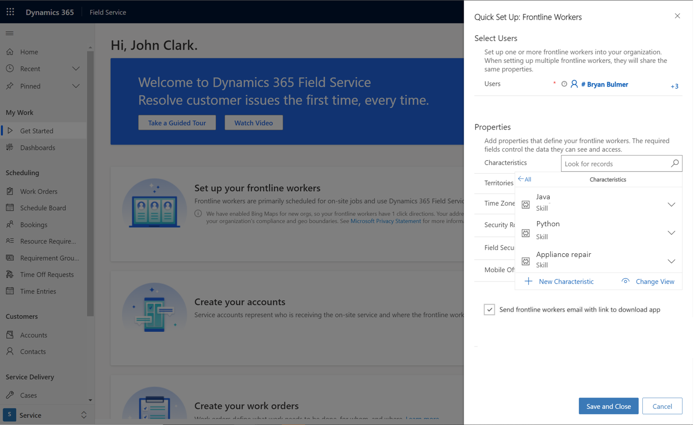

4a. If the **Characterisitcs** does not exist, select the drop down and select **+ New Characterisitcs**. A new form will appear and admins can define and create a new Characterisitcs for their frontline workers. Admins **will not** lose their work on the Quick Set Up: Frontline Workers form.

5. Type and select the **Territories** that your frontline workers has. This is an optional field. 

> 

5a. If the **Territories** does not exist, select the drop down and select **+ New Territories**. A pop-up form will appear and admins must leave the current form to create new Territories for their frontline workers. Admins **will** lose their work on the Quick Set Up: Frontline Workers form. Learn more about [setting up territories without this form](https://docs.microsoft.com/dynamics365/field-service/set-up-territories).

6. View or update the defaulted **Time Zone** for your frontline workers.

7. View or update the defaulted **Security Role** for your frontline workers. Admins may add multiple security roles, including any custom security roles, to this field. This is a required field. 

> 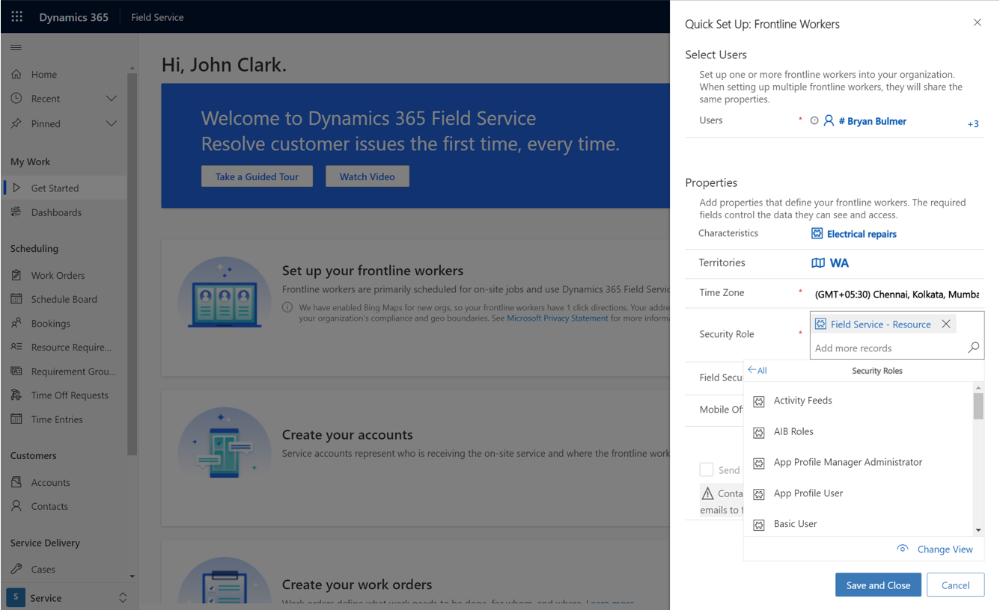

8. View or update the defaulted **Field Security Profile** for your frontline workers. Admins may add multiple field security profiles, including any custom field security profiles, to this field. This is a required field. 

> [!NOTE]
> In order to view, all of the Field Security Profiles in the dropdown, select the **Search icon** > **Change View** > **Only my records checkbox** > **Back button**.

> 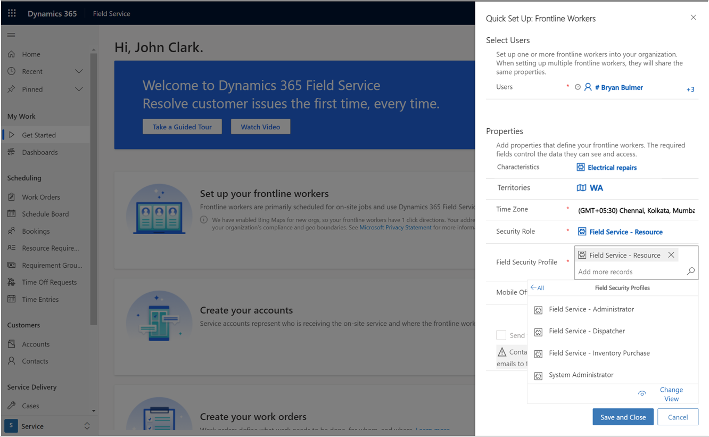

9. View or update the defaulted **Mobile Offline Profile** for your frontline workers. Admins can only add **one** mobile offline profile, including any custom mobile offline profile, to this field. This is a required field. 

 > [!NOTE]
 > Unpublished mobile offline profiles will not appear until published; [learn more here](https://docs.microsoft.com/dynamics365/field-service/mobile-power-app-system-offline).

> 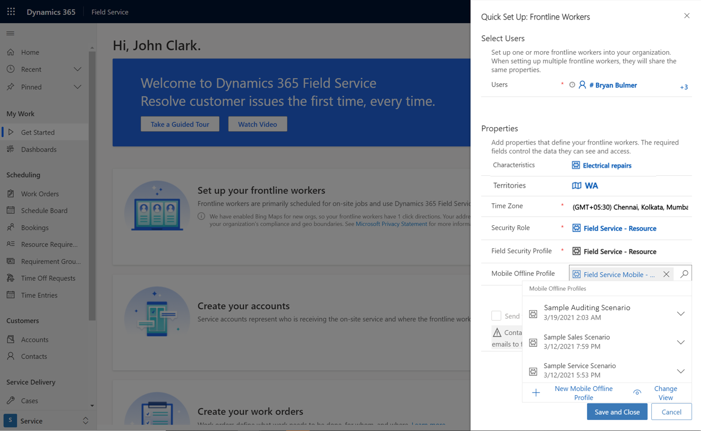

10. Automatically send an email to their frontline workers with a link to download the Dynamics 365 Field Service mobile application.

> 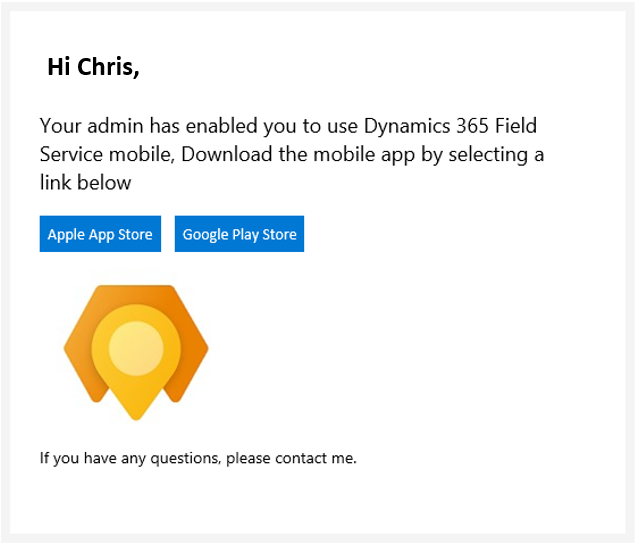

 > [!NOTE]
 > Admins cannot send an email to their frontline workers, if they do not have their mailbox approved by the global admin; learn more [here](frontline-worker-set-up-email-approval.md).
 > 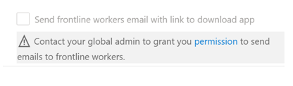.

## View a list of all frontline workers 

1. On the **Home** or **Get Started** page > **Set up your frontline workers** section, select **View All**.

> 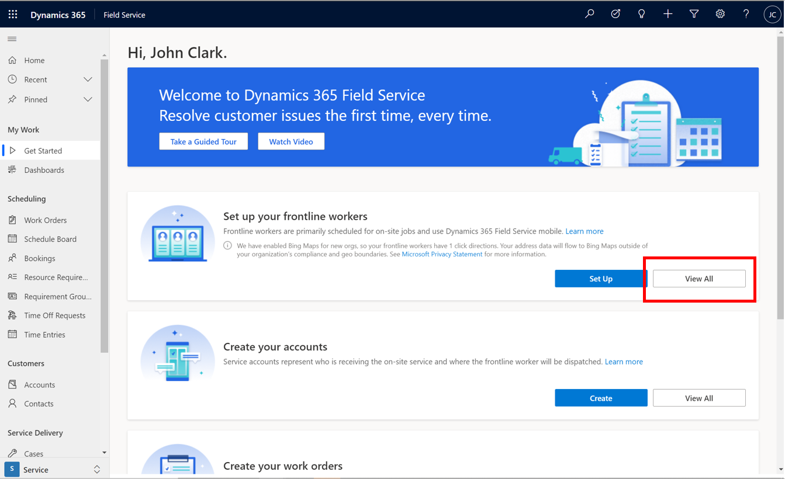

2. View a list of all of their frontline workers, including their name, e-mail address, and home address. 

> 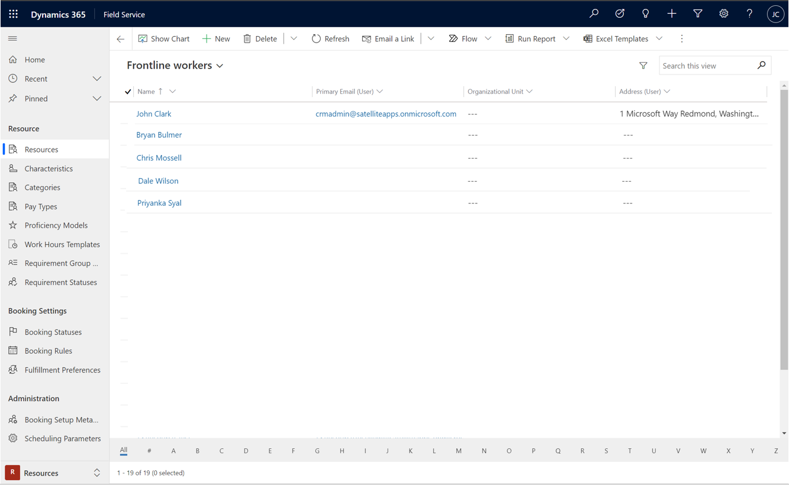

## View and update the details of individual frontline workers 

1. After selecting an individual from the **List View** of all frontline workers, admins can see the details of this worker on the Bookable Resource form. 

> 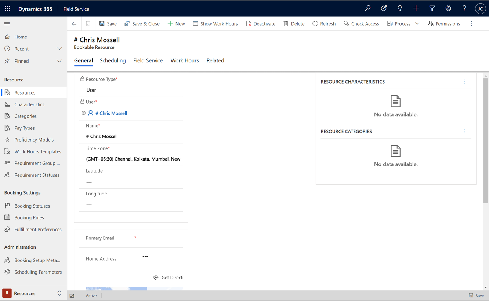

2. On the **General** tab, admins can view and/or update this worker's e-mail adress, home address, and more. 

> 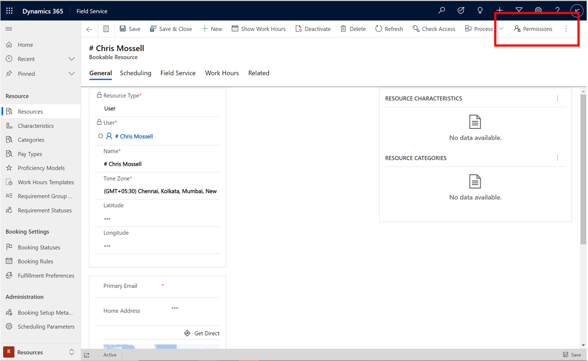

3. After selecting the **Permissions** button on the top of the Bookable Resource page, admins can view and/or update this worker's permissions, such as security role, field security role, and mobile offline profile. 

> 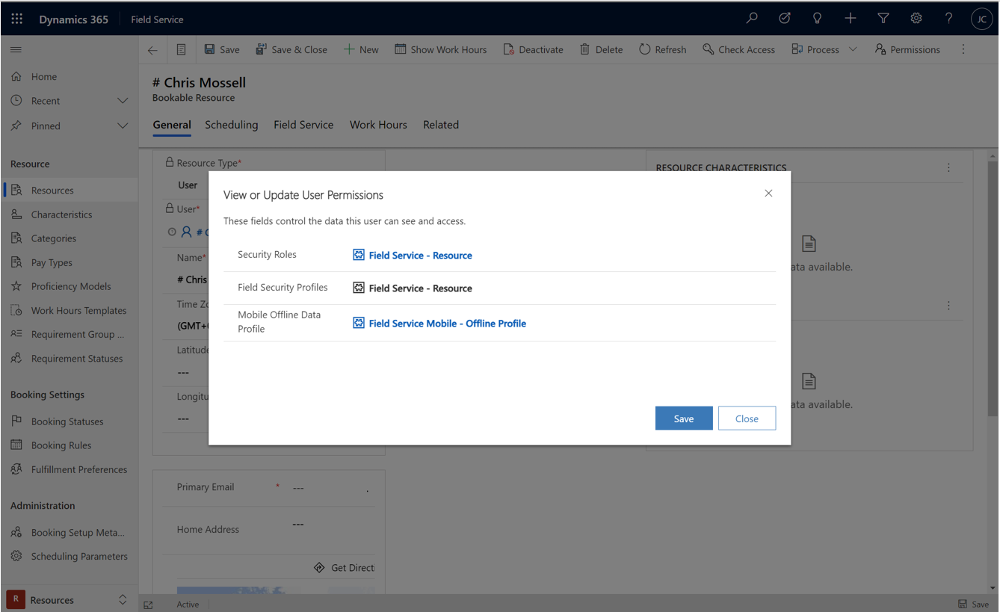
