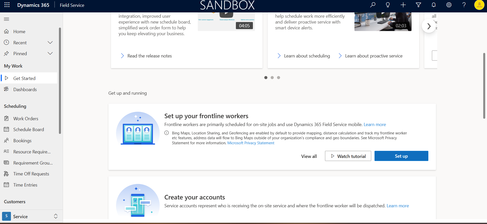
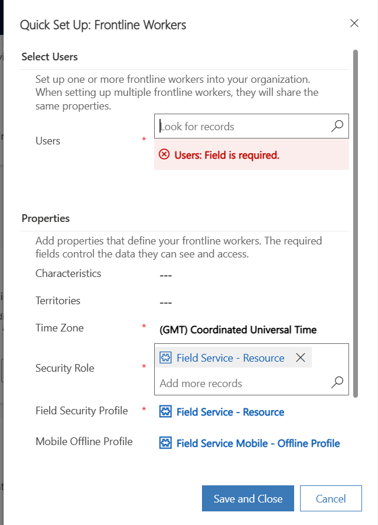
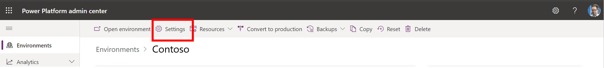
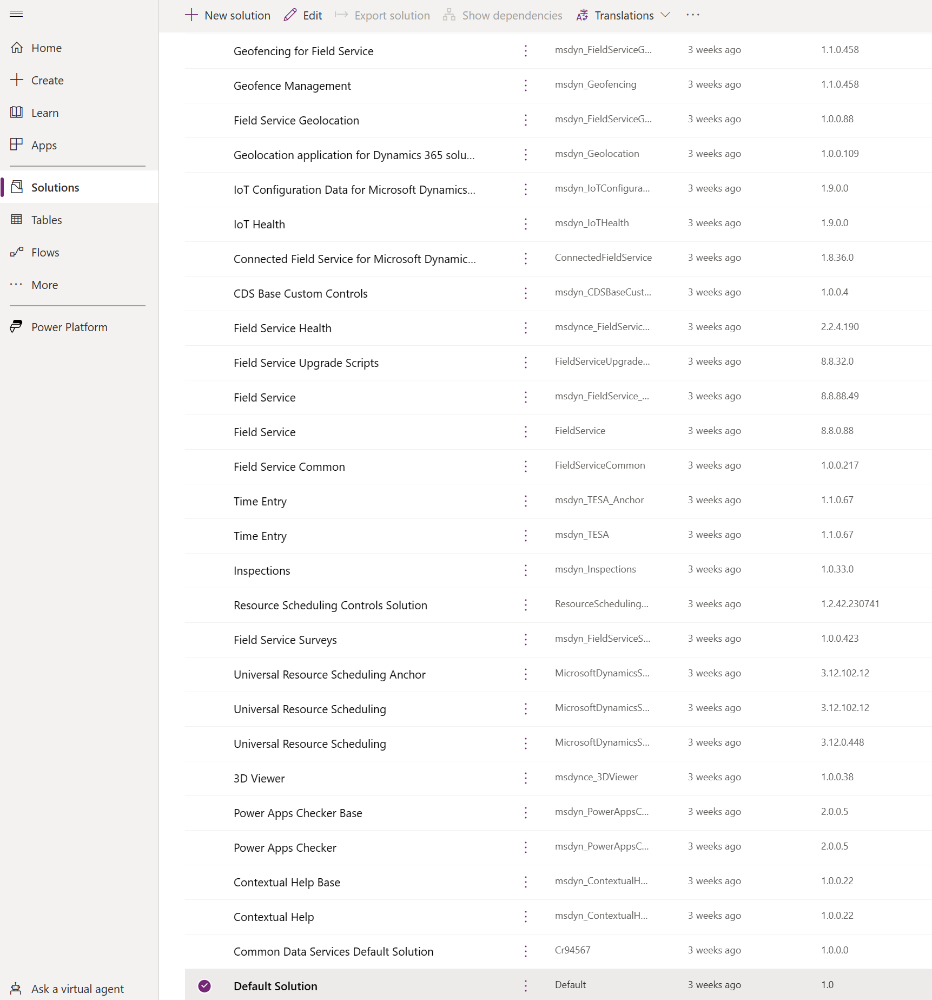

# Set up user permissions

- Advise to use Field Service Administrator or one with Time Promised To/From enabled

## Set up Dataverse security roles

### From Field Service

1. Go to the Field Service **Get Started** page.

1. Under **Set up your frontline workers**, select **Set up**.

    

1. For each user, select the user and assign a **Security Role** and **Field Security Profile**.

   

1. Select **Save and Close**.

### From Power Platform Admin Center

1. Sign into the Power Platform Admin Center.
    - https://admin.powerplatform.microsoft.com
    - https://admin.preprod.powerplatform.microsoft.com (if the environment is a pre-production environment)
1. Select your environment.
1. Select Settings.

    

1. Select Users + permissions > Users.

    

1. Find and select your user's name. This takes you to a new page.
1. Select Manage roles.

    

1. Select the appropriate role for your user > OK. View the roles and definitions to learn which one to choose.

    

1. Select the > next to your user's name and then select Field Security Profiles.

    

1. Select Add.

    

1. Select the appropriate role for your user > Select > Add. View the roles and definitions to learn which one to choose.

    

[Read more about user setup in Field Service](https://learn.microsoft.com/en-us/dynamics365/field-service/view-user-accounts-security-roles)

## Sync AAD groups and Dataverse Security Roles

This is needed to ensure your permissions are set up properly, so the right people can view the cards in Viva Connections. Note that if these aren't set, users won't be able to see the cards in Viva Connections. By default, users in Outlook will see the frontline manager card, even though they may be unable to perform all the actions.

1. Go to M365 Admin Center
1. Set up the groups you'd like to have
1. Go to D365 Field Service
1. Assign the AAD group to the Dataverse Security Role you would like

You can also view the current Security Roles by going to Power Platform Admin Center --> Environments --> Access --> Users
- https://admin.powerplatform.microsoft.com
- https://admin.preprod.powerplatform.microsoft.com (if the environment is a pre-production environment)

This tutorial can help automate this process: [Assigned a security role to an AAD group](https://learn.microsoft.com/en-us/power-apps/developer/data-platform/aad-group-team#assign-a-security-role-to-an-aad-group-team)

## Column Level Security

At times, some of the permissions of a user are inadequate to view or create work orders. While you can grant the user an elevated security role, another option is to change the [column-level security](https://learn.microsoft.com/en-us/power-platform/admin/field-level-security) of the respective security role.

1. Go to make.powerapps.com and log in as an administrator
1. Change the environment by clicking the top bar

    

1. Click on **Solutions** on the left nav bar
1. Find the **Default Solution**

    

1. Click on **Column security profiles**

    

1. Edit the column level profile for the desired Security Role.

## Known Issues

With the out-of-box Field Service solution, one known instance of this is the following:

- To give dispatchers the ability to create work orders, the Column Level Security for the **Field Service - Dispatcher** role needs the Create permission for 
    - Time Promised (from)
    - Time Promised (to)
