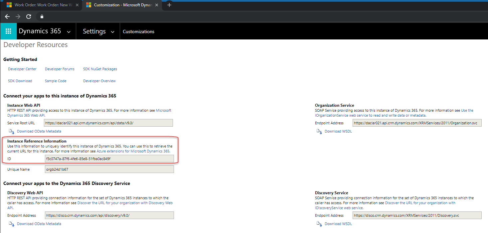

# How do I extend my Woodford trial?

If you need to extend your trial for the Woodford solution, you need to submit a new activation request. To speed up this process, fill out [this form](https://aka.ms/fsmlicense) to request the activation.

## What you need to know before you submit an activation request
There are a few important details to know before you submit a request to activate [!include[Dynamics 365 Field Service](../includes/pn-dyn-365-field-service.md)] mobile licenses:

- You need Microsoft 365 global admin privileges to manage licenses for a Dynamics 365 organization.

- Field service mobile licenses are allocated to one organization at a time, based on the organization ID.

- Each [!include[Dynamics 365 Field Service](../includes/pn-dyn-365-field-service.md)] license you purchase from Microsoft allows you to assign one mobile license per user, with the total number of mobile users allocated across all your production, sandbox, and trial organizations not to exceed the total number of licenses you purchased. 

    For example, if you purchase 100 field service licenses and you manage one production organization and one sandbox, you could assign mobile licenses to 50 users at both organizations for a maximum total of 100 mobile users (not 100 mobile users at *each* organization for a total of 200).

- A 30-day trial automatically starts when you install the Woodford solution in your Dynamics 365 instance. Submit the request to activate the licenses before the trial period ends. Additionally, if you want to maintain access to the field service mobile app beyond the 30-day trial, you need to submit a request extend the licenses. 

  To find out your trial end date, go to **Settings** > **Woodford** > **MobileCRM Woodford**. You'll see the trial end date at the top of the screen.

  >   

- If you make any updates or do any work that changes the organization ID, you need to submit a new request to activate the mobile licenses for the organization.

## Fill out an activation request form

[Fill out a Field Service mobile license activation request form](https://aka.ms/fsmlicense) to activate licenses or extend licenses beyond a 30-day trial.

You need the Dynamics 365 organization ID to complete the request form.

## Where to find the organization ID

 1. Sign in to the Dynamics 365 organization.
 2. Go to **Settings** > **Customizations** > **Developer Resources**.
 3. In the **Instance Reference Information** section, locate the ID.
        
  >   

[!INCLUDE[footer-include](../includes/footer-banner.md)]