# Geofencing for Field Service Mobile (Xamarin)

A geofence is a virtual perimeter around a specific location. Geofencing allows users to draw zones around places of work, customer sites, and secure areas. You can configure the system to trigger various actions when geofences are crossed by a person or an equipped vehicle.

In Dynamics 365 Field Service, the default use case for geofencing is to create a circular geofence around a work order's location and compare this to the changing location of field technicians as measured by their mobile devices running the Field Service Mobile app. When a work order geofence is crossed or "broken" by a field technician, a **geofence event** record is created and the geofence status is changed from **outside** to **inside**, indicating the field technician is inside the geofence. Another geofence event is created as the field technician leaves the geofenced area. Based on entering or leaving a geofenced area, a mobile push notification or custom workflow can be triggered.

In this article, we will look at how to configure and use geofences by exploring:

- setting distance radius
- enabling and testing field technician location tracking 
- booking a work order to automatically create a geofence around it 
- testing crossing the geofence, and triggering push notifications as field technicians enter and leave geofenced areas 

## Prerequisites

- **Field Service v8.3+**. Geofence solutions are included as part of the Field Service v8.3 upgrade. In order to use mobile push notifications with geofencing, ensure the [Mobile Configuration Tool (Woodford solution)](https://docs.microsoft.com/dynamics365/customer-engagement/field-service/install-field-service#install-the-field-service-mobile-configuration-tool) is installed in your environment before upgrading to v8.3.

- **Field Service Mobile v11.2+**

- [Connect to Bing Maps](https://docs.microsoft.com/dynamics365/customer-engagement/field-service/perform-initial-configurations-setup#step-1-resource-scheduling) in order to connect your Dynamics 365 environment to Bing Maps in order to locate service accounts and work orders to later place geofences around them.
   
- [Set auto geo code addresses to **yes**](https://docs.microsoft.com/dynamics365/customer-engagement/field-service/perform-initial-configurations-setup#step-2-field-service-settings) in order to automatically geo code accounts and work orders when addresses are entered. Geo coding an account or work order record populates latitude and longitude values, which are required to place geofences around them.

## Step 1. Verify geofence solutions are installed

Go to **Settings > Solutions** and make sure the three following geofence solutions are there:

- **Geofence Alerts**
- **Geofence Management**
- **Geofence for Field Service**

> [!div class="mx-imgBorder"]
> 

## Step 2. Activate geofence processes

Go to **Settings > Processes** and **Activate** the following processes. These processes are installed in a draft state with the geofence solutions:

- DeleteGeofenceWhenBookingIsCompletedOrCanceled
- GenerateGeofenceWhenBookingIsCreated
- Update Resource Location from Resco Audit

> [!div class="mx-imgBorder"]
> 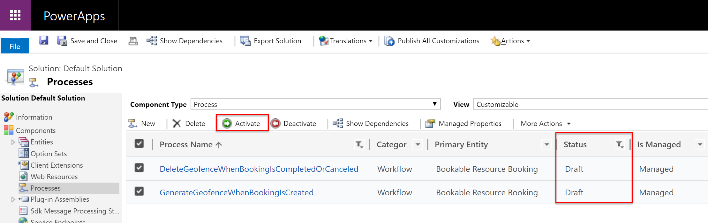

## Step 3. Enable location auditing for the Field Service Mobile app

Go to **Settings > Woodford > MobileCRM Woodford HTML5**.

Enter the mobile project that holds your Field Service Mobile customizations. 

> [!div class="mx-imgBorder"]
> 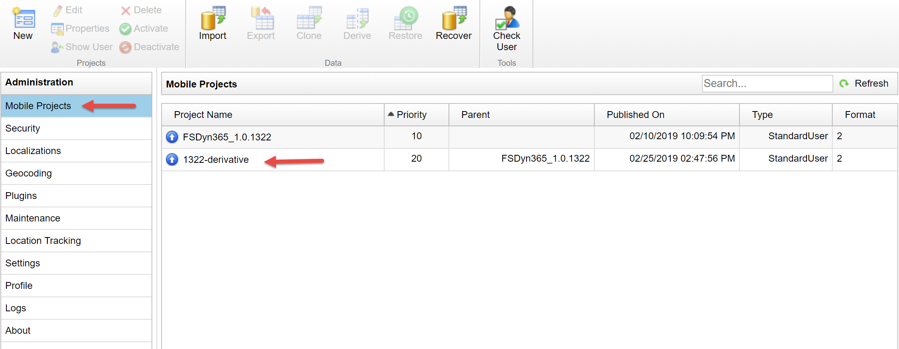

> [!Note]
> We recommend importing and deriving a mobile project template, and making customizations in the child derivation. The latest mobile project template can be downloaded at [https://aka.ms/fsmobile-project](https://aka.ms/fsmobile-project).  

Next, go to the **Auditing** section of the project. Here you can choose which actions taken on the Field Service Mobile app are recorded, and if that action should send related location data to the server. 

Be sure the following three boxes are checked: 

- **Enable Auditing** 
- **Include GPS Position** 
- **Log synchronization event**. 

> [!div class="mx-imgBorder"]
> 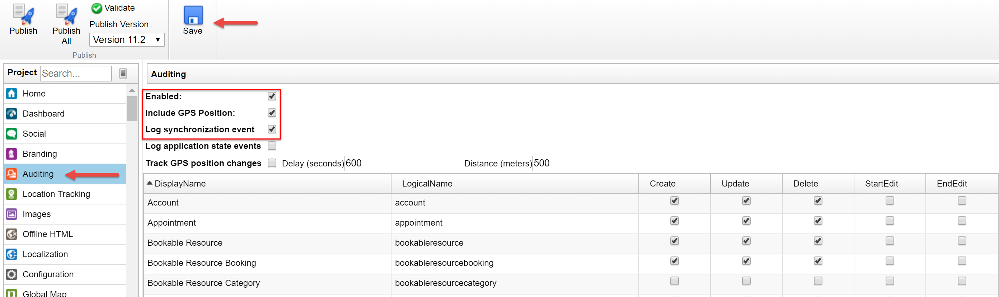

More specific auditing can be configured based on your business needs. You can track the application’s state events--whether the application is running, terminated, paused (put to background), or resumed (put back to foreground). If you want to audit the movement, you can use the track GPS position changes, where you can set the delay and distance of the GPS position. If the device moves for the defined distance after the set time interval expires, the position is recorded. 
 
## Step 4. Enable background location tracking 

1. Go to the **Location Tracking** section of the project. 
2. Select **Enable background GPS monitoring**  

> [!div class="mx-imgBorder"]
> 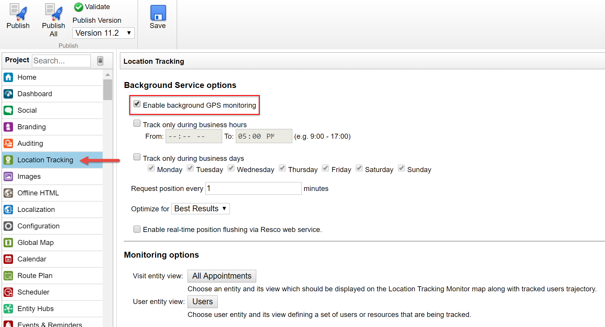

This allows a technician's location data stream to be sent to Dynamics 365 Field Service, which surfaces a technician’s location on the schedule board.

3. Choose **I Confirm this Organization has the appropriate license**. Location tracking does not require an additional license and is included with Field Service Mobile.

> [!div class="mx-imgBorder"]
> 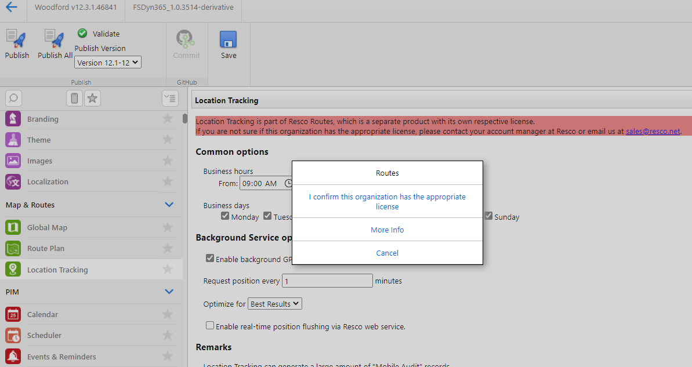

4. Deselect **Enable real-time position flushing via Resco web service**.

## Step 5. Test location auditing

After enabling location auditing and background location tracking, you should test the location data stream. 

First, log into the Field Service Mobile application and synchronize data.

> [!div class="mx-imgBorder"]
> 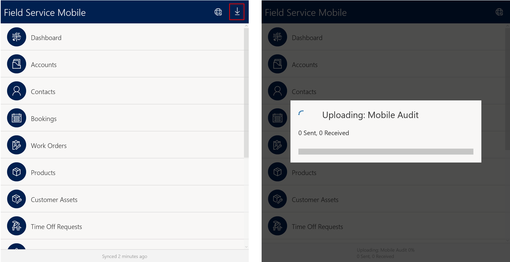

As configured in the mobile project in previous steps, synchronizing the mobile application is geo-audited.
> [!div class="mx-imgBorder"]
> 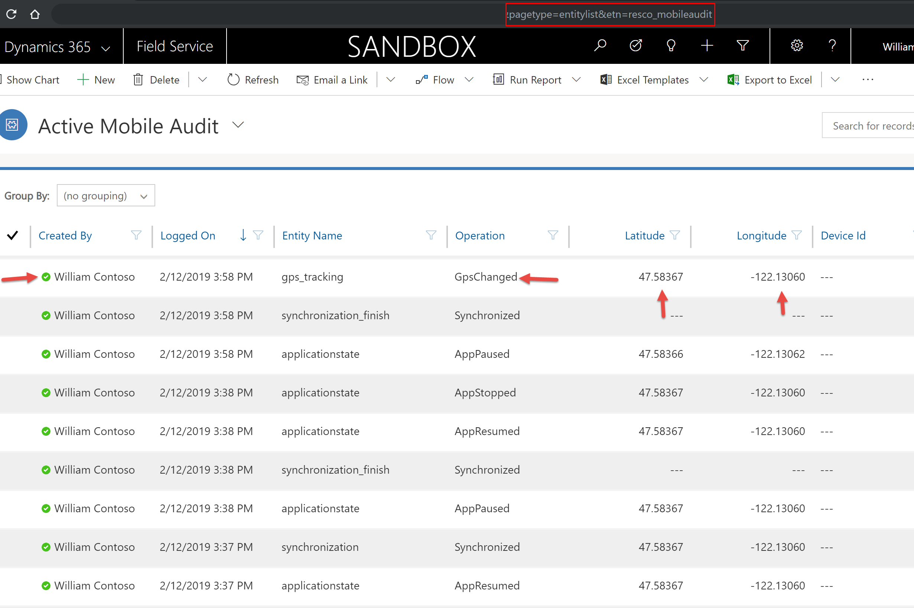

Back in Dynamics 365, go to the mobile audit table (**Settings > Mobile Auditing > Mobile Auditing Records**) to confirm the synchronization event, along with the user and the **latitude** and **longitude** values of the event are recorded.

If the signed-in mobile app user is related to a bookable resource, the most recent latitude and longitude coordinates will populate on the bookable resource record. 
> [!div class="mx-imgBorder"]
> 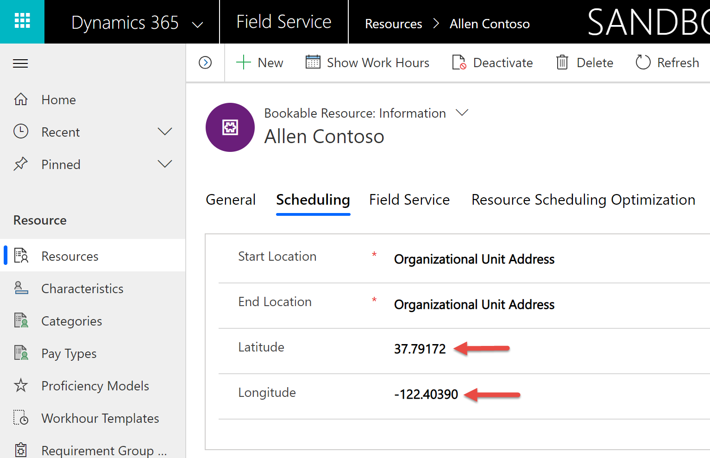

> [!Note]
> You may need to add the latitude and longitude fields to the bookable resource form.

Additionally, the bookable resource's current location will appear on the schedule board map. Select the map pin icon next to the bookable resource's name and the map will display the location with a different icon. 

> [!div class="mx-imgBorder"]
> 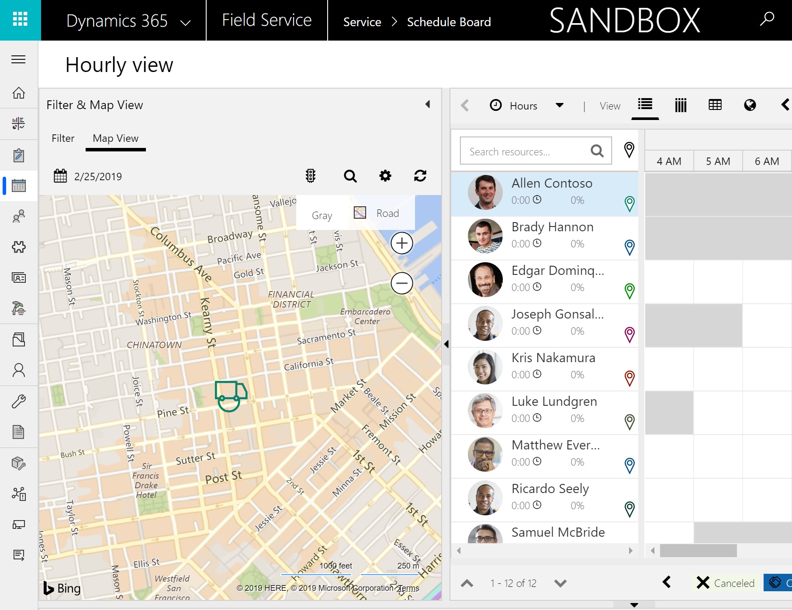

> [!Note]
> Dispatchers can use current locations for schedule assistant travel time calculations by selecting **Real time mode** in the schedule assistant filter pane. 

> [!div class="mx-imgBorder"]
> 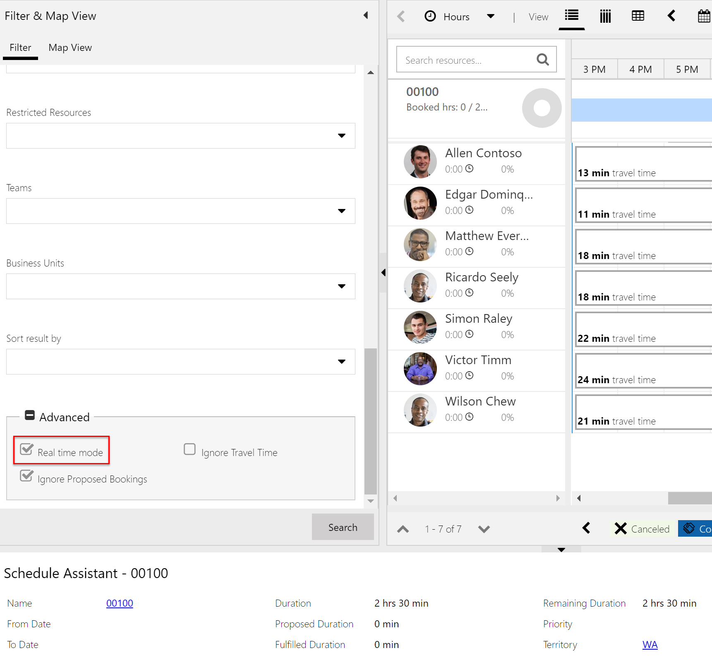

## Step 6. Configure geofencing settings

Go to **Field Service > Settings > Geofencing Settings**.

Enter a **unit of measure** and **minimum radius**. As demonstrated in the following screenshot, the smallest geofence we can create is a circle around a service account, with a radius of 25.59 feet.

> [!div class="mx-imgBorder"]
> 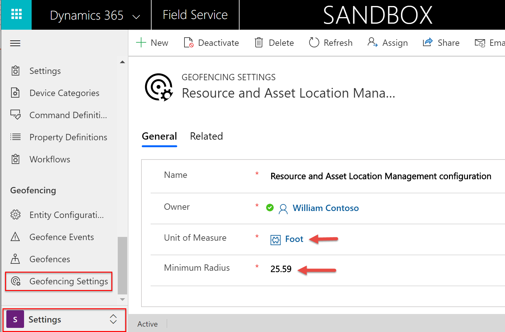

## Step 7. Configure geofence entities

Go to **Field Service > Settings > Entity Configurations**.

Then select the account configuration, included by default with the geofence solutions.

> [!div class="mx-imgBorder"]
> 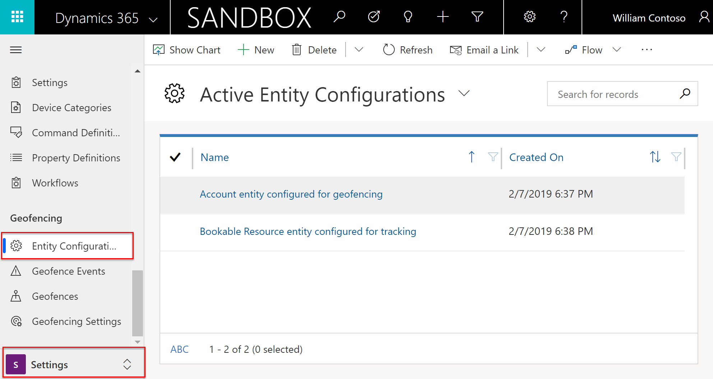

Enter the following information:

- **Entity:** Select **Account** because work order locations are inherited from the related service account. 

- **Latitude / Longitude:** Choose the latitude and longitude fields on the account entity that hold the geo coded location;  this will determine the center of the geofence.

- **Enabled As:** Select **Geofence** because the account serves as a static location that a geofence will surround.

- **Default Radius:** Enter a number to represent the radius of the geofence around the latitude and longitude of the account location. The unit of measure will be the unit chosen in the geofence settings in the previous step. In this example, the default radius is 328.08399 feet.
   
> [!div class="mx-imgBorder"]
> 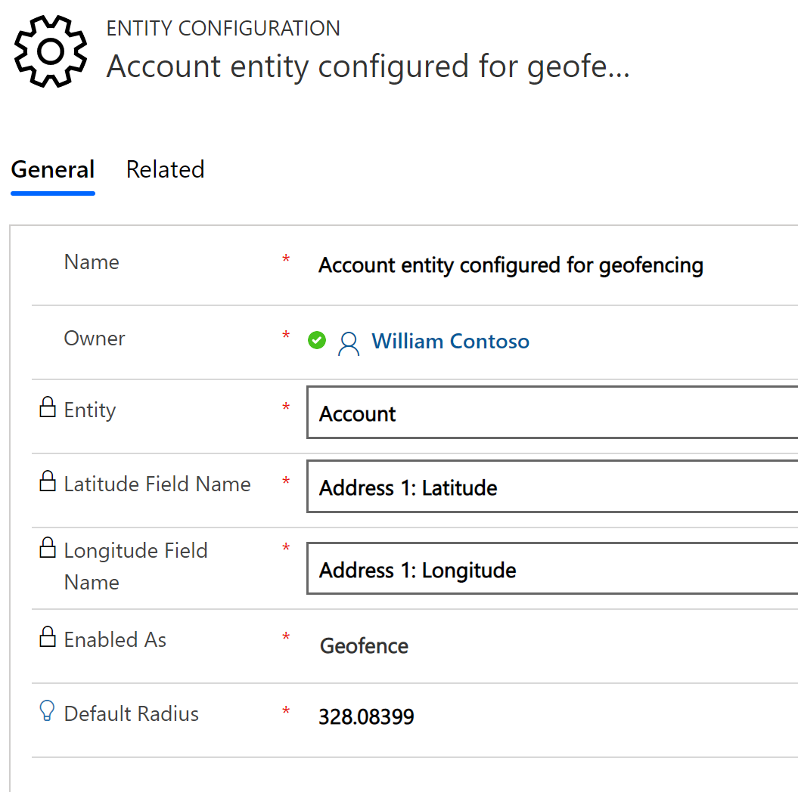
 
Next, go to the bookable resource configuration and enter the following: 

- **Entity:** Select **Bookable Resource** to compare the location of field technicians relative to work orders and service accounts. 

- **Latitude / Longitude:** Choose the latitude and longitude fields on the bookable resource entity that hold the most recent coordinates of the location.

- **Enabled As:** Select **Geotracked** because the bookable resource has a variable location that is compared against defined geofences.

> [!div class="mx-imgBorder"]
> 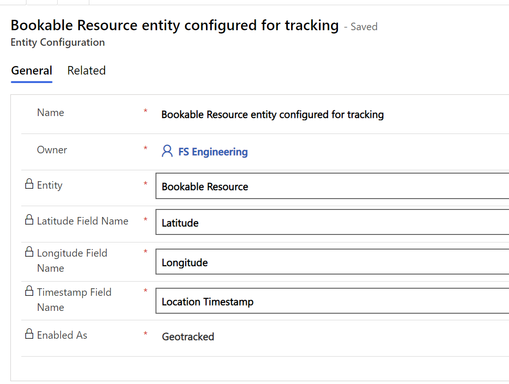

## Step 8. Book a work order 

Next, book a work order using your preferred method. In this example, a work order is manually dragged and dropped to a field technician bookable resource. As a reminder, this resource has been designated as a **User** type, and has access to the Field Service Mobile app. 

> [!div class="mx-imgBorder"]
> 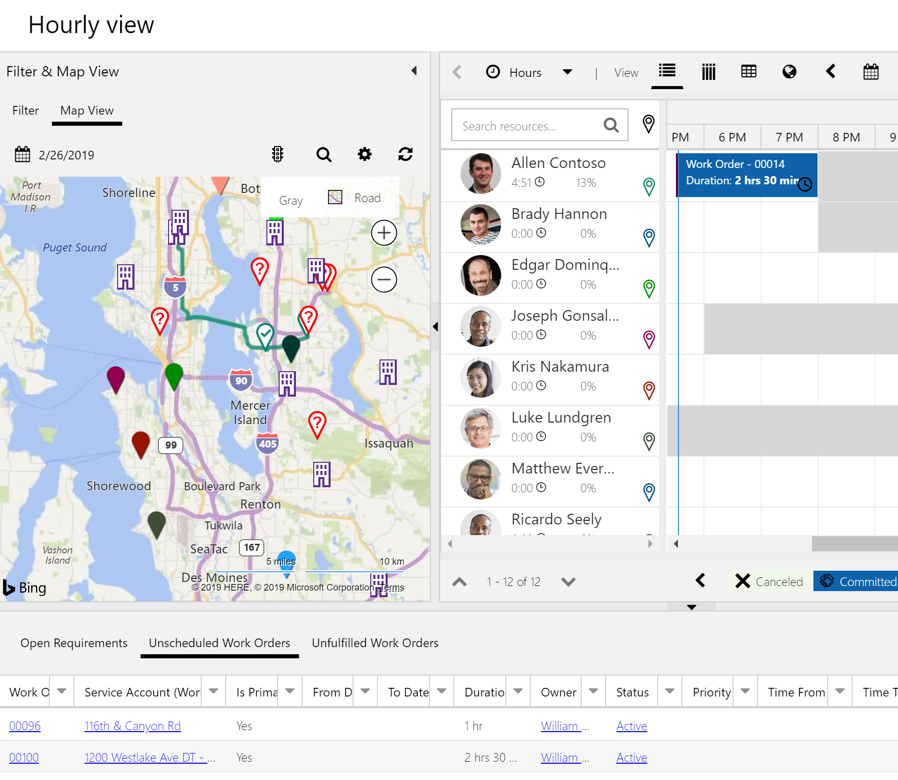

Booking a work order will trigger an asynchronous workflow that creates a geofence as long as the appropriate process was activated in earlier steps.

Go to **Field Service > Settings > Geofences** to view the newly created geofence.

> [!div class="mx-imgBorder"]
> 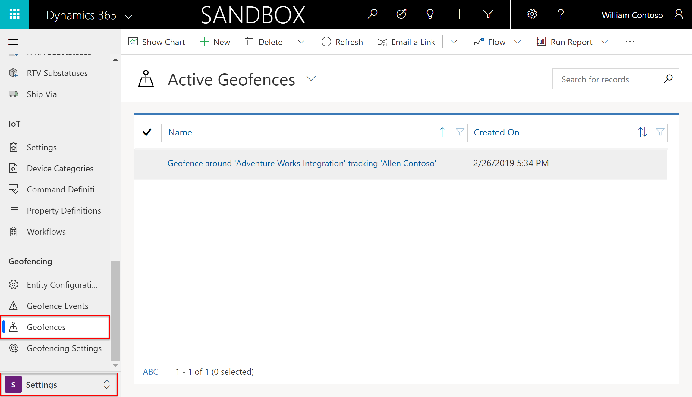

The **Geotracked Record Status** is set to **Outside**, meaning the bookable resource is outside of the geofence area.

> [!div class="mx-imgBorder"]
> 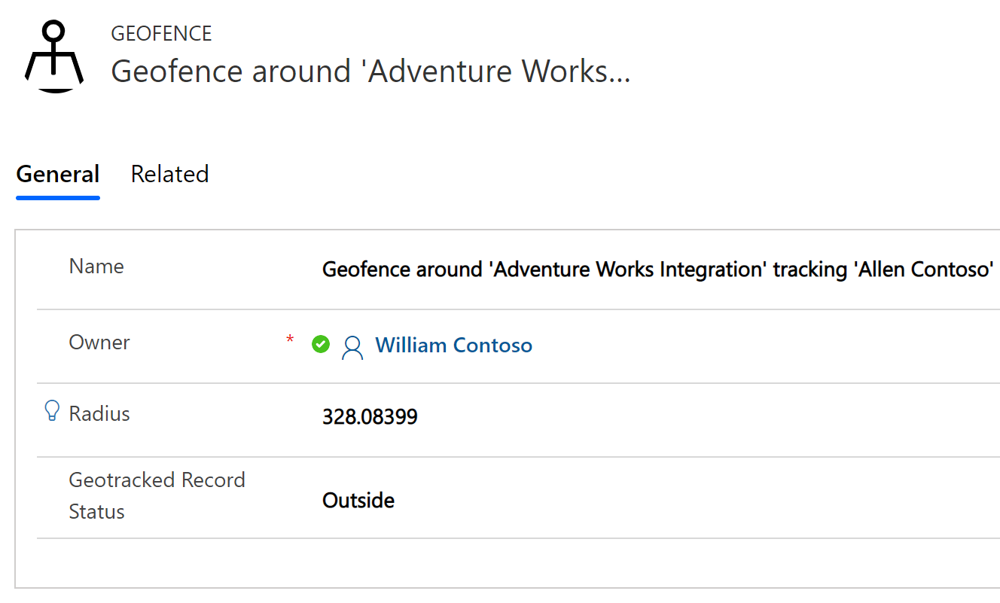

## Step 9. Test a geofence event

Finally, we can test "breaking" a geofence, meaning a bookable resource travels inside the geofenced area.  

This is typically done two ways.   

The first way is to travel within the geofenced area and sign in and synchronize the Field Service Mobile application. 

> [!div class="mx-imgBorder"]
> 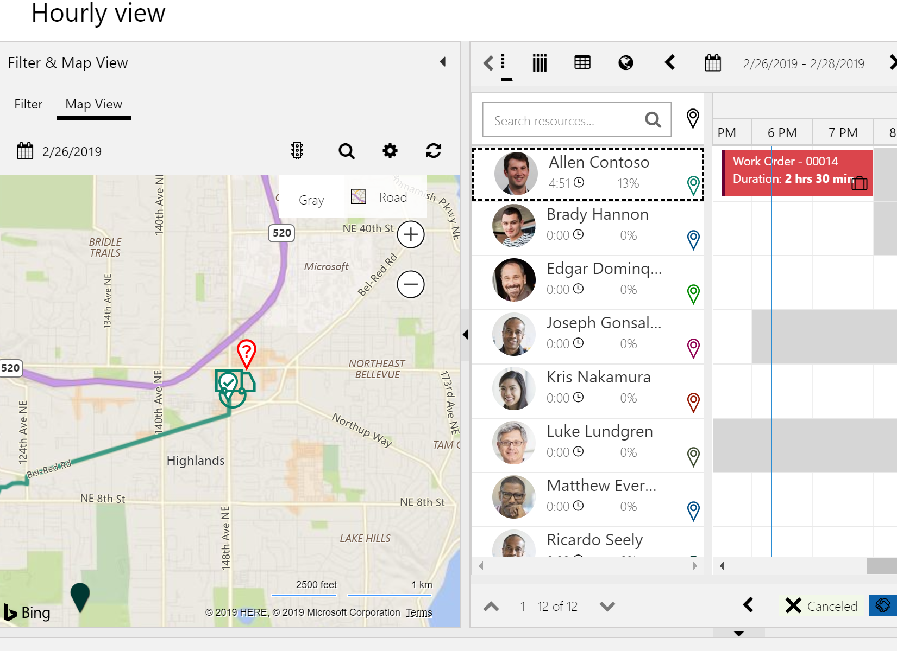

The second way is for testing and development purposes; it simulates traveling within the geofenced area by using administrator security to manually enter latitude and longitude values in the mobile audit table and the bookable resource record.

> [!div class="mx-imgBorder"]
> 

> [!Note]
> You can enable editable grids for the mobile audit entity to override the latitude and longitude values. You can access the mobile audit table by going to a list view for another entity in the Unified Client Interface (UCI) and manually entering **resco_mobileaudit** in the URL.

Confirm the latitude and longitude on the bookable resource record is updated as well, and if not, manually adjust them with administrator security.

Either way, the synchronized coordinates will be within the geofenced area and trigger a **Geofence Event**.

> [!div class="mx-imgBorder"]
> 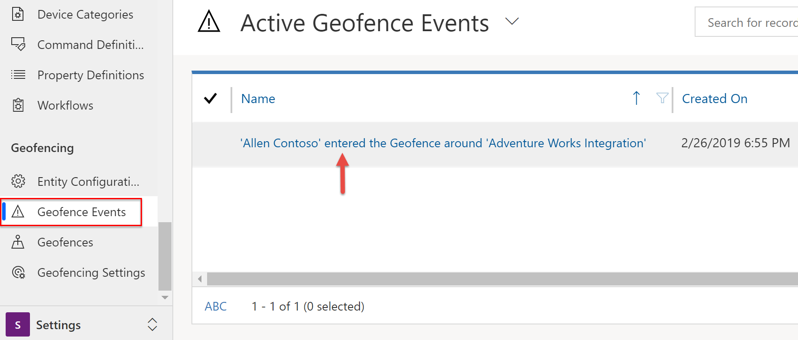

Additionally, this will change the related geofence **Geotracked Record Status** to **Inside**.

> [!div class="mx-imgBorder"]
> 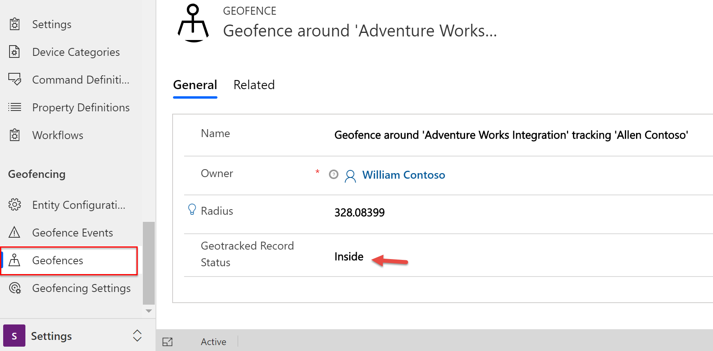

## Use push notifications with geofencing

If you would like the bookable resource to receive push notifications to change the booking status as they enter and leaves a geofence (in other words, when a geofence event record is created), configure push notifications and activate the processes included in the Geofence Alerts solution.

First, configure push notifications for Field Service Mobile by going to the article on [push notifications](./mobile-push-notifications.md).

Next, go to **Settings > Processes** and activate the following processes: 

1. *Remind to change status upon arrival*
2. *Remind to change status upon leaving*

> [!div class="mx-imgBorder"]
> 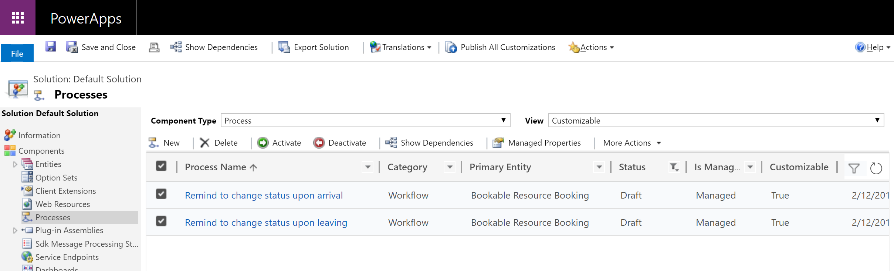

## Configuration considerations
- Custom geofences using entities other than accounts and bookable resources are supported; however only the mobile audit table (resco_mobileaudit) can be used to track variable locations at this time.
- You can configure how far back in time a geo-location is valid. This is important for scenarios when a bookable resource synchronizes a geo-location to the server and then loses internet connection, making dispatchers unaware of the true location. The time threshold can be configured in **Resource Scheduling > Settings > Scheduling Parameter > Geo Data > Geo Location Expires After X Minutes**.

> [!div class="mx-imgBorder"]
> 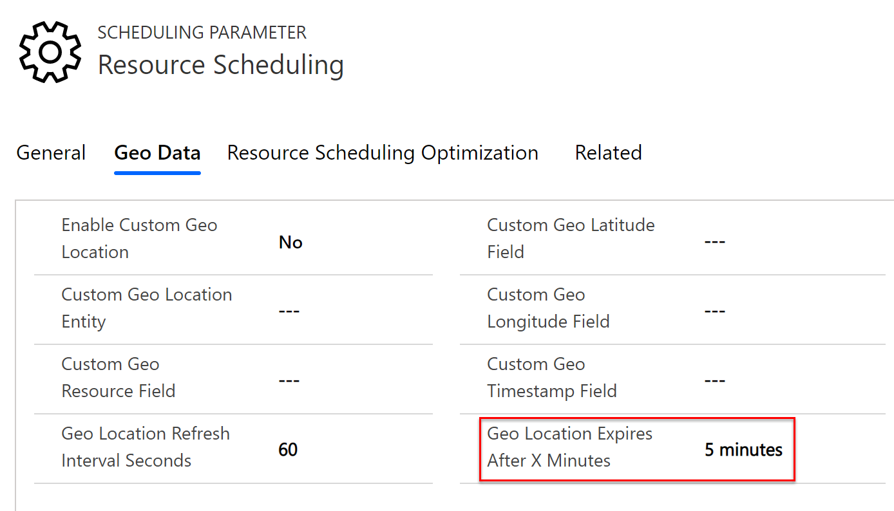
  
## Additional notes
- Currently only circular-shaped geofences are supported.
- In order to synchronize location data with the server, Field Service Mobile app users (field technicians) will need to consent to sharing GPS data. A message will appear after a geofence is active. 

