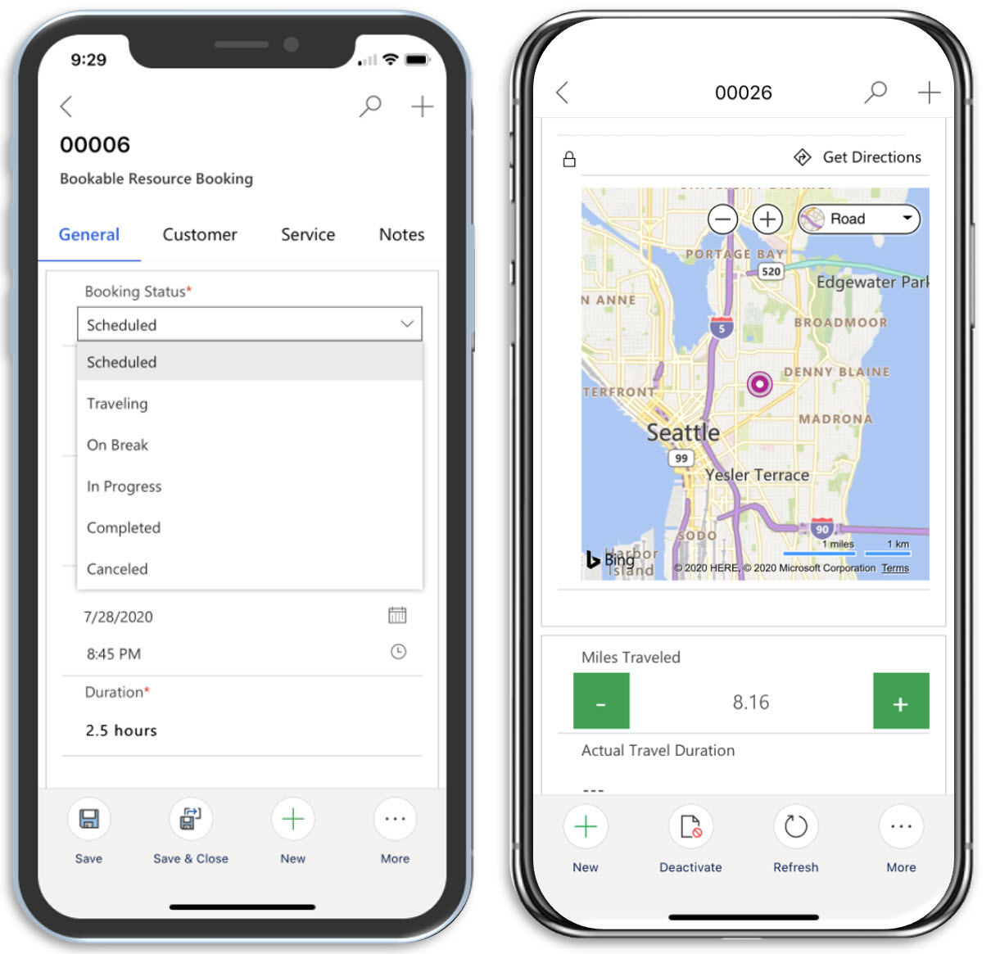
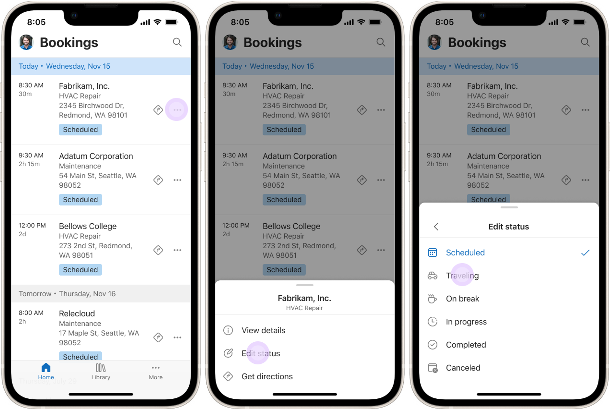
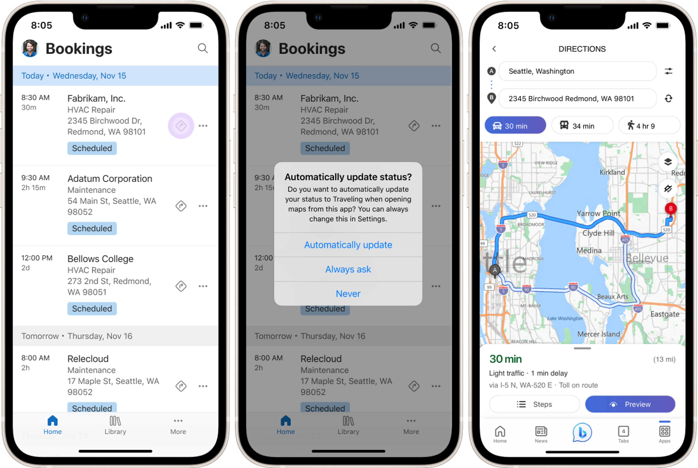
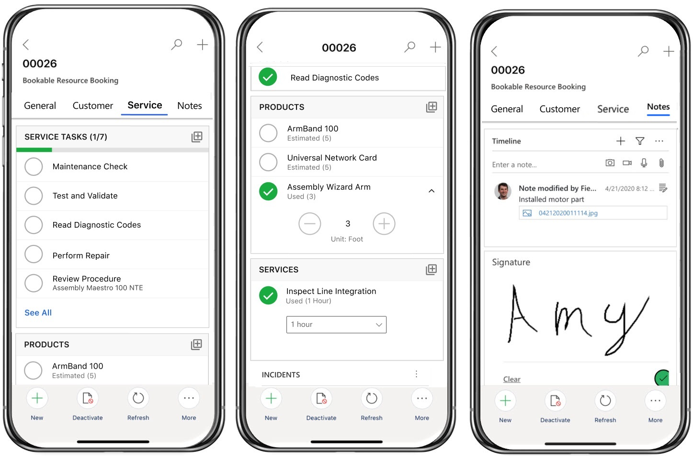
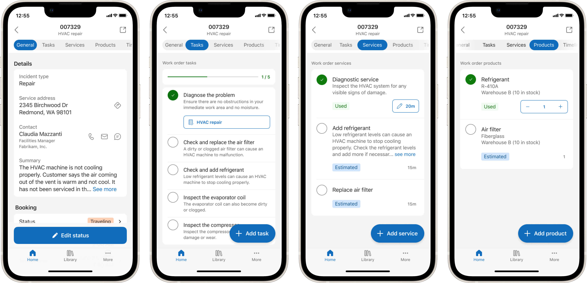
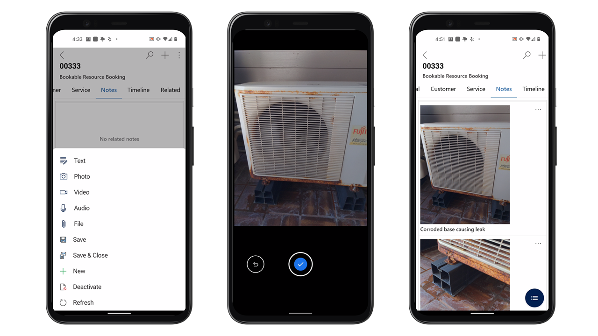
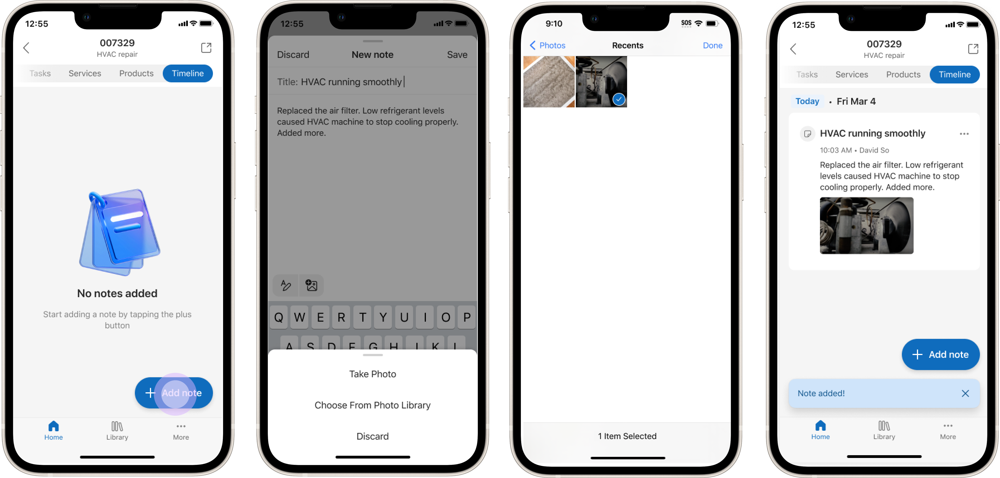
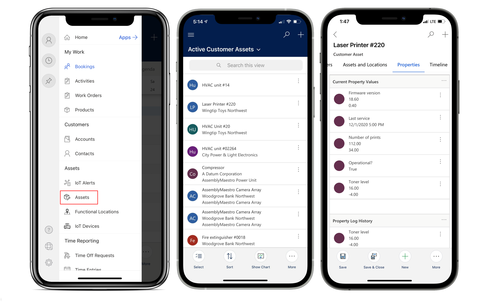
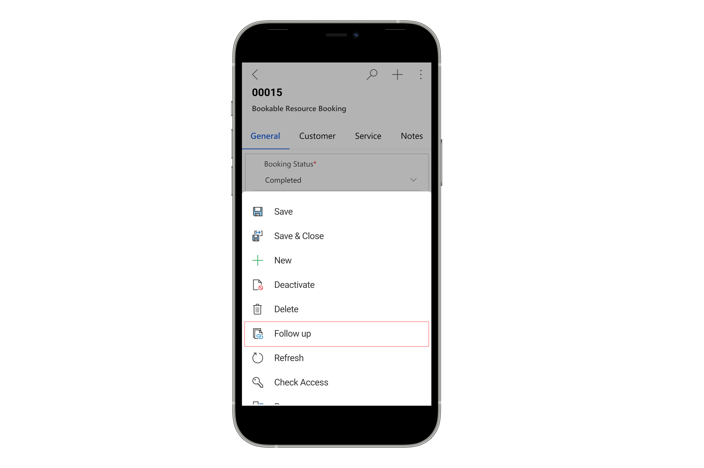

# Complete work orders on the mobile app

Technicians can use various features in the mobile app to efficiently plan their work day, track their work orders, and see details about customers. Other features include:

- A calendar view of assigned jobs with all details about the jobs
- Picture, video, and asset barcode scanning
- Integrations in other Microsoft applications for seamless collaboration
- Offline capabilities to work in areas without internet

## Travel to a job location

## [Unified Interface UX](#tab/vCurrent)

Select a booking to see more details about the booking time and the work order. Update the status to indicate you're driving to the customer location. On the **Customer** tab, you can see the work order location on a map to launch turn-by-turn driving directions on your preferred maps app.

> [!div class="mx-imgBorder"]
> 

The functional location field on the work order tells the technician exactly where to go within an address.

## [New mobile UX (preview)](#tab/vNext)

[!INCLUDE [public-preview-banner](../includes/public-preview-banner.md)]

[!INCLUDE [public-preview-note](../includes/public-preview-note.md)]

Change the status of a booking to **Traveling** directly from the booking home page. Swipe the booking from left to right or by tap on the booking's contextual menu to access its quick actions and set the status. You can also open the booking and tap **Edit status** on the **General** tab.

> [!div class="mx-imgBorder"]
> 

Open the default maps app to get directions by tapping on the directions icon on a booking tile in the bookings home page. Directions use the geolocation of the address and fall back to the address string when no geolocation is available. If no address is specified, then the directions icon doesn't show.
You can decide if you want the booking status to change to **Traveling** get directions.

> [!div class="mx-imgBorder"]
> 

---

## Perform and record work

## [Unified Interface UX](#tab/vCurrent)

On the **Service tab**, you see work order details like work order service tasks, products, and services. Mark a service or service task as complete and include the products used. Adjust the product units and the service hours as needed. Select the service task, service, or product name to open the full details form.

> [!div class="mx-imgBorder"]
> 

## [New mobile UX (preview)](#tab/vNext)

[!INCLUDE [public-preview-banner](../includes/public-preview-banner.md)]

When you're ready to start the work, access the booking details view by tapping on the booking tile on the booking home page. You find three separate tabs for work order service tasks (**Tasks**), products (**Products**), and services (**Services**). Mark a service or service task as complete and include the products used. Adjust the product units and the service hours as needed. Select the service task, service, or product name to open the full details form.

> [!div]
> 

---

## Take notes with attachments

## [Unified Interface UX](#tab/vCurrent)

On the **Notes** tab, capture text, image, audio, and video notes and associate them with the booking. You can also attach files and capture signatures. These notes help you record and build a work history.
The **Timeline** tab is available for other historical data related to the booking.

> [!div class="mx-imgBorder"]
> 

> [!NOTE]
> Notes are only available when included with the Bookable Resource Booking form. The control doesn't support other entities.
> Notes taken in the Field Service mobile app are stored in the `msdyn_bookableresourcebookingquicknotes` table. The default **Field Service - Resource** security role includes permissions to this table. If your app users do not have the out-of-the-box **Field Service - Resource** security role, you may have to include access to this table for these users. Follow the best practices described in the [Field Service security roles documentation](view-user-accounts-security-roles.md#q--a) to make sure your app users have access to this table.

## [New mobile UX (preview)](#tab/vNext)

[!INCLUDE [public-preview-banner](../includes/public-preview-banner.md)]

On the **Timeline** tab, select **+ Add note** to add text and images to your note. Notes taken here are visible on this Booking's timeline on both Field Service Mobile app and Field Service on the browser. There are two ways to add images: (1) add a single image by selecting file attachment button, or (2) add multiple images in the message body by selecting the image icon and then select multiple files in the system file picker at same time. Images added here takes advantage of Image optimization to conserve storage space.

> [!div]
> 

> [!NOTE]
> Notes in the timeline are associated with the booking and currently don't show on the parent work order timeline.

---

## Service assets

> [!div class="mx-imgBorder"]
> 

Technicians can also view and interact with functional locations and customer asset hierarchies on the mobile app when connected to the internet.

For a guided walkthrough of functional locations on the Field Service (Dynamics 365) Mobile app, check out the following video.

> [!VIDEO https://www.microsoft.com/videoplayer/embed/RE4I2pU]

## Barcode scanning

Select the search icon to find records from any entity. You can also search by scanning a barcode to find records that have a matching barcode field.

> [!div class="mx-imgBorder"]
> 

For more information, see the article on [configuring global search](mobile-power-app-system-barcode-scanning.md).

## Time entry

Track the time that technicians spend during work orders and other scenarios and create time entries in the mobile app.

Time entries are useful for reporting and billing purposes.

From the main menu, go to **Time Entry** and create a new one.  

> [!div class="mx-imgBorder"]
> 

For a guided walkthrough, check out the following video.

> [!VIDEO https://www.microsoft.com/videoplayer/embed/RE4J6mQ]

## Create follow-up work orders

While working on site, you may want to log work for another time. The Field Service (Dynamics 365) Mobile app makes it easy to create follow-up work orders.

For a guided walkthrough, check out the following video.

> [!VIDEO https://www.microsoft.com/videoplayer/embed/RWyHY4]

To create a follow-up work order, select the **Follow up** option in the bottom app menu. This option is only available the user has **create** permissions for the work order table. For more information on the security roles, see [users and security roles](./view-user-accounts-security-roles.md).

> [!div class="mx-imgBorder"]
> 

The following fields are already filled in based on the current work order:

- Address
- Billing Account
- Service Account
- Service Territory
- Exchange Rate
- Tax Code
- Taxable
- Transaction Currency ID

Once the technician saves the work order, it's uploaded and available for booking to the dispatcher.

[!INCLUDE[footer-include](../includes/footer-banner.md)]
