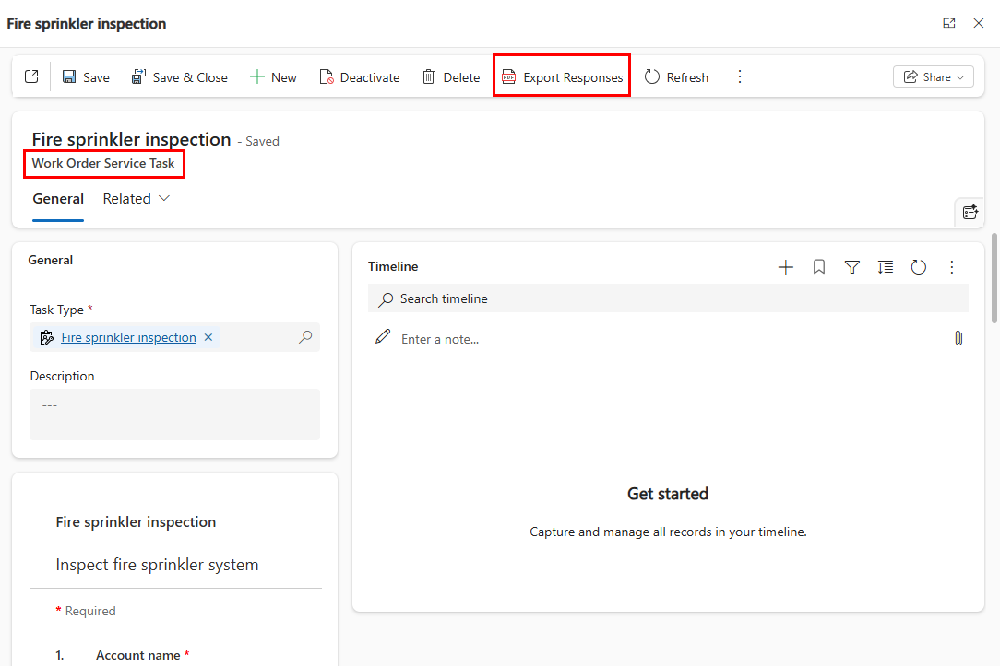
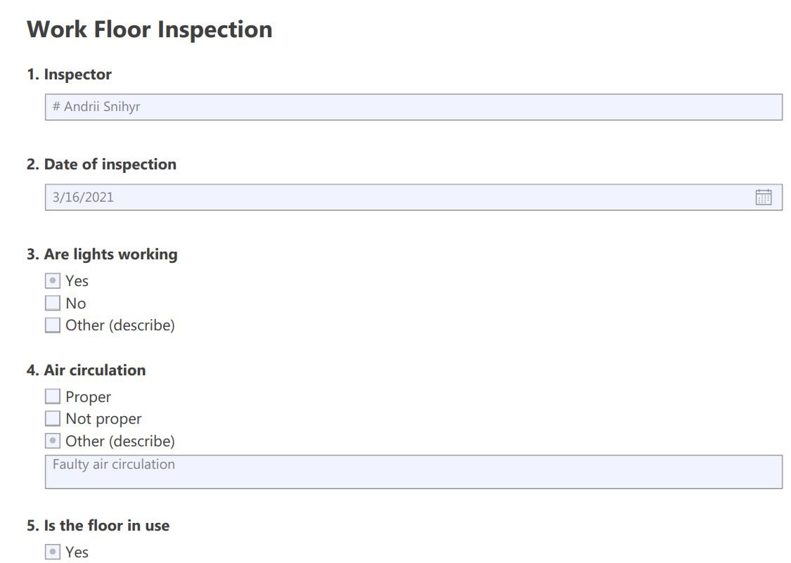

# Advanced options for inspections in Dynamics 365 Field Service

[!INCLUDE[cc-data-platform-banner](../includes/cc-data-platform-banner.md)]

In this article, we'll take a look at more advanced scenarios for using inspections in Dynamics 365 Field Service. For general information about inspections, see [this article on inspections](inspections.md).

For a guided walkthrough, check out the following video.

> [!VIDEO https://www.microsoft.com/videoplayer/embed/RE4JiMF]

## Branching and conditional logic

The inspection can be configured to look and act differently based on inspection answers in real time as the technician fills it out.

Go to the **Logic** section of the designer form to add branching and conditional logic to the inspection.

> [!div class="mx-imgBorder"]
> 

Based on the response to an inspection question, options include:

- **Make page visible**: Make the entire page of questions visible when the condition is true. Otherwise keep it hidden.

- **Show the question**: Make the question visible when the condition is true. Otherwise keep it hidden.

- **Change to required**: Question becomes required when the condition is true.

- **Skip to question**: When the condition is true, then the focus shifts to the selected question.

See the following screenshot for an example.

> [!div class="mx-imgBorder"]
> 

## Copy inspections

You can make a copy of an inspection. This is helpful if your organization has multiple inspections that are mostly similar.

From the list of inspections:

- Select an inspection (seen as "1" in the following screenshot).
- Select **Copy** in the top ribbon (seen as "2" in the following screenshot).
- A new inspection with the same questions will be created (seen as "3" in the following screenshot) with a **Draft** status.

> [!div class="mx-imgBorder"]
> 

## Create new versions of the same inspection

Select the **Revise** ribbon button to edit a published inspection to add new questions, remove obsolete questions, edit the question types, and update the logic.

> [!div class="mx-imgBorder"]
> 

In the **Versions** section of the inspection form, you'll see the current version of the inspection with a status of **Published**, and a new version that can be edited with a status of **Draft**.

> [!div class="mx-imgBorder"]
> 

When the draft version is published, the existing published inspection version will be deactivated.

Existing work orders will display and reference the previous version of the inspection, whereas new work orders will display and reference the new revised version.

## Export Inspection as blank PDF

Exporting and inspection as a PDF is helpful for situations where you need to send the inspection questions via email ahead of time.

From an inspection, select **Export to PDF** in the top ribbon.

> [!div class="mx-imgBorder"]
> 

A PDF with the blank inspection questions will download automatically.

> [!div class="mx-imgBorder"]
> 

The PDF will be interactive, where you can enter answers and save them to the PDF; the answers will *not* be saved to Dynamics 365 Field Service or Common Data Model. 

Some question types are limited. For example, the entity lookup question type will not reference the Dynamics 365 database records.

> [!Note]
> The export to PDF function on the Inspection only exports blank inspections without responses.

## Export Inspection Responses in PDF

> [!Note]
> The feature in this section is currently available as early access. For more information, see the article on [how to opt in to early access updates](https://docs.microsoft.com/power-platform/admin/opt-in-early-access-updates). 

Inspection responses can also be exported as a PDF from the work order service task. There is a new button 'Export Responses' on the service task which saves the inspection in the same format and with the responses filled in.

> [!div class="mx-imgBorder"]
> 

On mobile also this button can be used to generate the Inspection response PDF which can be saved and also shared with others.
> [!div class="mx-imgBorder"]
> 

#### Known limitations with exporting Inspection responses

- Export Responses to PDF does not support custom date or number format set using the personalization settings.  Date or number would show in the default format.
- Export Inspection to PDF does not support right-to-left (RTL) languages like Hebrew and Arabic.
- Export Inspection to PDF and Export Responses to PDF do not support Asian languages like Hindi and Chinese (available April 2021).

## Import and export inspection templates

> [!Note]
> The feature in this section is currently available as early access. For more information, see the article on [how to opt in to early access updates](https://docs.microsoft.com/power-platform/admin/opt-in-early-access-updates). 

Administrators can export inspection templates to then import into another environment. This is valuable in scenarios where an inspection was created in a test environment but now needs to be imported into a live production environment to use. Importing saves you having to re-create the inspection from scratch in the production environment.

From the inspection, select **Export** > **Export to json** in the top ribbon. 

> [!div class="mx-imgBorder"]
> 

In the list of inspections in another environment, select **Import from json** in the top ribbon.

> [!div class="mx-imgBorder"]
> 


## Understand, view, and report inspection responses

All the responses entered by technicians are stored in Common Data Service. They can configure analytics settings in **Field Service settings**, which lets them parse the inspection responses into individual question responses.

There are three entities stored in Common Data Service:

1. **Customer Voice survey question**: each inspection question
2. **Customer Voice survey response**: a response to an inspection
3. **Customer Voice survey question response**: each individual response to each inspection question

In this section, we'll walk through how to configure the analytics settings in order to parse individual inspection responses into individual question responses.

First, we'll define how often inspection answers should be parsed and organized in Common Data Service.

Go to **Field Service app** > **Settings** > **Field Service Settings** > **Inspection tab**.

> [!div class="mx-imgBorder"]
> 

Make sure **Analytics enabled** is set to **Yes**. For **Analytics frequency**, consider the following options:

- **Daily**: Every day on the **Record generation start time**, the **Deserialization of Inspection Response – Recurrent** flow triggers and updates the deserialized inspection response JSON in ```msfp_surveyresponse``` and creates new records for responses and corresponding questions in the ```msfp_questionresponse``` entity.
- **Immediately**:  As soon as a work order service task is marked complete, the **Deserialization of Inspection Response** flow triggers and updates the deserialized inspection response JSON in ```msfp_surveyresponse```, and also creates new records for responses and corresponding questions in ```msfp_questionresponse``` entity.
- **Custom**: Define your own frequency in number of days. See the following screenshot for an example.

> [!div class="mx-imgBorder"]
> 

> [!Note]
> When analytics frequency is set to **Immediately**, the inspection response is parsed and persisted as soon as the service task is completed; the parsed responses won't be updated even if the technician makes changes and completes the inspection again. However, if the analytics frequency is set to **Daily** or **Custom**, the responses are stored from the latest completion of the service task *before* the flow start time.

Next, we need to create and publish an inspection. See the following screenshot for an example.

> [!div class="mx-imgBorder"]
> 

In our example, we've created an inspection with four questions.

> [!div class="mx-imgBorder"]
> 

After publishing an inspection, the questions are stored in Common Data Service, and can be found in the **Customer Voice survey question** entity in Power Apps. Here, you can see entries for each question on an inspection.

> [!div class="mx-imgBorder"]
> 

If a question on an inspection has no response, the **Customer Voice survey question response** entity detail will remain empty.

> [!div class="mx-imgBorder"]
> 

Back on our sample inspection, we added some values for the questions, as seen in the following screenshot, and saved the inspection. 

> [!div class="mx-imgBorder"]
> 

> [!div class="mx-imgBorder"]
> 

Back in Power Apps, on the **Customer Voice survey question response** entity, you'll see the values to each submitted response from the inspection.

> [!div class="mx-imgBorder"]
> 

> [!Note]
> All the logic described in this section of the article is driven by a Power Automate flow to deserialize inspection definitions, and is shipped by default with the inspections feature.
>
> Upon publish of an inspection, the deserialized inspection definition JSON data is ingested into the Dynamics 365 Customer Voice entity **msfp_question**. This flow gets triggered on state changed to published and performs the same.
> [!div class="mx-imgBorder"]
> 

## Parse inspection responses

Inspection parsing allows you to isolate and select specific parts of inspection responses, like taking an inspection attachment or image within a response to use for other business processes. 

[Download guide to understand inspection response parsing](https://aka.ms/inspections-parse)

## Language translations

> [!Note]
> The feature in this section is currently available as early access. For more information, see the article on [how to opt in to early access updates](https://docs.microsoft.com/power-platform/admin/opt-in-early-access-updates). 

Inspection creators can add language variations for each inspection.

From an inspection, go to the **Translation** section of the form, select a language from the dropdown, and translate each question.

> [!div class="mx-imgBorder"]
> 

Save and publish the inspection.

Next, in order for technicians to view translated inspections on the Dynamics 365 mobile app, you must have language packs installed for each language the inspection is translated to.

Go to **Settings** > **Administration** > **Language Settings**, then select each language. 

> [!div class="mx-imgBorder"]
> 

The maker who adds the strings does not need to install the language packs. The technician who wants to see inspections in their language needs the desired language's pack to be installed.

## Inspections for customer assets

To relate an inspection to a customer asset and build out service history, enter the customer asset in the **Service Task Relates To** section of the work order service **Task** that holds the inspection.

> [!div class="mx-imgBorder"]
> 

Associating a customer asset allows the technician to see which customer asset needs the inspection. From the customer asset, they can see all related inspection history.

> [!div class="mx-imgBorder"]
> 

> [!Note]
> If you relate a work order incident type to a customer asset, the related work order service tasks will be related to the customer asset automatically.

### Add inspections to customer assets without work orders

> [!Note]
> The feature is currently available as early access. For more information, see the article on [how to opt in to early access updates](https://docs.microsoft.com/power-platform/admin/opt-in-early-access-updates). 

To enable inspections on customer assets without a work order, an admin must perform the following steps.

Go to **Advanced Settings** > **Settings** > **Customization** > **Customize the System** > **Components** > **Entities** > **Customer Asset** > **1:N Relationships**

There's an entity ```InspectionInstance``` with a display name **Inspection** with a 1:N relationship to customer asset. By default, this relationship is not visible in the related tab of the asset.

Find the row where **Related Entity** is **Inspection**.

> [!div class="mx-imgBorder"]
> 

On opening the record, find **Display Option**. This field is set to **Do not Display**. Upudate this value to **Use Plural Name** or **Custom Label**. Once updated, **Save and Close** and **Publish All Customizations**.

> [!div class="mx-imgBorder"]
> 

Inspection are now visible in the **Related** tab for assets. To validate, go to **Service** > **Assets** and create a new asset or open an existing asset. Right-click on the **Related** tab and verify that **Inspections** are now available. You should also see an option to create a **New Inspection**.

> [!div class="mx-imgBorder"]
> 

A new inspection instance can be created and an inspection template can be assigned to it. After saving, the inspection responses can be entered and saved. Upon selecting **Mark Complete** from the ribbon, the inspection becomes read-only and no more responses can be entered or edited.

From the Field Service mobile app, the technician can also go the asset and perform ad hoc inspections in the same way.

### Inspecting X number of assets at a location

Let's say a technician needs to inspect 10 customer assets at a customer's location. To accommodate this scenario, administrators can:

- Create one inspection with 10 questions - one for each asset - and associate the single inspection to a single service task, or
- Create 10 work order service tasks, each with one inspection.
 
When deciding, keep in mind work order service tasks can be associated to customer assets to build service history, viewable on the customer asset record. This means creating 10 service tasks each related to a different customer asset has the advantage of helping you build service history. The advantage of utilizing a single service task with multiple questions has the benefit of being easier to add to a work order and quicker to fill out. 


## Configuration considerations

### Using inspections vs. service tasks vs. Power Apps

The main advantage of inspections is they are easier to create and easier to fill out. Both service tasks and custom Power Apps require creating additional fields and entities; for work order service tasks, the technician must open and save each one. If you find yourself adding more than 10 service tasks to a work order, or creating a Power App with more than 10 questions, consider inspections instead.

### Use Power Automate flow to parse inspection responses 

When a technician fills out an inspection, the answers to each inspection question are stored as JSON in the **Inspection Response** entity.


> [!div class="mx-imgBorder"]
> 

Use a Power Automate flow to run a workflow on inspection responses.

In the following example, if a technician responds "Yes" to the inspection question "Is a follow-up required?" then a new follow-up work order service task is added to the related work order.

> [!Note]
> Out-of-the-box flows cannot be customized. You must create or copy a Power Automate flow in order to customize it.

### Create a flow

Go to [https://flow.microsoft.com](https://flow.microsoft.com), sign in, choose your environment, and create a new flow.

Choose **Automated - from blank**.

> [!div class="mx-imgBorder"]
> 

Name the flow and select **Skip** to choose the trigger on the flow editor page.

> [!div class="mx-imgBorder"]
> 

 
### Create a trigger 

Search for "Dynamics 365" in **Connectors** and choose the trigger as **When a record is created or updated**.

> [!div class="mx-imgBorder"]
> 
 
This flow will relate to the **Work Order Service Task** entity because technicians view and respond to inspections from this entity. Choose **Work Order Service Tasks** for the **Entity Name**. 

> [!div class="mx-imgBorder"]
> 
 
### Fetch the response from the database

Next, we need to retrieve the inspection responses.

Add a step using the **Get record** action in "Dynamics 365." 

Choose **Inspection Responses** as the entity to get and **Inspection Response ID** in the item identifier because this field has the ID of the inspection response record.

> [!div class="mx-imgBorder"]
> 
 
### Extract the JSON

Add an **Initialize Variable** action to retrieve the response from **ResponseJsonContent** field.

> [!div class="mx-imgBorder"]
> 
 
### Decode the response

Now we need to convert the response's JSON into a usable format.

Add an **Initialize Variable** action to url decode and base 64 decode the response JSON:

```decodeUriComponent(decodeBase64(variables('responseJson')))```

> [!div class="mx-imgBorder"]
> 

### Update the schema

Provide the schema with the name of the question you want to run a workflow on.

In our example, the schema is:

```
{
    "type": "object",
    "properties": {
        "Followup": {
            "type": "string"
        }
    }
}
```

> [!div class="mx-imgBorder"]
> 

If you're having trouble generating the schema, you can select the **Generate from sample** option and enter the name and sample answer of your inspection question and response.

In our example, we can enter:

```{"Followup":"Yes"}```

"Followup" comes from the inspection question's name value, as seen in the following screenshot:

> [!div class="mx-imgBorder"]
> 

### Condition-based action

Next we'll add a condition and action based on the response to the inspection question.

In this example, we'll create a **Work Order Service Task** with another **Service Task Type** in the same work order when the "Followup" inspection question has "Yes" as the answer.

> [!div class="mx-imgBorder"]
> 

> [!div class="mx-imgBorder"]
> 

Save and test your flow.


[!INCLUDE[footer-include](../includes/footer-banner.md)]
