# Run reports on inspection responses

Administrators can create reports based on the answers technicians respond to inspections. 

## Understand, view, and report inspection responses

All the responses entered by technicians are stored in Microsoft Dataverse. They can configure analytics settings in **Field Service settings**, which lets them parse the inspection responses into individual question responses.

There are three entities stored in Dataverse:

1. **Customer Voice survey question**: each inspection question.
2. **Customer Voice survey response**: a response to an inspection.
3. **Customer Voice survey question response**: each individual response to each inspection question.

In this section, we'll walk through how to configure the analytics settings in order to parse individual inspection responses into individual question responses.

First, we'll define how often inspection answers should be parsed and organized in Dataverse.

Go to **Field Service app** > **Settings** > **Field Service Settings** > **Inspection tab**.

> [!div class="mx-imgBorder"]
> 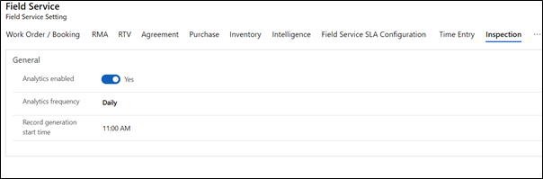

Make sure **Analytics enabled** is set to **Yes**. For **Analytics frequency**, consider the following options:

- **Daily**: Every day on the **Record generation start time**, the **Deserialization of Inspection Response – Recurrent** flow triggers and updates the deserialized inspection response JSON in ```msfp_surveyresponse``` and creates new records for responses and corresponding questions in the ```msfp_questionresponse``` entity.
- **Immediately**:  As soon as a work order service task is marked complete, the **Deserialization of Inspection Response** flow triggers and updates the deserialized inspection response JSON in ```msfp_surveyresponse```, and also creates new records for responses and corresponding questions in ```msfp_questionresponse``` entity.
- **Custom**: Define your own frequency in number of days. See the following screenshot for an example.

> [!div class="mx-imgBorder"]
> 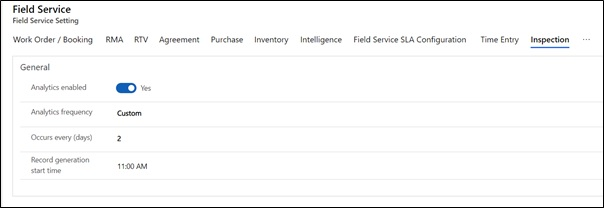

> [!Note]
> When analytics frequency is set to **Immediately**, the inspection response is parsed and persisted as soon as the service task is completed; the parsed responses won't be updated even if the technician makes changes and completes the inspection again. However, if the analytics frequency is set to **Daily** or **Custom**, the responses are stored from the latest completion of the service task *before* the flow start time.

Next, we need to create and publish an inspection. See the following screenshot for an example.

> [!div class="mx-imgBorder"]
> 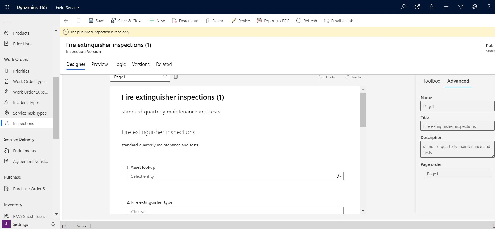

In our example, we've created an inspection with four questions.

> [!div class="mx-imgBorder"]
> 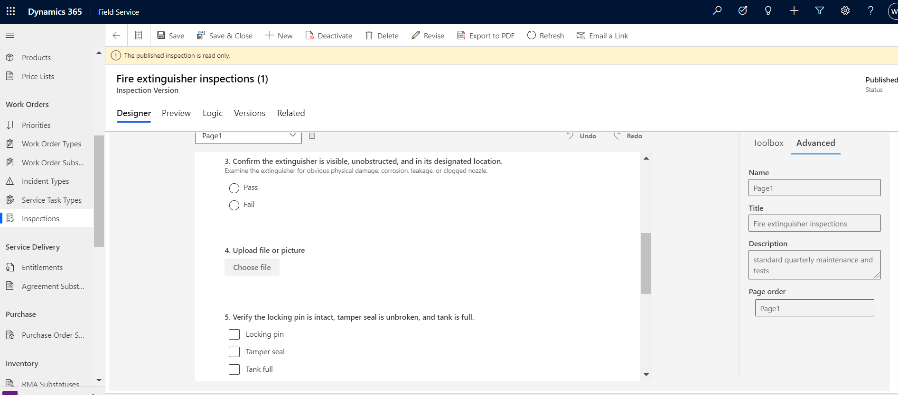

After publishing an inspection, the questions are stored in Dataverse, and can be found in the **Customer Voice survey question** entity in Power Apps. Here, you can see entries for each question on an inspection.

> [!div class="mx-imgBorder"]
> 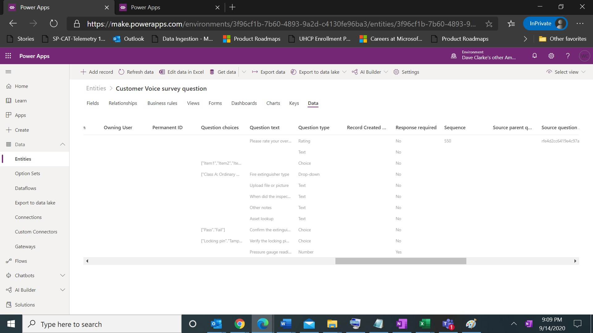

If a question on an inspection has no response, the **Customer Voice survey question response** entity detail will remain empty.

> [!div class="mx-imgBorder"]
> 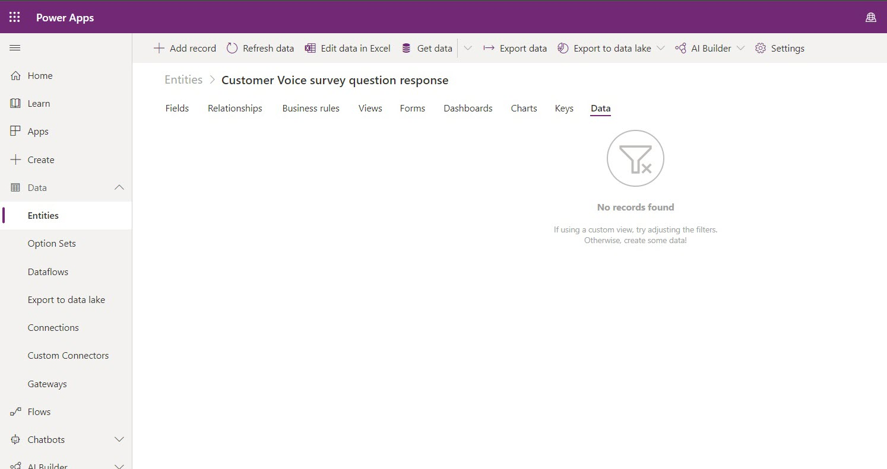

Back on our sample inspection, we added some values for the questions, as seen in the following screenshot, and saved the inspection. 

> [!div class="mx-imgBorder"]
> 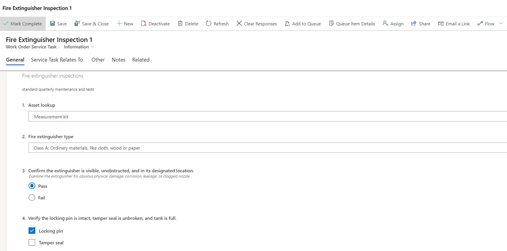

> [!div class="mx-imgBorder"]
> 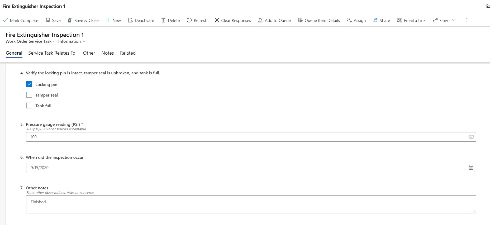

Back in Power Apps, on the **Customer Voice survey question response** entity, you'll see the values to each submitted response from the inspection.

> [!div class="mx-imgBorder"]
> 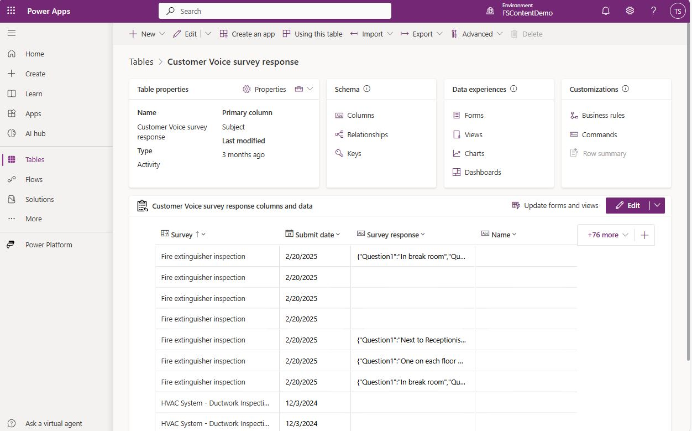

> [!Note]
> All the logic described in this section of the article is driven by a Power Automate flow to deserialize inspection definitions, and is shipped by default with the inspections feature.
>
> Upon publish of an inspection, the deserialized inspection definition JSON data is ingested into the Dynamics 365 Customer Voice entity **msfp_question**. This flow gets triggered on state changed to published and performs the same.
> [!div class="mx-imgBorder"]
> 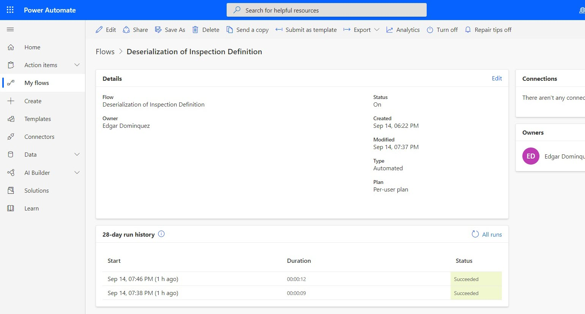

## Parse inspection responses

Inspection parsing allows you to isolate and select specific parts of inspection responses, like taking an inspection attachment or image within a response to use for other business processes. 

[Download guide to understand inspection response parsing](https://aka.ms/inspections-parse)


## Configuration considerations

### Use Power Automate flow to parse inspection responses (deserialization of responses)

When a technician fills out an inspection, the answers to each inspection question are stored as JSON in the **Inspection Response** entity.

> [!div class="mx-imgBorder"]
> 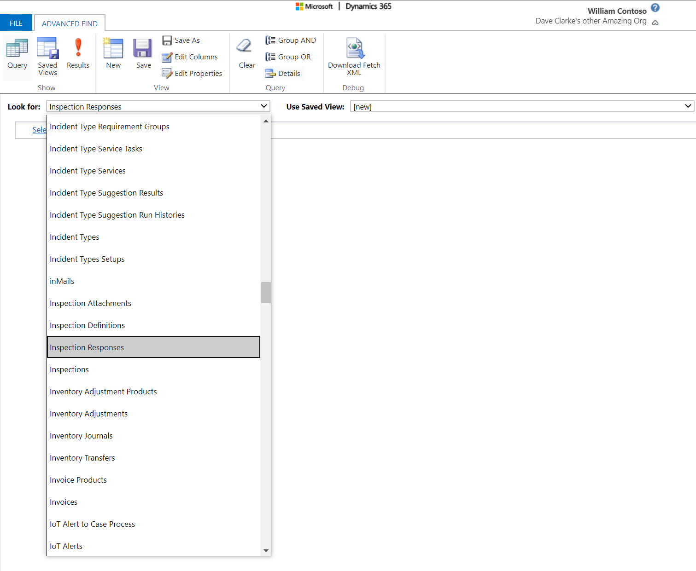

Use a Power Automate flow to run a workflow on inspection responses. For more information, see the video on [run workflows on Inspection responses](https://youtu.be/fCjQmIw9ahs).

In the following example, if a technician responds "Yes" to the inspection question "Is a follow-up required?" then a new follow-up work order service task is added to the related work order.

> [!Note]
> Out-of-the-box flows cannot be customized. You must create or copy a Power Automate flow in order to customize it.

### Create a flow

Go to [https://flow.microsoft.com](https://flow.microsoft.com), sign in, choose your environment, and create a new flow.

Choose **Automated - from blank**.

> [!div class="mx-imgBorder"]
> 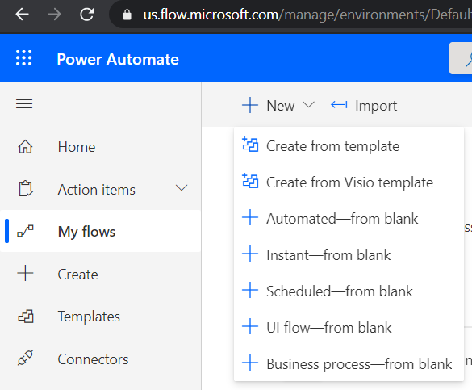

Name the flow and select **Skip** to choose the trigger on the flow editor page.

> [!div class="mx-imgBorder"]
> 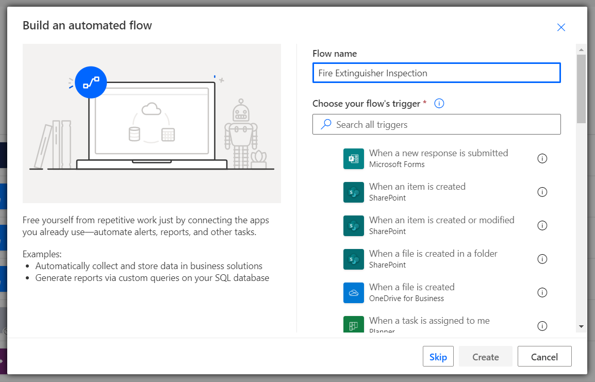

 
### Create a trigger 

Search for "Dynamics 365" in **Connectors** and choose the trigger as **When a record is created or updated**.

> [!div class="mx-imgBorder"]
> 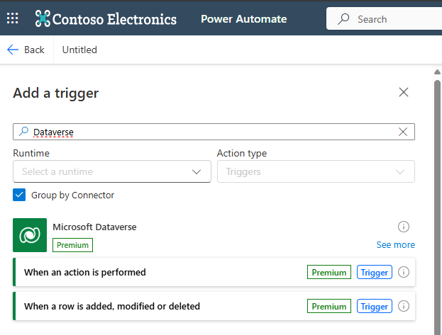
 
This flow will relate to the **Work Order Service Task** entity because technicians view and respond to inspections from this entity. Choose **Work Order Service Tasks** for the **Entity Name**. 

> [!div class="mx-imgBorder"]
> 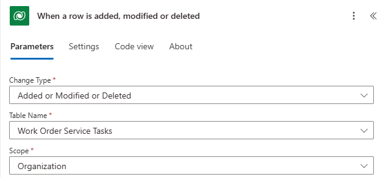
 
### Fetch the response from the database

Next, we need to retrieve the inspection responses.

Add a step using the **Get record** action in "Dynamics 365." 

Choose **Inspection Responses** as the entity to get and **Inspection Response ID** in the item identifier because this field has the ID of the inspection response record.

> [!div class="mx-imgBorder"]
> 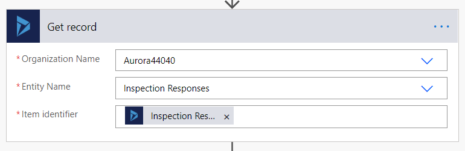
 
### Extract the JSON

Add an **Initialize Variable** action to retrieve the response from **ResponseJsonContent** field.

> [!div class="mx-imgBorder"]
> 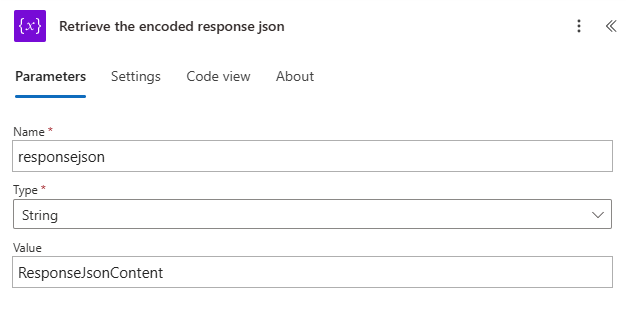
 
### Decode the response

Now we need to convert the response's JSON into a usable format.

Add an **Initialize Variable** action to url decode and base 64 decode the response JSON:

```decodeUriComponent(decodeBase64(variables('responseJson')))```

> [!div class="mx-imgBorder"]
> 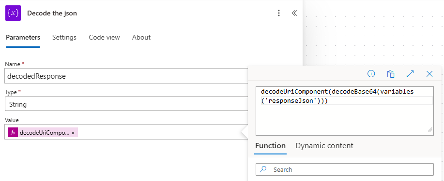

### Update the schema

Provide the schema with the name of the question you want to run a workflow on.

In our example, the schema is:

```
{
    "type": "object",
    "properties": {
        "Followup": {
            "type": "string"
        }
    }
}
```

> [!div class="mx-imgBorder"]
> 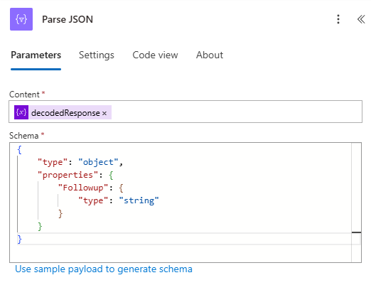

If you're having trouble generating the schema, you can select the **Generate from sample** option and enter the name and sample answer of your inspection question and response.

In our example, we can enter:

```{"Followup":"Yes"}```

"Followup" comes from the inspection question's name value, as seen in the following screenshot:

> [!div class="mx-imgBorder"]
> 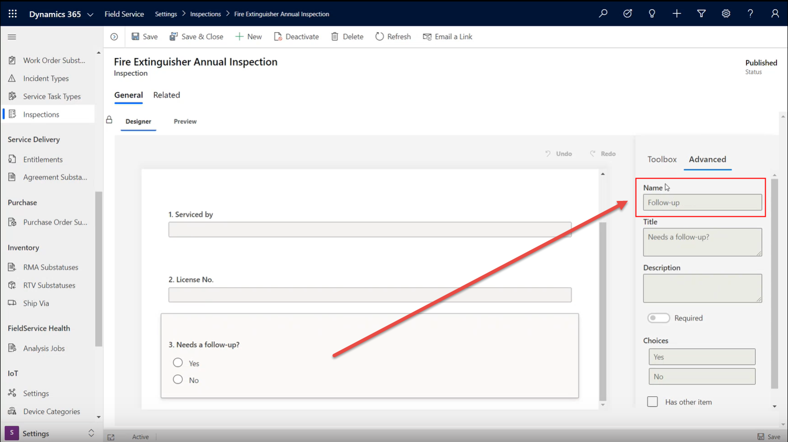

### Condition-based action

Next we'll add a condition and action based on the response to the inspection question.

In this example, we'll create a **Work Order Service Task** with another **Service Task Type** in the same work order when the "Followup" inspection question has "Yes" as the answer.

> [!div class="mx-imgBorder"]
> 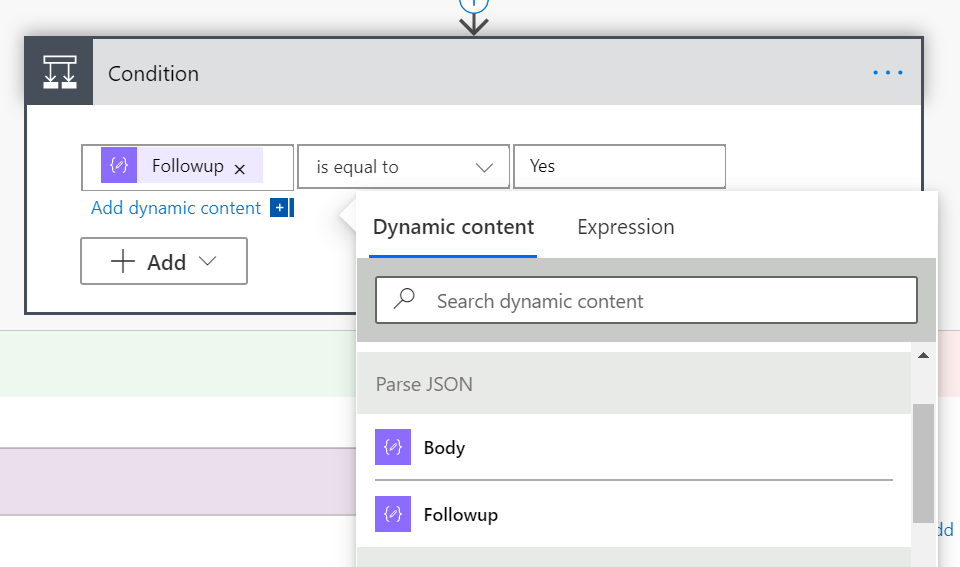

> [!div class="mx-imgBorder"]
> 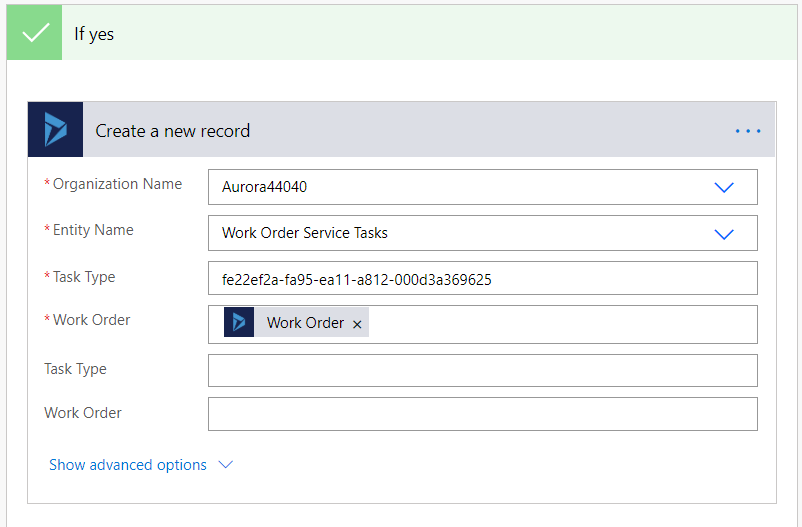

Save and test your flow.
