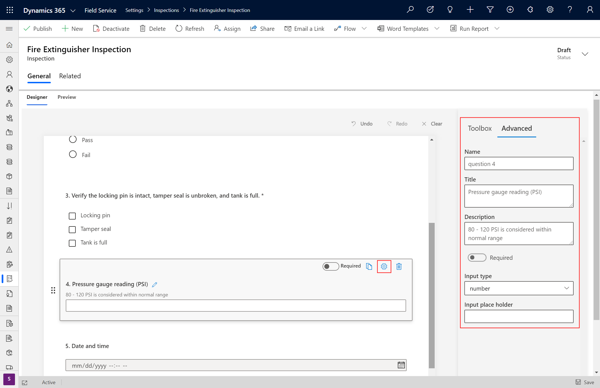
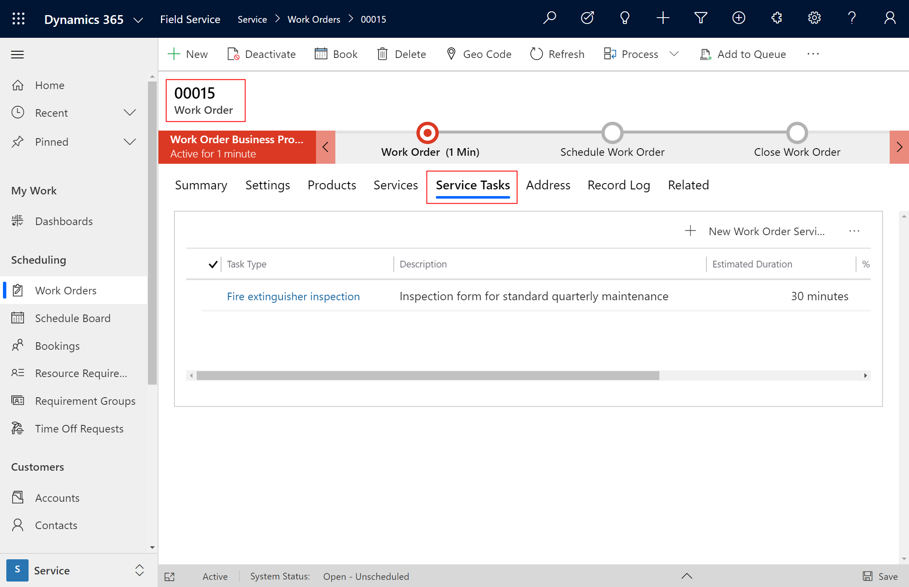
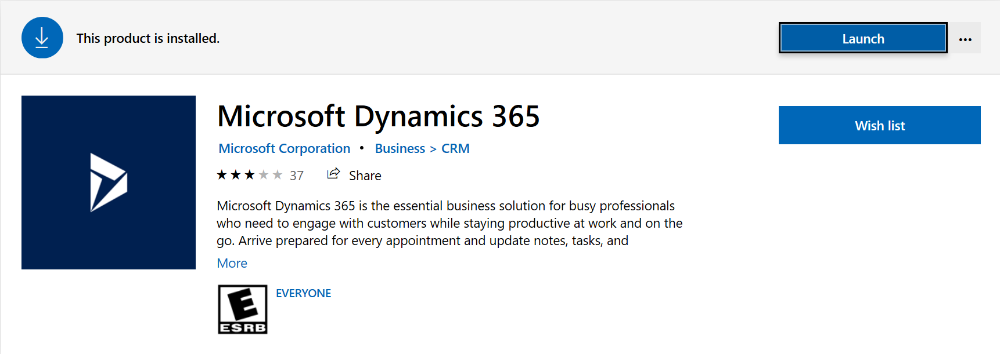
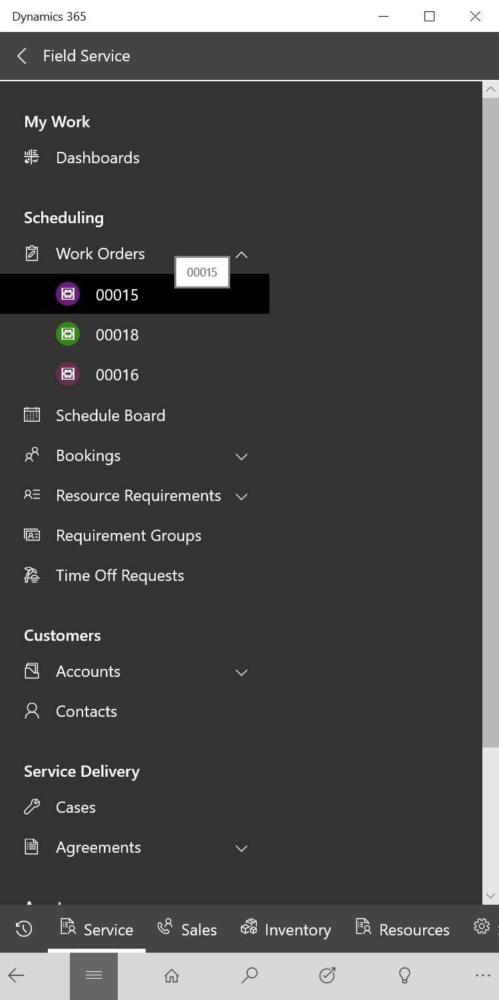
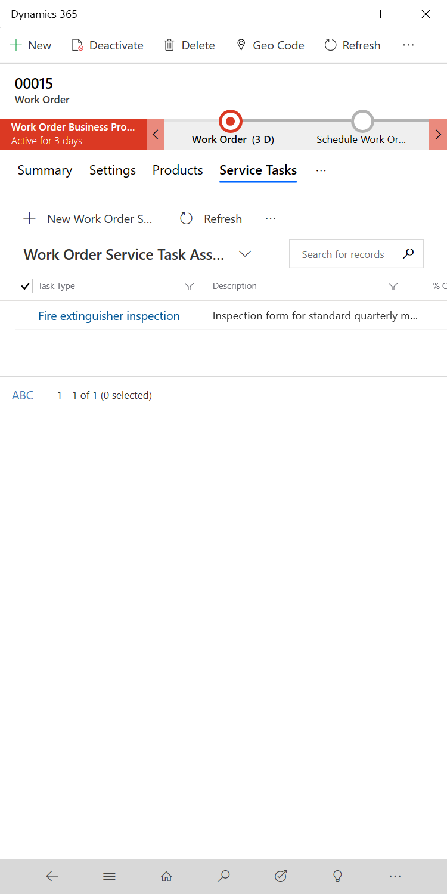
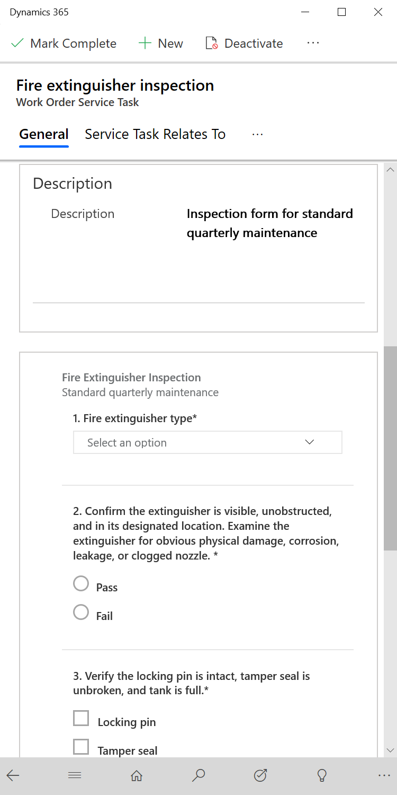
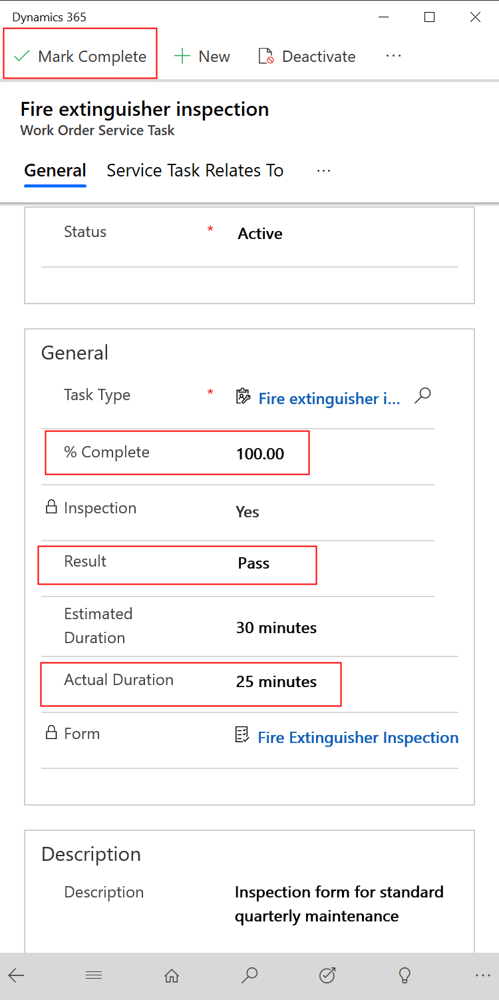
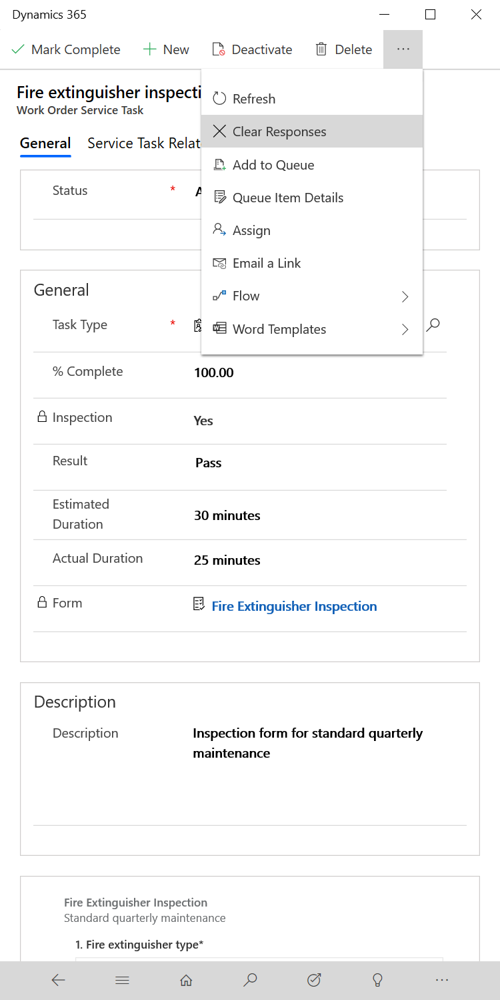

# Add inspections to Work Orders

Field Service inspections are a digital form that technicians use to quickly and easily answer a list of questions as part of a work order. The list of questions are often a safety protocol, pass and fail tests for a customer asset, an interview with a customer, or other various audits and assessments that are performed before, during, or after a work order.

Compared to using Work Order Incident Types and Service Tasks, using Inspections has the added benefits of:

- **Easier to create** - administrators can quickly create inspection questions with a drag and drop interface without the need to create new entities and fields.
- **Easier to fill out** - technicians can quickly enter answers for each inspection question and save all of them with one click rather than having to open and close multiple records.
- **More felxible and robust** - Field Service Inspections have many options for question formats and validations such as multi-option select, mandatory fields, images, attachments, etc. 

Creating and using Inspections is simple and involves the following steps: 

1. Administrator creates an inspection template
2. Administrator associates the inspection template to a Service Task Type
3. Dispatcher adds the Service Task Type to a Work Order
4. Technician completes the inspection
5. View inspection results

In this article we will walk through an example of setting up an inspection using an maintenance checklist on a customer asset as an example.

## Prerequisites
Public preview April 2020

Minimum supported CRM version for Inspections to work is 9.1.0000.15015

Work orders set up with data

submit request on insider form

Preview will be available shortly for selected participants. Reaching out since you had expressed interest in providing feedback. If you would be interested in joining the insider preview program then please register at the Insider portal here and respond back to me. We will then enroll you into the preview program. Once added, you will be notified via email and will be able to see Private Preview for D365 Field Service Inspections under 'my programs' on your Insider Programs Page. Please use “Forums” and “Program Feedback” to give us your inputs and feedback. As the preview for Field Service Inspections becomes available there will be detailed instructions available on how to install. We sincerely appreciate your interest and help in making the Field Service inspections better. 

> [!Note]
>

## Create inspection template

> [!div class="mx-imgBorder"]
> 

> [!div class="mx-imgBorder"]
> 

> [!div class="mx-imgBorder"]
> 

> [!div class="mx-imgBorder"]
> 

> [!Note]
> Once you publish you cannot edit

> [!div class="mx-imgBorder"]
> 

> [!Note]
> Cannot create inspection on mobile

## Associate inspection to service task type

> [!div class="mx-imgBorder"]
> 

> [!Note]
> Can add the service task type to an incident type as needed

> [!div class="mx-imgBorder"]
> 

## Add inspection to work order

> [!div class="mx-imgBorder"]
> 

> [!div class="mx-imgBorder"]
> 

## Perform inspection 	

> [!div class="mx-imgBorder"]
> 

> [!div class="mx-imgBorder"]
> 

Click on the Work Order Service Task (and not the Service Task Type).

> [!div class="mx-imgBorder"]
> 

> [!div class="mx-imgBorder"]
> 

> [!div class="mx-imgBorder"]
> 

> [!div class="mx-imgBorder"]
> 

Validations 
## View responses

## Configuration considerations
- is each question in CDS?
- branching logic
- reporting on responses
- FS Mobile
- PDF capability for reporting
- inspecting X assets at a location

## FAQs

## Additional Notes
secuirty roles?
vs. powerapps? - ok if have small handful, this inspections is better for more than 10
	- Difference between inspections and incidents and service tasks
	- Limits?
	- Known limitations 
Only single response , need to add multiple incidents