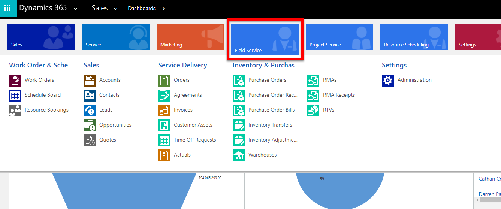

# How to install Dynamics 365 Field Service

This article describes how to install the Dynamics 365 Field Service application for Dynamics 365 (online). 

To get fully up and running with Field Service, you'll need to:

1. Install the core Field Service application
2. Install the Field Service Mobile app
3. Install the Woodford mobile configurator
4. Install and configure the mobile project template

In this article, we'll walk through each of these steps. 

> [!Note]
> Along with this article, see the video:  [Field Service installation and setup](https://youtu.be/hvcqAbe4g4E)

## Prerequisites

To follow the steps in this article, you will need: 

- Time. Field Service installations and upgrades can take up to 30 minutes or more. 
- A desktop browser and a mobile device (phone, tablet, or Windows 10 device).

## Step 1: Install Dynamics 365 Field Service

There are a few ways you can get access to Dynamics 365 Field Service: 

- Sign up for an entirely new trial environment. Head to [the Dynamics 365 trials site](https://trials.dynamics.com), select **Field Service**, and follow the instructions.

- Purchase Field Service by going to your **Office 365 admin center** > **Billing** > **Purchase Services** and select **Dynamics 365 Field Service** and **Buy Now**. You can also get Field Service from this [Dynamics 365 purchasing page](https://dynamics.microsoft.com/pricing/#FieldService).

- Add a Field Service trial to an existing Dynamics 365 organization by going to **Settings** > **Microsoft AppSource**. Search for **Field Service trial**, select **Dynamics 365 Field Service trial**, and then select **Free Trial**.

### Verify the installation is complete

If the installation is complete, the Field Service app will appear in the Dynamics 365 main menu when logged in as a system administrator.
   
> [!div class="mx-imgBorder"]
> 

In previous versions, Field Service appears in the Dynamics 365 custom application sitemap.
 
> [!div class="mx-imgBorder"]
>  

## Step 2: Download the Field Service Mobile app on a phone or tablet

> [!Note]
> You will not be able to use the Field Service Mobile application with your Dynamics 365 organization until you have followed all of the steps below and set up users and [bookable resources enabled for mobile app access](set-up-bookable-resources.md).

Dynamics 365 Field Service provides the cross-platform, multi-device Field Service Mobile application that is crafted to the field service worker's needs. The mobile application is entirely customizable and extensible, allowing any organization to brand the application as its own, define what types of data field service workers can access, and much more.

To get the mobile app, download **Field Service Mobile** from the Windows, Apple, or Google Play app stores, or visit the following links. **Field Service Mobile** requires Field Service versions **7.5.5** and **8.2+**.

- [Download for Windows](https://aka.ms/fsmobile-windows)
- [Download for iOS (Apple)](https://aka.ms/fsmobile-iOS)
- [Download for Android](https://aka.ms/fsmobile-android)

> [!div class="mx-imgBorder"]
> 

## Step 3: Install the Field Service Mobile configuration tool

The configuration tool allows app access for field technician users, and allows administrators to customize the mobile experience.

1. [Download the mobile configuration tool](https://www.resco.net/woodford/download) and save to your computer.

2. In the Dynamics 365 organization, go to **Settings** > **Solutions**. Select **Import**. 

>[!Note]
> You may have to select the gear icon and go to **Advanced Settings** in order to access the **Solutions** option from the settings dropdown.
 
> [!div class="mx-imgBorder"]
> 

3. On the **Select Solution Package** screen, select the Woodford\_\#\_\#\_\#\_\#\_managed.zip file, and then select **Next**.

> [!div class="mx-imgBorder"]
> 

4. After the import completes, verify that **Woodford** appears on the **Settings** menu. If you don't see it, refresh the page.

> [!div class="mx-imgBorder"]

>   

## Step 4: Import the mobile project template

Next, download and import a mobile project that allows you to configure the mobile app for your organization.

The mobile project template contains all customizations for the Field Service Mobile app. A mobile project allows you to customize the mobile experience across devices. For example, you use a mobile project to add, remove, and change fields, entities, views, and forms on the mobile app.

1. Open the Mobile Configuration Tool (Woodford) by going to **Settings** > **Woodford** and selecting **MobileCRM Woodford HTML5**. If you experience trouble opening or working in the HTML5 version, you can use the MobileCRM Woodford Legacy in a non-private Internet Explorer browser window.

> [!div class="mx-imgBorder"]
> 

2. You may be asked to set a storage quota. Set to **500 MB**, and then select **OK**.

3. Register yourself as a user.

4. [Download mobile project for **Field Service Mobile** (latest) Field Service v7.5.5 and v8.2+](https://aka.ms/fsmobile-project) and save in a location other than the Downloads folder. If you have an existing mobile project from a previous app version, you'll need to manually move the customizations for that project into a derivative of this project.

  The mobile project is updated periodically; [bookmark this website](https://aka.ms/fsmobile-project) for regular access the latest mobile project.

**For previous mobile apps** for D365 for Field Service, use the following mobile projects:

- [Download mobile project for **Field Service Mobile (2017)** Field Service v6.1](https://go.microsoft.com/fwlink/p/?linkid=836310).
- [Download mobile project for **Field Service Mobile (2016)** Field Service v6.0](https://go.microsoft.com/fwlink/p/?LinkId=808250).

5. Import the mobile project file.
> [!div class="mx-imgBorder"]
> 

6. In the **Add Mobile Project** dialog:

- Keep **Type** set to **Standard User**.
 - Enter the filename of the mobile project file you downloaded. In our example, it was FSDyn365_1.0.2735 (yours may be different depending on which version you downloaded).
 - Enter a priority value. In our example, we set it to 10. 
 - Assign the template to all field service security roles.
 - Select **Save**.

> [!div class="mx-imgBorder"]
> 

7. Double-click on your newly imported mobile project file. You'll be taken to the project detail page. Select **Publish**.

> [!div class="mx-imgBorder"]
> 

8. Head back to the main Woodford page by selecting the back button in the navigation, as seen in the following screenshot. 

> [!div class="mx-imgBorder"]
> 

9.  Select to highlight the mobile project template and select **Derive**.

> [!div class="mx-imgBorder"]
> 

- Keep **Type** set to **Standard User**.
- Enter a name (in our example, FSDyn365_1.0.2735-derivative), a higher priority (in our example, 20), and assign to relevant Field Service security roles.
- Select **Save**.

> [!div class="mx-imgBorder"]
> 

10. Double-click the mobile project template *parent* (not your new derivative), and then select **Publish All**.

> [!Note]
> For Field Service Mobile v11.2, publish to 11.2.

11.  Verify the mobile configurations are published by checking for an arrow next to the projects.
> [!div class="mx-imgBorder"]
> 

> [!Note]
> This is a trial license and is valid for 30 days. The trial can be extended by following the guidance in this topic: [Extend Field Service Mobile configuration tool trial](../field-service/activate-fs-mobile-app-license.md).

## Next steps
- [Set up users and security roles](../field-service/view-user-accounts-security-roles.md)
- [Enable bookable resources for mobile app access](set-up-bookable-resources.md)
- [Enable maps for Field Service Mobile](mobile-enable-maps.md)
- [Add sample data](../field-service/install-sample-data-8-x.md)

### See also

- [Frequently asked questions about the mobile solution](https://www.resco.net/mobilecrm/support.aspx)
- [Woodford guide](https://www.resco.net/downloads/Woodford_Guide.pdf)
