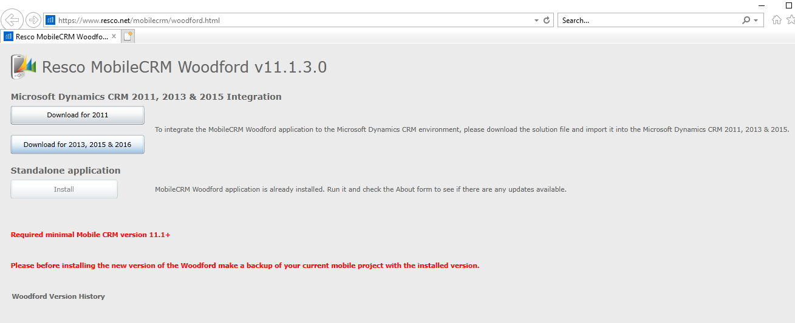
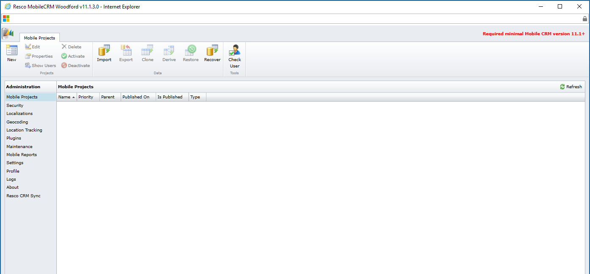
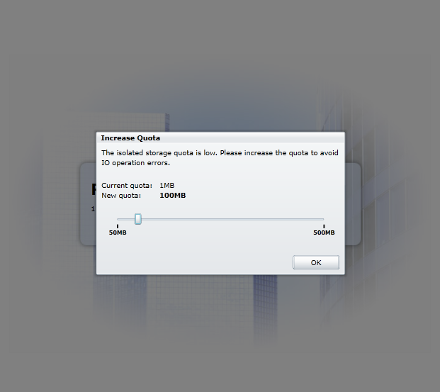
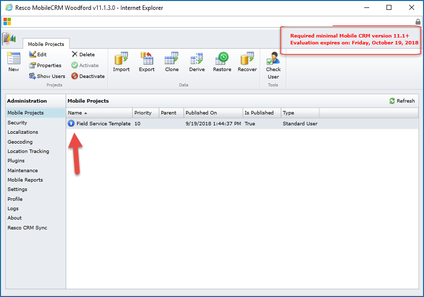
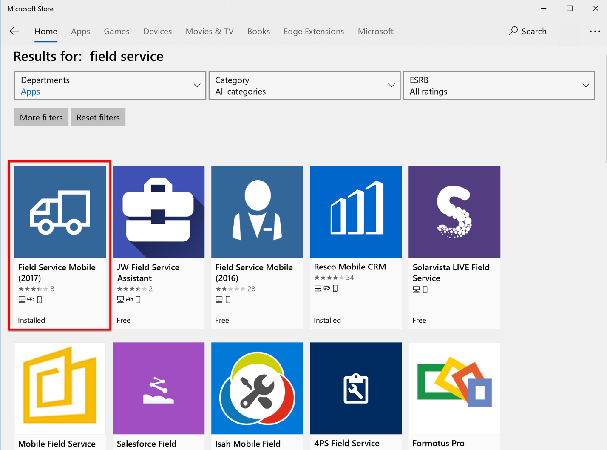

---
title: "Install Dynamics 365 for Field Service (Dynamics 365 for Field Service) | MicrosoftDocs"
ms.custom: "dyn365-fieldservice"
ms.date: 10/12/2018
ms.reviewer: ""
ms.suite: ""
ms.technology: 
  - "field-service"
ms.tgt_pltfrm: ""
author: "shellyhaverkamp"
ms.author: "FieldServiceDave"
ms.manager: "shellyhaverkamp"
search.audienceType: 
  - admin
  - customizer
  - enduser
search.app: 
  - D365CE
  - D365FS
--- 

# How to install Dynamics 365 for Field Service 

[!INCLUDE[cc-applies-to-update-9-0-0](../includes/cc_applies_to_update_9_0_0.md)]

This article describes how to install the Dynamics 365 for Field Service application for Dynamics 365 (online). It also includes steps to install the mobile solution, and describes how field technicians download and install the mobile app from their device's app store.

## Prerequisites
Before you begin, you need a Dynamics 365 (online) organization with system administrator access. If you don't already have one set up, [sign up for a Field Service trial](https://trials.dynamics.com/). 

> [!div class="mx-imgBorder"]
>   

## Install the application
You can add a trial or a purchased subscription of the Field Service application to a Dynamics 365 organization.

### Add a Field Service trial to a Dynamics 365 organization

1. Using system administrator credentials, sign in to the Dynamics 365 organization.

2. Go to **Settings > Microsoft AppSource**. Search for **field service trial**, select **Dynamics 365 for Field Service trial**, and then select **Free Trial**. 

> [!div class="mx-imgBorder"]
>   

3. In the **Organization to add the application to** drop-down list, select the Dynamics 365 organization name. Review the terms and conditions, and then select **Agree**. Installation may take several minutes. 
> [!div class="mx-imgBorder"]
> 

### Purchase a subscription of Field Service and add it to a Dynamics 365 organization

1. On the **Office365 Admin Center** go to **Billing > Purchase Services**. 
2. Select **Dynamics 365 for Field Service Enterprise Edition**, and then select **Buy now**. 
3. Follow the on-screen instructions to install the application. Installation may take several minutes.
> [!div class="mx-imgBorder"]
>   

### Verify that the installation is complete

1. Verify that the Field Service application is available from the Dynamics 365 Main Menu.
> [!div class="mx-imgBorder"]
>   

3. Verify that the Dynamics 365 custom application includes the Field Service module.
 
> [!div class="mx-imgBorder"]
>   

## Install the Field Service mobile solution

The mobile solution enables field technicians to use the mobile application and allows administrators to customize the mobile experience.

1. Open **Internet Explorer**.
2. Go to <https://www.resco.net/mobilecrm/woodford.html>. 
3. On the installation screen, select **Download for 2013, 2015 & 2016**. Save the downloaded file to a location other than the Downloads folder on your computer.
> [!div class="mx-imgBorder"]
>   

4. On the Dynamics 365 organization, go to **Settings > Solutions**. Select **Import**. 
> [!div class="mx-imgBorder"]
>   

 
5. On the **Select Solution Package** screen, select the Woodford\_\#\_\#\_\#\_\#\_managed.zip file, and then select **Next**.

> [!div class="mx-imgBorder"]
>   

6. After the import completes, verify that **Woodford** appears on the **Settings** menu. If you don't see it, refresh the page.

> [!div class="mx-imgBorder"]
>   

## Import the default mobile configuration

After you install the Field Service mobile solution, you need to download and import a template that allows you to configure the mobile app for the organization.

The template contains all customizations for the Field Service mobile app, and is called a **mobile project**. A mobile project allows you to customize the mobile experience across devices. For example, you use a mobile project to add, remove, and change fields, entities, views, and forms on the mobile app.

You use the Woodford admin interface to import a template, manage settings, set up mobile devices, and customize the mobile app for field technicians and other users. 

1. To open the Woodford admin interface, open Internet Explorer. In the Dynamics 365 organization, go to **Settings > Woodford > MobileCRM Woodford**.

> [!div class="mx-imgBorder"]
> 

2. Set the storage quota to 100MB, and then select **OK**.
> [!div class="mx-imgBorder"]
>   

3. Register yourself as a user.

4. Download and save the template file in a location other than the Downloads folder.

- [Download the mobile project template for December 2016 Update for Dynamics 365 (online) or later](https://go.microsoft.com/fwlink/p/?linkid=836310).  

- [Download the mobile project template for Dynamics CRM Online 2016 Update 1](http://go.microsoft.com/fwlink/p/?LinkId=808250).  

5. Import the template file.
> [!div class="mx-imgBorder"]
>   

6. In the **Add Mobile Project** dialog, enter a name and a priority. Assign the template to all field service security roles. Select **OK**.
> [!div class="mx-imgBorder"]
>   

7. Double-click the project template, and then select **Publish**. 

> [!Note]
> The published version number must match the version of the mobile app. To find the version of the mobile app, open the mobile app on a phone or tablet. On the home screen, select **About**. Note that the version only needs to match the first decimal.

> [!div class="mx-imgBorder"]
>   

8. Verify that the mobile configuration is published by checking that there is an arrow next to the project.
> [!div class="mx-imgBorder"]
>   

> [!Note]
> **Warning:** This is a trial license and is valid for 30 days. The trial can be extended for development and testing purposes. Purchasing a Dynamics 365 for Field Service license entitles you to a limited Woodford license. Request a Woodford trial extension at the following link: <https://docs.microsoft.com/en-us/dynamics365/customer-engagement/field-service/activate-fs-mobile-app-license>

## Download the Field Service Mobile (2017) app on a phone or tablet

Field technicians track work orders and on-site service calls using the mobile app on a phone or tablet.

To get the mobile app, download **Field Service Mobile (2017)** from the Windows, iOS, or Android app store.
> [!div class="mx-imgBorder"]
>   

## Next steps
- [Set up users and security roles](../field-service/view-user-accounts-security-roles.md)
- [Add sample data](../field-service/install-sample-data-8-x.md)

### See also
- [Frequently asked questions about the mobile solution](http://www.resco.net/mobilecrm/support.aspx) 
- [Woodford guide](https://www.resco.net/downloads/Woodford_Guide.pdf)  
