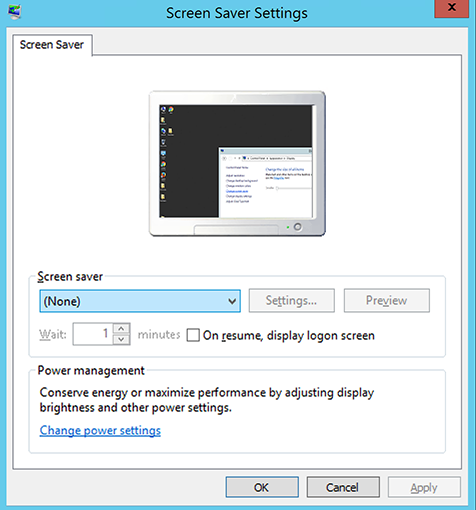
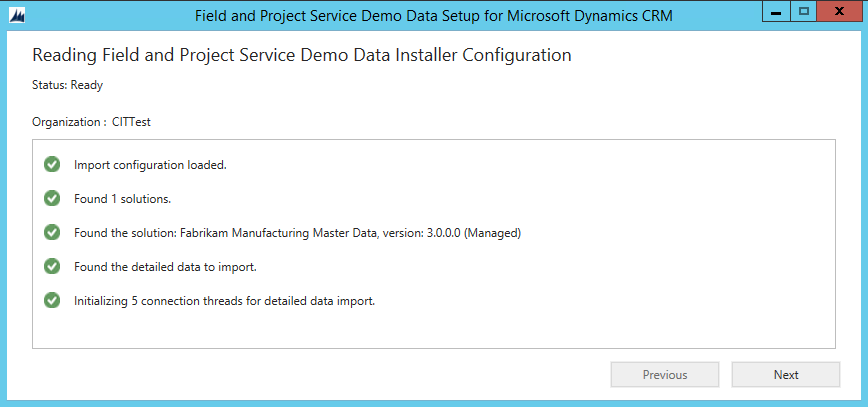
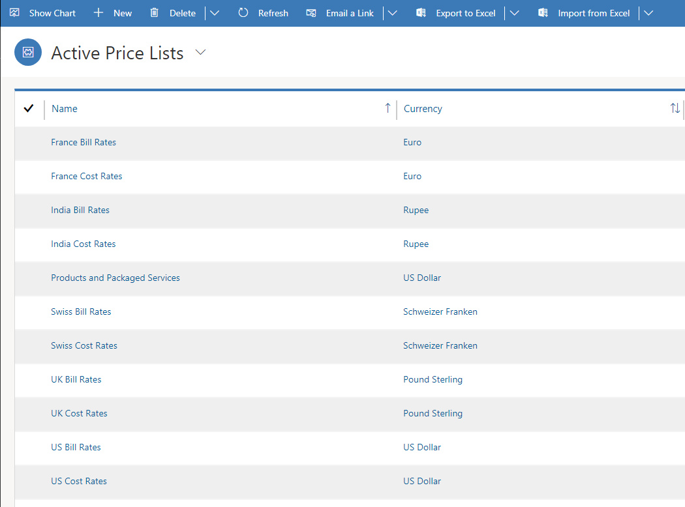
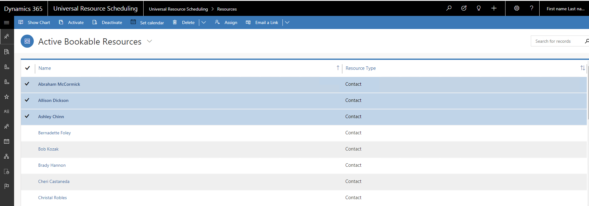

---
title: "Sample data installation (Dynamics 365 Field Service) | MicrosoftDocs"
description: Learn how to install sample data for Dynamics 365 Field Service
ms.custom: dyn365-fieldservice
ms.service: dynamics-365-customerservice
ms.date: 04/24/2020
ms.topic: article
ms.reviewer: krbjoran
author: FieldServiceDave
ms.author: daclar
ms.manager: shellyha
search.app: 
  - D365CE
  - D365FS
--- 

# Sample data installation for the Field Service application

To help you build your own demo environments, Microsoft provides downloadable sample data packages that showcase the capabilities of Dynamics 365 Field Service and Dynamics 365 Project Service.

The sample data is installable in three separate packages, so you can install data only for Field Service, or only for Project Service, or you can install sample data for both applications at once.

The sample data packages are:

- [**V902FSMasterData** - Field Service version 8.x only](https://go.microsoft.com/fwlink/?linkid=2026536&clcid=0x409)

- [**V902PSMasterData** - Project Service version 3.x only](https://go.microsoft.com/fwlink/?linkid=2026540&clcid=0x409)

- [**V902FPSMasterData** - Field Service 8.x and Project Service 3.x](https://go.microsoft.com/fwlink/?linkid=2026041&clcid=0x409)

- [**FPSAllDemoData** - Field Service 8.x and Project Service 3.x](https://aka.ms/fpsdemodatapackage) (includes sample work orders)

These sample data packages are available in English only.

**Important: There is no way to uninstall the sample data.** Only install these packages on demonstration, evaluation, training, or test systems. Also note that installing an individual package, and then installing the other individual package, is not supported. (In other words, you can't install **FSMasterData** followed by **PSMasterData**, or vice versa). If you see yourself needing sample data for both applications at any point in the future, you should install the **v902FPSMasterData** package.

When you install any of the sample data packages, the installation process performs the following actions:

- Creates or sets default parameters for using Field Service, Project Service, or both applications (if applicable).

- Imports sample data for the applications, such as bookable resources, application-specific roles, sales and cost price lists, organizational units, sales process records, and other entities to demonstrate key capabilities.  

Wondering what capabilities you can demo with the sample data? See the Fabrikam Robotics fictitious scenario below, under Technical notes.

If you have questions about installing these sample data packages, [send us an email at fpsdemodata@microsoft.com](mailto:fpsdemodata@microsoft.com).

## Requirements

The installation protocol assumes the following about your target instance (org):

- Dynamics 365 9.0.x or later

- Base language is English and base currency is US dollar (USD,$)

- The org has no Field Service or Project Service data already, or only has barebones default data that comes with any new org

- The correct version of the business application is already installed:

    - **For v902FPSMasterData:** The org has Field Service version 8.x and Project Service version 3.x installed.

    - **For v902FSMasterData:** The org has Field Service version 8.x installed.
    
    - **For v902PSMasterData:** The org has Project Service version 3.x installed.

**Note:** If you need to install the sample data on top of an existing Field Service and Project Service trial or demo environment that already has data (not recommended), you'll need to suspend the safety prechecks performed by the installer. For more information, see the technical notes below.

## Prepare for installation

Be sure to run the installer on a computer with a recent version of Windows (Windows 10 preferred).

Plan for the computer to remain connected to a network, and for the installation to run for up to one hour. (Normally the installation takes around 30 minutes for **FPSMasterData**, which includes sample data for both applications.)

The computer should have the screen saver function turned off. Otherwise, session credentials for the installation may be lost when the screen saver engages (unless you keep your session active throughout).

> [!div class="mx-imgBorder"]
> 

## Download and unpack

The Field Service and Project Service sample data installer is distributed as a self-extracting executable. The file names may vary depending on the sample data package, but otherwise the steps are the same no matter which package you install.

After downloading a package, run the EXE file, and then accept terms and conditions to unpack the compressed zip file. You then need to extract contents of that file to a folder on the computer.

Depending on the operating system and security settings, you may need to perform the following steps after unpacking the zip file:

1. Find and right-click the **FPSDemoData.dll** file in the **v902FPSMasterData** folder.

2. Choose **Unblock**.

3. Select **Apply**.

4. Select **OK**.

## Create or configure users

The **FPSMasterData** package is designed to install with one user named Spencer Low with the settings described here. To install the package correctly, you need to create (or temporarily rename) users in your Dynamics 365 to match the incoming sample data configuration.

To create or configure users, go to **Settings** > **Security** > **Users**, and do the following:

1. Set UserFullname="Spencer Low" with username "spencerl" (**lowercase**) to the Project Manager and Practice Manager roles.

2. Select the **Spencer Low** user, and then select **Manage Roles**. Find and select the **System Administrator** role, and then select **OK** to grant full admin rights to Spencer Low. This step is necessary to ensure that sample records are created with the correct user ownership and therefore populate views correctly.

3. From the downloaded package, you need to update a data-mapping file with email addresses of the default user context. To do this, open **PkgFolder**, and then find and open the **ImportUserMapFile.xml** file in Notepad (or Visual Studio or another XML editor). Set the **DefaultUserToMapTo=** field to the email address of the Spencer Low user.

4. If you aren't using Spencer Low with username **spencerl**, you need to update an additional file. Open the **DemoDataPreImportConfig.xml** file, and then find the **userstocreateandconfigure** tag. Update the **\<login\>** tag with the username of your Spencer Low user. For more information, see the technical notes below.

**Recommendation:** Consider creating a backup of your org now, in case you need to revert to your starting point if something goes wrong during the sample data installation. For more information, see [Backup and restore instances](https://docs.microsoft.com/dynamics365/customer-engagement/admin/backup-restore-instances).

## Run the Package Deployer

1. Find and run the **PackageDeployer.exe** in the **v902FPSMasterData** folder.

2. Accept the terms and conditions.

3. On the next window:

    a. Select deployment type **Microsoft 365**.

    b. Use the user and password of the system administrator user configured in "Create or configure users" ("Spencer Low" with "spencerl" username).

    c. Make sure **Display list of available organizations** is selected.

      > [!div class="mx-imgBorder"]
      > 

4. Select the Dynamics 365 organization where you want to install the sample data.

5. Select **Next** until you see the **Demo Data Setup** dialog.

    > [!div class="mx-imgBorder"]
    > 

6. Installing sample data could take up to one hour (normally ~10 minutes). You'll need to make sure the computer remains on and connected to a network throughout the installation process, and that your session remains active.   

7. When you're ready, select **Next** to start the sample data installation process. After the sample data is loaded, select **Finish**.

## Verify the sample data installation

For a sanity check, verify that the number of records and types of entities listed in Fabrikam Robotics fictitious scenario appear as expected.

After the sample data completely loads, sign in as the Spencer Low user and confirm the following:

- If the Project Service application is installed, go to **Project Service** > **Settings** > **Price Lists**. Confirm that bill rates and costs rates exist with the appropriate currency for each country/region in the data set.

- If the Project Service application is installed, go to **Universal Resource Scheduling** > **Settings** > **Organizational Units**. Confirm that a cost price list with the appropriate currency has been associated with each org unit (excluding city entries). If any are missing, find and associate the correct cost price list.

- If the Field Service application is installed, go to **Project Service** > **Settings** > **Price Lists**. Confirm that bill rates and costs rates exist. Go to **Field Service** > **Settings** > **Price Lists** and check that bill rates and costs rates exist, with the appropriate currency, for each country/region in the data set.

  > [!div class="mx-imgBorder"]
  > 

  > [!div class="mx-imgBorder"]
  > 

## Technical notes

### Installing sample data on top of existing data (not recommended)

If you need to install sample data on top of an existing Field Service or Project Service trial or demo environment that already has data, you'll need to suspend the safety prechecks performed by the installer.

To do this, go to the **PkgFolder** folder to find and open the **DemoDataPreImportConfig.xml** file with Notepad (or another XML editor).

Find the following value, and then change the setting from true to false:

```alias
<TerminateOnPreCheckFailure>true</TerminateOnPreCheckFailure>
```

This change causes the installer to bypass some important safety checks, including:

- Confirming that there is no more than one active **Organizational Unit** record, and then renaming it to **Fabrikam US**.

- Confirming that there is no more than one active **Work Template** record.

- Confirming that there is no more than one active **Project Parameter** record, and then renaming that entry to **Parameters**.

### Configuration components

There are a number of other configuration components in this pre-import configuration file. For technical users, some of these include:

- **\<RequiredSolutions\>** specifies prerequisite solution installations and their version numbers.

- **\<InstallSampleData\>** controls whether out-of-the-box sample data for the Dynamics 365 Sales and Service apps is installed.

    - false - skips installation of this built-in data (which is removable).

    - true - installs the built-in data concurrent with installation of the FS and PSA sample data.

- **\<PreImportDataCollection\>** specifies flat-file Data Maps and associated Records to be imported ahead of the main sample data installation.

- **\<EntitiesToEnableScheduling\>** specifies which entities should be enabled for Booking in Microsoft Dynamics Scheduling (also known as Universal Resource Scheduling).

- **\<UsersToCreateAndConfigure\>** specifies Bookable Resources that will be created (if they don't exist already) before the sample data import executes. Note that the source system sample data Bookable Resource match with the target system Bookable Resource records on the FullName and sign-in of each resource. Therefore, it is NOT possible to change the names in this preconfiguration file unless you first import sample data into a target system using these names, then rename the Bookable Resources to your desired name set along with the Enabled User records, and then export the data again for import into your final destination system (updating the **ImportUserMapFile.xml** Old and New entries accordingly.

- **\<PluginsToDisable\>** specifies discrete line-item plug-ins that must be disabled during the sample data import and then reenabled afterwards.

### Fabrikam Robotics fictitious scenario

The Field Service and Project Service sample data packages install the **Fabrikam Manufacturing Master Data (v3.0.0.0) solution**, along with approximately 4,000 records and approximately 40 different entities. The separate sample data packages for Field Service or Project Service contain a subset of the **v902FPSMasterData** sample data for that application.

The fictional company, Fabrikam Robotics, is a manufacturer of electronic device assembly line robots and is known for their product quality, innovation and solid customer service, including installation planning, implementation, and ongoing maintenance services. Fabrikam is headquartered in the United States (Fabrikam US), and has project-based service operations in France, India, the United Kingdom, and Switzerland.

Field service operations are centered in the United State, mostly in the greater Seattle area. The company is focused on leveraging Internet of Things (IoT) connectivity to monitor customer asset performance and deliver increasingly proactive onsite services.

A high-level overview of the sample data is as follows:

- Common sample data elements (included for both applications)

    - 1 user

    - 71 accounts

    - 137 contacts

    - Various transaction types and categories

    - 50 products with 1 product price list

    - 14 price/cost lists

    - 31 characteristics (resource skills) in 2 rating models with 3 levels (rating values)

- Field Service

    - 4 territories

    - 5 work order types

    - 22 customer assets

    - 9 incident types with a range of associated resource characteristics (9), services (13) and service tasks (13)
    
- Project Service

    - 8 organizational units

    - 6 role-specific utilization levels

    - 2.8k+ role-price specifications

### Change the work hours for sample resources

By default, all bookable resources have a default 24 work hours calendar.

If you need to change the work hours for sample bookable resources, go to **Universal Resource Scheduling** > **Scheduling** > **Resources**.

Select a user (for example, Spencer Low) and change Spencer's work hours to the hours you want to apply to multiple users. Go to **Universal Resource Scheduling** > **Settings** > **Work Hour Templates** and edit the **Default Work Template** record. In the **Template Resource** field, select a user with work hours that you want to apply to other resources. Go to **Universal Resource Scheduling** > **Scheduling** > **Resources** > **Active Bookable Resources**. Select the resources you want to change, and then select **Set Calendar**. On the **Work Template** drop-down list, select the **Default Work Hour** template or another template with the correct templating resource. When you go the schedule board, you should be able to see that the resources now have updated work hours.

> [!div class="mx-imgBorder"]
> 

## Sample data for older version of Field Service

The installation package for older versions of Field Service is available on the [Microsoft Download Center](https://go.microsoft.com/fwlink/?linkid=859966).  

Running the Package Deployer install performs the following actions:
  
-   Creates or sets default parameters that drive behavior of Project Service  
  
-   Imports sample data such as Bookable Resources, Roles, Sales and Cost Price lists, Organizational Units, relevant sales process records, Work Orders, and Projects    
  
> [!IMPORTANT]
> **There is no way to un-install the demo data.** Therefore, you should only use this package on demonstration, evaluation, training and test systems.

For more information, see this [blog](https://blogs.msdn.microsoft.com/crm/2017/10/24/microsoft-dynamics-365-for-field-service-and-project-service-automation-sample-data).


### See Also  
 [Overview of Field Service](../field-service/overview.md)   


[!INCLUDE[footer-include](../includes/footer-banner.md)]