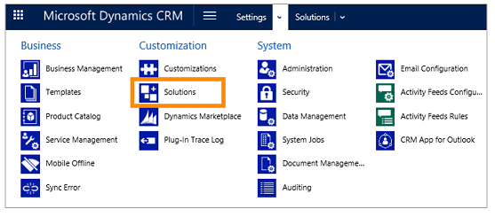
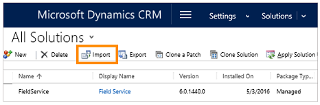
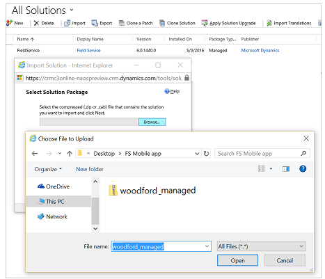
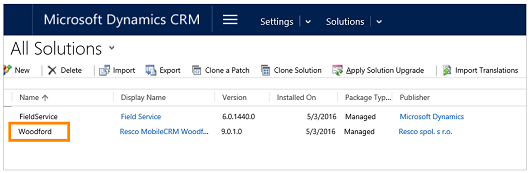
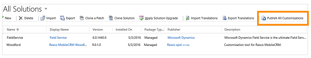
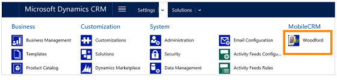
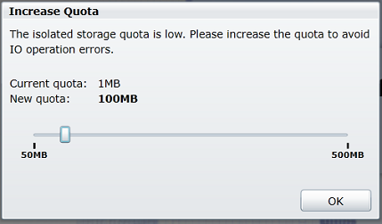
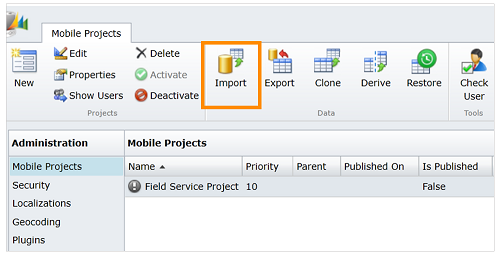
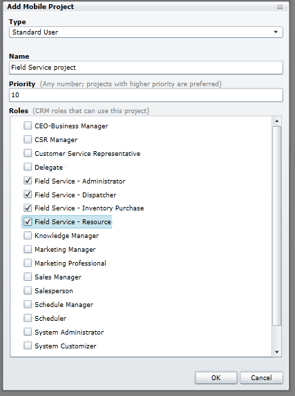
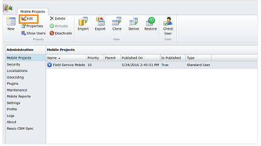

# Install the Field Service mobile app

[!INCLUDE[cc-applies-to-update-9-0-0](../includes/cc_applies_to_update_9_0_0.md)]

Solve customer issues quickly with [!INCLUDE[pn_fieldservice_mobile_app_long](../includes/pn-fieldservice-mobile-app-long.md)] (mobile). You can dispatch, route, and complete work orders, manage invoices, and more with the mobile app.  
  
 [!INCLUDE[pn_fieldservice_mobile_app_short](../includes/pn-fieldservice-mobile-app-short.md)] (mobile) is a solution built on the Resco Mobile Dynamics 365 platform. [!INCLUDE[proc_more_information](../includes/proc-more-information.md)] [Frequently asked questions about the Resco app](http://www.resco.net/mobilecrm/support.aspx)  
  
 To customize [!INCLUDE[pn_fieldservice_mobile_app_short](../includes/pn-fieldservice-mobile-app-short.md)] (mobile), you need to  install the Resco Mobile Dynamics 365 Woodford solution. This lets you configure mobile behavior around your business needs. If you don’t need to customize the app just yet, you can  use the default field service mobile configuration.  
  
 Before you can start configuring [!INCLUDE[pn_fieldservice_mobile_app_short](../includes/pn-fieldservice-mobile-app-short.md)] (mobile)  beyond what is shipped out of the box from the app store, your [!INCLUDE[pn_crm_shortest](../includes/pn-crm-shortest.md)] admin will need to install the Woodford mobile solution for your [!INCLUDE[pn_crm_online_subsequent](../includes/pn-crm-online-subsequent.md)] account.  
  
   
## Step 1: Download and install the Resco Mobile Dynamics 365 Woodford mobile solution  
 You need administrator permissions to install the Mobile Dynamics 365 Woodford mobile solution for field service capabilities in [!INCLUDE[pn_crm_shortest](../includes/pn-crm-shortest.md)] . You also need to use [!INCLUDE[pn_Internet_Explorer](../includes/pn-internet-explorer.md)] with [!INCLUDE[pn_Silverlight_short](../includes/pn-silverlight-short.md)] or [!INCLUDE[tn_Firefox](../includes/tn-firefox.md)].  
  
1.  Download and save the Woodford mobile solution from the [Resco site](http://go.microsoft.com/fwlink/p/?LinkId=808248) to your computer.  
  
2.  To perform the next steps, sign in to your [!INCLUDE[pn_crm_shortest](../includes/pn-crm-shortest.md)] account. [!INCLUDE[proc_permissions_system_admin](../includes/proc-permissions-system-admin.md)]  
  
3.  From the main menu, click **Settings** > **Solutions**.  
  
   
  
4.  On the **All Solutions** page, click **Import**.  
  
   
  
5.  In the **Import Solution** dialog box, click **Browse**, and then choose the Woodford file you downloaded in Step 1.  
  
   
  
6.  Click **Next** to start the import. When the import is complete, click **Close**. You should see **Woodford** listed on the **All Solutions** page.  
  
   
  
7.  To publish the Woodford solution, click **Publish All Customizations**, and then refresh the page.  
  
   
  
8.  You should now see the **Woodford** solution listed on the **Settings** menu. To verify this, go to **Settings**, and then click **Woodford**.  
  
    > [!IMPORTANT]
    >  If you don’t see **Woodford** under the **Settings** menu, refresh the page.  
  
   
  
9. In the **Increase Quota** dialog box, set the quota to 100MB, and then click **OK**.  
  
   
  
10. In the **Register User** dialog box, enter your user information, and then click **Register**.  
  
11. In the **Update available** dialog box, when you're prompted about an available update, click **Later**.  
  
   
  
     You have now installed the solution.  
  
   
## Step 2: Import the field service mobile project template into the Woodford solution  
 After the Woodford solution is installed, you’ll need to download a template that will help you configure the mobile app. The template is required if you are using the Woodford solution.  
  
> [!NOTE]
>  For the mobile app for field service capabilities for [!INCLUDE[pn_microsoftcrm](../includes/pn-microsoftcrm.md)] to work, the Woodford solution and Woodford template  are required. See the steps below to download and install the Woodford template.  
  
 The template contains all customizations for the field service mobile app. You can use it to add, remove, and change fields, entities, views, and forms.  
  
1.  Download and save the temple file.  
  
    -   If you are on [!INCLUDE[pn_crm_8_2_0_online](../includes/pn-crm-8-2-0-online.md)], use this  [mobile project template](https://go.microsoft.com/fwlink/p/?linkid=836310)  
  
    -   If you are on [!INCLUDE[pn_crm_8_1_0_online](../includes/pn-crm-8-1-0-online.md)], use this  [mobile project template](http://go.microsoft.com/fwlink/p/?LinkId=808250)  
  
2.  In [!INCLUDE[pn_crm_shortest](../includes/pn-crm-shortest.md)], go to **Settings** > **Woodford** , and then click **MobileCRM Woodford**.  
  
3.  Click **Import**, and then import the mobile project template file that you saved in Step 1.  
  
   
  
4.  In the **Add Mobile Project** dialog box do this:  
  
    1.  For **Type**, select **Standard User**.  
  
    2. **Name** the template.  
  
    3.  Set the **Priority**.  
  
        > [!NOTE]
        >  A user who signs in to the mobile app will see the customizations for the project that is assigned to their security role. If a user has more than one security role for which there is a project assigned, then the project with the highest priority will download to the user’s device.  
  
    4.  For **Roles**, select the roles you want this mobile template to apply to, and then click **OK**. A user who signs in and has a role that matches the role you select here, will inherit this configuration on their mobile app.  
  
   
  
5.  To publish the template file, on the **Mobile Project** tab, click **Edit**.  
  
    > [!NOTE]
    >  Change the published version to match the version of the app you have installed. To see which version of the mobile app you have installed, open your mobile app and from the home screen, and then tap **About**.  
    >   
    >  Make sure to match the first two numbers of the mobile app that you have installed to the published version in the project. If the number of the published version of the project is greater than the app version, you see an error about unsupported metadata  when you try to sync. The version only needs to match the first decimal.  
  
   
  
6.  On the next screen, click **Publish All**.  
  
 Next, install the app on your mobile device. [!INCLUDE[proc_more_information](../includes/proc-more-information.md)] [Field Service Mobile App User’s Guide](../field-service/field-service-mobile-app-user-guide.md)  
  
   
## Privacy notice  
 [!INCLUDE[cc_privacy_field_service_mobile_app](../includes/cc-privacy-field-service-mobile-app.md)]
  
### See also  
 [Overview of Dynamics 365 for Field Service](../field-service/overview.md)   
 [Install](../field-service/install-field-service.md)   
 [Configure default settings](../field-service/configure-default-settings.md)   
 [View user accounts and security roles](../field-service/view-user-accounts-security-roles.md) 
 [User's Guide](../field-service/user-guide.md)  
