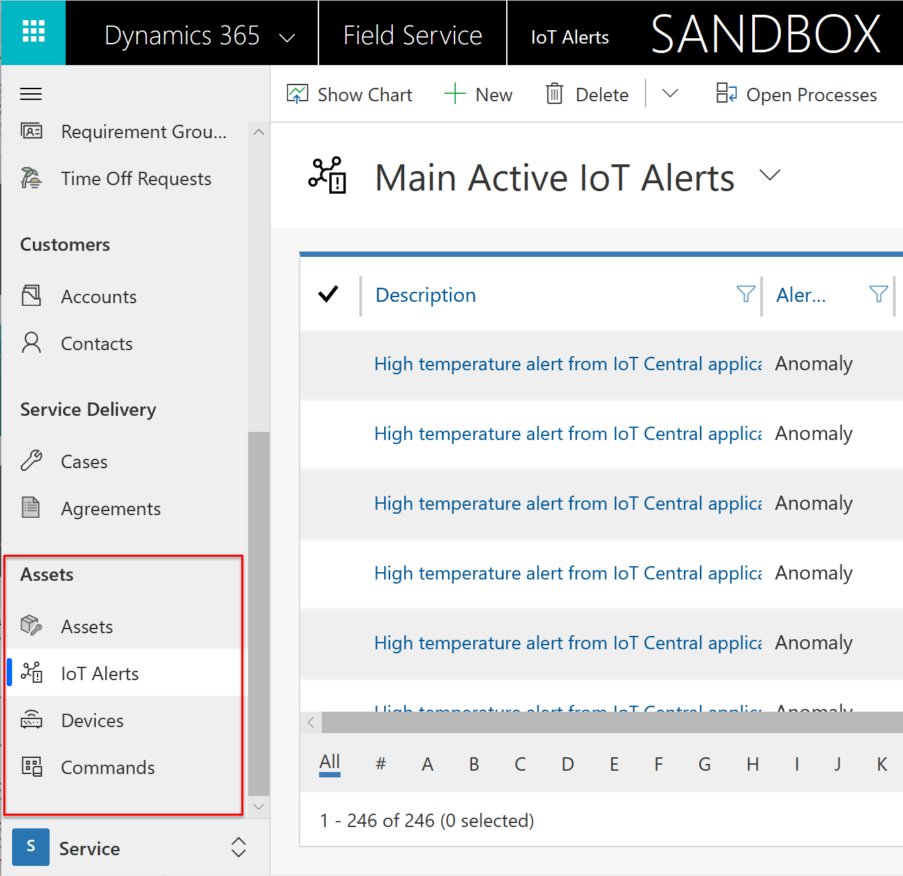
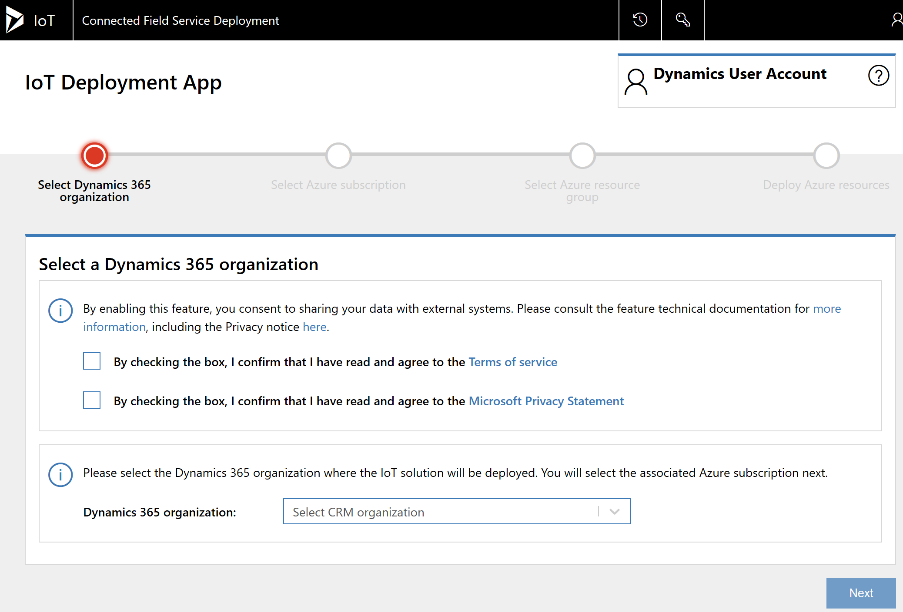
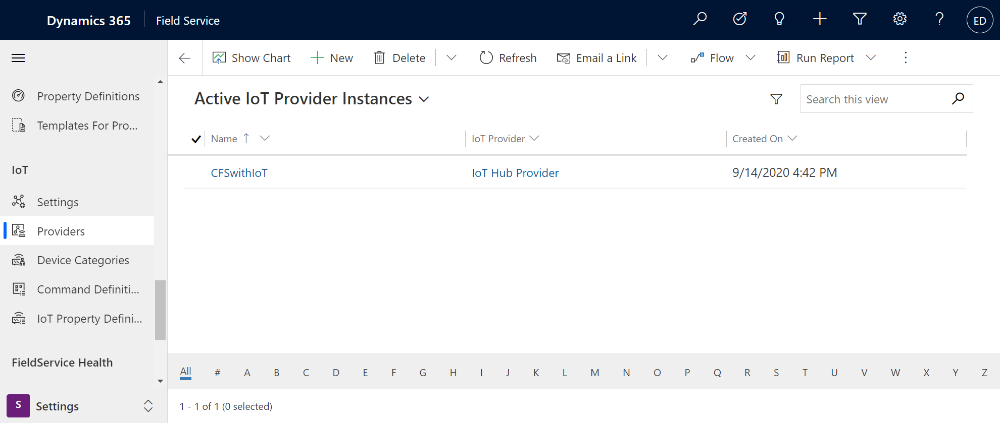
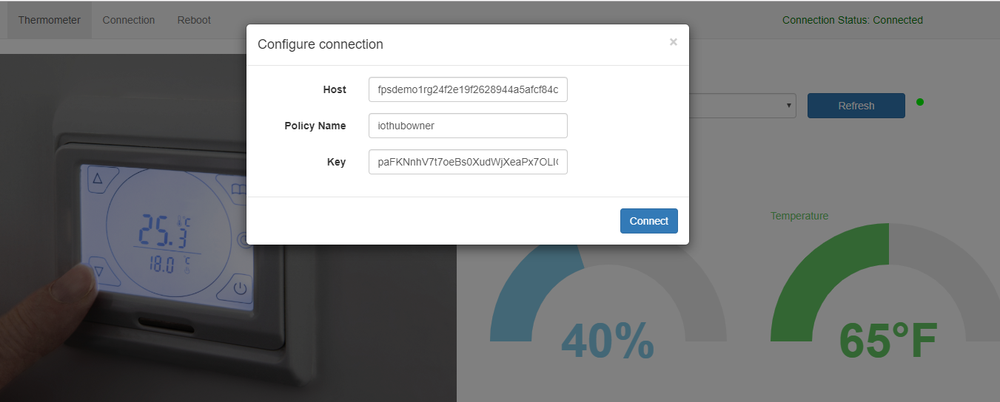
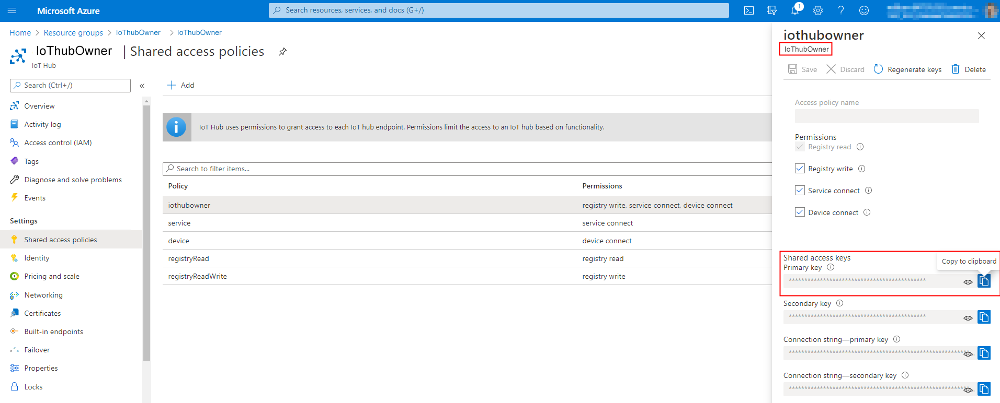

# Installation and setup - Connected Field Service for Azure IoT Hub

This guide provides all the steps required for getting up and running with Connected Field Service (CFS) for IoT Hub.

## Prerequisites

 Ensure the following before configuring Connected Field Service.
  
- Dynamics 365 Field Service. For more information, visit the [article on installing Dynamics 365 Field Service](../field-service/install-field-service.md).
  
- Assign your Dynamics 365 user the System Administrator and IoT-Administrator security roles. 

- An active Azure subscription with appropriate privileges. For more information, see the [article on Azure prerequisites](cfs-azure-subscription.md).

## Step 1: Install or upgrade Field Service  
 
Connected Field Service is included with Dynamics 365 Field Service. Creating a new Field Service environment or upgrading an existing one to v7.5.5 or v8.3+ will automatically include the following Connected Field Service entities and related processes:

- Assets
- IoT alerts
- Devices
- Commands
 
> [!div class="mx-imgBorder"]
> 

Verify you have the Connected Field Service entities in your environment.

## Step 2: Deploy Connected Field Service and Azure resources 

Next, deploy and connect Azure IoTHub to your Field Service environment by going to [https://cfsdeployment.crm.dynamics.com/](https://cfsdeployment.crm.dynamics.com/) and following the instructions.

> [!div class="mx-imgBorder"]
> 

> [!Note]
> If you are using an older version of Field Service and cannot upgrade, you can add the connected field service solution  you your field service environment from the app store. 
  1. Sign in to [https://admin.microsoft.com](https://admin.microsoft.com) with your Global Administrator or Dynamics 365 system administrator credentials.  
  2. Select **Admin centers** > **Dynamics 365**  
  3. Select the **Applications** tab, and then select **Connected Field Service**.  
  4. Select **Manage**.  
  5. Read and accept the **Terms of service**.  
  6. In the **Installing Azure Required Assets** dialog box, enter your Azure account, select **Sign In User**, and then  follow the sign-in process.  
  7. In the **Selecting Azure Subscription** dialog box, select the Azure subscription that you want to create resources under and then select **Next**.  
  8. In the **Choose a resource group** dialog box, create a new resource group or use an existing resource group.  
  9. **Optional Step for Power BI**.  To install the Azure SQL database that is used for Power BI, check the **Enable Power BI Integration** box, and then enter the Azure SQL database user name and password. 
  10. Select **Deploy**.  
  
Before proceeding, make sure all required Azure resources are successfully deployed and that the overall deployment status is **Success**.  

## Step 3: Authorize Azure app connection 

After you’ve installed all required Azure resources, select **Authorize** to configure the Dynamics 365 connector connection API. When you configure the connection API, you’ll need to enter your Dynamics 365 subscription account. See more details in the article on [Authorize API connection between Dynamics 365 and AzureIoT](./cfs-authorize-api-connection.md).

Back in Dynamics 365 Field Service, go to **Settings** > **Providers** to see your Azure IoT Hub subscription connected as an IoT provider.

> [!div class="mx-imgBorder"]
> 
  
## Step 4: Set up the simulator (optional) 

The simulator will allow you to test Connected Field Service without the need to connect physical hardware. By simulating IoT devices and data, you can understand all the different parts that contribute to turning IoT data into work orders. 

Set up the simulator to simulate IoT devices and data and begin to see device data pulled into Field Service.

To find the simulator URL, sign in to your Azure subscription, and then select the App Service resource type under the newly created resource group. You’ll see the URL is in the top-right corner. Copy the URL and complete the following steps:  
  
1. Paste the URL into your browser’s address bar to load the page.  
  
2. When the simulator page opens, select **Configuration**.  
  
3. Enter the IoT hub host name and key. The host is simply the name of the IoT Hub resource in Azure portal. 

> [!div class="mx-imgBorder"]
> 

 The key can be accessed by selecting the IoT Hub resource and going to the shared access policies, then copying the primary key for **iothubowner** as seen in the following screenshot.

> [!div class="mx-imgBorder"]
> 
  
1. Select the IoT hub in the **Resource Group**.  
  
2. On the left under **General**, select **Shared access policies** to get the host name and primary key.  
  
3. Make sure **Connection status**  is marked as **Connected** and then close the dialog box.  

Now you can send a test command by using the sample simulator. For example, select the temperature and increase it to above 70 degrees. The simulator is preprogrammed to create an IoT alert if temperature is above 70 degrees.

## Next steps

1. [Register devices](cfs-register-devices.md)
2. [Pull device data](cfs-pull-device-data.md)
3. [Visualize device readings](cfs-visualizations-iot-hub.md)

## Privacy notice
[!INCLUDE[cc_privacy_crm_connected_field_service](../includes/cc-privacy-crm-connected-field-service.md)]

[Azure Time Series Insight (Preview)](/azure/time-series-insights/)

[Connected Field Service Device Readings (Preview)](cfs-visualizations-iot-hub.md) uses Azure Time Series Insight to store, process, and query IoT devices measurements from IoT Hub.

[!INCLUDE[footer-include](../includes/footer-banner.md)]