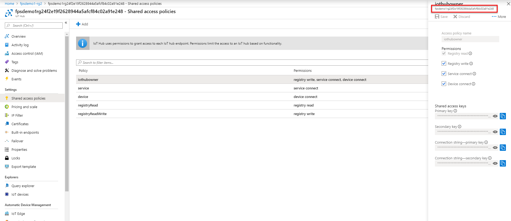

# Installation and setup - Connected Field Service for IoT Hub

This guide provides all the steps required for getting up and running with Connected Field Service (CFS) for IoT Hub. If you're looking for information about CFS for IoT Central, be sure to visit our tutorial on getting set up.

## Prerequisites  
 Before you install Connected Field Service, make sure you have the following:  
  
- Dynamics 365 Field Service. For more information, visit the [topic on installing Dynamics 365 Field Service](../field-service/install-field-service.md).
  
- Dynamics 365 system administrator credentials. For users with Office 365 global administrator access, they must be assigned the **System Administrator** security role within the Dynamics 365 organization.
  
- An IoT – Administrator role in the IoT solution (to access IoT entities and IoT functionality), plus another role, like Field Service – Dispatcher (to access Dynamics 365).  
  
- An active Azure subscription with appropriate privileges. See our [topic on Azure prerequisites](cfs-azure-subscription.md) for more information.
  
- Microsoft Power BI PRO and the sample report template. [!INCLUDE[proc_more_information](../includes/proc-more-information.md)] [Download the Power BI Template for Connected Field Service](https://download.microsoft.com/download/E/B/5/EB5ED97A-A36A-4CAE-8C04-333A1E463B4F/PowerBI%20Report%20Template%20for%20Connected%20Field%20Service%20for%20Microsoft%20Dynamics%20365.pbix)  
  
   

## Install Connected Field Service  
 
Connected Field Service is included with Dynamics 365 Field Service. Creating a new Field Service environment or upgrading an existing one to v7.5.5 or v8.3+ will automatically include the following Connected Field Service entities and related processes:

 - Assets
 - IoT alerts
 - Devices
 - Commands
 
 
> [!div class="mx-imgBorder"]
> 

Verify you have the Connected Field Service entities in your environment.

Next, deploy and connect Azure IoTHub to your Field Service environment by going to [https://cfsdeployment.crm.dynamics.com/](https://cfsdeployment.crm.dynamics.com/) and following the instructions.

> [!div class="mx-imgBorder"]
> 

> [!Note]
> If you are using an older version of Field Service and cannot upgrade, you can add the connected field service solution  you your field service environment from the app store. 
  1. Sign in to [https://admin.microsoft.com](https://admin.microsoft.com) with your Global Administrator or Dynamics 365 system administrator credentials.  
  2. Select **Admin centers** > **Dynamics 365**  
  3. Select the **Applications** tab, and then select **Connected Field Service**.  
  4. Select **Manage**.  
  5. Read and accept the **Terms of service**.  
  6. In the **Installing Azure Required Assets** dialog box, enter your Azure account, click **Sign In User**, and then  follow the sign-in process.  
  7. In the **Selecting Azure Subscription** dialog box, select the Azure subscription that you want to create resources under and then click **Next**.  
  8. In the **Choose a resource group** dialog box, create a new resource group or use an existing resource group.  
  9. **Optional Step for Power BI**.  To install the Azure SQL database that is used for Power BI, check the **Enable Power BI Integration** box, and then enter the Azure SQL database user name and password. 
  10. Select **Deploy**.  
  
Before proceeding, make sure all required Azure resources are successfully deployed and that the overall deployment status is **Success**.  

After you’ve installed all required Azure resources, click **Authorize** to configure the Dynamics 365 connector connection API. When you configure the connection API you’ll need to enter your Dynamics 365 subscription account. See more details in the topic on [Authorize API connection between Dynamics 365 and AzureIoT](./cfs-authorize-api-connection.md).
  
### Set up the sample simulator (optional)  
 To find the simulator URL , sign in to your Azure subscription, and then click the App Service resource type under the newly created resource group. You’ll see the URL is in the top right corner. Copy the URL and complete the following steps:  
  
1. Paste the URL into your browser’s address bar to load the page.  
  
2. When the simulator page opens, click **Configuration**.  
  
3. Enter the IoT hub host name and key. The host is simply the name of the IoT Hub resource in Azure portal. 

> [!div class="mx-imgBorder"]
> 

 The key can be accessed by clicking on the IoT Hub resource and going to the shared access policies, then copying the primary key for **iothubowner** as seen in the following screenshot.

> [!div class="mx-imgBorder"]
> 
  
4. Select the IoT hub in the **Resource Group**.  
  
5. On the left under **General**, click **Shared access policies** to get the host name and primary key.  
  
6. Make sure **Connection status**  is marked as **Connected** and then close the dialog box.  
  
   Now you can send a test command by using the sample simulator. For example, click the temperature and increase it to  above 70 degrees.  
  
   
## Register devices that you want to monitor in Dynamics 365

To monitor a device, you need to create and register an asset.  
  
1.  From the main menu  click, **Field Service** > **Customer Assets**.  
  
2.  On the command bar click **New**.  
  
3.  Use the helpful tooltips to fill in information.  
  
4. **Connected Device Attributes**: to register the device with the IoT hub, make sure you enter a **Device ID**.  
  
5.  When you’re done, click **SAVE** and a record will be created.  
  
6.  On the command bar click, **REGISTER DEVICES**.  
  
7.  Click **OK** in the registration box that appears.  
  
8.  When the device is registered, it will appear as a registered asset. To verify the registration, from the main menu click **Field Service**  > **Registered Assets**.  
  
### Set up a Power BI chart (optional)  
 Set up Power BI  accounts and open the sample .pbix report.  
  
1. Go to [https://powerbi.microsoft.com](https://powerbi.microsoft.com) and create a free Power BI account .  
  
2. [Install Power BI Desktop](https://powerbi.microsoft.com/desktop/).  
  
3. Sign in to Power BI Desktop with the Power BI user credentials (we recommend that this user is the same as the Dynamics 365 user).  
  
4. Download and open the sample Power BI template.  
  
   The Power BI report will open with errors because it was created with a sample SQL database and user. Update the query with your SQL database and user, and then publish the report to Power BI.  
  
#### Update the query to point to your SQL database  
  
1. Click **Edit Queries**.  
  
2. Click **Advanced Editor**.  
  
3. Replace the source SQL database with the database provisioned in your Azure resource group.  
  
4. Click **Close and Apply**.  
  
    You can find your SQL server name in the SQL database in the Azure portal.  
  
5. Add your IP address to the SQL server firewall to allow Power BI Desktop to connect to the SQL server.  
  
6. Copy the IP address when you see this message.  
  
     
  
7. Go to the Azure portal, open the SQL server, and add your IP address to the firewall.  
  
#### Publish to your Power BI account  
  
1.  Save your changes and publish.  
  
2.  Once you publish, Power BI Desktop will provide a link and message that instructs you to open the report and provide credentials.  
  
3.  Once the report is open, you’ll see notifications to edit your credentials.  
  
4.  Enter the SQL server admin user name and password to allow Power BI to access your database.  
  
5.  In the Power BI  sidebar, open the report and pin these tiles to a dashboard. You can create a dashboard or pin to an existing one.  
  
6.  Save the dashboard, and then share it with any users who have permissions to see the dashboard and tiles.  
  
    -   In the top right corner of the dashboard, click **Share**, enter the users email address, and click the **Share** button .  
  
#### Pin the tile in Dynamics 365  
  
1.  Open the device, alert, or asset form.  
  

    > [!IMPORTANT]
    >  The device that is related to any of the open forms must have a device ID and be registered; otherwise, the PowerBI section will be hidden.

2.  The first time you  will need to specify the tile you want pinned. After that, the tile will load when you go to the page.

    1.  Click the **Add** button.

    2.  A configuration window displays. Sign in if prompted.

    3.  Pick your dashboard and tile.

         A preview of the tile will load; however, if you have not run the simulator for that device, there will be no data, as shown here.

3.  Save the tile.

4.  The config window closes, and the Power BI section reloads with the pinned tile.

5.  The tile is filtered to the device ID of the current entity.

6.  The next time you load any of the device, alert, or asset forms, the Power BI section will load the tile automatically, filtered to the current entity device ID (if there is a device ID and the device has been registered).

### Add devices to an asset
 If you have a device with more parts that you want to monitor, instead of creating separate asset records for each part, you can create one asset record and add the parts to it.

1.  From the main menu click **Field Service** > **Registered Assets**.

2.  From the list of existing assets, open the asset record that you want to add parts to.

3.  To add parts, in the **Connected Devices** section, click the **See the records associated with this view** button.

4.  Click **Connect**, and then click **To Another** or **To Me**.

5.  Use the helpful tooltips to fill in the rest of the information and then click **Save**.

### Register multiple existing assets

1.  To register multiple assets at once, click **Field Service** > **Customer Assets**.

2.  From the list of assets, select the assets that you want to register.

3.  On the command bar, click **REGISTER DEVICES.**

4.  Click **OK** in the registration dialog box that appears.

5.  When the device is registered, it will show up as a registered asset. To verify the registration, from the main menu click **Field Service** > **Registered Assets**.

### Register an asset on the mobile app
 Before you can register assets on the mobile app, you will first need to install the mobile app. [!INCLUDE[proc_more_information](../includes/proc-more-information.md)] [Field Service Mobile App User’s Guide](../field-service/field-service-mobile-app-user-guide.md)

1.  On your mobile device, open the mobile app.

2.  Tap **Customer Assets**, and then tap the **Add** button.

3.  Fill in the asset information and, then  tap **Register Device**.

> [!NOTE]
>  You cannot associate an asset with a device using the mobile app.  
  
### Registration error  
 When a device does not register, you will see an error in the Registration Status field of the asset record. For assets with multiple devices, device status will show the error message for each device.  
  
 This error may occur if Dynamics 365 is not connected to Azure or if Azure is offline.  
  
### View a device's registration history  
  
1.  From the main menu, click **Internet of Things** > **Registered Devices**.  
  
2.  Click an IoT device record to open it.  
  
3.  In the Category field, use the search button to find and to add the device to a category.  
  
   
## Categorize devices  
 You can also manage devices by categorizing them. For example, you can categorize devices by the commands they support, the type of device, or by devices that break down more often.  
  
### Create a new IoT device category  
  
1.  From the main menu, click **Internet of Things** > **Device Categories**.  
  
2.  On the command bar, click **New**.  
  
3.  Enter a **Name** for the device category.  
  
4.  Use the helpful tooltips to fill in information.  
  
5.  When you're done click **Save**.  
  
6.  Open the IoT device category record that you created.  
  
7.  In the **Devices** section, click **Add IoT Device record** , and  then add a device to the category.  
  
### Add devices to an existing category  
  
1.  From the main menu click, **Internet of Things** > **Registered Devices**.  
  
2.  Click an IoT device record to open it.  
  
3.  In the **Category** field, use the search button to find and add the device to a category.  
  
   
## View device readings  
 Once a device is registered, you can open the record to view the readings sent by the device. For example, if you’re monitoring a thermostat, your reading will show the thermostat temperature.  
  
 By default, you can view the last 20 readings. You can change the default setting in the Power BI report by using Power BI Desktop.  
  
1.  To view a device reading, from the main menu, click **Field Service** > **Customer Asset**.  
  
2.  From the list of assets, choose an asset and open the record.  
  
3.  Refer to the **Connect Device Readings** section to view the device readings.  
  
   
## Remotely send commands to a registered device  
 When a device isn’t working properly, the system receives an alert. To troubleshoot the issue remotely, you can send a command by choosing a registered device or by using an existing IoT alert.  
  

> [!NOTE]
>  When you receive multiple alerts from the same device, the alerts will be listed in hierarchical order. You can change the grouping by changing the IoT - Parent IoT Alerts workflow.

### Send commands from a registered asset

1.  From the main menu, click **Field Service** > **Registered Assets**.

2.  From the list of assets, choose a registered asset or device.

3.  On the command bar, click **CREATE COMMAND**.

4.  Enter a **Name** for the command.

5.  In the **MESSAGE TO SEND** box, copy and paste one of these supported commends. `{"CommandName":"Reset Thermostat","Parameters":{}}` `{"CommandName":"Notification","Parameters":{"Message":"Technician has been dispatched"}}` `{"CommandName":"Set Values","Parameters":{"Reading":{"Temperature":"30","Humidity":"30"}}}`

    > [!NOTE]
    >  Before sending a command make sure there are no spaces or extra characters in the command.

6.  On the command bar, click **SEND&CLOSE** to send the command.

### Respond to an alert

1.  Navigate to **Field Service** > **IoT Alerts**.

2.  Choose an existing IoT alert record.

3.  On the command bar, click **CREATE COMMAND**.

4.  Enter a **Name** for the command.

5.  In the **MESSAGE TO SEND** box, copy and paste one of the supported commands listed section above.

6.  On the command bar, click **SEND&CLOSE** to send the command.

### View history of commands sent to a device

1.  From the main menu, click **Field Service** > **Customer Assets**.

2.  From the list, choose an asset.

3.  Scroll down to the **Command** section to view the history.

## Create business process flows to automatically handle incoming IoT alerts
 When you receive an alert from a device, your service team can manually monitor the alerts and troubleshoot the issue remotely. If the issue is not resolved by sending a remote command, the service rep can create a case or work order and dispatch a field tech. The provided business process flow guides you through the process of manually responding to IoT alerts. [!INCLUDE[proc_more_information](../includes/proc-more-information.md)] [Create a business process flow](../customize/create-business-process-flow.md)

 List of default IoT actions:

-   IoT- Parent IoT Alerts (Action)

-   IoT- Register Customer Entity (Action)

-   IoT- Register Device (Action)

-   IoT – Debounce IoT Alerts (Action)

-   JSON-Based Field Value - Get Number (Action)

-   JSON-Based Field Value - Get String (Action)

-   JSON-Based Field Value - Get Boolean (Action)

## View the IoT dashboard
 The default IoT dashboard provides data on registered devices and alerts. [!INCLUDE[proc_more_information](../includes/proc-more-information.md)] [Create or customize dashboards](../customize/create-edit-dashboards.md)

1.  From the main menu, click **Field Service** or **Internet of Things**.

2.  Click **Dashboard**.

    -   The first chart shows alerts that you can sort by clicking the IoT **Alerts by** menu.

    -   The second chart shows alerts by time.

    -   The third chart shows alerts along with the action taken to resolve the issue.

## Privacy notice
 [!INCLUDE[cc_privacy_crm_connected_field_service](../includes/cc-privacy-crm-connected-field-service.md)]

[Azure Time Series Insight (Preview)](https://docs.microsoft.com/azure/time-series-insights/)

[Connected Field Service Device Readings (Preview)](cfs-visualizations-iot-hub.md) uses Azure Time Series Insight to store, process, and query IoT devices measurements from IoT Hub.

### See also
 [Overview of Dynamics 365 Field Service](../field-service/overview.md)
 [Install Dynamics 365 Field Service](../field-service/install-field-service.md)
 [Configure default settings](../field-service/configure-default-settings.md)
 [View user accounts and security roles](../field-service/view-user-accounts-security-roles.md) 
 [Field Service User Guide](../field-service/user-guide.md)
