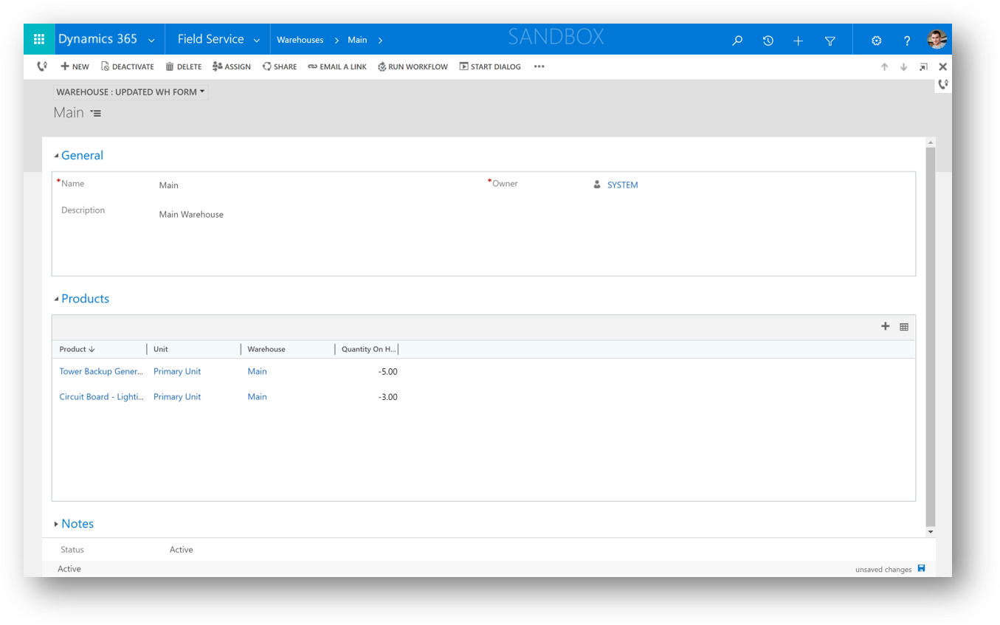
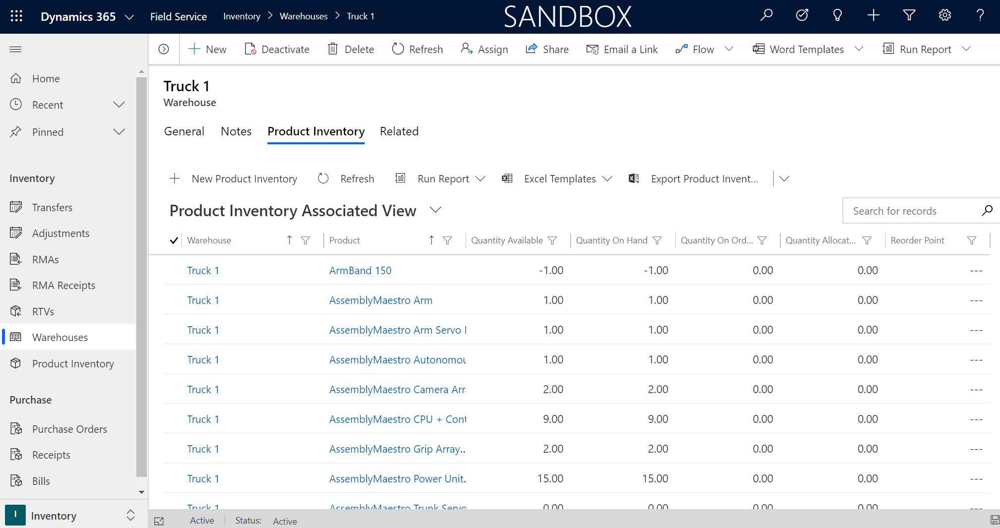
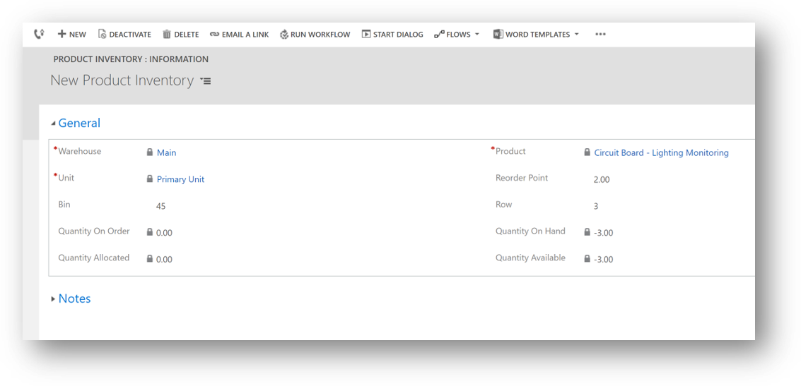
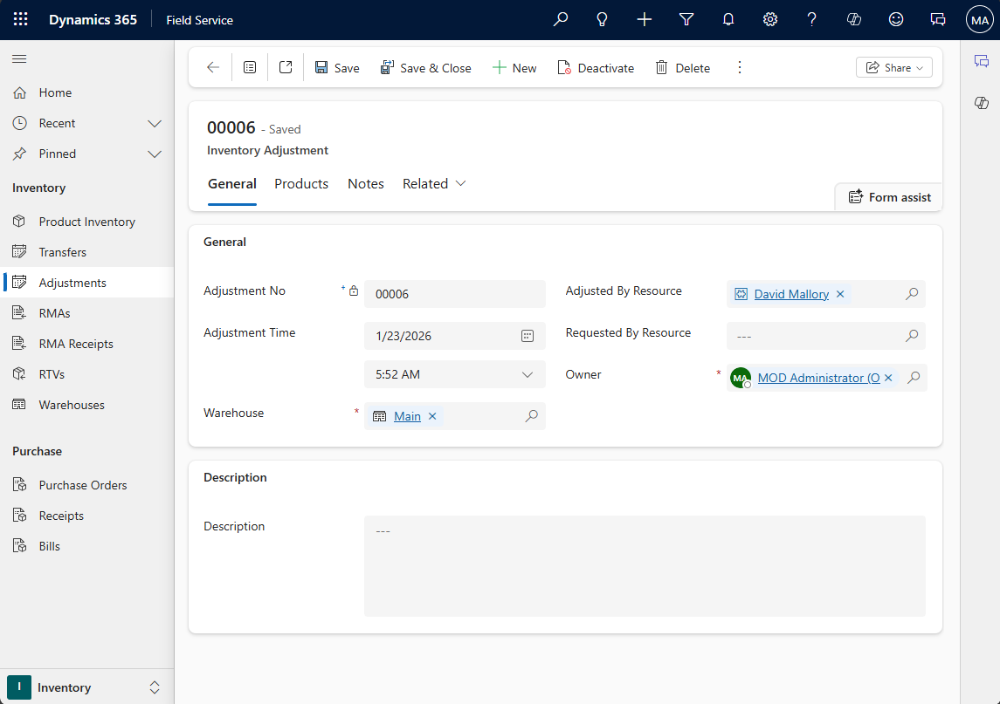

# Overview of inventory, purchasing, and returns

[!INCLUDE[cc-data-platform-banner](../includes/cc-data-platform-banner.md)]

Dynamics 365 Field Service inventory capabilities include:

- Warehousing
- Inventory adjustments and transfers
- Consuming and billing products during work orders
- Purchasing
- Returns
- Inventory journals

For basic inventory requirements, many organizations utilize the above capabilities included with Field Service. For more complex inventory and pricing requirements, Field Service is designed to integrate with enterprise resource planning (ERP) systems. A common example is integrating with [Dynamics 365 Supply Chain Management](https://docs.microsoft.com/dynamics365/supply-chain/sales-marketing/prospect-to-cash) using a pre-built [common data service "prospect to cash" template](https://appsource.microsoft.com/product/dynamics-365/mscrm.c7a48b40-eed3-4d67-93ba-f2364281feb3?src=office&tab=Overview).

## Prerequisites

- Knowledge of [Field Service product catalog capabilities](./create-product-or-service.md) is critical before using inventory, purchasing, and returns.

> [!Note]
> Only products that have a **Field Service Type** set to **Inventory** are tracked in inventory. Keep this in mind when adding products to work orders, purchase orders, and return merchandise authorizations (RMAs) and expecting to see inventory changes.

## Warehouses and product inventory

A warehouse in Field Service is any company location that holds inventory. This includes static and mobile locations such as:

- Warehouses
- Technician trucks
- Distribution centers
- Loading docks

> [!div class="mx-imgBorder"]
> 

Inventory at each warehouse is updated based on used work order products, purchase orders, returns, adjustments, and transfers. This is recorded in the related **Product Inventory** entity.

> [!div class="mx-imgBorder"]
> 

For each product at the warehouse, the system tracks:

- **Quantity Available** - how many units remain to be sold.
- **Quantity Allocated** - how many units are currently listed on work orders as allocated work order products.
- **Quantity on Hand** - sum of quantity available and quantity allocated. Basically, unsold units.
- **Quantity on Order** - how many units are currently listed on purchase orders, but haven't been received and added to inventory. Basically, units that are on the way.

> [!div class="mx-imgBorder"]
> 

## Inventory adjustments and transfers

**Inventory Adjustments** is a feature that lets you manually add or subtract inventory from warehouses. This feature is typically used for routine checkups to reflect shrinkage and defects, and compare expected inventory to actual inventory, adjusting for the difference.

> [!div class="mx-imgBorder"]
> 

**Inventory Transfers** is a feature that lets you transfer inventory from a source warehouse to a destination warehouse. The most common example of this is transferring inventory from a warehouse to a technician’s truck.

> [!div class="mx-imgBorder"]
> 

You can also enable adjustments and transfers on the Field Service Mobile app to allow technicians to meet in the field and record an inventory transfer from one truck to another, for example.

## Work order inventory

Adding products to work orders and using them affects inventory. 

For example, adding a product as estimated and allocated (**Line Status** set to **Estimated**, **Allocated** and **Yes**) reserves a portion of inventory from the specified warehouse, though it doesn’t actually deduct it.

If a work order product is used during a work order (**Line Status** set to **Used**), the inventory at the related warehouse is deducted by the work order product quantity. Typically, the warehouse listed on a work order product is the technician's truck.

## Purchase orders

Purchase orders (POs) are used to order products to a warehouse or directly to a work order to complete on-site work. 

The purchase order process includes:

1. Requesting products from a vendor by creating a **Purchase Order** and adding **Purchase Order Products**.
2. Gaining approval.
3. Documenting receipt of products by creating a PO receipt and PO Receipt Products. This will add the received products to warehouse inventory or as work order products.

## Returns

Sometimes the same organization that installs parts and equipment at a customer's location needs to process a return of that product or customer asset.

Common examples for why returns may be initiated include:

- The part or equipment is defective
- The customer is dissatisfied
- A repair is needed and the repair will not take place on-site, but back at the service provider's or manufacturer's location
- The equipment was at the customer's location as part of a lease that is ending and will not be renewed

Field Service supports three out-of-the-box returns:

- Return to warehouse
- Return to vendor
- Change of equipment ownership

There are three steps when issuing a return:
1. Create return merchandise authorizations (RMAs): all product returns are initiated with RMAs The RMA designates the products to be returned, as well as all other important information, such as pricing. It also specifies a processing action, which is the type of return. 
2. Create RMA receipt: the return isn’t finalized until an RMA receipt is created. The RMA receipt confirms the correct product and quantity were received, as well as date and person handling the receipt.
3. Inventory and customer asset adjustments are carried out: this is done automatically in the background.

Other important features of RMAs include the ability to issue credits to customers who initiate returns, and the ability to track returns as part of customer asset service history.

## Inventory journals

All inventory transactions are recorded in the **Inventory Journals** entity, which can be found via an advanced find. For example, when one product is allocated to a work order, an inventory journal is created that increases quantity allocated by one. When that same product is then used to complete the work order, another inventory journal is created that decreases quantity on hand. This happens for all increases and decreases of product inventory. Basically, inventory journals serve as an inventory ledger within Field Service.

Most importantly, inventory journals are sometimes used to integrate Field Service inventory transactions into external ERP systems, depending on how the integration is architected. To make integrations easier and more flexible, [inventory journals can be manually created](./manual-inventory-journals.md). 

> [!div class="mx-imgBorder"]
> 

## Configuration considerations
- Adding the **Inventory Purchase** security role to a user's existing security role (dispatcher or resource) will give them access to create and edit inventory-related entities such as warehouse, purchase orders, and RMAs.
- By adding a warehouse to each bookable resource, you can define the default warehouse that will be used when that bookable resource uses a work order product.

### See also

- [Products and services](./create-product-or-service.md)
- [Manual inventory journals](./manual-inventory-journals.md)

[!INCLUDE[footer-include](../includes/footer-banner.md)]