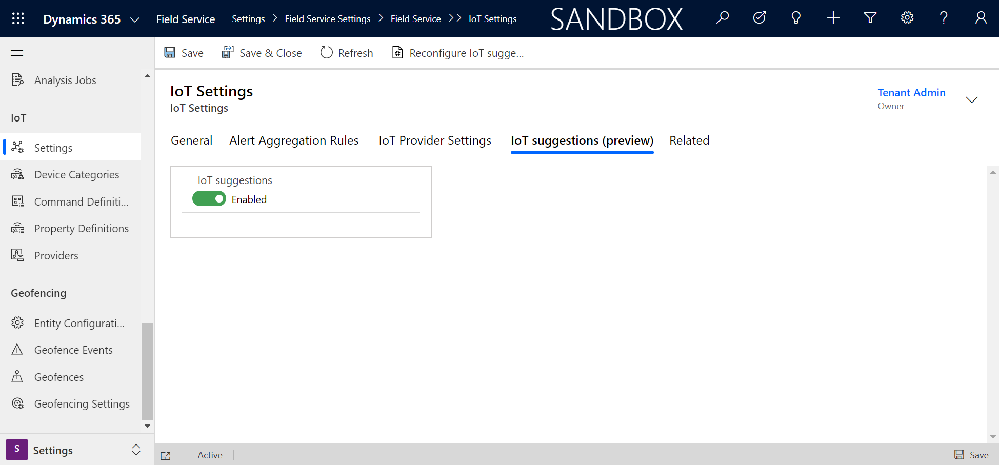
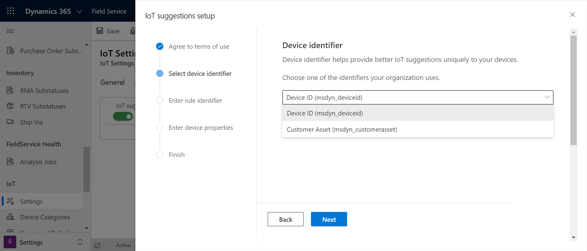
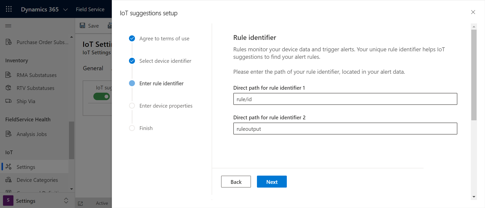
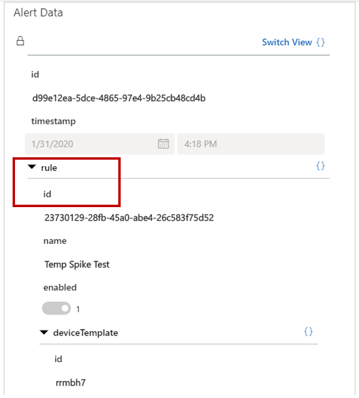
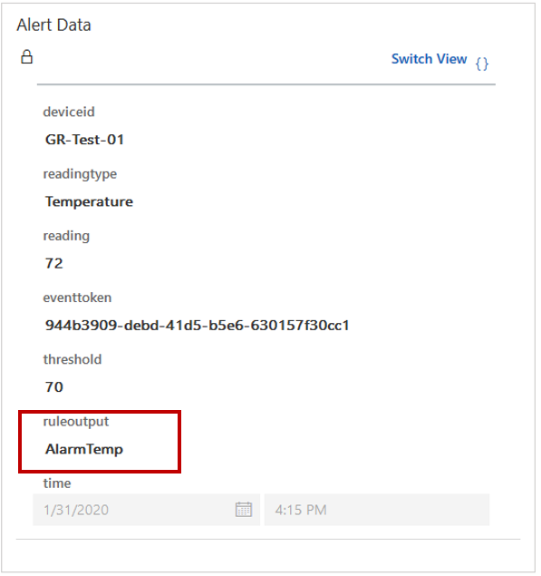
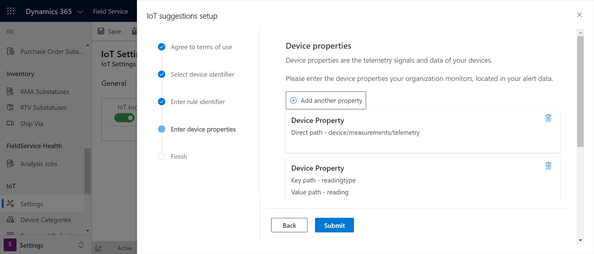
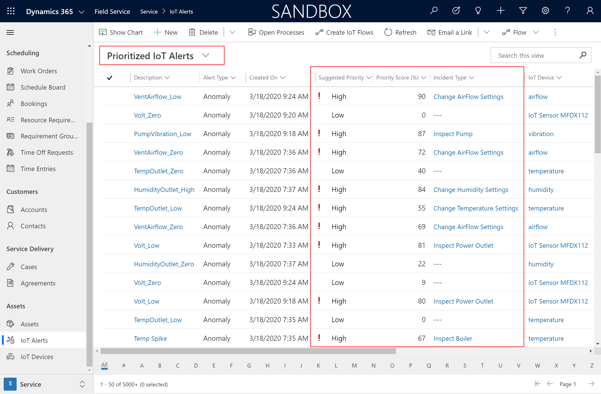
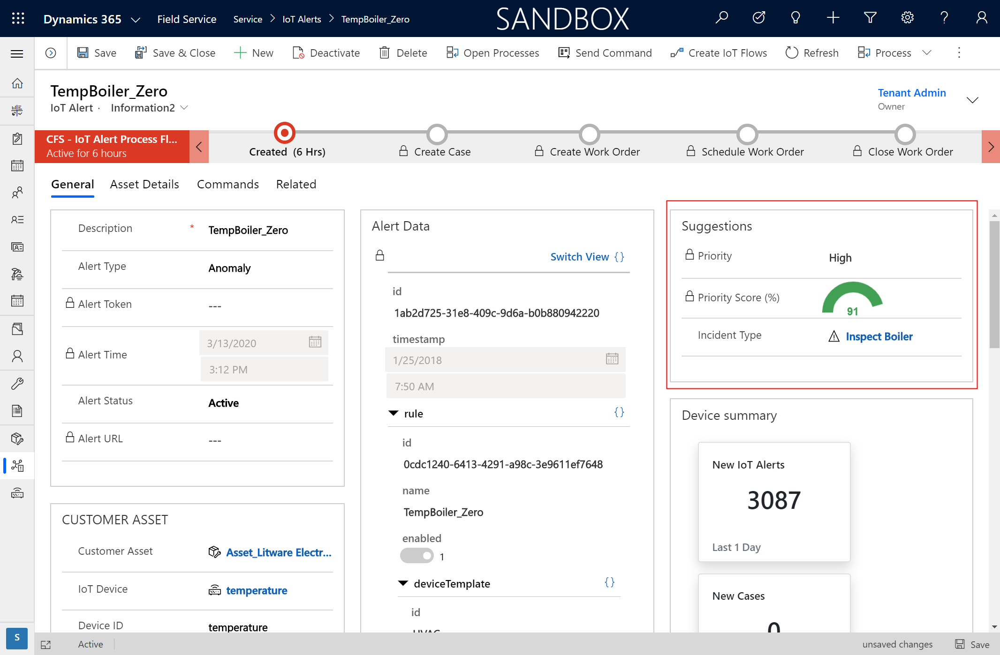

# IoT alert AI suggestions

Connected Field Service makes IoT data actionable by allowing an organization to convert IoT alerts into cases and work orders to later be investigated by the appropriate people. Over time, AI can learn from actions taken on IoT alerts and begin to make recommendations around which IoT alerts are most important and what should be done.
 
**IoT alert AI suggestions** tag IoT alerts with a suggested priority or incident type by learning from previous service history. For example, imagine it's common for your organization to receive an IoT alert when a machine's temperature exceeds the acceptable threshold by 10 degrees; when it happens, your organization frequently converts these IoT alerts into work orders. The AI model will learn from these actions, and the next time a new temperature alert arrives that's 15 degrees over the threshold, the AI will suggest it as high priority and suggest recalibration as the incident type.

By enabling these IoT alert suggestions, you'll be able to:  
- Understand which IoT alerts are higher priority.
- Be more proactive at handling higher impact issues.
- Better allocate limited resources to IoT alerts that become cases and work orders.
- Use AI to scale out and learn from the experienced personnel who know how to respond to issues surfaced by IoT data.

> [!div class="mx-imgBorder"]
> 

A few reminders before digging into this article:

- An [incident type](configure-incident-types.md) is the main issue of a work order and can dictate related details like work order type, products, services, and service tasks. 
- **Priority** represents the priority to the business, measured by financial impact or customer satisfaction. For example, imagine an IoT alert notifies the organization that a building's heating is broken, and the outage could have a large impact on an event and customer satisfaction. This case would represent a _high_ priority because of the large business impact. For more information, see the configuration considerations at the end of this article. 

## Prerequisites

- This feature is currently in public preview as of April 2020.

- Connected Field Service with either of the following:
    -	Azure IoTHub 
    -	Azure IoTCentral 
    -	Custom IoT provider (requires additional configuration)

## Instructions

From Field Service, go to **Settings** > **Settings (in IoT section)** > **IoT Suggestions section**.

Set the **IoT suggestions** toggle to **Enabled**. 

> [!div class="mx-imgBorder"]
> 

### Step 1: Agree to terms of use

First agree to the terms of service, and select **Next**.

### Step 2: Select device identifier

Select how your organization primarily uses IoT alerts in relation to devices and customer assets. As a reminder, there is a one-to-many relationship, where many devices can be related to one customer asset.

> [!div class="mx-imgBorder"]
> 

- Select **Device ID** if your organization primarily manages the IoT alerts from individual devices. Example: you have internet-connected thermometers that send temperature readings.
- Select **Customer Asset** if your organization primarily manages the IoT alerts from devices related to customer assets. Example: you have customer assets that represent rooms in a building and each room has multiple devices sending data. When work orders are created from these IoT alerts, they are related to a customer asset.

> [!Note]
> If you're not sure which option to choose or if your organization manages IoT alerts at both the device level and customer asset level, then leave this as the default **Device ID**.

### Step 3: Enter rule identifier

Choose the rules that you defined in IoTCentral or IoTHub that trigger IoT alerts. The rule paths can be found in the IoT Alert JSON.

> [!div class="mx-imgBorder"]
> 

An example of the rule path for IoTCentral is **rule/id**.

> [!div class="mx-imgBorder"]
> 

An example of the rule path for IoTHub is **ruleoutput**.

> [!div class="mx-imgBorder"]
> 

### Step 4: Enter device properties

Choose the device properties that should be considered by the AI model to make suggestions. These are the signals coming from connected devices along with other device variables and characteristics. For example, an internet-connected thermometer may give a temperature reading of 72 degrees and this temperature output should be considered. 

> [!div class="mx-imgBorder"]
> 

By default, the **Telemetry** field in IoTCentral and the **Reading Type** and **Reading** fields in IoTHub are used as device properties. However, you can also add custom fields. For example, you may have a model that associates a financial cost to each temperature reading; this custom addition can be added here as a device property to be considered by the AI model.

### Step 5: Finish

After entering the initial information, you're all done! After 24 hours, you'll start seeing recommendations. It will look at historical data as well as incoming data going forward.

You'll know the AI-based suggestions are working when there's a suggested priority and incident type in the **Prioritized IoT Alerts** view. You can add the **Suggested Priority** and other AI fields to the default **Primary IoT alerts** view or any of your custom views.

> [!div class="mx-imgBorder"]
> 

The priority and suggested incident type is also displayed on the IoT alert form.

> [!div class="mx-imgBorder"]
> 

## Configuration considerations

- The priority score is calculated for a particular alert using the model trained across historical alerts and related entities (see configuration considerations for more details). A dynamic threshold determines which alerts are "high" or actionable, and which are "low." The threshold is optimized in each training for maximum model performance to account for changing data patterns. A dynamic distribution also means that alerts that are previously scored stay relevant, as the model continues to learn and improve. In general, a higher priority score indicates the alert is more actionable.
- If the model needs to be reconfigured based on changes to the system or changing business needs, you can go through the set up again by going to **Settings** > **Settings (in IoT section)** > **IoT Suggestions section** and selecting **Reconfigure IoT suggestions** in the top ribbon. 
- When applicable, the model will return **No suggestions** if there's no recommendation. 
- Suggestions are updated every 24 hours.
- We recommended having at least 50 IoT alerts converted to cases or work orders to give the model enough data to make suggestions. 
- Suggestions work whether IoT alerts are converted into cases or work orders since both have incident types. 
### Use Power Automate flows to:
1. Convert IoT Alerts with suggested high priority to a new case or work order with the recommended incident type.
2. Send and display the AI suggestions in Azure IoTCentral or Azure IoTHub.

[!INCLUDE[footer-include](../includes/footer-banner.md)]