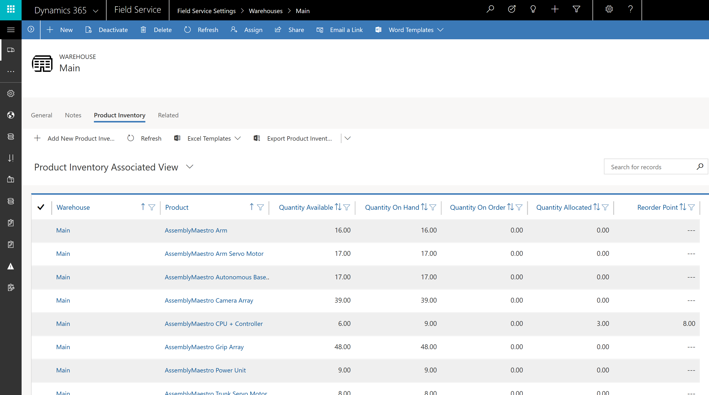
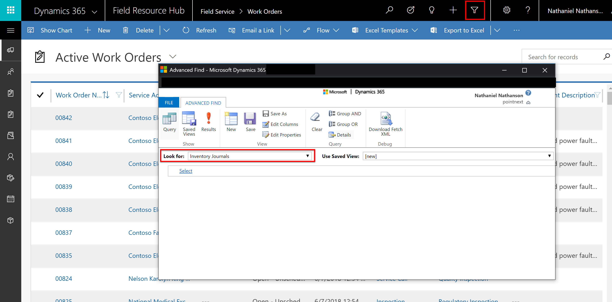
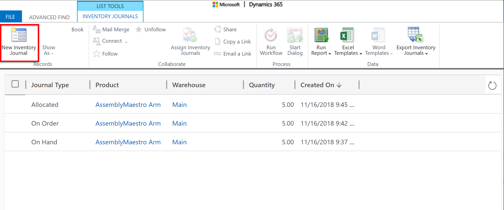
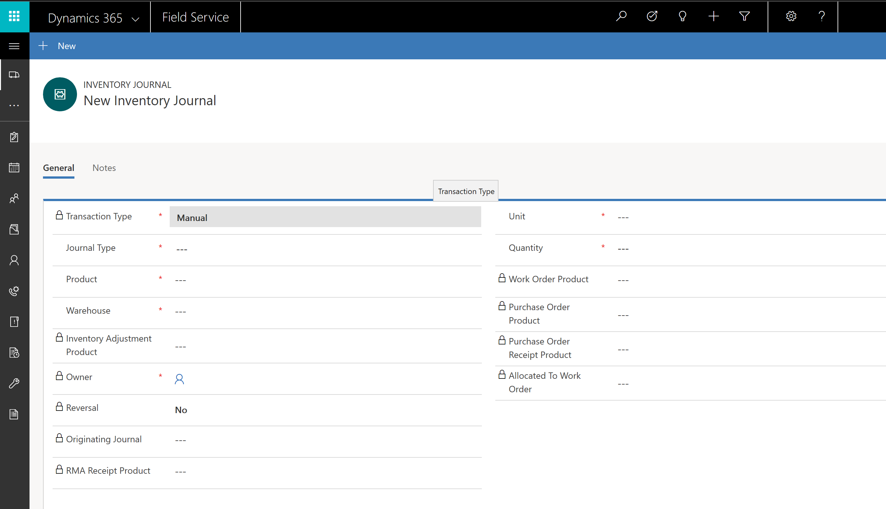
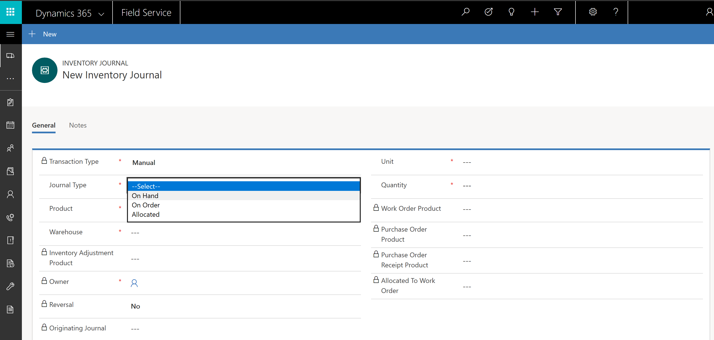
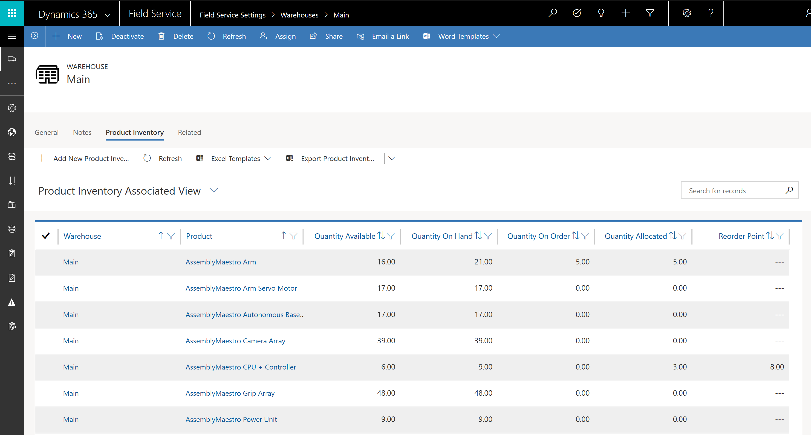

# Manual inventory journals in Dynamics 365 Field Service

In Dynamics 365 Field Service, organizations can track their product inventory. For any given warehouse and product, an organization can track **Available**, **On Hand**, **On Order**, and **Allocated** inventory.

> [!div class="mx-imgBorder"]
> 

**Inventory Journals** is a Field Service entity that serves as a ledger for all inventory changes related to field service warehouses and products. 

For example, when a field service purchase order is fulfilled, an inventory journal is created that documents an increase in inventory for the receiving warehouse. As another example, when a field service inventory transfer is completed, two inventory journals are created: one reducing inventory from the **source warehouse** and another adding inventory for the **receiving warehouse**.

## Using manual inventory journals

**Manual inventory journals** allow inventory administrators to manipulate inventory levels without the associated field service processes. For instance, you can manually add inventory without creating and fulfilling field service purchase orders, or transfer inventory without creating inventory transfer records.

The primary purpose of manual inventory journals is to make field service inventory easier to integrate with external inventory systems, such as Dynamics 365 for Finance & Operations.

Other use cases include:

- documenting lost, stolen, or destroyed inventory
- allowing extensibility scenarios to utilize field service inventory 

## Prerequisites

In order to use manual inventory journals, you'll need to meet the following criteria:

- Field Service v8.2+
- Warehouse records must exist in the system
- Products with **Field Service Type = Inventory** must exist in the system
- **Field Service - Inventory Purchase** security role

## Instructions 

### 1. Access inventory journals

Inventory journals are accessed through **Advanced Find**; they are *not* part of the sitemap by default.

Navigate to **Advanced Find** and select the **Inventory Journals** entity; choose **Results** to view existing inventory journals.

> [!div class="mx-imgBorder"]
> 

### 2. Create a manual inventory journal

Next, we'll create a new manual inventory journal.

Select **New Inventory Journal**, as seen highlighted in the following screenshot.

> [!div class="mx-imgBorder"]
> 

Set the **Transaction Type** field to **Manual**.

> [!div class="mx-imgBorder"]
> 

Many fields on the inventory journal form are locked because they relate to field service inventory processes, such as the purchase order process. However, manual inventory journals are designed to work outside of field service inventory processes, making the locked fields irrelevant. 
 
Select a journal type for your manual inventory. This will determine how the inventory is incremented or decremented.

- Creating an **On Hand** journal will increase **On Hand** and **Available** product inventory.
- Creating an **On Order** journal will increase **On Order** product inventory.
- Creating an **Allocated** journal will increase **Allocated** product inventory and reduce **Available** inventory.

> [!div class="mx-imgBorder"]
> 

> [!Note]
> Quantity value can be negative to decrement inventory.

### 3. View inventory changes

Navigate to **Field Service > Warehouse > Product Inventory** to view inventory changes, as seen in the following screenshot.

> [!div class="mx-imgBorder"]
> 

## Additional notes

- Inventory adjustments can be used to increment/decrement available inventory for a given warehouse. This is a field service-related process and only applies to adjusting available and on hand inventory. In contrast, manual inventory journals can edit any type of inventory levels; they're also more flexible and better suited for integration scenarios.
- Both manual inventory journals and inventory adjustments products can have negative quantity values to decrement inventory.
- Manual inventory journals are used to integrate Dynamics 365 Field Service and Finance & Operations. 

### See also
- [Install Field Service and Finance & Operations integration solution](https://appsource.microsoft.com/product/dynamics-365/mscrm.p2cfieldserviceintegration?tab=Overview)
- [Configure Field Service and Finance & Operations integration](/dynamics365/unified-operations/supply-chain/sales-marketing/field-service)

[!INCLUDE[footer-include](../includes/footer-banner.md)]