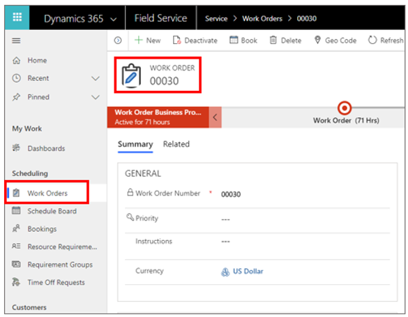
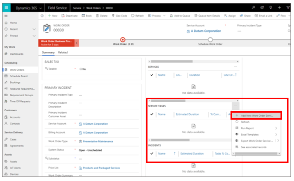
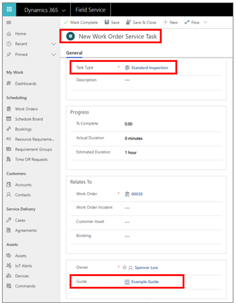
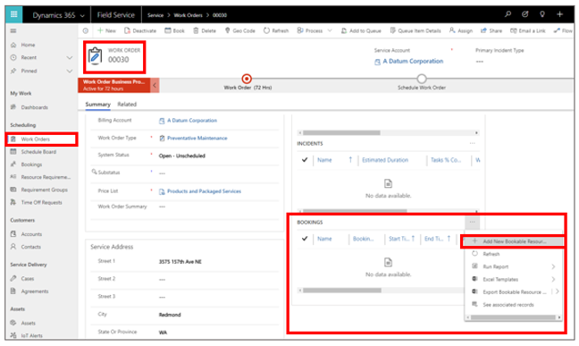
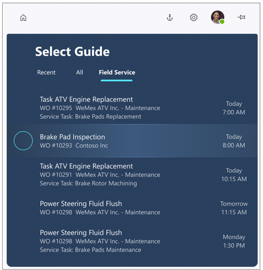
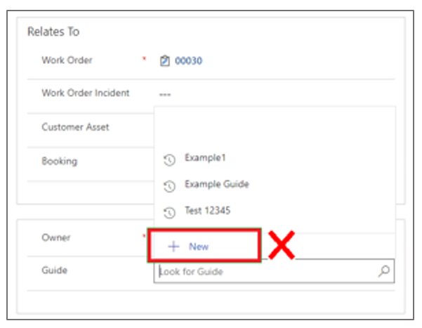

# Dynamics 365 Guides integration with Field Service

Integration with Dynamics 365 Guides lets Field Service customers attach mixed reality guides to Field Service tasks. When work orders are assigned to technicians, the technicians can use a dedicated **Field Service** tab in the Dynamics 365 Guides HoloLens app to launch the assigned guide and get their work done. 

   

> [!IMPORTANT]
> To attach guides to service tasks in Field Service, you'll need Dynamics 365 Field Service version 8.6.0.183 or later.

## Using Dynamics 365 Guides with work orders

1. Create a guide using the Dynamics 365 Guides PC and HoloLens apps. For information on creating a guide, see:
  
   - [Use the PC authoring app to create a guide](https://docs.microsoft.com/dynamics365/mixed-reality/guides/pc-authoring)
   
   - [Use the HoloLens app to place your holograms](https://docs.microsoft.com/dynamics365/mixed-reality/guides/hololens-authoring)
   
2. Create a Field Service work order and attach a service task to it. 

   1. To create a new work order in Field Service, select **Work Orders** in the left navigation, and then select **New Work Order**.
   
        
      
   2. In the **Service Tasks** view, select the **More Commands** button (...), and then select **Add New Work Order Service Task**.
   
         
      
   3. In the **New Work Order Service Task** view, select a task type, provide an optional description, and then select a 
   guide to associate with the service task. Select **Save** when you're done.
   
         
      
3. Assign the work order to a resource (the technician). To do this, you need to create a booking for the resource:

   1. In the **Work Order** view, scroll down to the **Bookings** tab, select the **More Commands** (...) button, and then select **Add New Bookable Resource**.
   
         
      
   2. In the **New Bookable Resource Booking** view, schedule the service task at the appropriate time for the technician, and then select the appropriate technician as the resource.
   
         
      
4. Have your technician launch the Dynamics 365 Guides app on HoloLens. After signing in, the technician will see the **Field Service** tab. The tab shows the guide (and any other guides assigned to them) along with a brief description of the booking and when that order is scheduled.

       
    
    
> [!NOTE]
> Keep the following in mind:
> - The Dynamics 365 Guides HoloLens app shows work orders scheduled for the current day and the following eight days.
> - Work orders continue to appear on HoloLens until they're marked as **Complete** in Field Service or assigned to someone else.

### Known issues

- Service task names that are longer than approximately 50 characters are cut off in the HoloLens user interface.

- When assigning a guide to a Field Service service task, there's an option to create a new guide. Do not use this option to create a new guide. Guides must be created using the Dynamics 365 Guides PC and HoloLens apps as described in step 1 of this procedure.
   
      

### See also

- [Overview of Dynamics 365 Field Service](https://docs.microsoft.com/dynamics365/customer-engagement/field-service/overview)
      
      
   

[!INCLUDE[footer-include](../includes/footer-banner.md)]