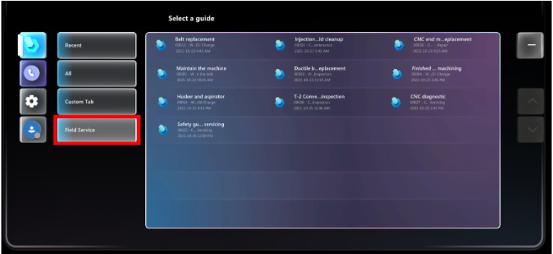

# Integrate Guides with Field Service

> [!TIP]
> To collaborate with other users including annotating in their environment, see [Use Teams mobile to annotate in a user's environment](annotate-teams-mobile.md).

Integration with Dynamics 365 Guides lets Field Service users attach mixed reality guides to Field Service tasks. When work orders are assigned to technicians, the technicians can use a dedicated Field Service tab in the Dynamics 365 Guides HoloLens app to launch the guide and get their work done.

## Prerequisites

- Guides and Field Service are installed on the same environment.
- Guides users have access to the Field Service application.

## Using Dynamics 365 Guides with work orders

1. Create a guide using the Dynamics 365 Guides PC and HoloLens apps. For information on creating a guide, see:
  
   - [Use the PC authoring app to create a guide](/dynamics365/mixed-reality/guides/pc-app-overview)

   - [Use the HoloLens app to place your holograms](/dynamics365/mixed-reality/guides/hololens-app-overview)

1. [Create a work order](create-work-order.md) in Field Service.

1. [Add a service task](set-up-service-task-types.md) to the work order. 

   1. In the **Service Tasks** view, select the **More Commands** button (...), and then select **Add New Work Order Service Task**.

   1. In the **New Work Order Service Task** view, select a task type, provide an optional description, and in the **Guides** field, select a guide to associate with the service task.

1. [Schedule the work order](schedule-work-order.md) to a resource.

After the technician signs in to the Dynamics 365 Guides app on HoloLens, they see the **Field Service** tab. This tab shows the guides, which relate to service tasks they're assigned to. There's also a short description of the booking and the work order.

   > 

The Guides HoloLens app shows work orders for the current day and the following eight days. Work orders appear in the HoloLens app until they're marked as **Complete** in Field Service or assigned to someone else.

## Known issues

- Long service task names are cut off in the HoloLens user interface.

- When assigning a guide to a Field Service service task, the system allows you to create a new guide. Don't use this option to create a new guide. Guides must be created using the Dynamics 365 Guides PC app or HoloLens app.

[!INCLUDE[footer-include](../includes/footer-banner.md)]
