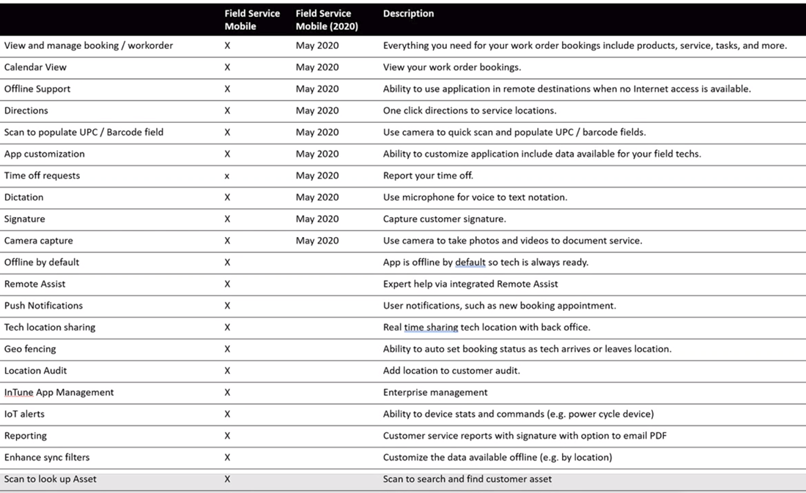
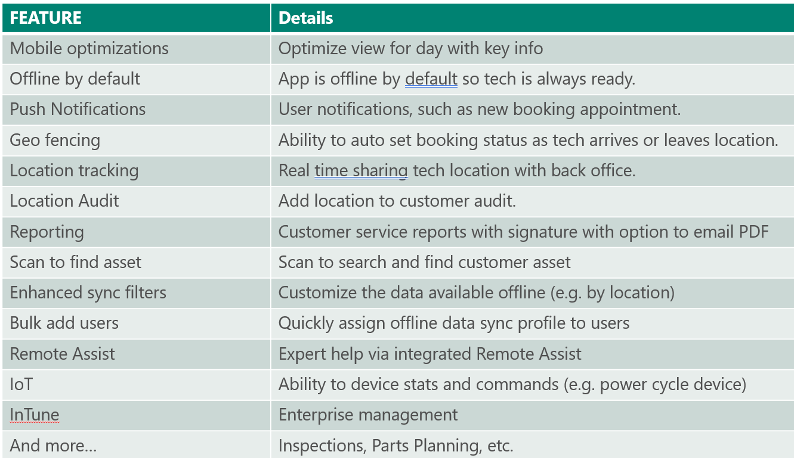

# Field Service Mobile (2020)

Field Service Mobile (2020) is a mobile app designed and optimized for technicians to view Dynamics 365 Field Service work orders, customer assets, accounts and contacts. Different than Field Service Mobile (see feature comparison below), this alternative mobile app is built on Microsoft's Power Platform as a model-driven app and is customizbale to your business needs with the same admin console as all Dynamics 365 business apps.

Available natively for Apple iOS and Google Android phones and tablets, Field Service Mobile (2020) offers technicians many capabilities they need to perform on site customer service like a calendar view of assigned jobs, support for picture, video, and asset barcode scanning, customer signature capture, and offline capabilities so technicians can continue viewing and recording work in areas without internet.

## Feature comparison: Field Service Mobile (2020) and Field Service Mobile

- typically an organization will implement one app entirely or for each department
- Feature parity with current mobile app (Oct 2020)
- avialable on windows
- Scripting - on load, on save, on change

> [!div class="mx-imgBorder"]
> 

> [!div class="mx-imgBorder"]
> 

## Implementation and migration guidance

It is recommended to continue using the [Field Service Mobile](./field-service-mobile-app-user-guide.md)
- Recommend customers to continue to use Xamarin “OEM” based mobile app
- if i were deploying today what should i do? - use current FSM app
- How should i pick which client to use? - use feature parity chart above, if FSM2020 meets your needs, use that bc eventually FSM 2020 will be the default
- when will field service mobile not be available for new customers? support for FSM will end 2022
- new customers going live after October 2021 will have to use FSM2020

## Prerequisites

Field Service v8.8.x+

## Install and set up Field Service Mobile (2020)

- Download from iOS or Android app stores
- Standalone app available in app store
- Sign in with Field Service resource user

## Use Field Service Mobile (2020)

- Calendar view
- work order
- Accounts & contacts
- Customer Assets
- Time off requests

## Configure Field Service Mobile (2020)

- Fields and PCF controls
- Views
- Forms
- Offline mode

## FAQs
- is this different than FSM and D365 mobile apps?
- can i add cases, sales orders, and other entities

## Provide feedback
