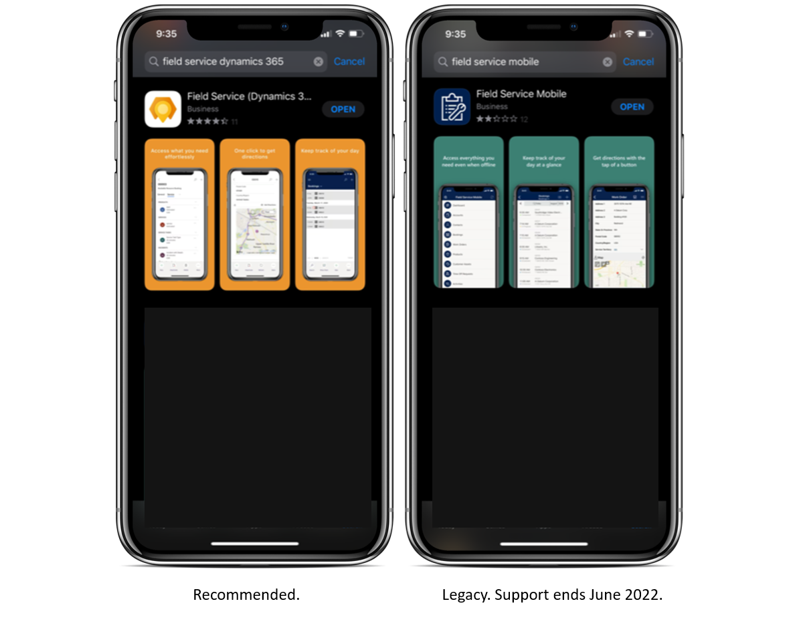

# Implement the Field Service (Dynamics 365) mobile app for your technicians 

Field Service technicians often need to see and update their work orders while onsite at a job.

There are currently two mobile apps available for technicians using Dynamics 365 Field Service:

> [!div class="mx-imgBorder"]
> 

- Field Service (Dynamics 365), shown to the left in the image above, is built on the Microsoft Power Platform. In our documentation, we refer to this app as the Field Service (Dynamics 365) mobile app. This mobile app is recommended.

- Field Service Mobile, shown to the right in the image above, is built on the Xamarin platform. In our documentation, we refer to this app as "Field Service Mobile (Xamarin). This mobile app will be supported until June 2022.

Both the Field Service (Dynamics 365) mobile app _and_ Field Service Mobile (Xamarin) are included with Field Service.

## Implementation and migration

We recommend using the Field Service (Dynamics 365) mobile app to benefit from the new features and continuous investments in the platform, as well as to avoid future migration, which must occur by June 2022. To learn about the existing and the upcoming capabilities, refer to the feature comparison table in this article for the Field Service (Dynamics 365) and the existing Field Service Mobile (Xamarin) apps.

While the new Field Service (Dynamics 365) mobile app continues to evolve, we'll continue to make available and support the current Field Service Mobile (Xamarin) app. By June 2021, new deployments must use the Field Service (Dynamics 365) mobile app; support for the current Field Service Mobile (Xamarin) app will end June 2022.

## Feature comparison: Field Service (Dynamics 365) mobile app versus Field Service Mobile (Xamarin)

Use the following feature comparison table to understand which mobile app is right for your business.

| Feature | Category | Field Service (Dynamics 365) mobile app | Field Service Mobile (Xamarin) | Details |
| --- | --- | --- | --- | --- |
| Mobile platform |  | iOS, Android | iOS, Android, Windows | |
| Camera capture (photo + video) | Technician | Yes | Yes | |
| Barcode scanning | Technician | Yes | Yes | |
| Offline data | Technician | Yes | Yes | |
| Calendar view | Technician | Yes | Yes | |
| Driving directions | Technician | Yes | Yes | |
| Speech to text | Technician | Yes | Yes | |
| Geocoding | Technician | Yes | Yes | |
| [Microsoft Intune](field-service-mobile-intune.md)  | Integration | Yes | Yes | |
| Time entry  | Technician | Yes | Yes | |
| Connected Field Service & IoT alerts | Technician | Yes | Yes | |
| [Inspections](inspections.md) | Technician | Yes | Yes | Field Service technician can find and capture inspections associated with a work order. |
| [Dynamics 365 Remote Assist](/dynamics365/mixed-reality/remote-assist/overview-hololens) | Integration | Yes | Yes | Access to help from remote collaborators with integrated Dynamics 365 Remote Assist. |
| [Push notifications](mobile-push-notifications.md) | Technician | Yes | Yes | User notifications, such as new booking appointment and other out-of-the-box triggers |
| [Geofencing](geofencing.md) | Technician | Yes | Yes | Ability to autoset booking status as technician arrives or leaves location. |
| Reporting | Technician | Yes | Yes | Customer service reports with signature, option to email PDF. |
| Scan to find asset (Global search) | Technician | Yes | Yes | |
| [Location sharing and auditing](./geofencing.md#step-3-enable-location-auditing-for-the-field-service-mobile-app) | Admin | Yes | Yes | Real time sharing tech location with back office. |
| Enhanced offline sync filters | Admin | Yes | Yes | Offline by default and the ability to customize the data available offline (for example, by location, accounts for scheduled bookings). |
| Offline by default | Technician | Yes | Yes | App is offline by default so tech is always ready. |
| Allow technician to force data sync | Technician | Yes | Yes | Technician can manually force data sync. |
| Bulk-add users  | Admin | Yes| Yes | Quickly assign offline data sync profile to users. |
| Check list for service tasks  | Technician | Yes | Yes | Check list for quickly mark task as complete. |

Check [Release Plans](/dynamics365/release-plans/) to stay up to date on upcoming features for Field Service including the Field Service (Dynamics 365) mobile app.

### See also

- [What are model-driven apps in Power Apps?](/powerapps/maker/model-driven-apps/model-driven-app-overview)
- [Enable entities for mobile offline synchronization](//dynamics365/mobile-app/setup-mobile-offline-for-admin#step-1-enable-entities-for-mobile-offline-synchronization)

[!INCLUDE[footer-include](../includes/footer-banner.md)]