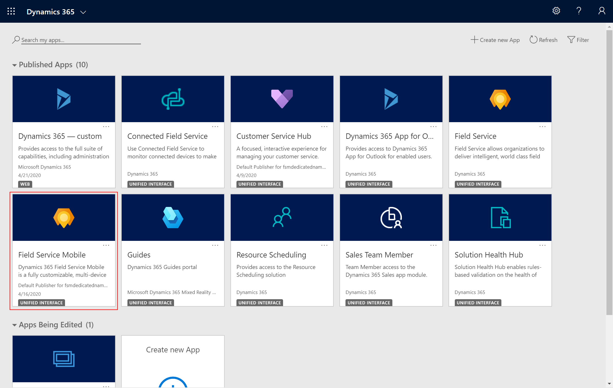
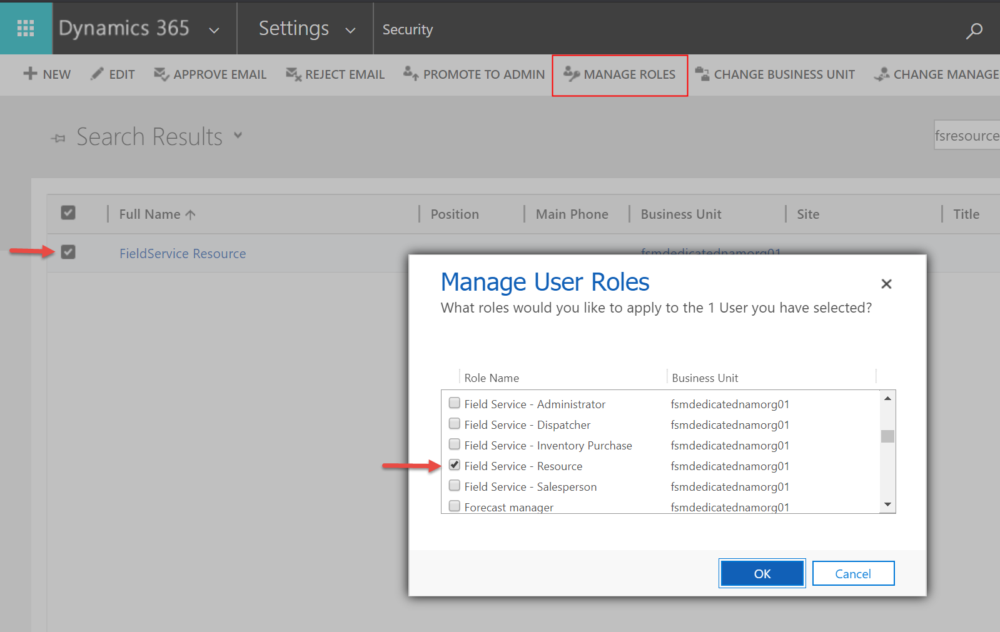
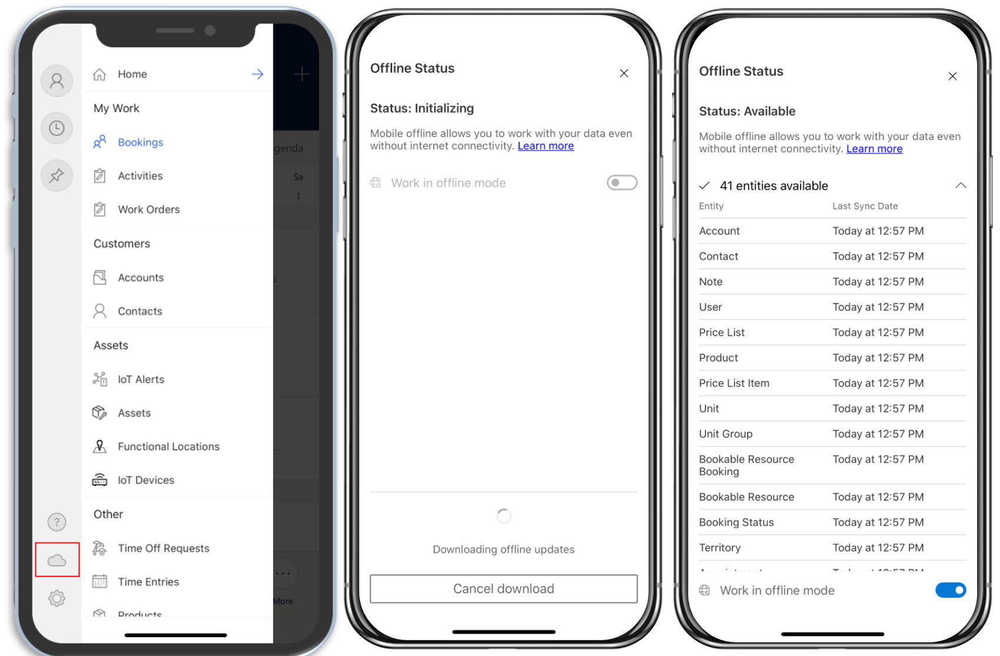
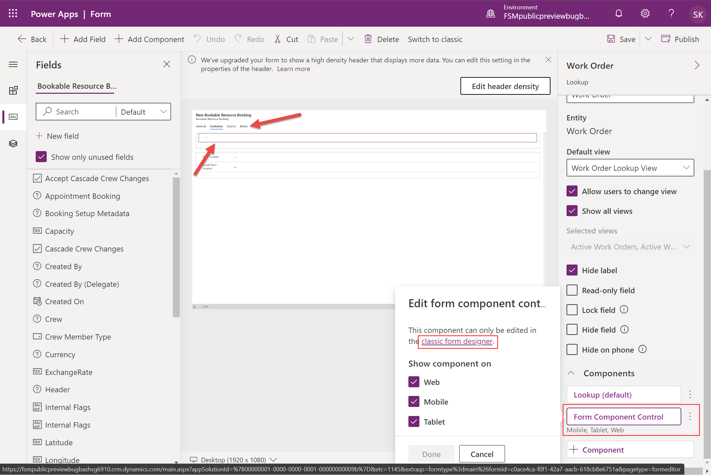
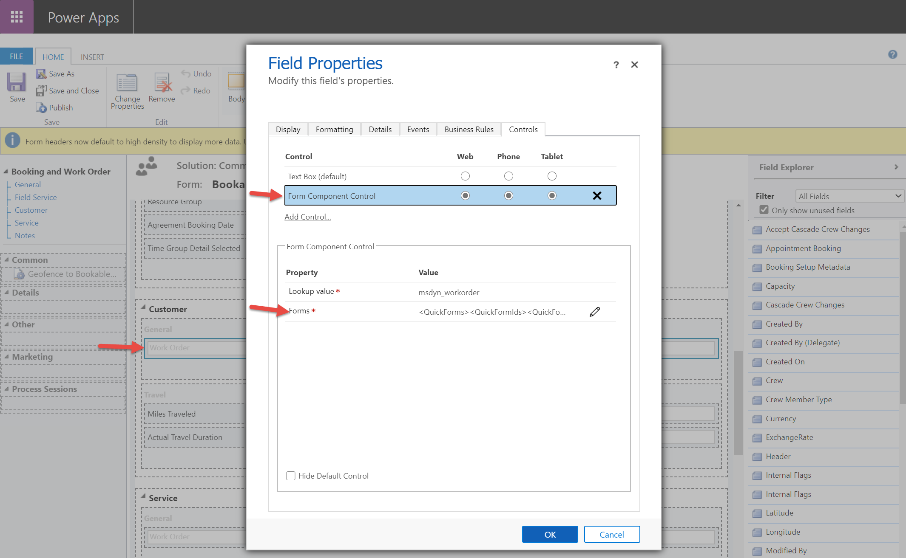
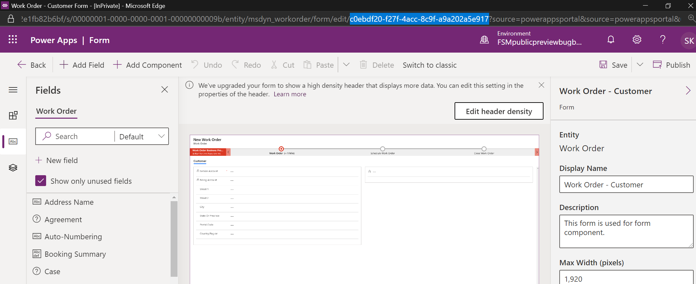
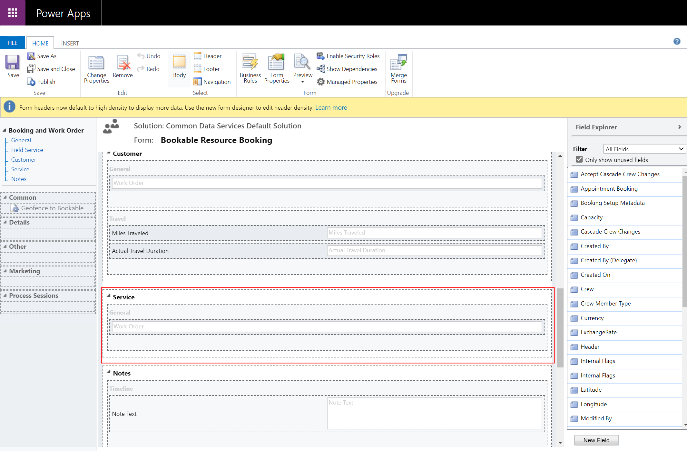

# Field Service Mobile (2020)

Field Service Mobile (2020) is a mobile app designed and optimized for technicians to view Dynamics 365 Field Service work orders, customer assets, accounts and contacts. Different than Field Service Mobile (see feature comparison below), this alternative mobile app is built on Microsoft's Power Platform as a model-driven app and is customizbale to your business needs with the same admin console as all Dynamics 365 business apps.

Available natively for Apple iOS and Google Android phones and tablets, Field Service Mobile (2020) offers technicians many capabilities they need to perform on site customer service like a calendar view of assigned jobs, support for picture, video, and asset barcode scanning, customer signature capture, and offline capabilities so technicians can continue viewing and recording work in areas without internet.

## Implementation and migration guidance

It is recommended to continue using the existing "[Field Service Mobile](./field-service-mobile-app-user-guide.md)" mobile app for current and new deployments of Dynamics 365 Field Service. As development in Field Service Mobile (2020) continues through 2021, capabiltiies will become comparable to Field Service Mobile and system administrators should use the feature comparison information below to decide which mobile app is right for their organization or department.

During the period in which the new app continues to evolve, we will continue to make available and support the current Field Service Mobile app. Organizations that are using the current app as of June, 2021 can continue to use the app until June 2022. 

## Feature comparison: Field Service Mobile (2020) and Field Service Mobile

Field Service Mobile (2020) is recommended for simpler use cases and for organizations that want to get up and running quickly with a mobile solution for technicians because Field Service Mobile (2020) is built on the Power Platform and uses the same admin console as Field Service web. 
 

Field Service Mobile is recommended for more complex use cases where you may need custom reporting, push notifications, geo fencing, and business processes or validations that work offline.

| Feature | Cateogry | Field Service Mobile (2020) | Field Service Mobile |
| --- | --- | --- | --- |
| Mobile Platform | Hardware & software | iOS, Android | iOS, Android, Windows |
| Camera capture (photo & video) | Technician | Yes | Yes |
| Barcode scanning | Technician | Yes | Yes |
| Offline data | Technician | Yes | Yes |
| Calendar view | Technician | Yes | Yes |
| Driving directions | Technician | Yes | Yes |
| Speech to text | Technician | Yes | Yes |
| Geocoding | Technician | Yes | Yes |
| Editable grids | Technician | Yes | Yes |
| Push notifications | Technician | | Yes |
| Geofencing | Technician | | Yes |
| IoT alerts | Technician | | Yes |
| Reporting | Technician | | Yes |
| Scan to find asset | Technician | | Yes |
| Location sharing and auditing | Admin | | Yes |
| Enhanced mobile workflows | Admin | | Yes |
| Enhanced offline sync filters | Admin | | Yes |
| Remote Assist | Integration | | Yes |
| Microsoft Intune  | Integration | | Yes |

## Prerequisites

Install or upgrade to **Field Service v8.8.22+**, the Field Service Mobile app will appear in your list of Dynamics 365 applications.

> [!div class="mx-imgBorder"]
> 

Set up a Dynamics 35 Field Service user with the **Field Service-Resource** security role. This user will sign in to the Field Service Mobile (2020) app as a technician.

> [!div class="mx-imgBorder"]
> 

To schedule work orders to view on the mobile app, you must also [create a bookable resource](./set-up-bookable-resources.md) related to your technician user.

**OPTIONAL:** to view bookings on Field Service Mobile (2020) schedule work orders to the bookable resource related to your user.

> [!div class="mx-imgBorder"]
> 

## Install and log in to Field Service Mobile (2020)

Go to the app store on your iOS or Android phone and search for Field Service Mobile.

Download the app titled **Field Service Mobile (2020)** shown below. This is the mobile app built on the Power Platform. 

> [!div class="mx-imgBorder"]
> 

Launch the app and log in with your username and password. This is the user credentials of the technician user with the **Field Service - Resource** security role.

## Use Field Service Mobile (2020)

Upon logging in the app will prompt you to download offline data meaning your scheduled work orders to the device. If you may not have access to internet, select **Download**, otherwise select **Skip for now**.

> [!div class="mx-imgBorder"]
> 

### View scheduled work orders

The first screen you'll see is a calendar view of your scheduled work orders.

Select **More > Show as > Read Only Grid** to view the bookings as a list as shown on the right side of the image below.

> [!div class="mx-imgBorder"]
> 

Select a booking to view more details about the booking time and the work order. As an example, you can update the status to traveling to indicate you are driving to the customer location, and on the Customer tab you can view the work order location on a map and trigger turn-by-turn driving directions from a GPS app on your phone such as Bing Maps, Apple Maps, Waze, or Google Maps.

> [!div class="mx-imgBorder"]
> 

On the **Service tab** you'll see work order details like Work order service tasks, products, and services.

And on the **Notes tab** you'll see a way to add note text, pictures, and videos as well as capture a customer signature.

> [!div class="mx-imgBorder"]
> 

### Navigate to more information

To navigate to sitemap, select the menu icon from the calendar view.

> [!div class="mx-imgBorder"]
> 

This will take you to the home screen where you can navigate to other important information like accounts, contacts, customer assets, or to record time off.

> [!div class="mx-imgBorder"]
> 

### Work offline

If you expect to be in areas without internet access, either WiFi or cellular, you can download important information to your device to keep working. 

From the home screen select the cloud icon in the bottom left. 

Then select **Dowload offline updates**.

> [!div class="mx-imgBorder"]
> 

Then toggle the **Work in offline mode** to on.

## Configure Field Service Mobile (2020)

Administrators can edit how Field Service Mobile (2020) looks and functions for technicians.

Let's walk through three common configurations administrators may perform:

1. Editing the entities displayed in the home screen (sitemap)
2. Editing the fields and layout in the work order and booking forms
3. Editing the entities and records downloaded to the mobile phone in offline mode for use without internet access.

### Edit Sitemap entities on home screen

Log in to Dynamics 365 as a System Administrator.

View your list of apps by going to 

      https://[YOUR-ENVIRONMENT-NAME].crm.dynamics.com/main.aspx?forceUCI=1&pagetype=apps

Find the Field Service Mobile app and go to the App designer.

> [!div class="mx-imgBorder"]
> 

Select the edit icon to edit the SiteMap

> [!div class="mx-imgBorder"]
> 

The Groups  "My Work", "Customers" and "Other" correspond with the home screen of Field Service Mobile (2020) and you can rearrange, delete, or edit the display names.

Rearrange the entities displayed within each group with the drag and drop interface or add new entities by adding new Subareas.

> [!div class="mx-imgBorder"]
> 

You can even create entirely new Groups with more Subareas to display different entities.

> [!div class="mx-imgBorder"]
> 

> [!Note]
> For every entity you display in the sitemap you can choose the views available on mobile in the App Designer page.

### Edit the Booking and Work Order form

You can add and delete fields displayed on field service mobile (2020) and because the app is built as a model-driven PowerApp you can utilize the PowerApps Control Framework to display different field controls like tiggle buttons and sliders for example.

Administrators who want to customize the Booking and Work Order forms must know they are combined in the mobile app. That means when a technician views a booking form, he or she is also viewing the related work order form. In the image below, the General section displays Bookable Resource Booking ("Booking") fields and the Customer, Service, and Notes sections display work order fields.

> [!div class="mx-imgBorder"]
> 

To edit the work order portion of the form, go to **Settings > Customizations > Customize the System** and find the Work Order entity.

> [!div class="mx-imgBorder"]
> 

> [!div class="mx-imgBorder"]
> 

> [!div class="mx-imgBorder"]
> 

> [!div class="mx-imgBorder"]
> 

> [!div class="mx-imgBorder"]
> 

> [!div class="mx-imgBorder"]
> 

> [!div class="mx-imgBorder"]
> 

    <QuickForms><QuickFormIds><QuickFormId entityname="msdyn_workorder">c0ebdf20-f27f-4acc-8c9f-a9a202a5e917</QuickFormId></QuickFormIds></QuickForms>

> [!div class="mx-imgBorder"]
> 

> [!div class="mx-imgBorder"]
> 

### Configure offline data and sync filters

> [!div class="mx-imgBorder"]
> 

> [!div class="mx-imgBorder"]
> 

Mobile Offline Profiles

> [!div class="mx-imgBorder"]
> 

> [!div class="mx-imgBorder"]
> 

For each entity you can choose and data download filter:

1. Download related data only
2. All records
3. Other data filter
4. Custom data filter

As an example, the Bookable Resource Booking (aka "the booking") entity has a data download filter set to **custom data filter** that downloads bookings of a resource that start or end in the next 7 days or yesterday.

> [!div class="mx-imgBorder"]
> 

As another example, the Work Order Product entity has a data download filter set to **Download related data only** which means that only work order products related to downloaded work orders, are available offline. To accomplish this, the work order product mobile offline profile item was listed as an associated profile item of the work order offline profile, as seen in the image below.

> [!div class="mx-imgBorder"]
> 

> [!Note]
> In addition, only Work Orders related to downloaded bookable resource bookings, are available offline, thus creating a chain of entities and records that are offline: Bookings > Work Orders > Work order products.

## FAQs
- is this different than FSM and D365 mobile apps?
- can i add cases, sales orders, and other entities

same model driven capabilities on web, so if you have security and license to access on web, you can acces on field service mobile (2020)

## Provide feedback
